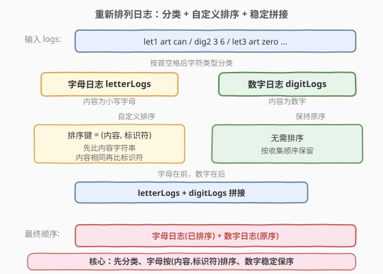
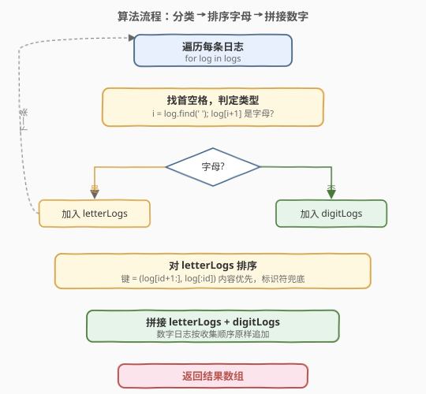
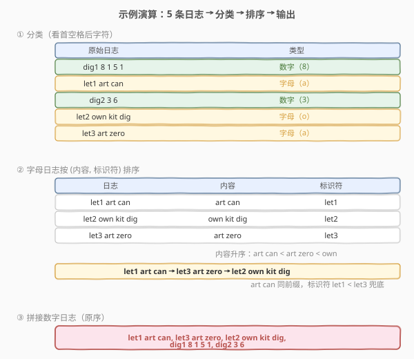

# 重新排列日志文件

- **题目名称**：重新排列日志文件
- **链接**：[937. 重新排列日志文件](https://leetcode.cn/problems/reorder-data-in-log-files/)
- **难度**：中等
- **标签**：数组、字符串、排序、自定义比较

## 1. 题目概述

给你一个日志数组 `logs`，每条日志都是以空格分隔的字串，其第一个字为字母与数字混合的 **标识符**。日志分两类：

- **字母日志**：除标识符外，其余字均由小写字母组成；
- **数字日志**：除标识符外，其余字均由数字组成。

请按下述规则将日志重新排序：

1. 所有 **字母日志** 排在 **数字日志** 之前；
2. **字母日志** 在内容不同时，忽略标识符后按内容字母顺序排序；内容相同时按标识符排序；
3. **数字日志** 保留原来的相对顺序。

返回日志的最终顺序。

**示例 1**：

```text
输入：logs = ["dig1 8 1 5 1","let1 art can","dig2 3 6","let2 own kit dig","let3 art zero"]
输出：["let1 art can","let3 art zero","let2 own kit dig","dig1 8 1 5 1","dig2 3 6"]
解释：
字母日志的内容排序后为 "art can", "art zero", "own kit dig"；
数字日志保留原序 "dig1 8 1 5 1", "dig2 3 6"。
```

**示例 2**：

```text
输入：logs = ["a1 9 2 3 1","g1 act car","zo4 4 7","ab1 off key dog","a8 act zoo"]
输出：["g1 act car","a8 act zoo","ab1 off key dog","a1 9 2 3 1","zo4 4 7"]
解释：
字母日志按内容排序："act car"（g1）, "act zoo"（a8）, "off key dog"（ab1）；
"act car" 与 "act zoo" 内容不同（car < zoo），无需再看标识符；
数字日志 "a1 9 2 3 1", "zo4 4 7" 保留原序。
```

**约束条件**：

- $1 \le \text{logs.length} \le 100$
- $3 \le \text{logs[i].length} \le 100$
- `logs[i]` 中字与字之间用**单个**空格分隔
- 题目数据保证 `logs[i]` 都有一个标识符，且标识符之后至少存在一个字

> 💡 **题意要点**：字母日志的排序键是「**内容优先、标识符兜底**」的二元组；数字日志**不参与排序**，只需按出现顺序原样追加到末尾。判定字母/数字只需看标识符后**第一个字符**。

---

## 2. 解题思路

### 2.1 暴力思路

对每条日志两两比较是否符合最终顺序（自定义全序关系），用任意 $O(n^2)$ 排序（如选择排序）按该关系输出。由于「数字日志保留原序」的要求，两两比较还需携带原始下标作为第三关键字，逻辑繁琐且 $O(n^2 \cdot L)$ 比较开销大。$n=100$ 虽能过，但完全没必要——标准库排序即可解决。

### 2.2 核心观察：分类 + 自定义排序 + 稳定拼接



关键转化是把三类规则拆成三个独立步骤：

- **分类**：遍历 `logs`，按「首空格后第一个字符是否为数字」将日志分成 `letterLogs` 与 `digitLogs` 两组。因为收集时按原顺序遍历，`digitLogs` 天然保序。
- **自定义排序**：只对 `letterLogs` 排序，比较键为 `(内容, 标识符)` 二元组——先比标识符后的内容字符串，内容相同再比标识符。这与规则 2 一一对应。
- **拼接**：`letterLogs`（已排序）+ `digitLogs`（原序），直接拼接即满足规则 1（字母在前）与规则 3（数字保序）。

> 💡 **为何这样拆解是对的？** 规则 1 保证了「字母整体在数字整体之前」，所以数字日志的相对位置只与数字日志彼此有关——它们不会被字母日志穿插，原序自然保留。规则 2 只作用于字母日志内部，与数字日志无关。三步解耦后各自独立处理，互不干扰。

> ⚠️ **判定类型看「第一个字符」即可**：题目保证标识符后至少有一个字，且该字要么全字母、要么全数字。所以只需看首空格后第一个字符 `isdigit()` 即可区分，无需扫描整个内容。

### 2.3 算法流程图



```
1. 初始化空列表 letterLogs、digitLogs
2. 遍历 logs 中每条 log：
      a. i = log 中首个空格的位置
      b. 若 log[i+1] 是数字 → digitLogs.push(log)
         否则               → letterLogs.push(log)
3. 对 letterLogs 排序，比较键 key(log) = (log[i+1:], log[:i])
      （内容优先，标识符兜底）
4. 拼接 result = letterLogs + digitLogs
5. 返回 result
```

> 💡 **第 3 步的排序键**：把每条字母日志拆成 `(内容, 标识符)` 二元组作为排序键。标准库的二元组比较天然「先比第一维、相等再比第二维」，与规则 2 完全吻合，无需手写多分支比较逻辑（Python 直接传 `key`；C++ 在 lambda 里做同样的事）。

### 2.4 示例演算

以示例 1 `logs = ["dig1 8 1 5 1","let1 art can","dig2 3 6","let2 own kit dig","let3 art zero"]` 为例：



**① 分类**（看首空格后第一个字符）：

| 原始日志 | 首空格后字符 | 类型 |
|----------|-------------|------|
| `dig1 8 1 5 1` | `8` | 数字 |
| `let1 art can` | `a` | 字母 |
| `dig2 3 6` | `3` | 数字 |
| `let2 own kit dig` | `o` | 字母 |
| `let3 art zero` | `a` | 字母 |

`letterLogs = ["let1 art can", "let2 own kit dig", "let3 art zero"]`
`digitLogs  = ["dig1 8 1 5 1", "dig2 3 6"]`（按原序收集）

**② 排序字母日志**（键 = 内容, 标识符）：

| 日志 | 内容 | 标识符 |
|------|------|--------|
| `let1 art can` | `art can` | `let1` |
| `let2 own kit dig` | `own kit dig` | `let2` |
| `let3 art zero` | `art zero` | `let3` |

按内容升序：`art can` < `art zero` < `own kit dig`，得到：

`["let1 art can", "let3 art zero", "let2 own kit dig"]`

> 💡 `art can` 与 `art zero` 前缀 `art ` 相同，继续比较 `can` < `zero`，内容已分出大小，**无需再看标识符**。

**③ 拼接**（字母 + 数字原序）：

```text
["let1 art can","let3 art zero","let2 own kit dig","dig1 8 1 5 1","dig2 3 6"]
```

与期望输出一致 ✅

---

## 3. 参考代码

### C++

```cpp
class Solution {
public:
    vector<string> reorderLogFiles(vector<string>& logs) {
        vector<string> letterLogs, digitLogs;
        for (const string& log : logs) {
            int i = log.find(' ');
            if (isdigit(log[i + 1])) {
                digitLogs.push_back(log);
            } else {
                letterLogs.push_back(log);
            }
        }
        sort(letterLogs.begin(), letterLogs.end(), [](const string& a, const string& b) {
            int ia = a.find(' '), ib = b.find(' ');
            string ca = a.substr(ia + 1), cb = b.substr(ib + 1);
            if (ca != cb) return ca < cb;
            return a.substr(0, ia) < b.substr(0, ib);
        });
        letterLogs.insert(letterLogs.end(), digitLogs.begin(), digitLogs.end());
        return letterLogs;
    }
};
```

### Python

```python
class Solution:
    def reorderLogFiles(self, logs: List[str]) -> List[str]:
        letters = [l for l in logs if l[l.index(' ') + 1].isalpha()]
        digits  = [l for l in logs if l[l.index(' ') + 1].isdigit()]

        def key(log):
            i = log.index(' ')
            return (log[i + 1:], log[:i])

        letters.sort(key=key)
        return letters + digits
```

> 💡 **两个实现细节**：
> 1. **Python 用 `key` 函数返回元组**：元组比较天然「先第一维、相等再第二维」，与规则 2 的「内容优先、标识符兜底」完全吻合，无需手写 `cmp_to_key`。`l.index(' ')` 找首空格，`log[i+1:]` 取内容、`log[:i]` 取标识符。
> 2. **C++ 用 lambda 做同等比较**：先取内容 `ca`/`cb` 比较，不等即定序；相等再取标识符比较。等价于二元组字典序。注意 `isdigit()` 判定的是标识符后第一个字符。

---

## 4. 复杂度分析

| 维度 | 复杂度 | 说明 |
|------|--------|------|
| 时间复杂度 | $O(n \log n \cdot L)$ | 排序 `letterLogs` 为主开销：$O(n \log n)$ 次比较，每次字符串比较 $O(L)$；分类遍历 $O(n \cdot L)$ |
| 空间复杂度 | $O(n \cdot L)$ | `letterLogs` 与 `digitLogs` 两组副本，共存储 $n$ 条长度 $O(L)$ 的字符串 |

其中 $n \le 100$、$L \le 100$，规模很小，任何合理实现都能轻松通过。

> ⚠️ C++ 中 `sort` **不保证稳定**。但本题无需依赖稳定性：字母日志靠 `(内容, 标识符)` 二元组完全定序（标识符互不相同，不会并列）；数字日志不参与排序、原序收集。因此即使用非稳定 `sort` 也正确。若改用 `stable_sort` 则对「内容与标识符都相同」的字母日志保序，但题目数据中标识符不会重复。

---

## 5. 扩展：为何数字日志保序不靠 sort 的稳定性

一个常见误区是「把所有日志一起 `stable_sort`，数字日志靠稳定性保序」。这看似可行但有陷阱：

- 若比较函数把数字日志判定为「相等」（返回 `false`），`stable_sort` 确实保序；但字母日志与数字日志之间的偏序需在比较函数里显式编码「字母 < 数字」，逻辑比拆分两组更绕。
- 拆分两组的做法**把规则 1、2、3 物理解耦**：分类负责规则 1 的分组、排序负责规则 2、原序收集负责规则 3。每步只管一件事，正确性论证清晰，代码也更短。

> 💡 这是「**分治到独立子问题**」的设计思想：当多条规则作用于不同对象子集时，先按对象类型分组再分别处理，往往比用一个统一的比较函数塞进所有规则更不易出错。

---

## 6. 面试要点

1. **为什么数字日志不用排序，直接按收集顺序追加就对？**

   - 规则 1 要求字母日志整体在数字日志之前，数字日志之间不会被字母日志穿插。
   - 规则 3 要求数字日志保序——我们遍历 `logs` 时按原顺序把数字日志收集到 `digitLogs`，该列表天然保序，直接追加到末尾即满足要求。

2. **字母日志的排序键为什么是 `(内容, 标识符)` 而不是只看内容？**

   - 规则 2 明确：内容不同时按内容排序；内容**相同时**按标识符排序。所以标识符是内容并列时的**次级关键字**（tie-breaker）。用二元组 `(内容, 标识符)` 作为排序键，标准库的字典序比较恰好实现「先比内容、相等再比标识符」。

3. **判定字母/数字日志为什么要看「首空格后第一个字符」就够了？**

   - 题目保证：标识符后的字要么**全为小写字母**、要么**全为数字**。所以第一个字符是字母则整条是字母日志，是数字则整条是数字日志，无需扫描整个内容验证。`isdigit(log[i+1])` 一步到位。

4. **C++ 的 `sort` 不稳定，会影响结果吗？**

   - 不会。字母日志靠 `(内容, 标识符)` 二元组定序，标识符互不相同，不会有两条字母日志键完全并列，稳定性无影响。数字日志根本不进排序，原序由收集顺序保证。若担心，可换 `stable_sort`，结果相同。

5. **如果允许标识符后内容既有字母又有数字（混合日志），该怎么扩展？**

   - 题目限定只有两类。若出现混合，需定义第三类及其排序规则（如按字母部分优先、数字部分兜底）。分类时从「看第一个字符」升级为「扫描整个内容判定类型」。骨架（分类 → 分别排序 → 拼接）不变，只是分类与比较逻辑更复杂。

> 💡 **一句话总结**：重新排列日志文件的招牌解法是「**分类 + 自定义排序 + 稳定拼接**」——按首空格后字符类型分两组，字母日志用 `(内容, 标识符)` 二元组排序，数字日志原序追加。三步解耦三条规则，$O(n \log n \cdot L)$ 时间、$O(n \cdot L)$ 空间。

---

## 7. 同类练习题

- [692. 前 K 个高频单词](https://leetcode.cn/problems/top-k-frequent-words/)（[站内题解](../0601-0700/692_前K个高频单词.md)）：自定义排序键 `(频率, 单词)`，频率降序、同频字典序升序，与本题二元组排序同套路
- [912. 排序数组](https://leetcode.cn/problems/sort-an-array/)（[站内题解](./912_排序数组.md)）：排序基础母题，手撕快排/归并/堆排，对照本题直接用库排序的场景
- [929. 独特的电子邮件地址](https://leetcode.cn/problems/unique-email-addresses/)（[站内题解](./929_独特的电子邮件地址.md)）：字符串按规则规范化后哈希去重，与本题「按规则拆分字符串」同属字符串处理基础题
- [179. 最大数](https://leetcode.cn/problems/largest-number/)：自定义比较函数（`a+b` 与 `b+a` 字典序）拼接成最大数，与本题自定义排序键同属「比较器设计」家族
- [剑指 Offer 45. 把数组排成最小的数](https://leetcode.cn/problems/ba-shu-zu-pai-cheng-zui-xiao-de-shu-lcof/)：自定义排序 `a+b < b+a`，与 179 互为对偶，同样考察比较器设计
