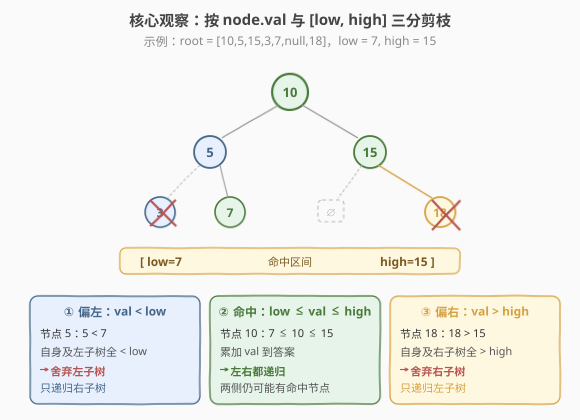
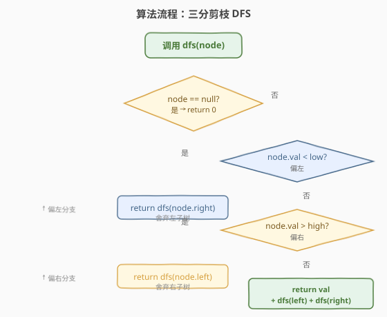

# LeetCode 二叉搜索树的范围和 题解

## 1. 题目概述

- **标题 / 题号**：二叉搜索树的范围和（#938，easy）
- **链接**：https://leetcode.cn/problems/range-sum-of-bst/
- **难度**：简单
- **标签**：树、二叉搜索树、深度优先搜索（DFS）

**题意**：给定一棵**二叉搜索树（BST）**的根节点 `root`，以及两个整数 `low` 和 `high`，返回树中**值在闭区间 `[low, high]` 内**的所有节点值之和。

> **BST 性质回顾**：对任意节点 `node`，其**左子树**所有节点值**严格小于** `node.val`，**右子树**所有节点值**严格大于** `node.val`（详见 [98. 验证二叉搜索树](../0001-0100/98_验证二叉搜索树.md)）。

**示例 1**：

```text
输入：root = [10,5,15,3,7,null,18], low = 7, high = 15
输出：32
解释：值在 [7, 15] 的节点有 7、10、15，其和为 7 + 10 + 15 = 32。

        10
       /  \
      5    15
     / \     \
    3   7    18
```

**示例 2**：

```text
输入：root = [10,5,15,3,7,13,18,1,null,6], low = 6, high = 10
输出：23
解释：值在 [6, 10] 的节点有 6、7、10，其和为 6 + 7 + 10 = 23。

          10
        /    \
       5      15
      / \    /  \
     3   7  13  18
    /   /
   1   6
```

**约束**：

- 树中节点数目在范围 `[1, 2 * 10^4]` 内
- `1 <= Node.val <= 2 * 10^5`
- `1 <= low <= high <= 2 * 10^5`

> 💡 本题是 **BST 有序性**的最直接应用。朴素做法是遍历整棵树累加范围内的值，`O(n)`；进阶做法利用 BST「左小右大」的**全局单调性**做**剪枝**——当 `node.val < low` 时整棵左子树都越界、可直接舍弃，当 `node.val > high` 时整棵右子树都越界、亦可舍弃。一次 DFS 即可，是把 [98 验证 BST](../0001-0100/98_验证二叉搜索树.md) 的「中序单调」性质从「**校验**」推向「**定向搜索**」的招牌题。

## 2. 解题思路

### 2.1 暴力思路：全树遍历 + 范围过滤

最直觉的做法：无视 BST 性质，对整棵树做一次 DFS/BFS，遇到值落在 `[low, high]` 的节点就累加。

```text
int rangeSumBST(TreeNode* root, int low, int high) {
    if (!root) return 0;
    int sum = (root->val >= low && root->val <= high) ? root->val : 0;
    return sum + rangeSumBST(root->left, low, high)
              + rangeSumBST(root->right, low, high);
}
```

这个做法**正确**，时间 `O(n)`、空间 `O(n)`（递归栈）。但它**浪费了 BST 的关键信息**——左右子树的值已经有序，本可以**整棵跳过**越界子树，却仍逐个访问。

> ⚠️ 题目特意强调「这是一棵 BST」，是在暗示你**用有序性剪枝**。在 `low/high` 范围远小于节点值域时，暴力法会做大量无用访问；剪枝版能把访问量降到与「范围内节点 + 路径长度」同阶。

### 2.2 核心观察：按 BST 有序性三分剪枝



BST 的关键性质是**全局单调**——不只是「左孩子 < 根 < 右孩子」，而是「**左子树所有节点 < 根 < 右子树所有节点**」（见 [98 题解 2.2 节](../0001-0100/98_验证二叉搜索树.md)）。由此对任意节点 `node` 的值与 `[low, high]` 的位置关系做**三分**：

| 情形 | 条件 | 结论 | 动作 |
|------|------|------|------|
| ① 偏左 | `node.val < low` | `node` 自身及**整棵左子树**都 `< low`，全部越界 | **舍弃左子树**，只递归右子树 |
| ② 偏右 | `node.val > high` | `node` 自身及**整棵右子树**都 `> high`，全部越界 | **舍弃右子树**，只递归左子树 |
| ③ 命中 | `low <= node.val <= high` | `node` 在范围内，但左右子树仍可能各有部分在范围内 | **累加 `node.val`**，**左右都递归** |

> 💡 **为什么能整棵舍弃？** 这是 BST 全局单调性的直接推论：若 `node.val < low`，则 `node` 左子树里**任何一个**节点值都 `< node.val < low`，递归下去必然全为 0，整棵剪掉零损失。偏右情形对称。这种「用一个节点值定整棵子树上下界」的思路，与 [98 验证 BST](../0001-0100/98_验证二叉搜索树.md) 的「上下界传递」、[450 删除 BST 节点](../0401-0500/450_删除二叉搜索树中的节点.md) 的「按值定方向」同源，都是 BST 有序性的标准用法。

### 2.3 算法流程图



**递归函数** `dfs(node)` 返回「以 `node` 为根的子树中、值在 `[low, high]` 内的节点值之和」：

1. **基准**：`node == null` → `return 0`。
2. **偏左**（`node.val < low`）：`return dfs(node.right)`（左子树整体剪掉）。
3. **偏右**（`node.val > high`）：`return dfs(node.left)`（右子树整体剪掉）。
4. **命中**（`low <= node.val <= high`）：`return node.val + dfs(node.left) + dfs(node.right)`。

> 💡 三分是**互斥**的——`node.val` 不可能同时 `< low` 又 `> high`（因 `low <= high`）。命中分支里左右都要递归，是因为即使 `node` 自身命中，左子树可能仍有部分节点 `>= low`（偏左子树右侧）、右子树可能仍有部分节点 `<= high`（偏右子树左侧），不能整体舍弃。

### 2.4 示例演算

以示例 1 `root = [10,5,15,3,7,null,18]`，`low = 7, high = 15` 为例，DFS 访问路径如下：

![示例演算：root = [10,5,15,3,7,null,18], [7,15] → 32](../images/rangesum_bst_walkthrough.svg)

| 步 | 访问节点 | 值 vs [7,15] | 分类 | 累加 | 动作 |
|----|----------|--------------|------|------|------|
| 1 | 10 | `7 ≤ 10 ≤ 15` | 命中 | **+10** | 左、右都递归 |
| 2 | 5 | `5 < 7` | 偏左 | +0 | **舍弃左**，递归右(7) |
| 3 | 7 | `7 ≤ 7 ≤ 15` | 命中 | **+7** | 左、右都递归 |
| 4 | 3 | `3 < 7` | 偏左 | +0 | **舍弃左**，递归右(null)→0 |
| 5 | 15 | `7 ≤ 15 ≤ 15` | 命中 | **+15** | 左、右都递归 |
| 6 | 18 | `18 > 15` | 偏右 | +0 | **舍弃右**，递归左(null)→0 |

累加：$10 + 7 + 15 = 32$。

> 💡 对比暴力法：暴力法会访问**全部 6 个节点**；剪枝法访问了 6 个节点（本例范围较宽，剪枝优势不明显）。若把范围缩为 `[7, 7]`，剪枝法在访问 `5` 时直接舍弃其左子树（节点 `3` 不再访问）、在访问 `15` 时直接舍弃右子树（节点 `18` 不再访问）——**范围越窄、剪枝越显著**，最坏退化到 `O(n)`（范围覆盖全部节点时），最好接近 `O(h)`（范围只含一条路径上的节点时，`h` 为树高）。

## 3. 参考代码

### C++

```cpp
// 二叉搜索树的范围和.cpp —— 三分剪枝 DFS
// 编译: g++ -O2 -std=c++17 二叉搜索树的范围和.cpp -o rangesum
#include <algorithm>
using namespace std;

struct TreeNode {
    int val;
    TreeNode* left;
    TreeNode* right;
    TreeNode() : val(0), left(nullptr), right(nullptr) {
    }
    TreeNode(int x) : val(x), left(nullptr), right(nullptr) {
    }
    TreeNode(int x, TreeNode* l, TreeNode* r) : val(x), left(l), right(r) {
    }
};

class Solution {
    int low_, high_;
    int dfs(TreeNode* node) {
        if (node == nullptr) return 0;
        if (node->val < low_) {              // 偏左：自身及左子树全 < low，只走右
            return dfs(node->right);
        }
        if (node->val > high_) {             // 偏右：自身及右子树全 > high，只走左
            return dfs(node->left);
        }
        return node->val + dfs(node->left)   // 命中：累加 + 左右都走
                       + dfs(node->right);
    }
  public:
    int rangeSumBST(TreeNode* root, int low, int high) {
        low_ = low;
        high_ = high;
        return dfs(root);
    }
};
```

### Python

```python
from typing import Optional


class Solution:
    def rangeSumBST(self, root: Optional[TreeNode], low: int, high: int) -> int:
        if root is None:
            return 0
        if root.val < low:                  # 偏左：自身及左子树全 < low，只走右
            return self.rangeSumBST(root.right, low, high)
        if root.val > high:                 # 偏右：自身及右子树全 > high，只走左
            return self.rangeSumBST(root.left, low, high)
        return (root.val                    # 命中：累加 + 左右都走
                + self.rangeSumBST(root.left, low, high)
                + self.rangeSumBST(root.right, low, high))
```

> 💡 Python 版直接用 `self.rangeSumBST` 递归、不引入额外 `dfs`，更简洁；C++ 为避免把 `low/high` 作为参数反复传递，存为成员 `low_/high_`。两种写法逻辑完全一致。也可改成**迭代版**：用显式栈替代递归，剪枝逻辑不变——把命中节点压栈、偏左只压右孩子、偏右只压左孩子，弹出时累加。

## 4. 复杂度分析

| 维度 | 复杂度 | 说明 |
|------|--------|------|
| 时间复杂度 | `O(n)`（最坏）/ `O(h + k)`（平均） | 最坏范围覆盖全树，访问所有 `n` 个节点；平均访问量与「路径长度 `h` + 范围内节点数 `k`」同阶，越界子树整体剪掉 |
| 空间复杂度 | `O(n)`（最坏）/ `O(h)`（平均） | 递归栈深度等于树高 `h`；最坏退化链 `h = n`，平衡 BST `h = O(log n)` |

> ⚠️ **不能笼统说剪枝版是 `O(log n)`**。剪枝只在「范围窄」时显著；当 `[low, high]` 覆盖几乎全部节点值时，三分退化为「命中」一条分支，仍要访问整棵树，时间退到 `O(n)`。面试时要说清「**最坏 `O(n)`，平均与范围大小相关**」。

## 5. 扩展：迭代版与中序遍历法

### 5.1 显式栈迭代版

把递归改写成迭代，剪枝逻辑不变，适合递归栈过深（退化链 `n = 2*10^4`）的场景：

```python
def rangeSumBST(self, root: Optional[TreeNode], low: int, high: int) -> int:
    ans = 0
    stack = [root]
    while stack:
        node = stack.pop()
        if node is None:
            continue
        if node.val < low:
            stack.append(node.right)        # 偏左：只压右
        elif node.val > high:
            stack.append(node.left)         # 偏右：只压左
        else:
            ans += node.val                 # 命中：累加 + 压左右
            stack.append(node.left)
            stack.append(node.right)
    return ans
```

### 5.2 中序遍历 + 提前终止

BST 的**中序遍历是升序序列**（见 [98 题解 2.2 节](../0001-0100/98_验证二叉搜索树.md)）。可以先中序遍历，跳过 `< low` 的前段、累加 `[low, high]` 段、遇到 `> high` 立即终止：

```python
def rangeSumBST(self, root: Optional[TreeNode], low: int, high: int) -> int:
    ans = 0
    stack, node = [], root
    while stack or node:
        while node:                          # 一路向左压栈
            stack.append(node)
            node = node.left
        node = stack.pop()
        if node.val > high:                  # 升序序列里已超出 high，后续更大 → 终止
            break
        if node.val >= low:                  # 跳过 < low 的前段
            ans += node.val
        node = node.right
    return ans
```

> 💡 三种写法时间都是 `O(n)` 最坏。三分剪枝版**代码最短、最贴合 BST 直觉**，作为主解；迭代版适合规避栈溢出；中序法把「BST = 升序序列」的性质用到了极致（提前终止），适合在面试中作为「我还能这样想」的加分项。三种本质都是**利用 BST 有序性避免无谓访问**。

## 6. 面试要点

1. **为什么 `node.val < low` 时能直接舍弃左子树？**

   - BST 的全局单调性保证「左子树**所有**节点值 `< node.val`」。若 `node.val < low`，则左子树任意节点值 `< node.val < low`，递归下去必然全为 0，整棵剪掉零损失。偏右情形对称。这正是 [98 验证 BST](https://leetcode.cn/problems/validate-binary-search-tree/) 强调的「约束作用于整棵子树而非仅直接孩子」的直接应用。

2. **剪枝版的时间复杂度到底是多少？**

   - **最坏 `O(n)`**：当 `[low, high]` 覆盖几乎全部节点值时，每个节点都命中「累加 + 左右都递归」分支，访问整棵树。
   - **平均 `O(h + k)`**：`h` 为树高、`k` 为范围内节点数；越界子树整体剪掉，只访问「范围内节点 + 从根到这些节点的路径」。
   - **不要**笼统说 `O(log n)`——那只在范围极窄且树平衡时成立。

3. **命中分支里为什么左右都要递归？**

   - 即使 `node` 自身命中，左子树**右侧**仍可能有节点 `>= low`（因左子树值 `< node.val` 但可能仍 `>= low`），右子树**左侧**仍可能有节点 `<= high`。只有 `node.val` 严格偏出范围时才能整棵舍弃一侧；命中时两侧都需探查。

4. **递归和迭代哪个更好？**

   - 逻辑完全等价。递归代码更短、更易讲清「三分」思路，作为主解；迭代版用显式栈，规避退化链下 `n = 2*10^4` 的递归栈深度风险（Python 默认递归上限 1000，需 `sys.setrecursionlimit`）。面试中先写递归版讲思路，再提一句「可改迭代避免栈溢出」即可。

5. **这道题和 [98 验证 BST](https://leetcode.cn/problems/validate-binary-search-tree/) 的联系？**

   - 都用 BST 的**全局单调性**。98 题**校验**单调性（中序严格递增）；938 题**利用**单调性剪枝（按值定方向）。两者共同的底层认知是「BST 不只是左小右大，而是左子树全小、右子树全大」——这个全局性质既能用来判合法性，也能用来定向搜索。

> 💡 **一句话总结**：938 的核心是把「范围求和」翻译成「**按 `node.val` 与 `[low, high]` 的三分做剪枝 DFS**」。用一个节点值定整棵子树的越界情况，是 BST 有序性从「校验」走向「定向搜索」的最简示例。

## 同类练习题

| # | 题目 | 与本题的关联 |
|---|------|-------------|
| 98 | [验证二叉搜索树](https://leetcode.cn/problems/validate-binary-search-tree/)（[题解](../0001-0100/98_验证二叉搜索树.md)） | BST 全局单调性的招牌题，中序严格递增；本题「整棵子树越界可剪」直接源于此性质 |
| 450 | [删除二叉搜索树中的节点](https://leetcode.cn/problems/delete-node-in-a-bst/)（[题解](../0401-0500/450_删除二叉搜索树中的节点.md)） | 按值定方向在 BST 中定位节点，与本题三分剪枝同属「BST 有序性定向搜索」家族 |
| 700 | [二叉搜索树中的搜索](https://leetcode.cn/problems/search-in-a-binary-search-tree/) | BST 查找母题，按值二分下降；本题是「范围查询」对单点查询的泛化 |
| 270 | [最接近的二叉搜索树值](https://leetcode.cn/problems/closest-binary-search-tree-value/) | 在 BST 中按值定方向维护最近值，同属「利用有序性剪枝」 |
