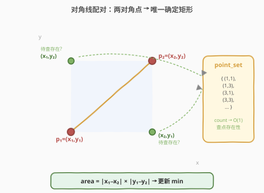
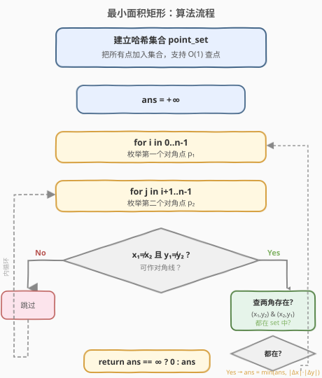
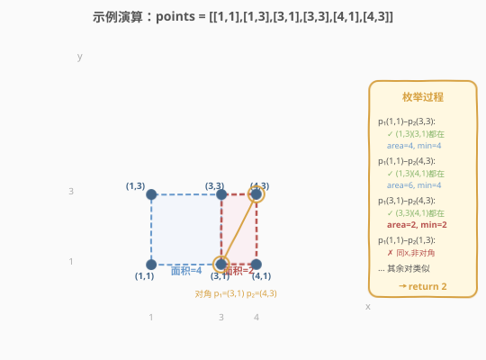

# LeetCode 最小面积矩形 题解

## 1. 题目概述

- **标题 / 题号**：最小面积矩形（#939，medium）
- **链接**：https://leetcode.cn/problems/minimum-area-rectangle/
- **难度**：中等
- **标签**：数组、哈希表、几何

**题意**：给定 X-Y 平面上的点数组 `points`，其中 `points[i] = [xi, yi]`。返回由这些点形成的、边与 X 轴和 Y 轴平行的矩形的**最小面积**。如果不存在这样的矩形，返回 `0`。

**示例 1**：

```text
输入：points = [[1,1],[1,3],[3,1],[3,3],[2,2]]
输出：4
解释：由点 (1,1)、(1,3)、(3,1)、(3,3) 构成边长为 2×2 的矩形，面积为 4。
```

**示例 2**：

```text
输入：points = [[1,1],[1,3],[3,1],[3,3],[4,1],[4,3]]
输出：2
解释：由点 (1,1)、(1,3)、(3,1)、(3,3) 面积为 4；由点 (3,1)、(3,3)、(4,1)、(4,3) 面积为 2，取最小值 2。
```

**约束**：

- `1 <= points.length <= 500`
- `points[i].length == 2`
- `0 <= xi, yi <= 4 * 10^4`
- 所有给定的点都是**唯一**的。

> ⚠️ 关键约束：矩形边必须与坐标轴平行。这意味着矩形的四条边要么水平、要么竖直，四个角点的坐标呈"两两共享"结构——这是本题能 O(n²) 求解的根本前提。

## 2. 解题思路

### 2.1 暴力思路

枚举所有 4 个点的组合，检查它们能否构成边与坐标轴平行的矩形。组合数 $C(n, 4) \approx \frac{n^4}{24}$，当 `n = 500` 时约 $2.6 \times 10^{10}$，远超时限。

### 2.2 核心观察：对角线配对 + 哈希查点

边与坐标轴平行的矩形有一个关键性质：**任一对对角点唯一确定整个矩形**。



给定两个对角点 $p_1 = (x_1, y_1)$ 和 $p_2 = (x_2, y_2)$（要求 $x_1 \neq x_2$ 且 $y_1 \neq y_2$，否则它们在同一条边上而非对角线），另外两个角点就唯一确定为：

$$
(x_1, y_2) \quad \text{和} \quad (x_2, y_1)
$$

只需检查这两个点是否存在于点集中即可。若都存在，就找到了一个合法矩形，面积为：

$$
\text{area} = |x_1 - x_2| \times |y_1 - y_2|
$$

> 💡 **为什么只需检查对角点？** 因为边平行于坐标轴，矩形的四条边由两组 $x$ 坐标和两组 $y$ 坐标完全确定。任选两个不在同一行/列的点作为对角，剩余两个角坐标是对角点 $x$、$y$ 的交叉组合，天然满足"边平行于轴"的条件。

### 2.3 哈希表优化：一次配对遍历

将所有点存入哈希集合（用 `pair` 或编码后的整数作键），实现 $O(1)$ 查点：

1. 把所有点加入集合 `point_set`。
2. 枚举每一对点 $(p_1, p_2)$，若 $p_1.x \neq p_2.x$ 且 $p_1.y \neq p_2.y$（可作对角线）：
   - 检查 $(p_1.x, p_2.y)$ 和 $(p_2.x, p_1.y)$ 是否都在 `point_set` 中。
   - 若都在，计算面积并更新最小值。
3. 遍历完所有对后返回最小面积（无矩形则返回 `0`）。

共有 $C(n, 2) = \frac{n(n-1)}{2}$ 对点，每对 $O(1)$ 查询，总时间 $O(n^2)$。

### 2.4 算法流程图



### 2.5 示例演算

以示例 2 `points = [[1,1],[1,3],[3,1],[3,3],[4,1],[4,3]]` 为例，关注能形成矩形的对角配对：



| 对角点 p₁ | 对角点 p₂ | 另两角 (x₁,y₂)/(x₂,y₁) | 是否存在 | 面积 | 最小面积 |
|-----------|-----------|------------------------|----------|------|----------|
| (1,1) | (3,3) | (1,3) / (3,1) | ✅ 都在 | \|1−3\|×\|1−3\| = 4 | 4 |
| (1,1) | (4,3) | (1,3) / (4,1) | ✅ 都在 | \|1−4\|×\|1−3\| = 6 | 4 |
| (1,3) | (3,1) | (1,1) / (3,3) | ✅ 都在 | 4 | 4 |
| (1,3) | (4,1) | (1,1) / (4,3) | ✅ 都在 | 6 | 4 |
| (3,1) | (4,3) | (3,3) / (4,1) | ✅ 都在 | \|3−4\|×\|1−3\| = 2 | **2** |
| (3,3) | (4,1) | (3,1) / (4,3) | ✅ 都在 | 2 | **2** |
| (1,1) | (1,3) | — | ❌ 同 x，非对角 | — | — |
| (2,2) 类 | — | — | 示例 1 才有此点 | — | — |

最终最小面积为 `2`。注意每对矩形会被两条对角线各发现一次（如 `(1,1)-(3,3)` 和 `(1,3)-(3,1)` 是同一个矩形），但取 `min` 不影响结果。

> 💡 **去重无需处理**：同一个矩形的两条对角线都会触发面积计算，但因为取的是最小值而非计数，重复计算不会影响正确性。若题目改为"统计矩形个数"则需除以 2。

## 3. 参考代码

### C++

```cpp
class Solution {
  public:
    int minAreaRect(vector<vector<int>>& points) {
        set<pair<int,int>> st;
        for (auto& p : points)
            st.insert({p[0], p[1]});

        int ans = INT_MAX;
        int n = points.size();
        for (int i = 0; i < n; ++i) {
            for (int j = i + 1; j < n; ++j) {
                int x1 = points[i][0], y1 = points[i][1];
                int x2 = points[j][0], y2 = points[j][1];
                if (x1 != x2 && y1 != y2) {
                    if (st.count({x1, y2}) && st.count({x2, y1})) {
                        ans = min(ans, abs(x1 - x2) * abs(y1 - y2));
                    }
                }
            }
        }
        return ans == INT_MAX ? 0 : ans;
    }
};
```

### Python

```python
class Solution:
    def minAreaRect(self, points: List[List[int]]) -> int:
        pt_set = {(x, y) for x, y in points}

        ans = float('inf')
        n = len(points)
        for i in range(n):
            x1, y1 = points[i]
            for j in range(i + 1, n):
                x2, y2 = points[j]
                if x1 != x2 and y1 != y2:
                    if (x1, y2) in pt_set and (x2, y1) in pt_set:
                        ans = min(ans, abs(x1 - x2) * abs(y1 - y2))

        return 0 if ans == float('inf') else ans
```

> 💡 **点集表示**：C++ 中用 `set<pair<int,int>>`，查找 $O(\log n)$，总时间 $O(n^2 \log n)$；若改用 `unordered_set` 配合编码 `x * 40001 + y`（坐标上限 $4 \times 10^4$），查找 $O(1)$，总时间严格 $O(n^2)$。Python 用 `set` of tuple 即为哈希集合，天然 $O(1)$。

## 4. 复杂度分析

| 维度 | 复杂度 | 说明 |
|------|--------|------|
| 时间复杂度 | $O(n^2)$ | 枚举 $C(n,2)$ 对点，每对 $O(1)$ 哈希查询（Python/C++ unordered） |
| 空间复杂度 | $O(n)$ | 哈希集合存储 $n$ 个点 |

> ⚠️ 若 C++ 使用 `set<pair>`（红黑树），单次查询退化为 $O(\log n)$，总时间 $O(n^2 \log n)$。$n = 500$ 时 $n^2 \log n \approx 4.5 \times 10^5$，依然在时限内，但面试中推荐 `unordered_set` 编码写法以体现复杂度意识。

## 5. 扩展：按列分组 + 双指针求交集

当点数较多但分布稀疏时，可换一种枚举维度——**按 x 坐标分列**，对每两列求公共 y 集合：

1. 将点按 $x$ 分组：`cols[x]` = 该列上所有 $y$ 的有序列表。
2. 对每对列 $(x_1, x_2)$，$x_1 < x_2$，用**双指针归并**求两个有序 $y$ 列表的交集 `common`。
3. 在 `common` 中，相邻两个 $y$ 值 $(y_a, y_b)$ 构成的矩形面积 $(x_2 - x_1) \times (y_b - y_a)$ 最小（同列间距越小面积越小），只需检查相邻对。

此法在每列点数较少时优于 $O(n^2)$，最坏仍 $O(n^2)$，但常数更优。

> 💡 **为什么只需相邻公共 y？** 对固定的两列 $(x_1, x_2)$，宽度 $x_2 - x_1$ 固定，要最小化面积只需最小化高度 $|y_b - y_a|$。在有序的公共 $y$ 列表中，最小差值一定出现在相邻元素之间（与 [数组最小差值](https://leetcode.cn/problems/minimum-absolute-difference/) 同理）。

## 6. 面试要点

1. **为什么对角线配对是对的？**
   - 边平行于坐标轴的矩形，其四角由两组 $x$ 和两组 $y$ 坐标决定。任一对对角点的 $x$、$y$ 交叉组合恰好给出另外两角，因此对角线配对 + 查两角存在性是充要的。

2. **为什么要排除 $x_1 = x_2$ 或 $y_1 = y_2$ 的情况？**
   - 两个点 $x$ 相同意味着它们在同一竖直线上，$y$ 相同意味着同一水平线上。此时它们是矩形的同一条边上的两点而非对角点，交叉后得到的就是它们自身，无法形成矩形。

3. **同一矩形被重复计算怎么办？**
   - 每个矩形有两条对角线，会被枚举两次。但本题取 `min` 而非计数，重复不影响结果。若改为计数，需对矩形去重（如以排序后的四角坐标为键）或将答案除以 2。

4. **与"边不平行于坐标轴"的矩形问题有何区别？**
   - 本题利用"边平行于轴"的约束将对角点交叉即可确定另两角，$O(n^2)$ 可解。若边可任意倾斜，需枚举中心点和半径（[Max Points on a Line](https://leetcode.cn/problems/max-points-on-a-line/) 思路变体），复杂度大幅上升。

5. **哈希集合的键如何设计？**
   - Python 直接用 `(x, y)` 元组（可哈希）。C++ 可用 `pair<int,int>`（配 `set` 或自定义哈希的 `unordered_set`），或将坐标编码为单个整数 `x * 40001 + y`（因 $y \leq 4 \times 10^4$，偏移量需大于 $y$ 上界）以直接用 `unordered_set<int>`。

## 同类练习题

| # | 题目 | 与本题的关联 |
|---|------|-------------|
| 963 | [最小面积矩形 II](https://leetcode.cn/problems/minimum-area-rectangle-ii/) | 边不要求平行于坐标轴，需枚举中心点 + 半径配对 |
| 149 | [直线上最多的点数](https://leetcode.cn/problems/max-points-on-a-line/)（[题解](../0101-0200/149_直线上最多的点数.md)） | 几何 + 哈希化简斜率，同属"坐标点 + 哈希"家族 |
| 587 | [安装栅栏](https://leetcode.cn/problems/erect-the-fence/) | 凸包问题，几何点集处理的另一经典题型 |
| 1401 | [圆和矩形是否有重叠](https://leetcode.cn/problems/circle-and-rectangle-overlapping/) | 几何判定，坐标轴对齐矩形的性质运用 |
