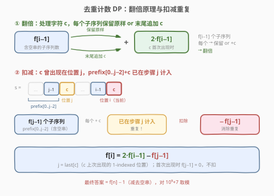
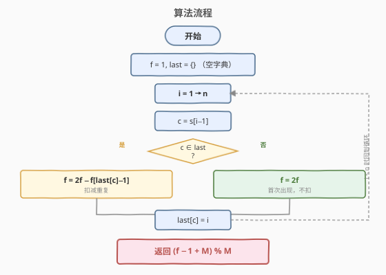
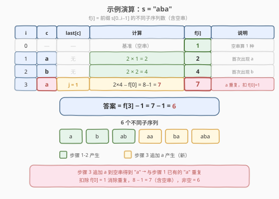

# LeetCode 不同的子序列 II 题解

## 1. 题目概述

- **标题 / 题号**：不同的子序列 II（#940，hard）
- **链接**：https://leetcode.cn/problems/distinct-subsequences-ii/
- **难度**：困难
- **标签**：动态规划、字符串、计数 DP

**题意**：给定一个字符串 `s`，返回 `s` 的**不同非空子序列**的个数。由于结果可能很大，对 $10^9 + 7$ 取余返回。

子序列：从原串中删除若干（可以不删）字符而不改变剩余字符相对顺序得到的新串。

**示例 1**：

```text
输入：s = "abc"
输出：7
解释：7 个不同子序列为 "a", "b", "c", "ab", "ac", "bc", "abc"。
```

**示例 2**：

```text
输入：s = "aba"
输出：6
解释：6 个不同子序列为 "a", "b", "ab", "aa", "ba", "aba"。
```

**示例 3**：

```text
输入：s = "aaa"
输出：3
解释：3 个不同子序列为 "a", "aa", "aaa"。
```

**约束**：

- $1 \le \text{s.length} \le 2000$
- `s` 仅由小写英文字母组成

> 💡 关键约束「仅小写字母」：字符种类至多 26 种，可用 $O(1)$ 空间记录每个字符的上次出现位置（或等价的扣减量），无需哈希表。

## 2. 解题思路

### 2.1 暴力思路

枚举 $s$ 的所有 $2^n$ 个子序列（每个字符选/不选），用集合去重后计数。$n = 2000$ 时 $2^{2000}$ 是天文数字，且存储子序列本身就要 $O(n \cdot 2^n)$ 空间，完全不可行。

> ⚠️ 暴力法的瓶颈在于「**先生成后去重**」——它把所有子序列都展开再判重，没有任何剪枝。突破口是：在**逐字符递推**的过程中同步去重，让重复在产生时就被扣除。

### 2.2 核心观察：翻倍 + 扣减重复的计数 DP



定义 $f[i]$ 为前缀 $s[0..i-1]$ 的**不同子序列数（含空串）**。含空串是为了让递推统一——空串对应「什么都不选」，追加字符后自然变成单字符子序列。

**翻倍原理**：处理字符 $c = s[i-1]$ 时，已有的 $f[i-1]$ 个子序列每个都有两种选择——**保留原样**或**末尾追加 $c$**——于是子序列数翻倍：

$$f[i] = 2 \times f[i-1] \quad (\text{当 } c \text{ 首次出现时})$$

**扣减重复**：若 $c$ 之前在位置 $j$（1-indexed）出现过，则「prefix $[0..j-2]$ 的每个子序列 $+ c$」这批结果在步骤 $j$ 时已经计入。现在再次追加 $c$ 到这批子序列会产生**完全相同**的串，属于重复。这批重复的数量恰为 $f[j-1]$（prefix $[0..j-2]$ 的子序列数，含空串），需扣除：

$$f[i] = 2 \times f[i-1] - f[j-1] \quad (j = \text{last}[c],\ c \text{ 上次出现的位置})$$

> 💡 **为什么扣的是 $f[j-1]$ 而不是 $f[j]$？** 重复的子序列 = prefix $[0..j-2]$ 的所有子串各追加一个 $c$。prefix $[0..j-2]$ 恰有 $f[j-1]$ 个子序列（含空串），所以重复数为 $f[j-1]$。$f[j]$ 多包含了步骤 $j$ 本身新产生的子序列，那些并不重复。

> ⚠️ **为什么只扣「上次」而不扣更早的？** 步骤 $j$ 处理 $c$ 时，已经把更早的 $c$ 造成的重复扣过了。所以当前只需扣离 $i$ 最近的那次（$j$），递推的链式扣减保证了不重不漏。

**基准与答案**：$f[0] = 1$（空串只有一个子序列——空串本身），最终答案 $= f[n] - 1$（减去空串）。

### 2.3 算法流程图



1. **初始化**：$f = 1$，`last` 字典为空。
2. **遍历** $i = 1 \ldots n$，$c = s[i-1]$：
   - 若 $c \in \text{last}$（上次出现在位置 $j$）：$f = 2f - f[j-1]$。
   - 否则（首次出现）：$f = 2f$。
   - 更新 $\text{last}[c] = i$。
3. **返回** $(f - 1) \bmod (10^9+7)$。

> 💡 **代码层面的统一**：首次出现时 $f[j-1]$ 不存在，可视为 0，则 $f = 2f - 0 = 2f$——两分支天然合并为一个公式 $f = (2f - \text{ded}[c]) \bmod M$，其中 $\text{ded}[c]$ 记录 $c$ 上次出现前的 $f$ 值（首次出现时为 0）。详见第 3 节代码。

### 2.4 示例演算



以示例 2（`s = "aba"`）为例，逐字符填表：

| 步骤 $i$ | 字符 $c$ | $\text{last}[c]$ | 计算 | $f[i]$ | 说明 |
|----------|----------|------------------|------|--------|------|
| 0 | — | — | 基准（空串） | **1** | $f[0] = 1$ |
| 1 | `a` | 无 | $2 \times 1 = 2$ | **2** | 首次出现，翻倍 |
| 2 | `b` | 无 | $2 \times 2 = 4$ | **4** | 首次出现，翻倍 |
| 3 | `a` | $j = 1$ | $2 \times 4 - f[0] = 8 - 1 = 7$ | **7** | 重复，扣 $f[0] = 1$ |

- **步骤 1**：处理 `a`，首次出现，$f = 2 \times 1 = 2$。子序列：{`ε`, `a`}。
- **步骤 2**：处理 `b`，首次出现，$f = 2 \times 2 = 4$。子序列：{`ε`, `a`, `b`, `ab`}。
- **步骤 3**：处理第二个 `a`，上次出现在 $j = 1$。翻倍得 8，但 prefix $[0..-1]$（即空串）追加 `a` 得到的 `"a"` 与步骤 1 已有的 `"a"` 重复，扣除 $f[0] = 1$，$f = 8 - 1 = 7$。子序列：{`ε`, `a`, `b`, `ab`, `aa`, `ba`, `aba`}。

最终答案 $= f[3] - 1 = 7 - 1 = \mathbf{6}$，与示例一致。

## 3. 参考代码

### C++

```cpp
// 940. 不同的子序列 II.cpp —— 去重计数 DP，O(n) 时间 O(1) 空间
// 编译: g++ -O2 -std=c++17 940.cpp -o distsubseq2
class Solution {
  public:
    int distinctSubseqII(string s) {
        const int MOD = 1e9 + 7;
        long long f = 1;                    // f[0] = 1（含空串）
        long long ded[26] = {};             // ded[c] = c 上次出现前的 f 值（首次为 0）
        for (char c : s) {
            int i = c - 'a';
            long long d = ded[i];           // 要扣除的量
            ded[i] = f;                     // 记住当前 f，供下次 c 出现时扣除
            f = ((2 * f - d) % MOD + MOD) % MOD;   // +MOD 防负数
        }
        return (f - 1 + MOD) % MOD;         // 减去空串
    }
};
```

### Python

```python
class Solution:
    def distinctSubseqII(self, s: str) -> int:
        MOD = 10**9 + 7
        f = 1                              # f[0] = 1（含空串）
        ded = [0] * 26                     # ded[c] = c 上次出现前的 f 值
        for c in s:
            i = ord(c) - ord('a')
            d = ded[i]
            ded[i] = f                     # 记住当前 f，供下次 c 出现时扣除
            f = (2 * f - d) % MOD          # Python 取模自动处理负数
        return (f - 1) % MOD               # 减去空串
```

> 💡 **`ded` 数组的含义**：`ded[c]` 存储的是字符 $c$ **上次被处理时的 $f$ 旧值**（即 $f[j-1]$，$c$ 上次出现前一步的 $f$）。首次出现时 `ded[c] = 0`，扣减为零等价于「不扣」，两分支统一为 $f = (2f - \text{ded}[c]) \bmod M$。更新顺序很关键：**先存 `ded[i] = f`，再更新 $f$**——存的是更新前的旧值，恰为下次 $c$ 出现时需要的 $f[j-1]$。

> ⚠️ **C++ 负数取模**：`2 * f - d` 可能为负（当 $d > 2f \bmod M$ 时），C++ 的 `%` 对负数返回负值，需 `((x % MOD) + MOD) % MOD` 规整到 $[0, M)$。Python 的 `%` 天然返回非负，无需额外处理。

## 4. 复杂度分析

| 维度 | 复杂度 | 说明 |
|------|--------|------|
| **时间复杂度** | $O(n)$ | 单次遍历字符串，每步 $O(1)$ 转移 |
| **空间复杂度** | $O(1)$ | `ded[26]` 固定 26 个槽位（小写字母）+ 标量 $f$ |
| **取模** | 每步 `% MOD` | C++ 用 `long long` 防溢出，`2*f` 最大约 $2 \times 10^9$ 不溢出 |

> ⚠️ 若用完整 $f[i]$ 数组（存储所有历史 $f$ 值，按 `last[c]` 查 $f[j-1]$），空间为 $O(n)$。但观察到 $f[j-1]$ 只需在 $c$ 下次出现时使用，可用 `ded[26]` 替代整个数组，降至 $O(1)$。

## 5. 扩展：ends 数组——另一种等价视角

除「翻倍 + 扣减」外，还有一种更直观的**按尾字符分类**的计数方式。

**思路**：维护 `ends[ch]` = 以字符 `ch` **结尾**的不同子序列数，`total` = 所有 `ends[ch]` 之和（即非空子序列总数）。

处理字符 $c$ 时，可将 $c$ 追加到**当前所有子序列（含空串）**末尾，形成 `total + 1` 个新候选。但其中已有 `ends[c]` 个以 $c$ 结尾的子序列是重复的，需扣除：

$$\text{new} = (\text{total} + 1) - \text{ends}[c]$$

追加后，所有以 $c$ 结尾的子序列 = 追加 $c$ 到之前的全部（含空串），故 $\text{ends}[c] \leftarrow \text{total} + 1$，$\text{total} \leftarrow \text{total} + \text{new}$。

```python
class Solution:
    def distinctSubseqII(self, s: str) -> int:
        MOD = 10**9 + 7
        ends = [0] * 26                     # ends[c] = 以 c 结尾的不同子序列数
        total = 0
        for c in s:
            i = ord(c) - ord('a')
            new = (total + 1 - ends[i]) % MOD
            ends[i] = (total + 1) % MOD
            total = (total + new) % MOD
        return total
```

**两种视角的等价性**：$f[i] = \text{total}_i + 1$（含空串 = 非空 + 1），代入 $f[i] = 2f[i-1] - f[j-1]$ 展开即得 $\text{total}_i = 2 \cdot \text{total}_{i-1} + 1 - \text{ends}[c]$，与 ends 递推完全一致。

| 维度 | 翻倍+扣减（ded 数组） | 按尾字符分类（ends 数组） |
|------|----------------------|--------------------------|
| 状态 | $f$（含空串总数）+ `ded[c]`（上次 $f$ 旧值） | `ends[c]`（各尾字符计数）+ `total` |
| 直觉 | 翻倍后扣重复 | 追加后去已有 |
| 空间 | $O(26)$ | $O(26)$ |
| 推导门槛 | 需理解 $f[j-1]$ 的含义 | 「追加到全部、减已以 $c$ 结尾」更直观 |

> 💡 面试中两种写法都正确且等价。`ends` 版本更易口头解释（「把 $c$ 贴到所有已有子序列后面，去掉本来就以 $c$ 结尾的」），`ded` 版本代码更紧凑。先讲清一种，再提另一种作为补充。

## 6. 面试要点

1. **为什么 $f[i]$ 要包含空串？**

   - 含空串后，追加 $c$ 到空串自然产生单字符子序列 `c`，无需额外 $+1$。递推统一为 $f[i] = 2f[i-1] - f[j-1]$，最后减 1 即可。若不含空串，递推需拆出「$c$ 本身作为新子序列」的 $+1$ 项，公式更繁琐。

2. **为什么扣 $f[j-1]$ 而不是 $f[j]$ 或 $f[i-1]$？**

   - 重复的子序列 = prefix $[0..j-2]$ 的所有子序列各追加 $c$。prefix $[0..j-2]$ 的子序列数（含空串）= $f[j-1]$，所以扣 $f[j-1]$。$f[j]$ 多算了步骤 $j$ 新增的子序列（它们不重复），$f[i-1]$ 则多算了步骤 $j$ 到 $i-1$ 间新增的子序列。

3. **`ded` 数组为什么只用存一个值而不是完整 $f$ 数组？**

   - 递推只需 $f[j-1]$（$c$ 上次出现前的 $f$ 值）。在处理 $c$ 时，当前 $f$ 就是下次 $c$ 出现时的 $f[j'-1]$。所以每个字符只需记住「上次处理时的 $f$ 旧值」，26 个槽位足够，无需 $O(n)$ 数组。

4. **更新顺序为什么是先存 `ded` 再更新 $f`？**

   - `ded[i] = f` 存的是**更新前**的 $f$（即 $f[i-1]$），这正是下次 $c$ 出现时需要扣除的 $f[j-1]$。若先更新 $f$ 再存，存的就是新值，语义错误。

5. **C++ 中 `(2 * f - d) % MOD` 为负怎么办？**

   - $d < \text{MOD}$ 且 $f < \text{MOD}$，$2f - d \in [-(\text{MOD}-1),\ 2(\text{MOD}-1)]$，可能为负。C++ `%` 对负数返回负值，需 `((x % MOD) + MOD) % MOD` 规整。Python `%` 天然非负，直接写即可。

## 同类练习题

| # | 题目 | 与本题的关联 |
|---|------|-------------|
| 115 | [不同的子序列](https://leetcode.cn/problems/distinct-subsequences/)（[题解](../0101-0200/115_不同的子序列.md)） | 计数子序列出现次数（$s$ 在 $t$ 中作为子序列出现几次），与本题「计数不同子序列」方向互补，同为子序列计数 DP |
| 920 | [播放列表的数量](https://leetcode.cn/problems/number-of-music-playlists/)（[题解](../0901-1000/920_播放列表的数量.md)） | 计数型 DP，转移时乘以选择数并扣除限制，与本题「翻倍 + 扣减」思想同构 |
| 1987 | [不同的子序列](https://leetcode.cn/problems/number-of-unique-good-subsequences/) | 二进制串版本的不同子序列计数，直接套用本题去重 DP，加上前导零处理 |
| 96 | [不同的二叉搜索树](https://leetcode.cn/problems/unique-binary-search-trees/)（[题解](../0001-0100/96_不同的二叉搜索树.md)） | 卡塔兰计数 DP，与本题同属「计数型 DP」家族，对比「结构计数」与「序列计数」的差异 |
