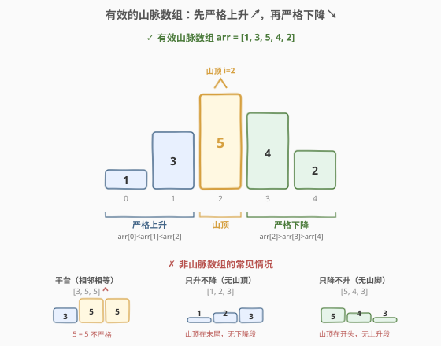
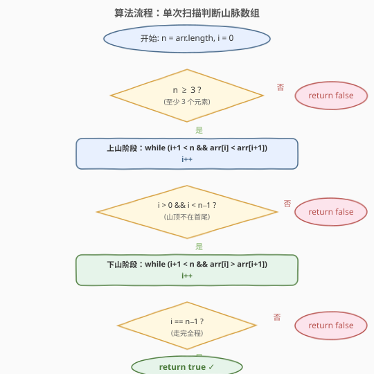

# 有效的山脉数组

- **题目名称**：有效的山脉数组
- **链接**：[941. 有效的山脉数组](https://leetcode.cn/problems/valid-mountain-array/)
- **难度**：简单
- **标签**：数组、单次扫描

## 1. 题目概述

给定一个整数数组 `arr`，如果它是有效的**山脉数组**就返回 `true`，否则返回 `false`。

山脉数组的定义：

- `arr.length >= 3`
- 在 `0 < i < arr.length - 1` 条件下，存在下标 `i`（山顶）使得：
  - `arr[0] < arr[1] < ... < arr[i-1] < arr[i]`（严格递增段）
  - `arr[i] > arr[i+1] > ... > arr[arr.length - 1]`（严格递减段）

**示例 1**：

```text
输入：arr = [2,1]
输出：false
解释：长度不足 3。
```

**示例 2**：

```text
输入：arr = [3,5,5]
输出：false
解释：5 = 5，不满足严格递增/递减。
```

**示例 3**：

```text
输入：arr = [0,3,2,1]
输出：true
解释：山顶 arr[1]=3，左侧 0<3 严格递增，右侧 3>2>1 严格递减。
```

**约束条件**：

- $1 \le \text{arr.length} \le 10^4$
- $0 \le \text{arr[i]} \le 10^4$

> 💡 山脉数组的本质是**先严格上升、再严格下降**——两个阶段缺一不可，且"严格"二字排除了相邻相等（平台）。山顶是上升段与下降段的唯一交汇点，不能在数组首尾。

---

## 2. 解题思路

### 2.1 暴力思路

枚举每个候选山顶 `i`（从 $1$ 到 $n-2$），对每个 `i` 分别验证：左侧 `arr[0..i]` 是否严格递增、右侧 `arr[i..n-1]` 是否严格递减。任一 `i` 满足即返回 `true`，全部不满足则返回 `false`。每个 `i` 的验证需 $O(n)$，共 $n-2$ 个候选，总时间 $O(n^2)$，空间 $O(1)$。

> 💡 优化思路：不需要对每个山顶重复扫描——山脉的上升段和下降段是**连续**的，只需从左到右走一遍：先走完上升段、确认山顶位置、再走完下降段、最后检查是否恰好走到末尾。

### 2.2 核心观察：单次扫描（上山 + 下山）



山脉数组有两个不可省略的阶段：

1. **上山阶段**：从下标 `0` 开始，只要 `arr[i] < arr[i+1]` 就 `i++`，走到第一个不满足的位置——这里就是**山顶**。
2. **下山阶段**：从山顶继续，只要 `arr[i] > arr[i+1]` 就 `i++`，走到第一个不满足的位置。

走完后，只需检查三个条件：

- **上山走了至少一步**：`i > 0`（山顶不在首位，否则没有上升段）。
- **下山走了至少一步**：`i < n - 1`（山顶不在末位，否则没有下降段）。
- **走完全程**：最终 `i == n - 1`（如果中途停下，说明上升/下降段之后还有"异常"元素，不是山脉）。

> ⚠️ **"严格"是关键**：上山用 `<`、下山用 `>`，绝不能用 `<=` / `>=`。相邻相等（平台）直接破坏山脉结构，示例 2 的 `[3,5,5]` 正是在上山阶段遇到 `5 = 5` 停下，下山阶段又因 `5 = 5` 无法前进，最终 `i` 卡在 $1$ 而非走到末尾。

> 💡 **循环不变式**：上山结束时，`arr[0..i]` 严格递增；下山结束时，`arr[山顶..i]` 严格递减。若 `i == n-1`，则两段恰好拼接覆盖整个数组，且共用唯一山顶——山脉成立。

### 2.3 算法流程图



1. 若 `n < 3`，直接返回 `false`。
2. 初始化 `i = 0`。
3. **上山**：`while (i + 1 < n && arr[i] < arr[i + 1]) i++`。
4. **检查山顶**：若 `i == 0` 或 `i == n - 1`，返回 `false`（山顶在边界，缺上升或下降段）。
5. **下山**：`while (i + 1 < n && arr[i] > arr[i + 1]) i++`。
6. **检查全程**：返回 `i == n - 1`。

### 2.4 示例演算

![示例演算：有效 [0,3,2,1] 与无效 [3,5,5]](../images/mountain_array_walkthrough.svg)

**有效示例** `arr = [0, 3, 2, 1]`，`n = 4`：

| 步骤 | 操作 | i | 说明 |
|------|------|---|------|
| ① 上山 | `0 < 3` → `i=1`；`3 > 2` → 停止 | 1 | 上升段 `[0, 3]`，山顶 `arr[1]=3` |
| ② 边界检查 | `i=1 > 0` 且 `i=1 < 3` | 1 | 山顶不在首尾 ✓ |
| ③ 下山 | `3 > 2` → `i=2`；`2 > 1` → `i=3`；`i+1=4=n` → 停止 | 3 | 下降段 `[3, 2, 1]` |
| ④ 结果 | `i == n-1` | 3 | `return true` ✓ |

**无效示例** `arr = [3, 5, 5]`，`n = 3`：

| 步骤 | 操作 | i | 说明 |
|------|------|---|------|
| ① 上山 | `3 < 5` → `i=1`；`5 = 5` → 不满足 `<` → 停止 | 1 | 上升段 `[3, 5]`，停在 `5=5` |
| ② 边界检查 | `i=1 > 0` 且 `i=1 < 2` | 1 | 山顶不在首尾 ✓（通过） |
| ③ 下山 | `5 > 5`? 否 → 停止 | 1 | 相等无法前进，`i` 卡在 1 |
| ④ 结果 | `i == n-1`? `1 ≠ 2` | 1 | `return false` ✗ |

> 💡 `[3, 5, 5]` 的关键在于：上山遇到 `5 = 5` 停下（`i=1`），下山又因 `5 = 5` 无法前进，`i` 始终停在 $1$，无法走完全程。

---

## 3. 参考代码

### C++

```cpp
class Solution {
  public:
    bool validMountainArray(vector<int>& arr) {
        int n = arr.size();
        if (n < 3) return false;
        int i = 0;
        while (i + 1 < n && arr[i] < arr[i + 1]) ++i;
        if (i == 0 || i == n - 1) return false;
        while (i + 1 < n && arr[i] > arr[i + 1]) ++i;
        return i == n - 1;
    }
};
```

### Python

```python
class Solution:
    def validMountainArray(self, arr: List[int]) -> bool:
        n = len(arr)
        if n < 3:
            return False
        i = 0
        while i + 1 < n and arr[i] < arr[i + 1]:
            i += 1
        if i == 0 or i == n - 1:
            return False
        while i + 1 < n and arr[i] > arr[i + 1]:
            i += 1
        return i == n - 1
```

> ⚠️ **`i + 1 < n` 的边界检查不可省略**：上山和下山的 `while` 条件中，`i + 1 < n` 防止 `arr[i + 1]` 越界。若省略，当 `i` 走到末尾时 `arr[i + 1]` 会访问非法内存（C++）或抛 `IndexError`（Python）。

> 💡 **山顶检查 `i == 0 || i == n - 1` 可以合并**：这两个条件分别对应"没有上升段"（如 `[5, 4, 3]`，上山一步都没走）和"没有下降段"（如 `[1, 2, 3]`，上山直接走到末尾）。合并为一次判断更简洁。

---

## 4. 复杂度分析

| 维度 | 复杂度 | 说明 |
|------|--------|------|
| 时间复杂度 | $O(n)$ | 上山和下山各最多遍历 $n-1$ 个元素，`i` 单调递增不回退，总计最多 $n-1$ 步 |
| 空间复杂度 | $O(1)$ | 仅使用指针 `i` 和数组长度 `n` 两个变量 |

---

## 5. 扩展：从两端同时爬山

除了从左到右单次扫描，还可以**从左右两端同时向山顶靠拢**：

1. 左指针 `left` 从 `0` 出发，向右走上山：`while (left + 1 < n && arr[left] < arr[left+1]) left++`。
2. 右指针 `right` 从 `n-1` 出发，向左走上山（反向看就是下山）：`while (right - 1 >= 0 && arr[right] < arr[right-1]) right--`。
3. 若 `left == right` 且 `left != 0` 且 `right != n - 1`，则左右两端在同一个山顶汇合，返回 `true`。

```cpp
class Solution {
  public:
    bool validMountainArray(vector<int>& arr) {
        int n = arr.size();
        if (n < 3) return false;
        int left = 0, right = n - 1;
        while (left + 1 < n && arr[left] < arr[left + 1]) ++left;
        while (right - 1 >= 0 && arr[right] < arr[right - 1]) --right;
        return left == right && left != 0 && right != n - 1;
    }
};
```

时间 $O(n)$、空间 $O(1)$，与单次扫描法相同。两种解法本质同源——都是利用山脉"先升后降"的单峰结构，只是扫描方向不同：单次扫描法**顺序走完上升再走下降**，双指针法**从两端向中间靠拢**在山顶汇合。

---

## 6. 面试要点

1. **为什么上山和下山都要用严格不等号 `<` / `>`？**

   山脉数组的定义要求"严格递增"和"严格递减"。若用 `<=` 上山，会把平台（相邻相等）误认为上升段；下山同理。示例 `[3, 5, 5]` 正是因 `5 = 5` 不满足 `<` 而在上山阶段停止，又因不满足 `>` 而在下山阶段无法前进。

2. **山顶检查 `i == 0 || i == n - 1` 的含义是什么？**

   `i == 0` 表示上山一步都没走——第一个元素就不小于第二个，没有上升段（如 `[5, 4, 3]`）。`i == n - 1` 表示上山直接走到了末尾——整个数组单调递增，没有下降段（如 `[1, 2, 3]`）。两种情况都缺少一个阶段，不是山脉。

3. **最后为什么要检查 `i == n - 1` 而不是直接返回 `true`？**

   下山阶段的 `while` 可能在中途停止——如果下降段之后又出现上升或平台（如 `[0, 3, 2, 1, 4]`，下山走到 `i=3` 后 `1 < 4` 不满足 `>` 而停止），此时 `i < n - 1` 说明数组不是单纯的山脉。只有 `i == n - 1` 才保证从山顶到末尾全程严格递减。

4. **`i` 是否会回退？时间复杂度为什么是 $O(n)$？**

   `i` 在上山和下山两个阶段都**单调递增**，从不回退。上山最多走 $n-1$ 步，下山从上山终点继续走，最多再走 $n-1$ 步。总步数 $\le 2(n-1)$，故 $O(n)$。

5. **双指针法和单次扫描法各有何优劣？**

   两者时间空间相同。单次扫描法逻辑更线性（先上后下，符合直觉），代码更短；双指针法更直观地体现了"从两端向山顶汇合"的对称美，且能更早发现"左右两端爬山不到同一位置"的错误。面试中两种都能接受，选自己讲得清楚的即可。

---

## 7. 同类练习题

- [852. 山脉数组的峰顶索引](https://leetcode.cn/problems/peak-index-in-a-mountain-array/)： guaranteed 山脉数组中找山顶，本题的"信任输入"版——无需边界校验，可用二分 $O(\log n)$
- [1095. 山脉数组中查找目标值](https://leetcode.cn/problems/find-in-mountain-array/)：在山脉数组中二分查找目标值，先找山顶再左右分别二分，本题 + 二分的进阶
- [845. 数组中的最长山脉](https://leetcode.cn/problems/longest-mountain-in-array/)：在普通数组中找最长的山脉子数组，本题的"子数组"推广——枚举山顶向两侧扩展
- [905. 按奇偶排序数组](https://leetcode.cn/problems/sort-array-by-parity/)（[站内题解](../0901-1000/905_按奇偶排序数组.md)）：同样是数组单次扫描 + 指针推进，结构相似但分区条件不同
