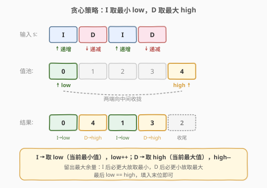
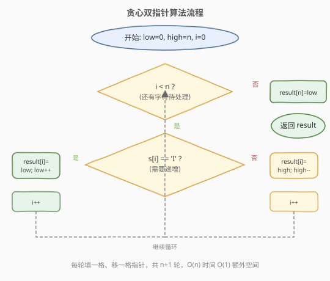
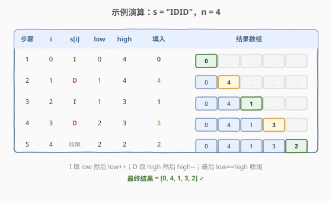

# 增减字符串匹配

- **题目名称**：增减字符串匹配
- **链接**：[942. 增减字符串匹配](https://leetcode.cn/problems/di-string-match/)
- **难度**：简单
- **标签**：贪心、数组、双指针

## 1. 题目概述

给定一个长度为 $n$ 的字符串 $s$（仅由 `'I'` 和 `'D'` 组成），需要重构一个排列 $\text{perm}$，它由 $[0, 1, \dots, n]$ 这 $n+1$ 个整数组成，满足：

- 若 $\text{perm}[i] < \text{perm}[i+1]$，则 $s[i] = \text{'I'}$（Increase，递增）；
- 若 $\text{perm}[i] > \text{perm}[i+1]$，则 $s[i] = \text{'D'}$（Decrease，递减）。

如果有多个有效排列，返回**任意一个**即可。

**示例 1**：

```text
输入：s = "IDID"
输出：[0,4,1,3,2]
解释：0<4(I) 4>1(D) 1<3(I) 3>2(D)，满足 "IDID"。
```

**示例 2**：

```text
输入：s = "III"
输出：[0,1,2,3]
解释：0<1(I) 1<2(I) 2<3(I)，满足 "III"。
```

**示例 3**：

```text
输入：s = "DDI"
输出：[3,2,0,1]
解释：3>2(D) 2>0(D) 0<1(I)，满足 "DDI"。
```

**约束条件**：

- $1 \le \text{s.length} \le 10^5$
- `s` 只包含字符 `'I'` 或 `'D'`

> 💡 **关键信息**：结果是 $[0, n]$ 的一个**排列**（每个整数恰好出现一次），且只需返回**任意一个**合法解——这意味着可以走贪心路线，不必枚举所有方案。

---

## 2. 解题思路

### 2.1 暴力思路

枚举 $[0, n]$ 的所有排列（共 $(n+1)!$ 个），逐个检查是否满足 $s$ 的 I/D 约束。当 $n = 10^5$ 时排列数是天文数字，完全不可行。

稍好一点的想法是**回溯 + 剪枝**：逐位填数，每填一位检查与上一位的 I/D 关系是否一致，不一致就回溯。但回溯仍可能在大量分支间反复试探，最坏仍接近指数级，且实现复杂。

> ⚠️ 这类「只需任意一个解」的构造题，往往存在**确定性的贪心策略**——关键是找到那个「永远不犯错」的填法。

### 2.2 核心观察：贪心双指针——I 取最小、D 取最大



我们手上有 $[0, 1, \dots, n]$ 这 $n+1$ 个数要逐一安放。核心观察是**「留出最大余量」**：

- 遇到 `'I'`（要求**递增**，即当前位要比下一位**小**）：就放**当前剩余的最小值** `low`，然后 `low++`。这样无论下一位放什么，剩余的数都 $\ge \text{low}+1 > \text{旧 low}$，递增关系天然成立。
- 遇到 `'D'`（要求**递减**，即当前位要比下一位**大**）：就放**当前剩余的最大值** `high`，然后 `high--`。这样无论下一位放什么，剩余的数都 $\le \text{high}-1 < \text{旧 high}$，递减关系天然成立。

用两个指针 `low = 0`、`high = n` 分别标记剩余值域的下界与上界，每填一个数就收缩一端。处理完 $n$ 个字符后，`low == high`，把最后剩下的那个数填入末位即可——末位没有后续约束，填什么都行。

> 💡 **为什么这样一定合法？** 设当前要填第 $i$ 位，剩余可用值为 $[\text{low}, \text{high}]$：
> - 若 $s[i] = \text{'I'}$，填 `low` 后，下一位的候选值是 $[\text{low}+1, \text{high}]$，**全部大于**刚填的 `low`，递增必成立；
> - 若 $s[i] = \text{'D'}$，填 `high` 后，下一位的候选值是 $[\text{low}, \text{high}-1]$，**全部小于**刚填的 `high`，递减必成立。
>
> 每一步都把「让下一步无论怎么选都满足约束」做到极致，这就是「留最大余量」的贪心正确性。

### 2.3 算法流程图



初始化 `low = 0`、`high = n`、`i = 0`，结果数组 `result` 大小为 $n+1$。每轮：

1. 若 $i < n$：看 $s[i]$，`'I'` 则 `result[i] = low; low++`，`'D'` 则 `result[i] = high; high--`，然后 `i++`。
2. 若 $i = n$（字符已处理完）：`result[n] = low`（此时 `low == high`），结束。

共 $n+1$ 轮，每轮 $O(1)$，总复杂度 $O(n)$。

### 2.4 示例演算



以 `s = "IDID"`（$n = 4$）为例，逐步执行：

| 步骤 | $i$ | $s[i]$ | low | high | 填入 | 结果数组 |
|------|-----|--------|-----|------|------|----------|
| 1 | 0 | I | 0 | 4 | 0 | `[0, _, _, _, _]` |
| 2 | 1 | D | 1 | 4 | 4 | `[0, 4, _, _, _]` |
| 3 | 2 | I | 1 | 3 | 1 | `[0, 4, 1, _, _]` |
| 4 | 3 | D | 2 | 3 | 3 | `[0, 4, 1, 3, _]` |
| 5 | 4 | 收尾 | 2 | 2 | 2 | `[0, 4, 1, 3, 2]` |

最终结果 `[0, 4, 1, 3, 2]`：$0<4(\text{I})$、$4>1(\text{D})$、$1<3(\text{I})$、$3>2(\text{D})$，完全匹配 "IDID"。

---

## 3. 参考代码

### C++

```cpp
class Solution {
  public:
    vector<int> diStringMatch(string s) {
        int n = s.size();
        vector<int> result(n + 1);
        int low = 0, high = n;
        for (int i = 0; i < n; i++) {
            if (s[i] == 'I') {
                result[i] = low++;
            } else {
                result[i] = high--;
            }
        }
        result[n] = low;
        return result;
    }
};
```

### Python

```python
class Solution:
    def diStringMatch(self, s: str) -> List[int]:
        low, high = 0, len(s)
        result = []
        for ch in s:
            if ch == 'I':
                result.append(low)
                low += 1
            else:
                result.append(high)
                high -= 1
        result.append(low)
        return result
```

> 💡 **两个实现细节**：
> 1. **结果数组大小是 $n+1$**：$n$ 个字符对应 $n+1$ 个排列元素，循环只填前 $n$ 位，第 $n+1$ 位由最后的 `low`（== `high`）补齐，切勿漏填。
> 2. **`low++` / `high--` 写在赋值同一条语句里**：`result[i] = low++` 是「先用后加」，即先把当前 `low` 存入结果，再让 `low` 自增。语义清晰且无歧义，C++ 中这一行同时完成了取值与指针收缩。

---

## 4. 复杂度分析

| 维度 | 复杂度 | 说明 |
|------|--------|------|
| 时间复杂度 | $O(n)$ | 遍历 $s$ 一次，每轮 $O(1)$；末尾补一位 $O(1)$ |
| 空间复杂度 | $O(1)$ | 仅 `low`、`high` 两个指针变量（结果数组不计入额外空间） |

> 若结果数组计入空间复杂度，则为 $O(n)$——这是输出本身的固有开销。

---

## 5. 扩展：DI 序列问题家族

942 属于「DI 序列」问题家族中最简单的一员，这套题在不同约束下有不同难度：

| 题号 | 题目 | 难度 | 区别 |
|------|------|------|------|
| 942 | 增减字符串匹配 | 简单 | 值域固定为 $[0, n]$，求**任意一个**排列 → 贪心 $O(n)$ |
| 484 | 寻找排列 | 中等 | 值域固定为 $[1, n]$，求**字典序最小**的排列 → 贪心变体（连续 D 段翻转） |
| 903 | DI 序列的有效排列 | 困难 | 值域不限，求合法排列的**总数** → 区间 DP $O(n^2)$ |

942 的贪心之所以成立，关键在于「**只需任意解 + 值域恰好是连续整数**」——这两条让「留最大余量」策略无后顾之忧。一旦改成「求字典序最小」（484）或「求计数」（903），贪心就不够了，需要更精细的处理。

> 💡 **从 942 到 903 的思维跃迁**：942 是「构造一个解」，903 是「数有多少个解」。前者用贪心一步到位，后者必须用 DP 穷尽所有状态。这是面试中从「构造」到「计数」的经典升级路径。

---

## 6. 面试要点

1. **为什么贪心是正确的？会不会走到死胡同？**

   不会。每填一位后，剩余候选值始终是一个**连续区间** $[\text{low}, \text{high}]$。`'I'` 取 `low` 后下一位候选是 $[\text{low}+1, \text{high}]$（全大于刚填值），`'D'` 取 `high` 后下一位候选是 $[\text{low}, \text{high}-1]$（全小于刚填值）。无论后续字符是 I 还是 D，都能继续往下填，绝不会卡死。

2. **为什么取「最小」和「最大」而不是中间某个值？**

   取极值是为了**留出最大余量**：`'I'` 取最小值，意味着剩余值都更大，下一步无论要递增还是递减都有充足的空间；若取中间值，可能让后续某个 `'I'` 找不到更大的数。极值策略把「让下一步最宽松」做到极致，是贪心正确性的来源。

3. **结果数组为什么是 $n+1$ 长度？最后那个 `low` 从哪来？**

   $n$ 个字符描述的是 $n+1$ 个相邻关系（$\text{perm}[0]$ 到 $\text{perm}[n]$），所以排列有 $n+1$ 个元素。循环填完前 $n$ 位后，`low` 和 `high` 收敛到同一个值，把它填入第 $n+1$ 位（下标 $n$）即可——末位没有后续约束。

4. **如果题目改成求字典序最小的排列怎么办？**

   那就是 [484. 寻找排列](https://leetcode.cn/problems/find-permutation/)。942 的贪心产出的 `[0,4,1,3,2]` 对 "IDID" 合法但未必字典序最小。求字典序最小需调整策略：先按 942 思路生成（I 取最小、D 取最大），再把每段连续 D 反转——本质是「先贪心构造，再局部修正」。这超出 942 的范围，但理解 942 是做 484 的前提。

5. **这题和「双指针」有什么关系？**

   `low` 和 `high` 就是两个指针，分别从值域 $[0, n]$ 的两端出发，根据字符 I/D 决定收缩哪一端。和 [977. 有序数组的平方](../0901-1000/977_有序数组的平方.md) 的对撞双指针形似——都是两端向中间收拢，只是这里的「收拢」由字符串字符驱动，而非由数值大小驱动。

---

## 7. 同类练习题

- [484. 寻找排列](https://leetcode.cn/problems/find-permutation/)：942 的字典序最小版，值域 $[1,n]$，需对连续 D 段反转
- [903. DI 序列的有效排列](https://leetcode.cn/problems/valid-permutations-for-di-sequence/)（[题解](../0901-1000/903_DI序列的有效排列.md)）：从「构造一个」升级为「数有多少个」，区间 DP $O(n^2)$
- [977. 有序数组的平方](https://leetcode.cn/problems/squares-of-a-sorted-array/)（[题解](../0901-1000/977_有序数组的平方.md)）：同款「两端向中间收拢」的双指针思路
- [406. 根据身高重建队列](https://leetcode.cn/problems/queue-reconstruction-by-height/)：贪心构造排列类问题，先排序再按约束插入
