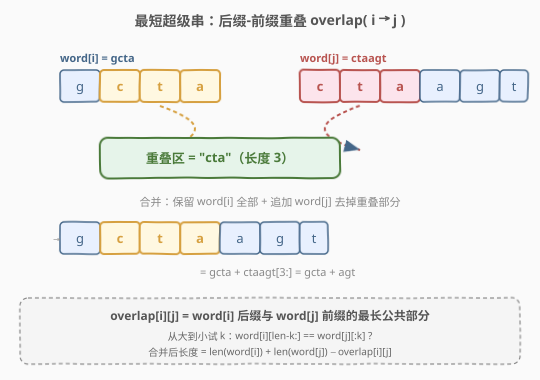
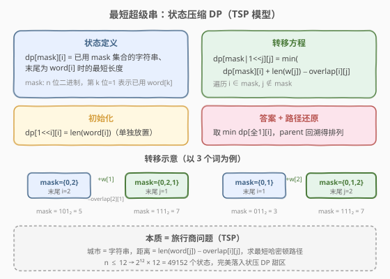
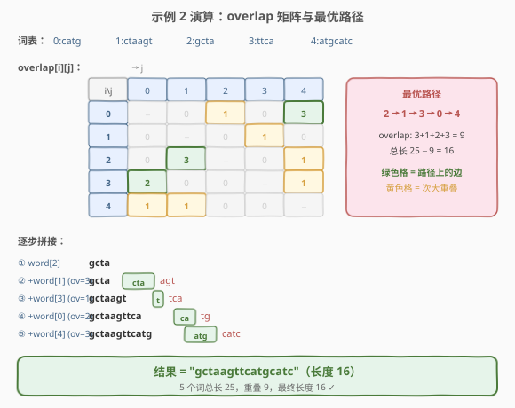

# 最短超级串

- **题目名称**：最短超级串
- **链接**：[943. 最短超级串](https://leetcode.cn/problems/find-the-shortest-superstring/)
- **难度**：困难
- **标签**：动态规划、状态压缩、字符串、位运算

## 1. 题目概述

给定一个字符串数组 `words`，找到一个**最短**的字符串，使得 `words` 中每个字符串都是它的**子字符串**。如果有多个等长的合法答案，返回任意一个即可。题目保证 `words` 中没有字符串是另一个字符串的子字符串。

**示例 1**：

```text
输入：words = ["alex","loves","leetcode"]
输出："alexlovesleetcode"
解释：三个词互不重叠，任意排列拼接均可，长度 = 4+5+8 = 17。
```

**示例 2**：

```text
输入：words = ["catg","ctaagt","gcta","ttca","atgcatc"]
输出："gctaagttcatgcatc"
解释：按 2→1→3→0→4 的顺序拼接，重叠 9，总长 25−9 = 16。
```

**约束条件**：

- `1 <= words.length <= 12`
- `1 <= words[i].length <= 20`
- `words[i]` 由小写英文字母组成
- `words` 中所有字符串互不相同

> ⚠️ `n ≤ 12` 是典型的**状态压缩 DP** 甜区——$2^{12} \times 12 = 49152$ 个状态，完美落入 bitmask DP 的可行范围。本题本质是**旅行商问题（TSP）**的变体：把每个字符串看作「城市」，相邻字符串间的「距离」就是合并时新增的字符数。

---

## 2. 解题思路

### 2.1 暴力思路

枚举 `words` 的所有排列（$n!$ 种），对每个排列依次拼接——从第一个词开始，后续每个词与当前结果做后缀-前缀匹配，取最大重叠后追加。记录最短结果即可。

$n = 12$ 时 $12! \approx 4.8 \times 10^8$，每个排列还要做 $O(n \cdot L)$ 的拼接，总复杂度远超时限。

> ⚠️ 暴力的瓶颈是「枚举完整排列再求值」。突破口：**拼接顺序的代价只取决于相邻两词的重叠量**，具有最优子结构——前面选了哪些词、末尾是哪个词，完全决定了后续能怎样接，与前面的具体顺序无关。这正是 TSP 的特征，可以用状态压缩 DP 求解。

### 2.2 核心观察：后缀-前缀重叠 + 状态压缩 DP



**第一步：预处理重叠矩阵 `overlap[i][j]`**

对于任意两个词 `word[i]` 和 `word[j]`，定义 `overlap[i][j]` 为 `word[i]` 的**后缀**与 `word[j]` 的**前缀**的最长公共部分长度。即将 `word[j]` 接在 `word[i]` 后面时，能省掉多少个字符。

> 💡 计算方法：从最大可能重叠长度 $k = \min(\text{len}_i, \text{len}_j)$ 开始**从大到小**试，找到第一个满足 `word[i][len_i - k:] == word[j][:k]` 的 $k$ 即可。由于词长 $\le 20$，单次计算 $O(L^2)$，总预处理 $O(n^2 L^2)$。

> ⚠️ 必须从大到小试 $k$：因为较长的重叠包含较短的重叠的子串，但不一定逐层嵌套。例如 `"catg"` 和 `"atgcatc"`：$k=1$ 时 `"g" ≠ "a"` 不匹配，但 $k=3$ 时 `"atg" == "atg"` 匹配！所以不能「先试 $k=1$ 发现不匹配就停」。

**第二步：状态压缩 DP（TSP 模型）**



定义：

> `dp[mask][i]` = 已使用 `mask` 表示的字符串集合、且**末尾为 `word[i]`** 时，所能达到的**最短超级串长度**。

- `mask` 是 $n$ 位二进制数，第 $k$ 位为 1 表示 `word[k]` 已被使用。
- `i` 是当前超级串末尾对应的词的编号（`mask` 中必须包含第 `i` 位）。

**初始化**：

$$\text{dp}[1 \ll i][i] = \text{len}(\text{word}[i])$$

单独放置 `word[i]`，长度就是它自身的长度。

**状态转移**：从状态 `(mask, i)` 出发，尝试把一个未使用的词 `word[j]`（`j ∉ mask`）接在末尾：

$$\text{dp}[\text{mask} \mid (1 \ll j)][j] = \min\Big(\text{dp}[\text{mask} \mid (1 \ll j)][j],\ \ \text{dp}[\text{mask}][i] + \text{len}(\text{word}[j]) - \text{overlap}[i][j]\Big)$$

> 💡 **为什么这样转移是对的？** 超级串的总长度 = 所有词长之和 − 相邻词重叠之和。要最小化总长度，等价于**最大化相邻重叠之和**。`dp[mask][i]` 已经记录了「用 `mask` 中的词、末尾是 `word[i]`」时的最短长度（即最大重叠），新接 `word[j]` 只需加上 `len(word[j]) − overlap[i][j]`（`word[j]` 去掉与 `word[i]` 的重叠部分后剩余的字符数）。这正是 TSP 中「从城市 $i$ 到城市 $j$ 的距离」。

**第三步：路径还原**

DP 只给出了最短长度，题目要求返回具体的超级串。为此，在转移时同步记录 `parent[mask][i] = j`，表示 `dp[mask][i]` 是从 `dp[mask ^ (1<<i)][j]` 转移而来（即 `word[j]` 在 `word[i]` 之前）。

1. 在 `mask = (1<<n)−1`（全 1）时，找使 `dp[full][i]` 最小的 `i`，作为末尾词。
2. 沿 `parent` 回溯，得到完整的词排列 `[p₀, p₁, ..., p_{n-1}]`。
3. 按排列重建超级串：先放完整的 `word[p₀]`，之后每个 `word[p_k]` 只追加 `word[p_k][overlap[p_{k-1}][p_k]:]`。

### 2.3 算法流程图

整体流程分三阶段：**预处理重叠矩阵 → 状压 DP 填表 + 记录 parent → 回溯重建超级串**。

1. **预处理**：双重循环计算 `overlap[i][j]`，从大到小试 $k$ 找最大重叠。
2. **DP 填表**：按 `mask` 从小到大遍历（保证子集先算），对每个 `(mask, i)` 枚举未用的 `j` 做转移，更新 `dp[mask|1<<j][j]` 和 `parent[mask|1<<j][j]`。
3. **回溯**：从 `full_mask` 找最优末尾，沿 `parent` 反向收集排列，正向重建字符串。

### 2.4 示例演算

以示例 2 `words = ["catg","ctaagt","gcta","ttca","atgcatc"]` 为例，5 个词编号 0–4，总长 $4+6+4+4+7 = 25$。



**overlap 矩阵**（绿色为最优路径上的边，黄色为次大重叠）：

| | 0:catg | 1:ctaagt | 2:gcta | 3:ttca | 4:atgcatc |
|------|--------|----------|--------|--------|-----------|
| **0:catg** | − | 0 | 1 | 0 | **3** |
| **1:ctaagt** | 0 | − | 0 | 1 | 0 |
| **2:gcta** | 0 | **3** | − | 0 | 1 |
| **3:ttca** | **2** | 0 | 0 | − | 1 |
| **4:atgcatc** | 1 | 1 | 0 | 0 | − |

**DP 找到的最优路径**：`2 → 1 → 3 → 0 → 4`，重叠和 $= 3 + 1 + 2 + 3 = 9$，最短长度 $= 25 - 9 = 16$。

**逐步拼接**：

| 步骤 | 操作 | 当前超级串 | 新增字符 |
|------|------|-----------|---------|
| ① | 放 word[2]="gcta" | `gcta` | gcta |
| ② | +word[1], overlap=3 | `gcta`**`cta`**`agt` → `gctaagt` | agt |
| ③ | +word[3], overlap=1 | `gctaagt`**`t`**`tca` → `gctaagttca` | tca |
| ④ | +word[0], overlap=2 | `gctaagttca`**`ca`**`tg` → `gctaagttcatg` | tg |
| ⑤ | +word[4], overlap=3 | `gctaagttcatg`**`atg`**`catc` → `gctaagttcatgcatc` | catc |

最终结果 `"gctaagttcatgcatc"`，长度 16，包含全部 5 个词作为子字符串。✓

> 💡 注意第 ⑤ 步：`word[4]="atgcatc"` 的前 3 个字符 `"atg"` 恰好是 `word[0]="catg"` 的后 3 个字符（因为 `overlap[0][4]=3`），所以只追加了 `"catc"`。这正是从大到小试 $k$ 的价值——$k=1$ 时 `"g"≠"a"`，但 $k=3$ 时 `"atg"=="atg"`。

---

## 3. 参考代码

### C++

```cpp
class Solution {
  public:
    string shortestSuperstring(vector<string>& words) {
        int n = words.size();
        // 预处理：计算重叠矩阵 overlap[i][j]
        vector<vector<int>> overlap(n, vector<int>(n, 0));
        for (int i = 0; i < n; i++) {
            for (int j = 0; j < n; j++) {
                if (i == j) continue;
                int leni = words[i].size(), lenj = words[j].size();
                int maxk = min(leni, lenj);
                for (int k = maxk; k >= 1; k--) {
                    if (words[i].substr(leni - k) == words[j].substr(0, k)) {
                        overlap[i][j] = k;
                        break;
                    }
                }
            }
        }

        // dp[mask][i] = 已用 mask 集合、末尾为 word[i] 时的最短长度
        int full = (1 << n) - 1;
        vector<vector<int>> dp(1 << n, vector<int>(n, INT_MAX));
        vector<vector<int>> parent(1 << n, vector<int>(n, -1));

        for (int i = 0; i < n; i++)
            dp[1 << i][i] = words[i].size();

        // 按 mask 从小到大遍历
        for (int mask = 1; mask <= full; mask++) {
            for (int i = 0; i < n; i++) {
                if (!(mask & (1 << i)) || dp[mask][i] == INT_MAX) continue;
                for (int j = 0; j < n; j++) {
                    if (mask & (1 << j)) continue;
                    int nmask = mask | (1 << j);
                    int cost = dp[mask][i] + (int)words[j].size() - overlap[i][j];
                    if (cost < dp[nmask][j]) {
                        dp[nmask][j] = cost;
                        parent[nmask][j] = i;
                    }
                }
            }
        }

        // 找最优末尾
        int last = 0;
        for (int i = 1; i < n; i++)
            if (dp[full][i] < dp[full][last])
                last = i;

        // 回溯得到排列
        vector<int> path;
        int mask = full;
        while (mask) {
            path.push_back(last);
            int prev = parent[mask][last];
            mask ^= (1 << last);
            last = prev;
        }
        reverse(path.begin(), path.end());

        // 重建超级串
        string result = words[path[0]];
        for (int k = 1; k < n; k++) {
            int ov = overlap[path[k - 1]][path[k]];
            result += words[path[k]].substr(ov);
        }
        return result;
    }
};
```

### Python

```python
class Solution:
    def shortestSuperstring(self, words: List[str]) -> str:
        n = len(words)
        # 预处理：计算重叠矩阵 overlap[i][j]
        overlap = [[0] * n for _ in range(n)]
        for i in range(n):
            for j in range(n):
                if i == j:
                    continue
                li, lj = len(words[i]), len(words[j])
                for k in range(min(li, lj), 0, -1):
                    if words[i][li - k:] == words[j][:k]:
                        overlap[i][j] = k
                        break

        # dp[mask][i] = 已用 mask 集合、末尾为 word[i] 时的最短长度
        full = (1 << n) - 1
        dp = [[float('inf')] * n for _ in range(1 << n)]
        parent = [[-1] * n for _ in range(1 << n)]

        for i in range(n):
            dp[1 << i][i] = len(words[i])

        # 按 mask 从小到大遍历
        for mask in range(1, full + 1):
            for i in range(n):
                if not (mask & (1 << i)) or dp[mask][i] == float('inf'):
                    continue
                for j in range(n):
                    if mask & (1 << j):
                        continue
                    nmask = mask | (1 << j)
                    cost = dp[mask][i] + len(words[j]) - overlap[i][j]
                    if cost < dp[nmask][j]:
                        dp[nmask][j] = cost
                        parent[nmask][j] = i

        # 找最优末尾
        last = min(range(n), key=lambda i: dp[full][i])

        # 回溯得到排列
        path = []
        mask = full
        while mask:
            path.append(last)
            prev = parent[mask][last]
            mask ^= (1 << last)
            last = prev
        path.reverse()

        # 重建超级串
        result = words[path[0]]
        for k in range(1, n):
            ov = overlap[path[k - 1]][path[k]]
            result += words[path[k]][ov:]
        return result
```

> 💡 **代码要点**：
> - **遍历顺序**：`mask` 从小到大保证子集状态先于超集状态被计算（`mask | (1<<j) > mask` 恒成立）。
> - **回溯方向**：`parent` 记录的是「前驱」，从 `full_mask` 反向走，收集后 `reverse` 得到正向排列。
> - **重建技巧**：第一个词完整放入，后续词只追加 `word[path[k]][overlap[prev][cur]:]`，即去掉与前词的重叠部分。

---

## 4. 复杂度分析

| 维度 | 复杂度 | 说明 |
|------|--------|------|
| **预处理** | $O(n^2 L^2)$ | $n^2$ 对词，每对最多比较 $L$ 个长度、每次比较 $O(L)$ 字符 |
| **时间复杂度** | $O(2^n \cdot n^2)$ | 状态数 $2^n \times n$，每个状态枚举 $n$ 个后继，共 $2^n \cdot n^2$ |
| **空间复杂度** | $O(2^n \cdot n)$ | `dp` 与 `parent` 各为 $2^n \times n$ 的二维数组 |

> 💡 $n \le 12$ 时 $2^{12} \times 12^2 = 589824$，预处理 $12^2 \times 20^2 = 57600$，总计远在时限内。对比暴力 $O(n! \cdot nL)$ 的 $12! \approx 4.8 \times 10^8$，状压 DP 将指数从阶乘级降到 $2^n$ 级，这是 TSP 类问题的经典优化。

---

## 5. 扩展：贪心近似与 NP-hard 背景

最短超级串问题是 **NP-hard** 的（它包含了 TSP 作为特例），因此不存在多项式时间的精确算法（除非 P=NP）。本题能精确求解完全归功于 $n \le 12$ 的小数据范围。

**贪心近似算法**：如果 $n$ 更大（如 $n \le 1000$），可用贪心策略获得近似解：

1. 每轮选择重叠最大的一对相邻词合并，将合并后的新串替换回词表。
2. 重复直到只剩一个串。

该贪心算法的近似比为 4（即结果长度不超过最优解的 4 倍），时间复杂度 $O(n^2 L^2)$。虽然不保证最优，但在大数据量下是实用的折中方案。

```python
def shortestSuperstringGreedy(words: List[str]) -> str:
    while len(words) > 1:
        best_i, best_j, best_ov = 0, 1, -1
        for i in range(len(words)):
            for j in range(len(words)):
                if i == j:
                    continue
                ov = 0
                li, lj = len(words[i]), len(words[j])
                for k in range(min(li, lj), 0, -1):
                    if words[i][li - k:] == words[j][:k]:
                        ov = k
                        break
                if ov > best_ov:
                    best_i, best_j, best_ov = i, j, ov
        merged = words[best_i] + words[best_j][best_ov:]
        new_words = [words[k] for k in range(len(words)) if k != best_i and k != best_j]
        new_words.append(merged)
        words = new_words
    return words[0]
```

> ⚠️ 贪心法在示例 2 上也能得到正确答案，但不保证一般情况最优。面试中 $n \le 12$ 时优先使用状压 DP 精确求解，$n$ 更大时再考虑贪心近似。

---

## 6. 面试要点

1. **为什么这题可以转化为 TSP？**

   - 超级串的总长度 = 所有词长之和 − 相邻词重叠之和。最小化总长度等价于最大化相邻重叠之和，而相邻重叠只取决于「前一个词」和「后一个词」，与更早的排列无关——这正是 TSP 的最优子结构。每个词恰好出现一次（哈密顿路径），状态压缩 DP 天然适配。

2. **`overlap[i][j]` 为什么要从大到小试 $k$？**

   - 我们要找的是**最长**公共后缀-前缀。从 $k = \min(\text{len}_i, \text{len}_j)$ 向下试，第一个匹配的就是最大值，直接 `break`。如果从小到大试，即使 $k=1$ 匹配了也无法确定它是不是最大的（更大的 $k$ 可能也匹配），需要全部试完取 max，效率更低且容易写错。

3. **状态压缩 DP 的遍历顺序为什么是 mask 从小到大？**

   - 转移方向是 `mask → mask|1<<j`，而 `mask|1<<j > mask` 恒成立（多了一个 1 位）。因此按 `mask` 从小到大遍历时，计算 `dp[mask][i]` 需要的所有子集状态（`mask` 的子集）都已被计算过。这保证了 DP 的正确性。

4. **路径还原时 parent 怎么用？**

   - `parent[mask][i] = j` 表示「在 `mask` 集合中末尾是 `word[i]` 的最优解，是从 `mask` 去掉 `i` 后、末尾是 `word[j]` 的状态转移来的」。从 `full_mask` 出发，记录当前末尾 `i`，查 `parent` 得前驱 `j`，从 `mask` 中去掉 `i`，令 `i = j` 继续回溯，直到 `mask = 0`。收集的序列是逆序的，`reverse` 后即为正向排列。

5. **为什么题目保证「没有词是另一个词的子字符串」？**

   - 如果 `word[k]` 是 `word[j]` 的子字符串，那么 `word[k]` 可以被完全吸收——只要 `word[j]` 出现在超级串中，`word[k]` 自动满足。预处理时移除这类词可以减小 $n$，降低 DP 状态数。题目给出此保证，使得我们无需做子串过滤，直接对所有词建 TSP 模型即可。

---

## 7. 同类练习题

- [947. 移除最多的同行或同列石头](https://leetcode.cn/problems/most-stones-removed-with-same-rows-or-columns/)：同为状压 / 并查集思维，体会「状态压缩」在不同问题中的表现形式
- [1655. 分配重复整数](https://leetcode.cn/problems/distribute-repeating-integers/)：状态压缩 DP + 子集枚举，`mask` 表示已分配的顾客集合，思路同源
- [1494. 并行课程 II](https://leetcode.cn/problems/parallel-courses-ii/)：状压 DP + 子集枚举转移，`dp[mask]` 表示已修课程集合，与本题的 mask 遍历逻辑一致
- [847. 访问所有节点的最短路径](https://leetcode.cn/problems/shortest-path-visiting-all-nodes/)：标准 TSP 状压 DP，`dp[mask][i]` = 访问 mask 集合、末尾在节点 i 的最短步数，是本题的「图论版」
- [691. 贴纸拼词](https://leetcode.cn/problems/stickers-to-spell-word/)：状压 DP，`dp[mask]` 表示已拼出的目标字符集合，与本题「拼接 + 状态压缩」的思路相通
