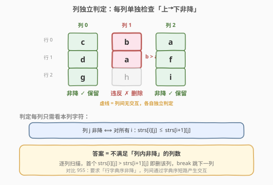
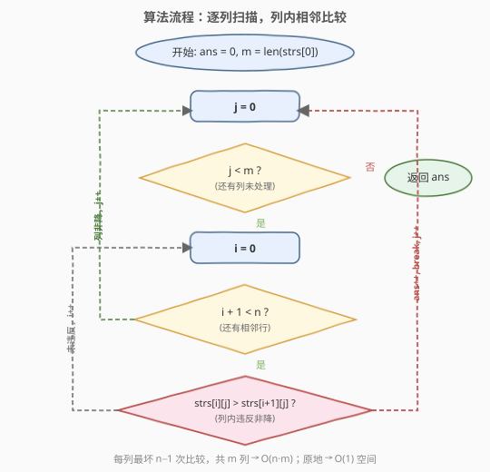

# LeetCode 删列造序 题解

## 1. 题目概述

- **标题 / 题号**：删列造序（#944，easy）
- **链接**：https://leetcode.cn/problems/delete-columns-to-make-sorted/
- **难度**：简单
- **标签**：数组、矩阵、贪心

**题意**：给定一个由 `n` 个**等长小写字符串**组成的数组 `strs`，将其看作一个 `n × m` 的字符矩阵（每行是一个字符串，`m` 为字符串长度）。

一次「删列」操作会**删除某一整列**（即所有行的同一位置字符）。删除后，剩下的列保持原相对顺序拼成新的字符串数组。

目标是：删除**尽量少**的列，使得**剩余每一列**从上到下都是**非降**的（即对每个保留列 $j$ 和任意相邻行 $i$，都有 $\text{strs}[i][j] \le \text{strs}[i+1][j]$）。返回必须删除的列数。

> 💡 **关键观察**：944 的目标是「列内非降」，**列与列相互独立**——某列是否该删只取决于该列自身字符的纵向单调性，与其它列无关。因此逐列单独判定即可，无需考虑列间交互（这正是 944 比 955/959 简单的根本原因——后两者要求「行字典序非降」，列间会通过字典序产生交互）。

**示例 1**：

```text
输入：strs = ["cba","daf","ghi"]
输出：1
解释：矩阵如下（3 行 × 3 列）
  c b a
  d a f
  g h i
第 0 列 c,d,g  → 非降 ✓
第 1 列 b,a,h  → b > a，非降失败 ✗ → 删
第 2 列 a,f,i  → 非降 ✓
只需删第 1 列，剩 ["ca","df","gi"]，各列均非降。
```

**示例 2**：

```text
输入：strs = ["abcdef"]
输出：0
解释：只有一行，任意列都「非降」（无相邻行可比），无需删除。
```

**示例 3**：

```text
输入：strs = ["zyx","wvu","tsr"]
输出：3
解释：3 列全部不满足非降（z>w、y>v、x>s），全删。
```

**约束**：

- $n = \text{strs.length}$
- $1 \le n \le 100$
- $1 \le \text{strs[i].length} \le 1000$
- $\text{strs[i]}$ 由小写英文字母组成
- 所有字符串长度相同

## 2. 解题思路

### 2.1 暴力思路

对每一列 $j$（$0 \le j < m$），从上到下扫描相邻两行字符 `strs[i][j]` 与 `strs[i+1][j]`：一旦遇到 `strs[i][j] > strs[i+1][j]`，该列必须删除，计数 +1 并跳到下一列。

这其实已经是最优做法——因为判定一列是否非降**必须**检查所有相邻对，最坏情况要看完整个列。

### 2.2 核心观察：列独立 + 列内非降判定



**两个关键观察**：

1. **列与列相互独立**。944 题的要求是「每一列内部从上到下非降」，不同列之间互不影响。因此可以**逐列单独判定**，无需考虑列间交互（这正是 944 比 955/959 简单的根本原因——后两者列与列会通过字典序产生交互）。

2. **列内非降 = 相邻对全满足 $\le$**。一列字符序列 $c_0, c_1, \dots, c_{n-1}$ 非降，当且仅当对任意 $i$ 都有 $c_i \le c_{i+1}$。只需找到**第一个违反**的对即可判定该列需删除，可提前终止该列扫描。

> 💡 **为何列独立是「天然」的？** 944 的目标本身就是「每个保留列列内非降」——这是一条**逐列定义**的约束，某列是否合格只看该列自身字符，不依赖其它列的存在或顺序。因此删与不删完全可逐列决定，答案就是「不合格列」的计数。对比 955（要求行字典序非降），字典序的「短路比较」会让前缀相同的行段推迟到后续列决断，列间因此产生交互，无法再独立判定。

### 2.3 算法流程图



1. 初始化 `ans = 0`，列数 `m = strs[0]` 的长度。
2. 对每一列 $j$ 从 $0$ 到 $m-1$：
   - 设标志 `sorted = true`。
   - 对每一对相邻行 $i$ 从 $0$ 到 $n-2$：
     - 若 `strs[i][j] > strs[i+1][j]`：`sorted = false`，**break**（提前终止本列）。
   - 若 `sorted == false`：`ans += 1`（本列需删除）。
3. 返回 `ans`。

### 2.4 示例演算

![示例演算：strs = ["cba","daf","ghi"]](../images/delcols_walkthrough.svg)

以 `strs = ["cba","daf","ghi"]`（$n=3, m=3$）为例：

| 列 $j$ | 列字符（上→下） | 相邻比较 | 判定 | ans |
|--------|-----------------|----------|------|-----|
| 0 | `c, d, g` | `c≤d` ✓, `d≤g` ✓ | 非降，保留 | 0 |
| 1 | `b, a, h` | `b≤a`? ✗（`b > a`） | 违反，删除 | 1 |
| 2 | `a, f, i` | `a≤f` ✓, `f≤i` ✓ | 非降，保留 | 1 |

最终 `ans = 1`。

> 💡 第 1 列在比较第 0、1 行时即发现 `b > a`，**立即 break**，不再比较第 1、2 行——这是提前终止带来的小优化（虽不改变整体复杂度量级，但常数更优）。

## 3. 参考代码

### C++

```cpp
class Solution {
public:
    int minDeletionSize(vector<string>& strs) {
        int n = strs.size();
        int m = strs[0].size();
        int ans = 0;
        for (int j = 0; j < m; ++j) {
            for (int i = 0; i + 1 < n; ++i) {
                if (strs[i][j] > strs[i + 1][j]) {
                    ++ans;
                    break;
                }
            }
        }
        return ans;
    }
};
```

### Python

```python
class Solution:
    def minDeletionSize(self, strs: List[str]) -> int:
        n, m = len(strs), len(strs[0])
        ans = 0
        for j in range(m):
            for i in range(n - 1):
                if strs[i][j] > strs[i + 1][j]:
                    ans += 1
                    break
        return ans
```

> ⚠️ **比较方向**：用 `>`（严格大于）判定违反，而非 `>=`。题目要求**非降**（允许相等），相等的相邻字符不算违反。若误写成 `>=`，会把「列内全相同」的合法列误判为需删除。

> 💡 **Python 一行写法**（可读性稍差，面试慎用）：`return sum(any(a[j] > b[j] for a, b in pairwise(strs)) for j in range(len(strs[0])))`，逻辑与上方展开版完全一致。

## 4. 复杂度分析

| 维度 | 复杂度 | 说明 |
|------|--------|------|
| 时间复杂度 | $O(n \cdot m)$ | 最坏情况每个字符都被比较一次（$n$ 行 $m$ 列共 $nm$ 个字符，每列最多 $n-1$ 次相邻比较） |
| 空间复杂度 | $O(1)$ | 仅用 `ans` 及循环索引，原地判定 |

> 💡 **下界论证**：为何 $O(nm)$ 已是最优？考虑输入全为同一字符（如全 `a`），此时**没有任何列可提前 break**——每一列都必须完整扫描 $n-1$ 个相邻对才能确认非降。最坏情况下至少要看 $\Omega(nm)$ 个字符，故 $O(nm)$ 严格最优，无法改进。

## 5. 扩展：「删列造序」三部曲

944 是该系列的**入门篇**，核心是「列独立」。后续两题引入列间交互，难度递增：

| 题号 | 题目 | 难度 | 与 944 的差异 |
|------|------|------|---------------|
| 944 | 删列造序 | 简单 | 列独立，逐列判定非降即可 |
| 955 | 删列造序 II | 中等 | 要求**行字典序非降**，列间通过字典序交互——前缀相同时后续列才有决定权，需贪心保留列 |
| 959 | 删列造序 III | 困难 | 要求删后**所有行均为同一非降序列的子序列**（等价于删后列内严格非降 + 行间可重排），DP 求最长「可保留列链」 |

**944 → 955 的关键升级**：955 中两行若在前若干列相等，则后续列的比较才生效（字典序的「短路」特性），因此**不能**像 944 那样无条件逐列独立判定，而要用贪心维护「已确定非降的行段」。

## 6. 面试要点

1. **为什么这道题的暴力就是最优解？**

   判定一列是否非降，最坏情况下必须检查所有相邻对（如全相同字符时无提前终止）。因此每个字符都可能被访问，下界 $\Omega(nm)$。暴力扫描恰好达到该下界，故最优。

2. **列与列真的独立吗？依据是什么？**

   944 的目标本身就是「每个保留列列内非降」——这是逐列定义的约束，某列合格与否只看该列自身字符，不依赖其它列。因此逐列判定天然充要，列间无交互。注意 955 的目标是「行字典序非降」，字典序的短路比较会让前缀相同的行段推迟到后续列决断，列间产生交互，不再独立——这是 944 与 955 的本质区别。

3. **提前 break 带来的收益有多大？**

   只影响常数，不改变 $O(nm)$ 量级。最坏输入（全同字符）下每列都要扫完，break 无用；最好情况下每列首个相邻对就违反，仅需 $O(m)$ 次比较。平均意义上有常数级加速。

4. **如果字符串长度极大（$m$ 很大）但行数很少（$n$ 小），有优化空间吗？**

   可以转置思维：按行遍历，对每对相邻行求「首个不同列」，但 944 要求的是「列内非降」而非「行间字典序」，转置收益有限。真正受益于转置的是 955（按行段贪心）。944 中 $n$ 小时，按列遍历每列只做 $n-1$ 次比较，已很高效。

5. **数据范围（$n,m \le 1000$）下会不会超时？**

   $nm \le 10^6$，$O(nm)$ 在 1 秒时限内绰绰有余（约几毫秒）。无需担心常数。

## 同类练习题

| # | 题目 | 与本题的关联 |
|---|------|-------------|
| 955 | [删列造序 II](https://leetcode.cn/problems/delete-columns-to-make-sorted-ii/) | 本题进阶版，列间通过字典序交互，贪心保留列使行字典序非降 |
| 959 | [删列造序 III](https://leetcode.cn/problems/delete-columns-to-make-sorted-iii/) | 三部曲最难篇，DP 求最长可保留列链 |
| 14 | [最长公共前缀](https://leetcode.cn/problems/longest-common-prefix/)（[站内题解](../0001-0100/14_最长公共前缀.md)） | 同样按列扫描字符串数组，纵向比较字符 |
| 766 | [托普利茨矩阵](https://leetcode.cn/problems/toeplitz-matrix/) | 矩阵性质判定，逐格检查与左上角是否相等，同属「矩阵逐元素扫描」套路 |
