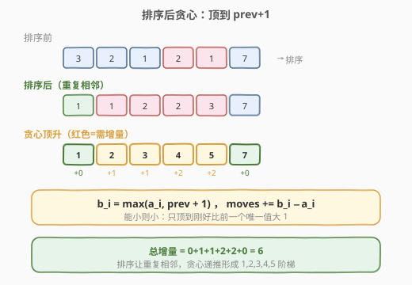
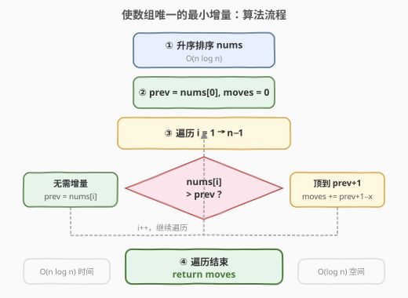

# LeetCode 使数组唯一的最小增量 题解

## 1. 题目概述

- **标题 / 题号**：使数组唯一的最小增量（#945，medium）
- **链接**：https://leetcode.cn/problems/minimum-increment-to-make-array-unique/
- **难度**：中等
- **标签**：贪心、数组、排序、并查集

**题意**：给定一个整数数组 `nums`，每次操作可以选择一个下标 `i` 并将 `nums[i]` 加 `1`。返回使 `nums` 中**所有值各不相同**所需的最少操作次数。

> 💡 本题是「**贪心 + 排序**」的招牌题。核心直觉是：排序后从左到右，每个元素只需被顶到「刚好比前一个唯一值大」的位置，就能保证全局增量最小。此外还有一道**路径压缩并查集**的进阶解法，面试追问时非常出彩。

**示例 1**：

```text
输入：nums = [1,2,2]
输出：1
解释：将第二个 2 增量为 3，数组变为 [1,2,3]，所有值唯一，操作 1 次。
```

**示例 2**：

```text
输入：nums = [3,2,1,2,1,7]
输出：6
解释：排序后 [1,1,2,2,3,7]，依次顶为 [1,2,3,4,5,7]，增量分别为 0+1+1+2+2+0 = 6。
```

**约束**：

- `1 <= nums.length <= 10^5`
- `0 <= nums[i] <= 10^5`
- 测试用例保证答案在 32 位整数范围内

## 2. 解题思路

### 2.1 暴力思路

每次发现有重复值，就把其中一个加 `1`，直到无重复。最坏情况（全为 `0` 的数组）需要把第 `i` 个元素加到 `i`，总增量 $O(n^2)$，逐次检查重复又需 $O(n)$，整体 $O(n^3)$，$n = 10^5$ 完全不可行。

### 2.2 核心观察：排序后贪心——顶到 prev+1



关键洞察：**排序后，最优的唯一化结果一定是一段严格递增序列，且每个值「能小则小」**——即每个元素只被顶到刚好比前一个唯一值大 `1` 的位置。

理由如下：

> 💡 设排序后为 $a_0 \le a_1 \le \dots \le a_{n-1}$，最终唯一化后的值为 $b_0 < b_1 < \dots < b_{n-1}$，且 $b_i \ge a_i$（只能增不能减）。要最小化 $\sum(b_i - a_i)$，最优策略是让每个 $b_i$ 尽可能小。由于 $b_i > b_{i-1}$，最小的合法取值就是 $b_i = \max(a_i,\ b_{i-1} + 1)$。这是一个**递推贪心**：每步只依赖前一个结果，局部最优即全局最优。

具体地，维护 `prev`（上一个唯一化后的值），对排序后的每个 `x`：

- 若 `x > prev`：无需增量，`prev = x`
- 若 `x <= prev`：顶到 `prev + 1`，增量 `moves += prev + 1 - x`，`prev = prev + 1`

> ⚠️ 为什么排序是必要的？不排序时，重复元素可能散布各处，无法用「比前一个大 1」的简单递推确定每个值该顶到哪。排序后，重复元素相邻，贪心的「顶到 prev+1」自然把一串重复值连续顶开，形成 $1, 2, 3, \dots$ 的阶梯，增量最小。

### 2.3 算法流程图



```
1. 对 nums 升序排序
2. 初始化 prev = nums[0], moves = 0
3. 从 i = 1 到 n-1：
      若 nums[i] > prev：
          prev = nums[i]              // 无需增量
      否则：
          moves += prev + 1 - nums[i] // 顶到 prev+1
          prev = prev + 1
4. 返回 moves
```

> 💡 第 3 步是单遍扫描，每步 $O(1)$，加上排序的 $O(n \log n)$，总时间 $O(n \log n)$。排序把「找重复」的复杂度从 $O(n^2)$ 降到了 $O(n \log n)$。

### 2.4 示例演算

![示例演算：nums = [3,2,1,2,1,7]](../images/min_incr_unique_walkthrough.svg)

以示例 2 `nums = [3,2,1,2,1,7]` 为例。排序后得 `[1, 1, 2, 2, 3, 7]`：

| 步骤 | 原值 x | prev（前） | 比较结果 | 唯一化值 | 增量 | prev（后） | moves |
|------|--------|-----------|----------|----------|------|-----------|-------|
| ① | 1 | — | 首元素 | 1 | 0 | 1 | 0 |
| ② | 1 | 1 | x ≤ prev | 2 | 1 | 2 | 1 |
| ③ | 2 | 2 | x ≤ prev | 3 | 1 | 3 | 2 |
| ④ | 2 | 3 | x ≤ prev | 4 | 2 | 4 | 4 |
| ⑤ | 3 | 4 | x ≤ prev | 5 | 2 | 5 | 6 |
| ⑥ | 7 | 5 | x > prev | 7 | 0 | 7 | 6 |

最终唯一化数组为 `[1, 2, 3, 4, 5, 7]`，总增量 `moves = 6` ✅

## 3. 参考代码

### C++

```cpp
// 使数组唯一的最小增量.cpp —— 排序 + 贪心递推
#include <vector>
#include <algorithm>
using namespace std;

class Solution {
public:
    int minIncrementForUnique(vector<int>& nums) {
        sort(nums.begin(), nums.end());
        int moves = 0;
        int prev = nums[0];
        for (int i = 1; i < (int)nums.size(); ++i) {
            if (nums[i] > prev) {
                prev = nums[i];              // 无需增量
            } else {
                moves += prev + 1 - nums[i]; // 顶到 prev+1
                prev = prev + 1;
            }
        }
        return moves;
    }
};
```

### Python

```python
class Solution:
    def minIncrementForUnique(self, nums: list[int]) -> int:
        nums.sort()
        moves = 0
        prev = nums[0]
        for i in range(1, len(nums)):
            if nums[i] > prev:
                prev = nums[i]               # 无需增量
            else:
                moves += prev + 1 - nums[i]  # 顶到 prev+1
                prev = prev + 1
        return moves
```

> 💡 **一个易错点**：`prev` 必须初始化为 `nums[0]`（排序后），而非 `-1` 或 `0`。若初始化为 `0`，当 `nums[0] = 0` 时首个元素会被误判为需要增量；从 `i = 1` 开始遍历可避免对首元素的特殊处理。

## 4. 复杂度分析

| 维度 | 复杂度 | 说明 |
|------|--------|------|
| **时间复杂度** | $O(n \log n)$ | 排序 $O(n \log n)$ 主导；单遍扫描 $O(n)$ |
| **空间复杂度** | $O(\log n)$ | 排序所需的栈空间（C++ `sort` 为内省排序，递归深度 $O(\log n)$）；若不允许原地排序则 $O(n)$ |

## 5. 扩展：路径压缩并查集——O(n α(n)) 解法

当 `nums[i]` 的值域较小（本题 $0 \le nums[i] \le 10^5$）时，可以避免排序，用**路径压缩并查集**直接找到每个值该放到的空位。

**思路**：维护一个映射 `parent`，`find(v)` 返回「从 `v` 出发，第一个还没被占用的值」。处理 `nums[i] = v` 时：

1. 调用 `root = find(v)`，找到可用空位。
2. 增量 `moves += root - v`。
3. 占用 `root`，并令 `parent[root] = root + 1`（指向下一个候选空位），这样后续遇到 `v` 或 `root` 时路径压缩会直接跳到 `root + 1`。

```cpp
class Solution {
    unordered_map<int, int> parent;
    int find(int v) {
        if (parent.find(v) == parent.end())
            return v;                       // v 还没被占用
        return parent[v] = find(parent[v]); // 路径压缩
    }
public:
    int minIncrementForUnique(vector<int>& nums) {
        int moves = 0;
        for (int v : nums) {
            int root = find(v);             // 找可用空位
            moves += root - v;
            parent[root] = root + 1;        // 占用 root，指向下一位
        }
        return moves;
    }
};
```

> 💡 **为什么正确**：`find(v)` 保证返回的 `root >= v` 且 `root` 尚未被占用。每次占用后立即把 `parent[root]` 指向 `root + 1`，后续 `find` 会沿路径压缩直达下一个空位，均摊 $O(\alpha(n))$。总时间 $O(n\,\alpha(n))$，接近线性。

> ⚠️ 此解法不依赖排序顺序，对任意输入顺序都正确。但由于哈希表常数较大，在 $n = 10^5$ 时实际运行未必比排序解法快——它的价值在于**思路的通用性**：任何「找下一个可用空位」的问题都能套用路径压缩并查集。

## 6. 面试要点

1. **为什么排序后贪心「顶到 prev+1」是最优的？**

   - 排序后 $a_0 \le a_1 \le \dots$，最终唯一值 $b_0 < b_1 < \dots$ 且 $b_i \ge a_i$。要最小化 $\sum(b_i - a_i)$，每个 $b_i$ 取尽可能小的合法值 $b_i = \max(a_i,\ b_{i-1}+1)$。这是「能小则小」的贪心，可由交换论证证明：若某 $b_i$ 取得更大，只会把后续的 $b_j$ 也推高，总增量不减。

2. **不排序会怎样？贪心还成立吗？**

   - 不排序时重复元素不相邻，无法用「比前一个大 1」确定该顶到哪。例如 `[2, 2, 2]` 不排序按序处理：第一个 `2`→`prev=2`，第二个 `2`→顶到 `3`，第三个 `2`→顶到 `4`，看似成立。但 `[2, 1, 2]` 不排序：先 `prev=2`，再 `1 < 2` 顶到 `3`（增 `2`），再 `2 ≤ 3` 顶到 `4`（增 `2`），总 `4`；而排序后 `[1,2,2]` 只需顶到 `[1,2,3]`，增 `1`。排序保证贪心的递推方向正确。

3. **路径压缩并查集解法相比排序解法有什么优劣？**

   - 时间上并查集 $O(n\,\alpha(n))$ 优于排序 $O(n \log n)$，但哈希表常数大，实际未必更快。空间上并查集需 $O(n)$ 哈希表，排序解法可 $O(1)$ 额外空间（原地排序）。并查集的优势是**不修改输入顺序**且**思路通用**，适合值域受限、需在线处理的场景。

4. **如果允许减量操作（既可加也可减），怎么解？**

   - 变成「使数组唯一的最小总变化量」，贪心不再直接适用。通常用排序 + 动态规划，或转化为「将值分配到不重叠的槽位」的二分图匹配问题，复杂度上升。

5. **全为相同值（如 `[0,0,0,0]`）时结果是什么？**

   - 排序后 `[0,0,0,0]`，贪心顶为 `[0,1,2,3]`，增量 `0+1+2+3 = 6`。一般地，`k` 个相同值 `v` 会顶为 `v, v+1, ..., v+k-1`，增量为 $0+1+\dots+(k-1) = \frac{k(k-1)}{2}$。

> 💡 **一句话总结**：使数组唯一的最小增量招牌解法是「**排序后贪心递推**」——每个元素顶到 `max(自身, prev+1)`，增量累加。排序 $O(n \log n)$ 是瓶颈；进阶可用**路径压缩并查集**找空位，均摊接近线性。

## 同类练习题

| # | 题目 | 与本题的关联 |
|---|------|-------------|
| 1089 | [复写零](https://leetcode.cn/problems/duplicate-zeros/) | 原地处理重复元素的操作计数，同属「扫描 + 贪心」家族 |
| 1365 | [有多少小于当前数字的数字](https://leetcode.cn/problems/how-many-numbers-are-smaller-than-the-current-number/) | 排序 + 计数的基础应用，与本题共享「排序简化重复问题」的思想 |
| 684 | [冗余连接](https://leetcode.cn/problems/redundant-connection/)（[题解](../0601-0700/684_冗余连接.md)） | 并查集判环模板，与第 5 节路径压缩并查集同源 |
| 740 | [删除并获得点数](https://leetcode.cn/problems/delete-and-earn/)（[题解](../0701-0800/740_删除并获得点数.md)） | 值域建桶 + DP，与本题并查集解法共享「值域受限」的前提 |
| 547 | [省份数量](https://leetcode.cn/problems/number-of-provinces/)（[题解](../0501-0600/547_省份数量.md)） | 并查集模板题，巩固路径压缩的写法 |
