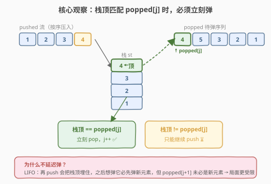
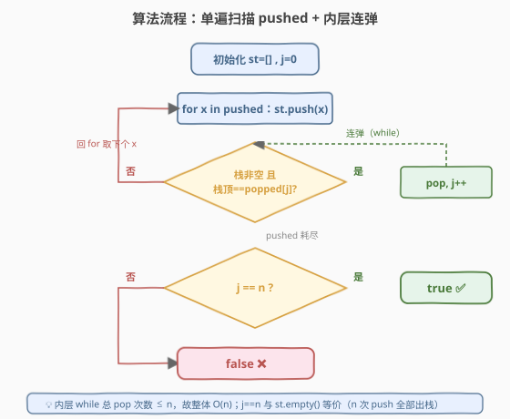
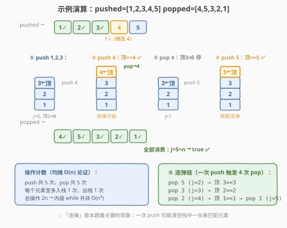

# LeetCode 验证栈序列 题解

## 1. 题目概述

- **标题 / 题号**：验证栈序列（#946，medium）
- **链接**：https://leetcode.cn/problems/validate-stack-sequences/
- **难度**：中等
- **标签**：栈、模拟、贪心

**题意**：给定两个整数序列 `pushed` 和 `popped`，每个序列中的值**互不相同**。如果 `popped` 是在空栈上对 `pushed` 执行一系列 `push` / `pop` 操作后可能得到的弹出序列，返回 `true`；否则返回 `false`。

> 💡 本题对应 **剑指 Offer 31. 栈的压入、弹出序列**，是字节、腾讯面试的高频题。它考察的不是「设计一个栈」，而是「**用一个栈去模拟、验证一个序列是否合法**」——这种「栈模拟判定合法性」的套路在面试中非常常见，掌握后可迁移到一整类「验证出栈 / 入栈序列」问题。

**示例 1**：

```text
输入：pushed = [1,2,3,4,5], popped = [4,5,3,2,1]
输出：true
解释：可以按如下顺序操作：
  push(1), push(2), push(3), push(4), pop → 4
  push(5), pop → 5, pop → 3, pop → 2, pop → 1
```

**示例 2**：

```text
输入：pushed = [1,2,3,4,5], popped = [4,3,5,1,2]
输出：false
解释：pop 出 4、3、5 之后，栈中从底到顶是 [1,2]，1 被压在 2 下面，无法先于 2 弹出。
```

**约束**：

- `0 <= pushed.length == popped.length <= 1000`
- `0 <= pushed[i], popped[i] <= 1000`
- `pushed` 中的所有元素**互不相同**
- `popped` 中的所有元素**互不相同**
- `popped` 是 `pushed` 的一个排列

## 2. 解题思路

### 2.1 暴力思路

枚举所有可能的 `push` / `pop` 决策序列（每个元素要么入栈、要么在栈非空时出栈），看是否存在一种决策能产生 `popped`。决策树规模是指数级的，`n=1000` 时完全不可行，且存在大量重复子问题。

### 2.2 核心观察：贪心模拟——能弹就弹



关键观察是：**当栈顶恰好等于 `popped` 中下一个要弹出的值时，我们必须立刻弹出它，没有理由推迟。**

理由如下：

> 💡 栈是「后进先出」（LIFO）。如果当前栈顶 `x` 正好是 `popped[j]`，而我们选择不弹、继续 `push` 别的元素 `y`，那么 `y` 会盖在 `x` 上面。要想之后弹出 `x`，必须先把 `y` 弹掉——但 `popped[j]` 之后紧接着要弹的是 `popped[j+1]`，未必是 `y`。推迟弹 `x` 只会让局面更受限，不会更宽松。

换句话说，**每个时刻的「弹或不弹」其实没有选择**：栈顶匹配就必须弹，不匹配就只能继续 `push`。这是一个**被迫的贪心**过程——把 `pushed` 按顺序逐个压入，每次压完后只要栈顶匹配 `popped` 的当前待弹值就不断弹出。最终若 `popped` 被完整消费，则合法。

> ⚠️ 「元素互不相同」是这个贪心成立的前提。若值可重复，栈顶等于 `popped[j]` 不代表它就是「那个该弹的元素」（可能是后压入的同值元素），贪心不再正确——这也是本题约束强调 distinct 的原因。

### 2.3 算法流程图



```
1. 初始化空栈 st，弹出指针 j = 0
2. 逐个把 pushed[i] 压入栈：
     a. st.push(pushed[i])
     b. while 栈非空 且 栈顶 == popped[j]：
            st.pop()
            j++                    // 消费掉一个 popped 元素
3. 循环结束，判断 j == n：
     - 是 → popped 是合法弹出序列，返回 true
     - 否 → 还有元素没弹出来，返回 false
```

> 💡 第 2.b 步是「连弹」：一次 `push` 之后可能触发连续多次 `pop`（例如示例 1 中压入 5 后连续弹出 5、3、2、1）。每个元素最多入栈一次、出栈一次，所以总操作数是 `O(2n)`，均摊到每个 `push` 上是 `O(1)`。

### 2.4 示例演算

以示例 1 `pushed = [1,2,3,4,5]`、`popped = [4,5,3,2,1]` 为例：



| 步骤 | 操作 | 栈状态（底→顶） | j | 说明 |
|------|------|------------------|---|------|
| ① | push 1 | `[1]` | 0 | 栈顶 1 ≠ popped[0]=4 |
| ② | push 2 | `[1,2]` | 0 | 栈顶 2 ≠ 4 |
| ③ | push 3 | `[1,2,3]` | 0 | 栈顶 3 ≠ 4 |
| ④ | push 4 | `[1,2,3,4]` | 0 | 栈顶 4 == 4，触发连弹 |
| ⑤ | pop → 4 | `[1,2,3]` | 1 | 栈顶 3 ≠ popped[1]=5，停止 |
| ⑥ | push 5 | `[1,2,3,5]` | 1 | 栈顶 5 == 5，触发连弹 |
| ⑦ | pop → 5 | `[1,2,3]` | 2 | 栈顶 3 == 3，继续弹 |
| ⑧ | pop → 3 | `[1,2]` | 3 | 栈顶 2 == 2，继续弹 |
| ⑨ | pop → 2 | `[1]` | 4 | 栈顶 1 == 1，继续弹 |
| ⑩ | pop → 1 | `[]` | 5 | 栈空，停止 |

循环结束，`j = 5 = n` → **合法** ✅

以示例 2 `pushed = [1,2,3,4,5]`、`popped = [4,3,5,1,2]` 为例：

| 步骤 | 操作 | 栈状态 | j | 说明 |
|------|------|--------|---|------|
| ① | push 1,2,3,4 | `[1,2,3,4]` | 0 | 栈顶 4 == 4，连弹 |
| ② | pop → 4 | `[1,2,3]` | 1 | 栈顶 3 == 3，继续弹 |
| ③ | pop → 3 | `[1,2]` | 2 | 栈顶 2 ≠ popped[2]=5，停止 |
| ④ | push 5 | `[1,2,5]` | 2 | 栈顶 5 == 5，弹 |
| ⑤ | pop → 5 | `[1,2]` | 3 | 栈顶 2 ≠ popped[3]=1，停止 |
| — | 无元素可压 | `[1,2]` | 3 | 循环结束 |

循环结束，`j = 3 ≠ 5`，栈中残留 `[1,2]`，但 `popped` 接下来要弹 1，而 1 被压在 2 下方无法先弹 → **非法** ❌

## 3. 参考代码

### C++

```cpp
// 验证栈序列.cpp —— 贪心模拟：能弹就弹
#include <vector>
#include <stack>
using namespace std;

class Solution {
public:
    bool validateStackSequences(vector<int>& pushed, vector<int>& popped) {
        stack<int> st;
        int j = 0;                       // popped 的消费指针
        for (int x : pushed) {
            st.push(x);                  // 按顺序压入
            while (!st.empty() && st.top() == popped[j]) {
                st.pop();                // 栈顶匹配，立刻弹出
                ++j;                     // 消费一个 popped 元素
            }
        }
        return j == (int)popped.size();  // popped 全部消费完即合法
    }
};
```

### Python

```python
class Solution:
    def validateStackSequences(self, pushed: list[int], popped: list[int]) -> bool:
        st: list[int] = []
        j = 0                            # popped 的消费指针
        for x in pushed:
            st.append(x)                 # 按顺序压入
            while st and st[-1] == popped[j]:
                st.pop()                 # 栈顶匹配，立刻弹出
                j += 1                   # 消费一个 popped 元素
        return j == len(popped)          # popped 全部消费完即合法
```

> 💡 代码极简但有一个易错点：内层 `while` 的条件必须先判 `st` 非空再访问 `st.top()` / `st[-1]`，否则空栈访问栈顶会越界（C++ 是未定义行为，Python 会抛 `IndexError`）。利用短路求值把 `!st.empty()` 放在 `&&` 前面即可。

## 4. 复杂度分析

| 维度 | 复杂度 | 说明 |
|------|--------|------|
| **时间复杂度** | `O(n)` | 外层 `for` 执行 `n` 次 `push`；内层 `while` 总共最多执行 `n` 次 `pop`（每个元素至多出栈一次）。总操作数 `O(2n) = O(n)` |
| **空间复杂度** | `O(n)` | 最坏情况 `popped` 与 `pushed` 顺序完全相反，所有元素先入栈再一次性弹出，栈存 `n` 个元素 |

> ⚠️ 注意内层 `while` 看起来像嵌套循环，但**均摊**到每次 `push` 上是 `O(1)`：`n` 次 `push` + `n` 次 `pop` 一共 `2n` 次栈操作，所以整体是 `O(n)` 而非 `O(n²)`。这是「**用总操作数而非嵌套层数来估界**」的典型例子。

## 5. 扩展：用 pushed 数组本身模拟栈（O(1) 额外空间）

如果允许复用 `pushed` 的空间，可以用一个指针 `top` 指向「模拟栈的栈顶位置」，把 `pushed` 的前若干格当作栈来用，省去显式的 `stack`：

```cpp
class Solution {
public:
    bool validateStackSequences(vector<int>& pushed, vector<int>& popped) {
        int top = 0, j = 0;              // top 指向模拟栈顶（下一个待写入位置）
        for (int x : pushed) {
            pushed[top++] = x;           // 压入：写入并 top++
            while (top > 0 && pushed[top - 1] == popped[j]) {
                top--;                   // 弹出：top--
                ++j;
            }
        }
        return j == (int)popped.size();
    }
};
```

> 💡 这里 `pushed[top++] = x` 会覆盖掉正在遍历的当前元素 `x`——但 `x` 此时已经被读到，覆盖无副作用。`top` 之前的区域就是「当前栈内容」。逻辑与显式栈完全等价，只是把 `O(n)` 的栈空间复用到了输入数组上，额外空间降到 `O(1)`。面试中作为「能否优化空间」的追问应答很出彩。

## 6. 面试要点

1. **为什么「栈顶匹配就必须立刻弹」是正确的？延迟弹不是有更多选择吗？**

   - 栈是 LIFO：栈顶 `x` 若不立刻弹，后续 `push` 的任何元素 `y` 都会盖在 `x` 上。要再弹 `x` 必须先弹 `y`，但 `popped[j+1]` 未必是 `y`。
   - 所以延迟弹只会让 `x` 被「埋得更深」，可选操作反而更少。立即弹是**不损害未来灵活性**的唯一选择——这是「**贪心的安全性**」论证。

2. **「元素互不相同」这个约束在算法里起什么作用？去掉会怎样？**

   - 元素互不相同 ⇒ 栈顶等于 `popped[j]` 时，栈顶元素就**一定是**该弹的那个 `x`，没有歧义。
   - 若有重复值，栈顶等于 `popped[j]` 可能是「后压入的同值元素」而非「该弹的那个」，贪心可能误弹。此时需要更复杂的判定（如记录每个值的出现位置），贪心不再直接成立。

3. **内层 while 是嵌套循环，为什么时间复杂度还是 `O(n)` 而不是 `O(n²)`？**

   - 用**总操作数**估界：每个元素至多 `push` 一次、`pop` 一次，全局 `pop` 总次数 ≤ `n`。外层 `for` 跑 `n` 次，内层 `while` 累计也只跑 `n` 次，总操作 `2n`。
   - 不能用「嵌套层数」简单相乘——内层循环的执行次数受全局 `pop` 上限约束，这是**均摊分析**的典型场景。

4. **最后只判断 `j == n` 就够了吗？为什么不用看栈是否为空？**

   - 二者等价：`pushed` 和 `popped` 长度相同（都是 `n`）。若 `j == n` 表示 `popped` 全部被消费，而每次消费都对应一次 `pop`，共 `n` 次 `pop` = `n` 次 `push` 全部出栈，栈必为空。
   - 反之若 `j < n`，说明还有 `popped` 元素没弹出来，但 `pushed` 已耗尽，无法再让栈顶匹配，栈中必有残留。写 `return st.empty()` 或 `return j == n` 都正确，后者更直观地表达「`popped` 是否被完整消费」。

5. **面试官追问「能否做到 `O(1)` 额外空间」怎么答？**

   - 见第 5 节：用 `pushed` 数组自身充当栈，维护一个 `top` 指针。`push` 即 `pushed[top++] = x`，`pop` 即 `top--`。逻辑不变，额外空间从 `O(n)` 降到 `O(1)`。要点是说明覆盖当前遍历元素 `x` 是安全的（已被读取）。

> 💡 **一句话总结**：验证栈序列的招牌解法是「**贪心模拟**」——按序 `push`，栈顶一匹配 `popped` 当前值就立刻 `pop`，最后看 `popped` 是否被完整消费。核心论证是「LIFO 下延迟弹只会埋得更深，能弹就该弹」。每个元素进出栈各一次，`O(n)` 时间、`O(n)` 空间，可优化到 `O(1)` 额外空间。

## 同类练习题

| # | 题目 | 与本题的关联 |
|---|------|-------------|
| 剑指 Offer 31 | [栈的压入、弹出序列](https://leetcode.cn/problems/zhan-de-ya-ru-dan-chu-xu-lie-lcof/) | 本题的剑指 Offer 原题，题意与判定方法完全一致 |
| 20 | [有效的括号](https://leetcode.cn/problems/valid-parentheses/)（[题解](../0001-0100/20_有效括号.md)） | 另一类「用栈验证序列合法性」，匹配的是括号类型而非数值顺序 |
| 71 | [简化路径](https://leetcode.cn/problems/simplify-path/) | 用栈处理 `.` / `..` 的路径压缩，同样是「扫描 + 栈模拟」骨架 |
| 1441 | [用栈操作构建数组](https://leetcode.cn/problems/build-an-array-with-stack-operations/) | 正向构造 push/pop 序列，与本题的「反向验证」互为对偶 |
| 2196 | [根据描述创建二叉树](https://leetcode.cn/problems/create-binary-tree-from-descriptions/) | 用哈希 + 栈式父子关系判定，思路同属「扫描序列 + 维护待匹配结构」家族 |
