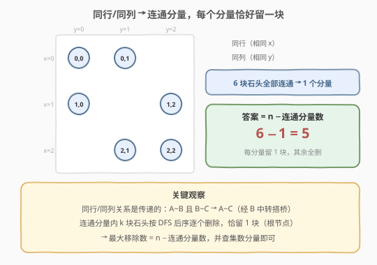
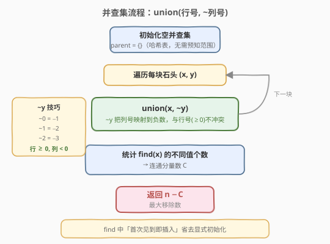
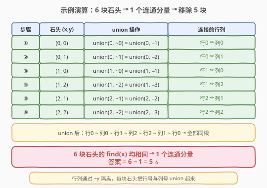

# LeetCode 移除最多的同行或同列石头 题解

## 1. 题目概述

- **标题 / 题号**：移除最多的同行或同列石头（#947，medium）
- **链接**：https://leetcode.cn/problems/most-stones-removed-with-same-row-or-column/
- **难度**：中等
- **标签**：并查集、图、搜索

**题意**：`n` 块石头放置在二维平面中的一些整数坐标点上，每个坐标点最多一块石头。如果一块石头的**同行或同列**上有其他石头存在，就可以移除这块石头。返回**可以移除的石头的最大数量**。

> 💡 本题的核心是**图连通性**——把"同行/同列"看作石头之间的连接关系，问题就转化为"每个连通分量里最多能删多少块"。这是并查集的经典应用场景，与 [547. 省份数量](../0501-0600/547_省份数量.md) 和 [684. 冗余连接](../0601-0700/684_冗余连接.md) 同属一个模板家族。

**示例 1**：

```text
输入：stones = [[0,0],[0,1],[1,0],[1,2],[2,1],[2,2]]
输出：5
解释：一种移除顺序——
  移除 [2,2]（与 [2,1] 同行）→ 移除 [2,1]（与 [0,1] 同列）
  → 移除 [1,2]（与 [1,0] 同行）→ 移除 [1,0]（与 [0,0] 同列）
  → 移除 [0,1]（与 [0,0] 同行），最终只剩 [0,0]
```

**示例 2**：

```text
输入：stones = [[0,0],[0,2],[1,1],[2,0],[2,2]]
输出：3
解释：[0,0],[0,2],[2,0],[2,2] 四块同属一个连通分量，可删 3 块；
  [1,1] 单独一个分量，不能删。总计 3 块。
```

**约束**：

- `1 <= stones.length <= 1000`
- `0 <= xi, yi <= 10^4`
- 不会有两块石头放在同一坐标点

## 2. 解题思路

### 2.1 暴力思路

枚举所有移除顺序（全排列），对每种顺序模拟：逐个检查当前石头是否仍有同行/同列的石头存在，能删就删。取所有合法顺序中删除数的最大值。时间复杂度 $O(n!)$，`n=1000` 完全不可行，且存在大量重复子问题。

### 2.2 核心观察：连通分量——每个分量恰留一块



关键观察分两步：

**第一步：同行/同列关系是传递的。** 如果石头 A 与 B 同行（$x_A = x_B$），B 与 C 同列（$y_B = y_C$），则 A、B、C 三块石头互相可达——删 B 时 A/C 都还在，删 A 时 B 还在（同行）。这种"经中转石块搭桥"的关系使得**同行/同列的石头自然形成连通分量**。

**第二步：每个连通分量恰能留一块。** 设某连通分量有 $k$ 块石头：

- **能删 $k-1$ 块**：在该分量的连通图上取一棵生成树，按 DFS 后序处理——先删子节点，再删父节点。每个被删的节点在其被删时刻，它的父节点（同行/同列）仍在，所以满足删除条件。根节点最后留下。
- **不能删 $k$ 块**：最后一块石头没有同行/同列的伙伴，无法删除。

> 💡 由此得到公式：**最大移除数 = $n - \text{连通分量数}$**。问题从"找最优移除顺序"简化为"数连通分量"——正是并查集的招牌应用。

### 2.3 算法流程图



```
1. 初始化并查集（用哈希表，无需预知坐标范围）
2. 对每块石头 (x, y)：
     union(x, ~y)           // ~y 取反，负数表示列号，与正数行号不冲突
3. 统计所有石头的 find(x) 的不同值个数 → 连通分量数 C
4. 返回 n − C
```

> ⚠️ **~y 技巧**：`~y` 对 $y \ge 0$ 得到负数（`~0 = -1, ~1 = -2, …`），而行号 $x \ge 0$ 恒为非负。正负不重叠，行节点与列节点天然区分，无需开大数组或预知坐标范围。这是本题最优雅的实现细节。

### 2.4 示例演算



以示例 1 `stones = [[0,0],[0,1],[1,0],[1,2],[2,1],[2,2]]` 为例：

| 步骤 | 石头 $(x,y)$ | union 操作 | 连接的行列 |
|------|-------------|------------|-----------|
| ① | $(0,0)$ | `union(0, ~0)` = `union(0, -1)` | 行0 ↔ 列0 |
| ② | $(0,1)$ | `union(0, ~1)` = `union(0, -2)` | 行0 ↔ 列1 |
| ③ | $(1,0)$ | `union(1, ~0)` = `union(1, -1)` | 行1 ↔ 列0 |
| ④ | $(1,2)$ | `union(1, ~2)` = `union(1, -3)` | 行1 ↔ 列2 |
| ⑤ | $(2,1)$ | `union(2, ~1)` = `union(2, -2)` | 行2 ↔ 列1 |
| ⑥ | $(2,2)$ | `union(2, ~2)` = `union(2, -3)` | 行2 ↔ 列2 |

union 后的连通关系：

- 行0 ~ 列0 ~ 行1 ~ 列2 ~ 行2 ~ 列1 ~ 行0 → **全部同根**

6 块石头的 `find(x)` 均相同 → **1 个连通分量** → 答案 = $6 - 1 = \mathbf{5}$ ✅

## 3. 参考代码

### C++

```cpp
// 移除最多的同行或同列石头.cpp —— 并查集 + ~y 技巧
#include <vector>
#include <unordered_map>
#include <unordered_set>
using namespace std;

class Solution {
    unordered_map<int, int> parent;

    int find(int x) {
        if (parent.find(x) == parent.end()) {
            parent[x] = x;                            // 首次见到，自成一集合
            return x;
        }
        if (parent[x] != x) parent[x] = find(parent[x]);  // 路径压缩
        return parent[x];
    }

    void unite(int x, int y) {
        int rx = find(x), ry = find(y);
        if (rx != ry) parent[rx] = ry;               // 合并
    }

public:
    int removeStones(vector<vector<int>>& stones) {
        parent.clear();
        int n = stones.size();
        for (auto& s : stones) {
            unite(s[0], ~s[1]);                      // ~y 区分行列
        }
        unordered_set<int> roots;
        for (auto& s : stones) {
            roots.insert(find(s[0]));                // 统计不同根
        }
        return n - (int)roots.size();
    }
};
```

### Python

```python
class Solution:
    def removeStones(self, stones: list[list[int]]) -> int:
        parent: dict[int, int] = {}

        def find(x: int) -> int:
            if x not in parent:
                parent[x] = x                        # 首次见到，自成一集合
                return x
            if parent[x] != x:
                parent[x] = find(parent[x])          # 路径压缩
            return parent[x]

        def union(x: int, y: int) -> None:
            parent[find(x)] = find(y)                # 合并

        for x, y in stones:
            union(x, ~y)                             # ~y 区分行列

        roots = {find(x) for x, _ in stones}         # 统计不同根
        return len(stones) - len(roots)
```

> 💡 代码用 `unordered_map` / `dict` 而非数组，因为 `~y` 产生负数键且坐标范围不必预知。`find` 中"首次见到即插入"省去了显式初始化，是哈希表并查集的惯用写法。

## 4. 复杂度分析

| 维度 | 复杂度 | 说明 |
|------|--------|------|
| **时间复杂度** | $O(n \, \alpha(n))$ | $n$ 块石头各做一次 `union`（两次 `find`），最后 $n$ 次 `find` 统计根。单次均摊 $O(\alpha(n))$ |
| **空间复杂度** | $O(n)$ | 哈希表存至多 $2n$ 个键值对（$n$ 个行号 + $n$ 个列号），根集合至多 $n$ 个 |

> 💡 $\alpha(n) \le 5$（本题 $n \le 1000$），实际等同于 $O(n)$。哈希表单次操作均摊 $O(1)$，不增加渐近复杂度。

## 5. 扩展：DFS 写法

并查集之外，DFS 也能数连通分量。思路是用两个哈希表把石头按行/列分组，DFS 时从一块石头出发，递归访问所有同行/同列的石头：

```python
class Solution:
    def removeStones(self, stones: list[list[int]]) -> int:
        from collections import defaultdict

        n = len(stones)
        row_map = defaultdict(list)              # 行号 → 石头下标列表
        col_map = defaultdict(list)              # 列号 → 石头下标列表
        for i, (x, y) in enumerate(stones):
            row_map[x].append(i)
            col_map[y].append(i)

        visited = [False] * n

        def dfs(i: int) -> None:
            visited[i] = True
            x, y = stones[i]
            for j in row_map[x]:                 # 同行的石头
                if not visited[j]:
                    dfs(j)
            for j in col_map[y]:                 # 同列的石头
                if not visited[j]:
                    dfs(j)

        components = 0
        for i in range(n):
            if not visited[i]:
                dfs(i)
                components += 1

        return n - components
```

> ⚠️ DFS 版本最坏情况 $O(n^2)$（所有石头同行时，每块都遍历 `row_map[x]` 全表）。可以在 DFS 后清空对应的 `row_map[x]` / `col_map[y]` 优化到 $O(n)$，但代码不如并查集简洁。面试中推荐并查集写法。

## 6. 面试要点

1. **为什么答案 = n − 连通分量数？**

   - 每个连通分量的 $k$ 块石头中，按生成树的 DFS 后序删除——每个非根节点被删时父节点仍在（同行/同列），满足删除条件。根节点最后留下无法删除。所以每分量删 $k-1$ 块，总计 $\sum(k_i - 1) = n - C$。

2. **为什么用 ~y 区分行列？直接 union(x, y) 不行吗？**

   - 行号和列号范围相同（都是 $0..10^4$），直接 `union(x, y)` 会让"行3"和"列3"被当成同一个节点，错误地连接不相关的石头。`~y` 把列号映射到负数（`~0=−1, ~1=−2…`），与正数行号不重叠，天然区分。

3. **为什么用哈希表而不是数组存 parent？**

   - `~y` 产生负数，且坐标范围 $0..10^4$ 对应 `~y` 范围 $−1..−10001$。用数组需要知道范围并做偏移，哈希表 `unordered_map` / `dict` 自动处理任意 int 键，代码更简洁。`find` 中"首次见到即插入"省去显式初始化。

4. **DFS 和并查集哪个更好？**

   - 并查集更好：$O(n \, \alpha(n))$ 时间、$O(n)$ 空间，且不受图密度影响。DFS 最坏 $O(n^2)$（需额外清表优化才到 $O(n)$）。两者空间都是 $O(n)$，但并查集代码更短、更不易出错。

5. **"同行/同列是传递的"这个性质怎么理解？**

   - A 与 B 同行、B 与 C 同列 $\Rightarrow$ A 能借 B 的"桥梁"间接与 C 发生关系。具体来说，删 B 前 A 和 C 都可能在；即使 B 被删，只要删 B 时 A 或 C 还在（满足条件），传递性就保证了分量内所有石头最终都能被处理到。并查集的 union 天然捕捉这种传递闭包。

> 💡 **一句话总结**：把同行/同列的石头用并查集 union 起来，数连通分量数 $C$，答案就是 $n - C$。`~y` 技巧优雅地区分行列节点，哈希表实现无需预知坐标范围。每个分量留一块、其余全删——这是并查集"数连通分量"用法的招牌题。

## 同类练习题

| # | 题目 | 与本题的关联 |
|---|------|-------------|
| 547 | [省份数量](https://leetcode.cn/problems/number-of-provinces/)（[题解](../0501-0600/547_省份数量.md)） | 同一并查集模板数连通分量，是本题的直接模板来源 |
| 684 | [冗余连接](https://leetcode.cn/problems/redundant-connection/)（[题解](../0601-0700/684_冗余连接.md)） | 同一并查集模板判环，与本题"数分量"用法对照 |
| 721 | [账户合并](https://leetcode.cn/problems/accounts-merge/) | 并查集合并字符串键（邮箱），模板进阶到"哈希映射 + 并查集" |
| 959 | [由斜杠划分区域](https://leetcode.cn/problems/regions-cut-by-slashes/) | 并查集 + 坐标变换技巧，与本题 `~y` 技巧异曲同工 |
| 1202 | [交换字符串中的元素](https://leetcode.cn/problems/smallest-string-with-swaps/) | 并查集分组后组内排序，"数分量→分量内处理"思路的延伸 |
