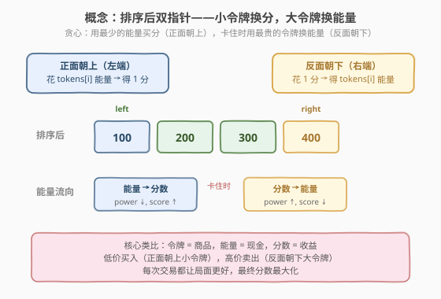
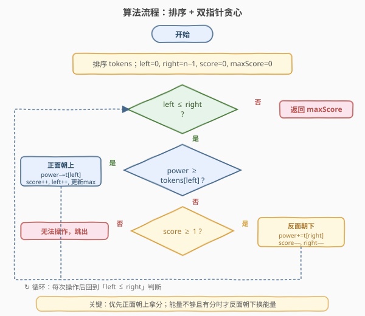
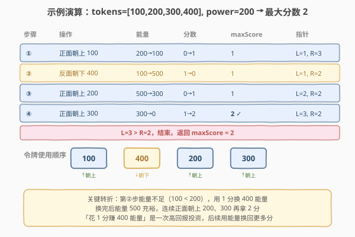

# 令牌放置

- **题目名称**：令牌放置
- **链接**：[948. 令牌放置](https://leetcode.cn/problems/bag-of-tokens/)
- **难度**：中等
- **标签**：贪心、排序、双指针

## 1. 题目概述

你的初始**能量**为 `power`，初始**分数**为 `0`，只有一包令牌以整数数组 `tokens` 给出，其中 `tokens[i]` 是第 `i` 个令牌的值。你可以通过有策略地使用这些令牌来**最大化**总分数。每次行动可以选择一种方式使用一个**未被使用的**令牌：

- **正面朝上**：若当前能量 $\ge$ `tokens[i]`，可以失去 `tokens[i]` 点能量，获得 $1$ 分。
- **反面朝下**：若当前分数 $\ge 1$，可以获得 `tokens[i]` 点能量，失去 $1$ 分。

每个令牌最多使用一次。返回能得到的**最大分数**。

> 💡 本题本质是一道**资源调度贪心**：能量是「现金」，分数是「收益」，令牌是「商品」。正面朝上是「花钱买收益」，反面朝下是「卖收益换钱」。目标是让收益最大化——经典的**低买高卖**模式。

**示例 1**：

```text
输入：tokens = [100], power = 50
输出：0
解释：能量 50 < 100，无法正面朝上；分数 0，无法反面朝下。
```

**示例 2**：

```text
输入：tokens = [200,100], power = 150
输出：1
解释：正面朝上 100（排序后），能量 150→50，分数 0→1。
      剩余令牌 200，能量 50 < 200 无法正面朝上，停止。最大分数 1。
```

**示例 3**：

```text
输入：tokens = [100,200,300,400], power = 200
输出：2
解释：
  ① 正面朝上 100：能量 200→100，分数 0→1
  ② 反面朝下 400：能量 100→500，分数 1→0
  ③ 正面朝上 200：能量 500→300，分数 0→1
  ④ 正面朝上 300：能量 300→0，  分数 1→2
最大分数 2。
```

**约束条件**：

- `0 <= tokens.length <= 1000`
- `0 <= tokens[i], power < 10^4`

---

## 2. 解题思路

### 2.1 暴力思路

枚举所有令牌的使用顺序和方式（正面/反面/不使用），搜索所有可能的状态转移路径，取最大分数。决策树规模为 $O(3^n)$（每个令牌三种选择），$n = 1000$ 时完全不可行。

记忆化搜索需要记录「已用令牌集合 + 当前能量 + 当前分数」，状态空间爆炸（$2^{1000} \times 10^4 \times n$），也不可行。需要贪心来缩小决策空间。

### 2.2 核心观察：排序 + 双指针贪心——低买高卖



关键洞察是：**正面朝上时应该选最便宜的令牌（花最少能量拿 1 分），反面朝下时应该选最贵的令牌（花 1 分换最多能量）**。

理由如下：

> 💡 **交换论证**：假设最优解中，正面朝上用了令牌 $j$（值较大），而此时还有一个更便宜的令牌 $i$（值较小）未使用。把 $j$ 换成 $i$ 正面朝上：花费的能量更少，获得的分数相同，剩余能量更多。后续用多出的能量可以做更多操作，结果不会更差。因此**总存在一个最优解，每次正面朝上都选当前最便宜的可用令牌**。同理，反面朝下选最贵的令牌能换回最多能量，也是最优的。

排序后用**双指针**即可实现：
- **左指针 `left`** 指向最便宜的未用令牌 → 候选正面朝上
- **右指针 `right`** 指向最贵的未用令牌 → 候选反面朝下

策略很简单：
1. **能正面朝上就正面朝上**（`power >= tokens[left]`）：花小代价拿分，`left++`
2. **不能正面朝上但有分时反面朝下**（`score >= 1`）：花 1 分换大能量，`right--`
3. **两者都不行就停止**：能量不够且没有分可换

> ⚠️ **为什么要记录 `maxScore` 而非直接返回 `score`？** 因为分数不是单调递增的——反面朝下会**暂时降低**分数来换取能量。最优分数可能出现在中间某步，而非最终状态。例如 `tokens = [100, 200, 300, 1000, 1001], power = 200`，中间达到分数 2 后又反面朝下降回 1，最终 `score = 1` 但 `maxScore = 2`。因此每步正面朝上后都要更新 `maxScore`。

### 2.3 算法流程图



```
1. 对 tokens 升序排序
2. 初始化 left = 0, right = n - 1, score = 0, maxScore = 0
3. while left <= right：
     a. 若 power >= tokens[left]：          // 能正面朝上
          power -= tokens[left]
          score++
          left++
          maxScore = max(maxScore, score)   // 更新最大分数
     b. 否则若 score >= 1：                  // 不能正面朝上但有分可换
          power += tokens[right]
          score--
          right--
     c. 否则：                               // 能量不够且无分可换
          break
4. 返回 maxScore
```

> 💡 **循环不变式**：`[left, right]` 区间内的令牌都是未使用的。每次操作要么 `left++`（消费一个便宜令牌换分），要么 `right--`（消费一个昂贵令牌换能量），区间严格缩小，循环必然终止。每个令牌至多被使用一次。

### 2.4 示例演算

以示例 3 `tokens = [100, 200, 300, 400]`, `power = 200` 为例：



| 步骤 | 操作 | 能量 | 分数 | maxScore | 指针 |
|------|------|------|------|----------|------|
| 初始 | 排序 | 200 | 0 | 0 | L=0, R=3 |
| ① | 正面朝上 100 | 200→100 | 0→1 | 1 | L=1, R=3 |
| ② | 反面朝下 400 | 100→500 | 1→0 | 1 | L=1, R=2 |
| ③ | 正面朝上 200 | 500→300 | 0→1 | 1 | L=2, R=2 |
| ④ | 正面朝上 300 | 300→0 | 1→2 | **2** | L=3, R=2 |
| 结束 | L=3 > R=2 | — | — | **2** | — |

关键转折在第②步：能量 100 < 200 无法继续正面朝上，于是用 1 分换取 400 能量（反面朝下最大令牌）。换完后能量充裕至 500，连续正面朝上 200、300 再拿 2 分。这是一次「先投资后回报」的典型操作——花 1 分赚 400 能量，再用能量换回 2 分，净赚 1 分。

---

## 3. 参考代码

### C++

```cpp
// 令牌放置.cpp —— 排序 + 双指针贪心：低买高卖
#include <vector>
#include <algorithm>
using namespace std;

class Solution {
public:
    int bagOfTokensScore(vector<int>& tokens, int power) {
        sort(tokens.begin(), tokens.end());
        int left = 0, right = (int)tokens.size() - 1;
        int score = 0, maxScore = 0;
        while (left <= right) {
            if (power >= tokens[left]) {         // 能正面朝上：花小能量拿分
                power -= tokens[left];
                score++;
                left++;
                maxScore = max(maxScore, score);
            } else if (score >= 1) {             // 不能正面朝上但有分：换大能量
                power += tokens[right];
                score--;
                right--;
            } else {                             // 能量不够且无分可换
                break;
            }
        }
        return maxScore;
    }
};
```

### Python

```python
class Solution:
    def bagOfTokensScore(self, tokens: List[int], power: int) -> int:
        tokens.sort()
        left, right = 0, len(tokens) - 1
        score = max_score = 0
        while left <= right:
            if power >= tokens[left]:             # 能正面朝上：花小能量拿分
                power -= tokens[left]
                score += 1
                left += 1
                max_score = max(max_score, score)
            elif score >= 1:                     # 不能正面朝上但有分：换大能量
                power += tokens[right]
                score -= 1
                right -= 1
            else:                                 # 能量不够且无分可换
                break
        return max_score
```

> 💡 **代码要点**：
> - 先排序，再用 `left` / `right` 双指针从两端向中间推进，天然实现「最便宜正面朝上 / 最贵反面朝下」。
> - `maxScore` 在**每次正面朝上后**更新，保证记录到过程中的最高分。
> - 三个分支互斥：能正面朝上就优先（拿分），否则能反面朝下就换能量，否则终止。

---

## 4. 复杂度分析

| 维度 | 复杂度 | 说明 |
|------|--------|------|
| **时间复杂度** | $O(n \log n)$ | 排序 $O(n \log n)$；双指针循环 $O(n)$（每次 `left++` 或 `right--`，最多 $n$ 次）。总体由排序主导 |
| **空间复杂度** | $O(1)$ | 仅使用 `left`、`right`、`score`、`maxScore` 四个变量（不计排序的递归栈空间 $O(\log n)$） |

> 💡 双指针循环虽然是 `while` 套 `if-else`，但**每次迭代必有一个指针移动**（`left++` 或 `right--`），所以总迭代次数 $\le n$，不会超时。

---

## 5. 扩展：贪心正确性证明

### 交换论证

**定理**：排序后按双指针贪心策略得到的分数等于最大分数。

**证明思路**：

1. **正面朝上选最便宜**：设最优解在某步正面朝上使用了令牌 $j$，而此时更便宜的令牌 $i$（$tokens[i] < tokens[j]$）也未使用。将 $j$ 换成 $i$：花费能量从 $tokens[j]$ 降到 $tokens[i]$，分数不变，剩余能量增加 $tokens[j] - tokens[i]$。后续操作不受影响（能量更多只会更宽松），所以交换后仍是最优解。反复交换可得：**总存在最优解，正面朝上总选最便宜令牌**。

2. **反面朝下选最贵**：同理，反面朝下选最贵令牌能换回最多能量，交换论证同样成立。

3. **优先正面朝上**：若某步既可正面朝上又可反面朝下（`power >= tokens[left]` 且 `score >= 1`），选择正面朝上。因为反面朝下的目的是「换能量以继续正面朝上」，但当前已经能正面朝上，没有理由先换能量。直接拿分后再判断是否需要换能量，灵活性更高。

4. **`maxScore` 的正确性**：反面朝下会暂时降低分数，但目的是换取能量以获得更多分数。最高分可能出现在中间某步。记录 `maxScore` 相当于在所有可能的「停止时机」中取最优——等价于枚举了所有「正面朝上若干次后停止」的方案。

---

## 6. 面试要点

1. **为什么正面朝上要选最便宜的令牌？**

   - 正面朝上花 `tokens[i]` 能量换 1 分，选最便宜的令牌花费最少，剩余能量最多，后续能拿更多分。交换论证：把较贵令牌换成较便宜令牌，分数不变、能量更充裕，结果不会更差。

2. **为什么反面朝下要选最贵的令牌？**

   - 反面朝下花 1 分换 `tokens[i]` 能量，选最贵的令牌换回最多能量。能量越多，后续正面朝上的机会越多。交换论证同理。

3. **为什么不能直接返回最终 `score`，要记录 `maxScore`？**

   - 反面朝下会**暂时降低**分数来换取能量。最高分可能出现在中途某步，之后反面朝下使分数下降但无法再补回。例如 `tokens = [100, 200, 300, 1000, 1001], power = 200`：中途达到分数 2，之后反面朝下降到 1 且无法再升。返回 `maxScore = 2` 才正确。

4. **贪心和 DP 有什么区别？为什么这题用贪心而不是 DP？**

   - 贪心每步做局部最优选择，不回头；DP 枚举所有状态取最优。本题的状态空间（已用令牌子集 + 能量 + 分数）太大，DP 不可行。但排序后，最优选择是确定的（最便宜正面朝上 / 最贵反面朝下），没有真正的「选择」——因此贪心足够。

5. **什么情况下反面朝下是「亏本」的？**

   - 如果反面朝下后只能再正面朝上 0 次（换来的能量不够任何剩余令牌），净亏 1 分。但 `maxScore` 机制保证不会因此丢失已记录的最高分——相当于「试了但不亏」。

> 💡 **一句话总结**：令牌放置的招牌解法是「**排序 + 双指针贪心**」——左端最便宜令牌正面朝上拿分，右端最贵令牌反面朝下换能量，全程记录 `maxScore`。核心类比是「低买高卖」，交换论证保证贪心最优。

---

## 7. 同类练习题

- [455. 分发饼干](https://leetcode.cn/problems/assign-cookies/)（[题解](../0401-0500/455_分发饼干.md)）：排序 + 双指针贪心，同属「小配小」匹配家族
- [502. IPO](https://leetcode.cn/problems/ipo/)（[题解](../0501-0600/502_IPO.md)）：贪心 + 堆，资源管理型贪心——用资本做项目赚利润再投资，与本题「用能量换分再换能量」同构
- [881. 救生艇](https://leetcode.cn/problems/boats-to-save-people/)：排序 + 双指针贪心配对，两端选取的思路与本题一致
- [1874. 两个数组最小乘积和](https://leetcode.cn/problems/minimize-product-sum-of-two-arrays/)：排序 + 贪心配对，最大配最小的思想
