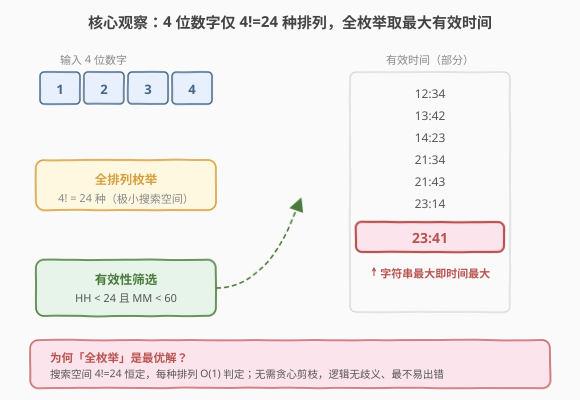
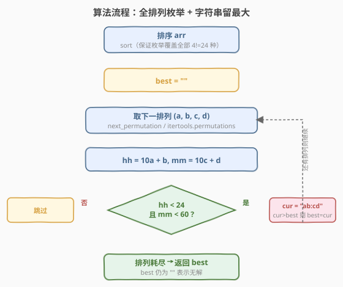

# 给定数字能组成的最大时间

- **题目名称**：给定数字能组成的最大时间
- **链接**：[949. 给定数字能组成的最大时间](https://leetcode.cn/problems/largest-time-for-given-digits/)
- **难度**：中等
- **标签**：数组、排列、枚举

## 1. 题目概述

给定一个由 4 位数字组成的数组 `arr`，返回用这 4 个数字拼出的符合 24 小时制的**最大时间**，格式为 `"HH:MM"`（`HH` 在 `00`–`23`，`MM` 在 `00`–`59`）。若无法组成任何有效时间，返回空字符串 `""`。

**示例 1**：

```text
输入：arr = [1,2,3,4]
输出："23:41"
解释：有效时间有 "12:34"、"12:43"、...、"23:14"、"23:41"，其中 "23:41" 最大。
```

**示例 2**：

```text
输入：arr = [5,5,5,5]
输出：""
解释：仅能拼出 "55:55"，HH=55 ≥ 24，无有效时间。
```

**示例 3**：

```text
输入：arr = [0,0,0,0]
输出："00:00"
```

**示例 4**：

```text
输入：arr = [0,0,1,0]
输出："10:00"
```

**约束条件**：

- `arr.length == 4`
- `0 <= arr[i] <= 9`

> 💡 **题意要点**：4 个数字**必须全部用上且各用一次**（即求一个排列），而非子集选取。目标是「最大」——时间越大越好，等价于字符串 `"HH:MM"` 越大越好（因为格式定宽，高位优先）。

---

## 2. 解题思路

### 2.1 暴力思路

对 4 个数字做全排列，逐个判定 `HH < 24 && MM < 60`，记录所有有效时间取最大。问题是：全排列共有 $4! = 24$ 种——**搜索空间极小**，暴力枚举本身就是最优解，无需任何剪枝或贪心。

### 2.2 核心观察：全排列枚举 + 字符串留最大



关键观察有三点：

- **搜索空间恒定且极小**：4 个数字的排列数 $4! = 24$ 是常数，每种排列的判定是 $O(1)$，总工作量 $O(24) = O(1)$。任何更精巧的贪心都只能把常数做得更小，而代价是逻辑复杂度上升、易错。
- **判定条件清晰**：给定排列 $(a, b, c, d)$，令 $\text{HH} = 10a + b$、$\text{MM} = 10c + d$，有效当且仅当 $\text{HH} < 24 \land \text{MM} < 60$。
- **「最大时间」=「最大字符串」**：`"HH:MM"` 是定宽 5 字符串，且时间数值的大小顺序与字典序完全一致（`HH` 在高位先比，`HH` 相同时 `MM` 决定）。因此直接比较两个 `"HH:MM"` 字符串即可，无需转换成分钟数。

> 💡 **为何不贪心？** 贪心思路是「从高位到低位依次选最大的可用数字、且能保证后效可成」。但验证「后效可成」本身就需要回溯/可行性检查，逻辑分支多（首位能否取 2 取决于是否还有 ≤3 的数字做第二位……），实现易错。而全枚举把所有可能性都摆出来比较，**正确性由「穷举完备」直接保证**，是「以小搜索空间换大确定性」的典型。

### 2.3 算法流程图



1. **排序**：对 `arr` 排序（C++ 用 `std::sort` + `std::next_permutation` 需从最小排列起步才能遍历全部；Python 的 `itertools.permutations` 不依赖输入顺序，可省略）。
2. **初始化**：`best = ""`，记录目前见过的最大有效时间串。
3. **枚举**：遍历每个排列 $(a, b, c, d)$：
   - 计算 $\text{hh} = 10a + b$、$\text{mm} = 10c + d$；
   - 若 $\text{hh} < 24 \land \text{mm} < 60$，构造 `cur = "ab:cd"`；
   - 若 `cur > best`（字典序），更新 `best = cur`。
4. **返回**：排列耗尽后返回 `best`；若 `best` 仍为 `""` 即无解。

### 2.4 示例演算

以 `arr = [1,2,3,4]` 为例：

![示例演算：arr = [1,2,3,4] → "23:41"](../images/largest_time_example_walkthrough.svg)

| 排列 $(a,b,c,d)$ | hh | mm | 有效？ | 时间串 |
|------------------|----|----|--------|--------|
| 1, 2, 3, 4 | 12 | 34 | ✓ | 12:34 |
| 1, 4, 3, 2 | 14 | 32 | ✓ | 14:32 |
| 2, 3, 4, 1 | 23 | 41 | ✓ | **23:41** |
| 2, 4, 1, 3 | 24 | 13 | ✗ hh≥24 | — |
| 3, 1, 4, 2 | 31 | 42 | ✗ hh≥24 | — |
| 4, 3, 2, 1 | 43 | 21 | ✗ hh≥24 | — |

> ⚠️ 上表仅列出 24 种排列中的 6 行示意。完整有效时间集合按字符串升序为：`12:34 < 12:43 < 13:24 < 13:42 < 14:23 < 14:32 < 21:34 < 21:43 < 23:14 < 23:41`。字符串最大者 `"23:41"` 即为答案。

> 💡 注意 `2,4,1,3` 虽然字典序最大，但 `HH=24` 非法——这正说明**不能直接对数字排序取最大**，必须先过有效性筛选。全枚举 + 筛选天然规避了此类陷阱。

---

## 3. 参考代码

### C++

```cpp
class Solution {
public:
    string largestTimeFromDigits(vector<int>& arr) {
        sort(arr.begin(), arr.end());          // 从最小排列起步，next_permutation 才能遍历全部
        string best = "";
        do {
            int hh = arr[0] * 10 + arr[1];
            int mm = arr[2] * 10 + arr[3];
            if (hh < 24 && mm < 60) {
                char buf[6];
                sprintf(buf, "%d%d:%d%d", arr[0], arr[1], arr[2], arr[3]);
                string cur(buf);
                if (cur > best) best = cur;    // 定宽串字典序 == 时间大小序
            }
        } while (next_permutation(arr.begin(), arr.end()));
        return best;
    }
};
```

### Python

```python
import itertools

class Solution:
    def largestTimeFromDigits(self, arr: List[int]) -> str:
        best = ""
        for a, b, c, d in itertools.permutations(arr):
            if a * 10 + b < 24 and c * 10 + d < 60:
                cur = f"{a}{b}:{c}{d}"
                if cur > best:                 # 定宽串字典序 == 时间大小序
                    best = cur
        return best
```

> 💡 **两个实现细节**：
> 1. **C++ 必须先 `sort`**：`std::next_permutation` 只枚举「当前排列之后」的排列，未排序时起点不是最小排列，会漏掉部分排列导致答案错误。Python 的 `itertools.permutations` 与输入顺序无关，可省略排序。
> 2. **用字符串字典序代替分钟数比较**：`"HH:MM"` 是定宽 5 字符串，字典序与时间数值大小一致。也可改用 `hh * 60 + mm` 数值比较，但需额外记录对应数字以便拼串——字符串比较更简洁。

---

## 4. 复杂度分析

| 维度 | 复杂度 | 说明 |
|------|--------|------|
| 时间复杂度 | $O(1)$ | 全排列数 $4! = 24$ 恒定，每种排列 $O(1)$ 判定 + 拼串 + 比较；排序 $O(4 \log 4)$ 亦常数 |
| 空间复杂度 | $O(1)$ | 仅用常数个变量 `best` / `cur`，排列就地枚举或由标准库生成 |

> ⚠️ 严格说是 $O(4!)$，但 $4! = 24$ 是与输入无关的常数，故写作 $O(1)$。即使推广到 $n$ 位数字，复杂度为 $O(n!)$——这正是全排列枚举仅在 $n$ 极小时可行的原因，本题 $n=4$ 是甜区。

---

## 5. 扩展：贪心构造法（O(1) 但分支多）

若追求更少的判定次数，可从「最大有效时间」倒推贪心构造：

1. **枚举 HH**：从 `23` 递减到 `00`，对每个 `hh` 检查 `arr` 中能否选出两个数字 $a, b$ 使得 $10a + b = \text{hh}$（即 $a = \text{hh} // 10$、$b = \text{hh} \% 10$，需这两个值在 `arr` 中可取，含重复时用计数判定）。
2. **配最大 MM**：找到第一个可行的 `hh` 后，用剩余两个数字拼出最大的 `mm < 60`（若剩余两数 $x, y$，取 $\max(10x+y, 10y+x)$ 中 $< 60$ 者）。
3. **拼接返回**；若无任何 `hh` 可行则返回 `""`。

```cpp
class Solution {
public:
    string largestTimeFromDigits(vector<int>& arr) {
        for (int hh = 23; hh >= 0; --hh) {
            int a = hh / 10, b = hh % 10;
            vector<int> cnt(10, 0);
            for (int x : arr) cnt[x]++;
            if (cnt[a]-- <= 0 || cnt[b]-- <= 0) continue;   // a,b 取不出
            // 剩余两数拼最大 mm < 60
            int best = -1, bi = -1, bj = -1;
            for (int i = 9; i >= 0; --i) if (cnt[i] > 0)
                for (int j = 9; j >= 0; --j) if (j != i && cnt[j] > 0) {
                    int mm = i * 10 + j;
                    if (mm < 60 && mm > best) { best = mm; bi = i; bj = j; }
                }
            if (best >= 0) {
                char buf[6];
                sprintf(buf, "%d%d:%d%d", a, b, bi, bj);
                return string(buf);
            }
        }
        return "";
    }
};
```

> 💡 贪心版从大到小找 `hh`，**首个可行的 `hh` 必对应最大时间**（因为 `hh` 是高位，决定大小主序）。它避免了枚举全部 24 种排列，最坏约 $24 \times 9 \times 9$ 次小循环，仍是常数。但分支与边界条件明显增多（重复数字的计数、剩余两数拼 `mm` 的双循环），**面试中除非被追问「能否不枚举全排列」，否则首选全排列法**——简洁、不易错、$O(1)$ 已经足够。

---

## 6. 面试要点

1. **为什么用全排列枚举而不是贪心？**

   4 个数字的全排列仅 $4! = 24$ 种，搜索空间极小且恒定。全枚举的正确性由「穷举完备」直接保证，逻辑无歧义；贪心需处理「高位取最大后低位是否仍可成有效时间」的回溯式可行性检查，分支多、易错。在常数级搜索空间下，**简洁性优于常数优化**。

2. **为什么可以直接比较 `"HH:MM"` 字符串而不转成分钟数？**

   `"HH:MM"` 是定宽 5 字符串：前两位 `HH` 在高位先参与字典序比较，`HH` 大者时间必大；`HH` 相同时后两位 `MM` 决定。因此字典序与时间数值大小序完全一致。用字符串比较省去了 `hh*60+mm` 的换算与数字回溯。

3. **C++ 用 `next_permutation` 为什么要先 `sort`？**

   `std::next_permutation` 只生成「字典序严格大于当前」的下一个排列，循环到「最大排列」时返回 `false` 停止。若不排序，起点可能不是最小排列，会漏掉比起点更小的那些排列。先 `sort` 升序保证从最小排列起步，遍历全部 $4!$ 种。

4. **`arr = [0,0,0,0]` 为什么返回 `"00:00"` 而不是 `""`？**

   `00:00` 是合法的 24 小时制时间（午夜，`HH=0 < 24`、`MM=0 < 60`）。题目只要求有效，并未排除全零。唯一返回 `""` 的情况是**所有排列都无法同时满足 `HH<24` 且 `MM<60`**（如 `[5,5,5,5]`，任何排列都 `HH≥55`）。

5. **若把题目推广到 $n$ 位数字（如 6 位拼 `HH:MM:SS`），全枚举还可行吗？**

   $n=6$ 时全排列 $6! = 720$ 仍可行；但 $n$ 再增大，$O(n!)$ 会迅速爆炸。此时应转向贪心/回溯 + 剪枝，或按位从高到低 DFS 并用可行性剪枝（每位取值受后续位约束）。本题 $n=4$ 是全排列枚举的甜区。

> 💡 **一句话总结**：4 位数字拼最大时间，招牌解法是「全排列枚举 + 有效性筛选 + 字符串留最大」。$4!=24$ 的常数搜索空间让暴力即最优，正确性由穷举完备保证。用定宽串字典序代替分钟数换算，是「问题特性简化比较」的典型。

---

## 7. 同类练习题

- [31. 下一个排列](https://leetcode.cn/problems/next-permutation/)（[站内题解](../0001-0100/31_下一个排列.md)）：`next_permutation` 的底层原理，理解「字典序下一个排列」的翻转变换
- [47. 全排列 II](https://leetcode.cn/problems/permutations-ii/)（[站内题解](../0001-0100/47_全排列II.md)）：含重复元素的全排列枚举，对照本题数字可重复的情形
- [60. 第k个排列](https://leetcode.cn/problems/permutation-sequence/)（[站内题解](../0001-0100/60_第k个排列.md)）：康托尔展开按序定位排列，与本题「枚举全部排列取最值」互为正反问题
- [681. 最近时刻](https://leetcode.cn/problems/next-closest-time/)：给定数字集合求下一个最近时刻，同为「数字拼时间 + 枚举/模拟」家族，可对照贪心构造思路
