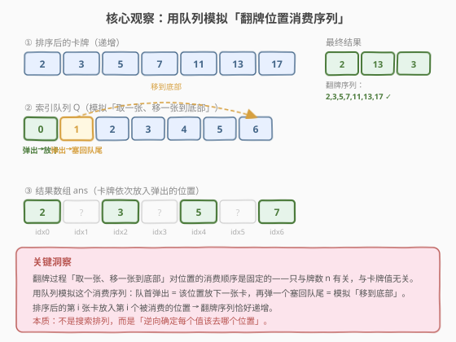
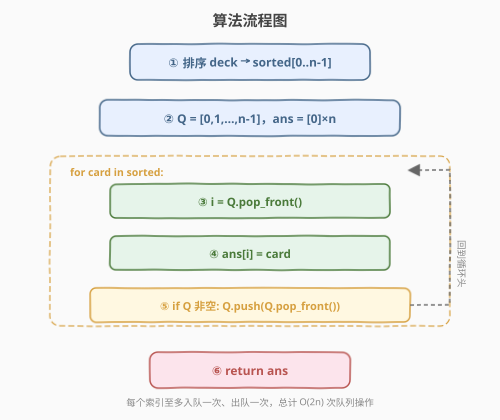
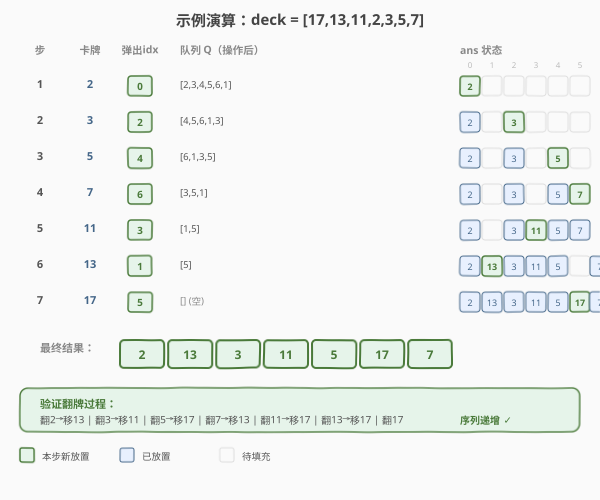

# 按递增顺序显示卡牌

- **题目名称**：按递增顺序显示卡牌
- **链接**：[950. 按递增顺序显示卡牌](https://leetcode.cn/problems/reveal-cards-in-increasing-order/)
- **难度**：中等
- **标签**：队列、数组、排序、模拟

## 1. 题目概述

给定一个整数数组 `deck`，每个卡片上有一个**唯一**的整数。初始所有卡片正面朝下叠成一摞。重复执行以下操作直到所有卡片翻开：

1. 从牌堆顶部取一张牌，**翻开**并移除。
2. 如果牌堆中还有牌，将**下一张顶部的牌**放到牌堆**底部**。
3. 如果还有未翻开的牌，回到步骤 1。

返回一个牌堆的排列顺序，使得按上述操作翻开的卡片按**递增顺序**显示。

> 💡 本题的关键不在于「正向模拟翻牌」，而在于**逆向思考**——先确定翻牌过程会按什么顺序消费位置，再把排序后的卡牌依次放入这些位置。这种「不搜索排列，而是确定位置映射」的思路在面试中很受青睐。

**示例 1**：

```text
输入：deck = [17,13,11,2,3,5,7]
输出：[2,13,3,11,5,17,7]
解释：
  牌堆顺序 [2,13,3,11,5,17,7]（2 在顶部）
  翻 2，移 13 到底 → [3,11,5,17,7,13]
  翻 3，移 11 到底 → [5,17,7,13,11]
  翻 5，移 17 到底 → [7,13,11,17]
  翻 7，移 13 到底 → [11,17,13]
  翻 11，移 17 到底 → [13,17]
  翻 13，移 17 到底 → [17]
  翻 17
  翻牌序列：2,3,5,7,11,13,17（递增 ✓）
```

**示例 2**：

```text
输入：deck = [1,1000]
输出：[1,1000]
解释：翻 1，移 1000 到底（只有一张无需移），翻 1000。
```

**约束条件**：

- `1 <= deck.length <= 1000`
- `1 <= deck[i] <= 10^6`
- `deck` 中的所有值**互不相同**

---

## 2. 解题思路

### 2.1 暴力思路

枚举 `deck` 的所有排列，对每个排列模拟完整的翻牌过程，检查翻牌序列是否递增。排列数为 $n!$，`n=1000` 时完全不可行。即使 `n` 很小，逐一验证也极其低效。

### 2.2 核心观察：用队列模拟「位置消费序列」



关键洞察是：**翻牌过程对「位置」的消费顺序是固定的——只与牌数 $n$ 有关，与卡牌值无关。**

> 💡 无论牌堆里放什么卡，翻牌规则「取一张、移一张到底部」始终按同一套顺序访问位置。因此我们不必搜索排列，而是**先确定位置消费序列，再把排序后的卡牌填入**。

具体做法：用一个**索引队列** $Q = [0, 1, 2, \ldots, n-1]$ 模拟翻牌过程：

- **队首弹出**一个索引 $i$ → 这是下一个被翻开的位置，把当前最小的卡牌放入 $\text{ans}[i]$。
- 如果队列非空，**再弹出一个塞回队尾** → 模拟「将下一张牌移到底部」。

排序后的第 $i$ 张卡牌恰好放入第 $i$ 个被消费的位置 → 翻牌序列递增。

> ⚠️ 第二步「再弹一个塞回队尾」必须判断队列是否为空：当只剩最后一个索引时，弹出后队列已空，不能再弹（否则越界）。这对应翻牌过程中最后一张牌翻开时无需「移到底部」。

### 2.3 算法流程图



```
1. 排序 deck → sorted[0..n-1]
2. 初始化队列 Q = [0,1,2,...,n-1]，结果数组 ans = [0] × n
3. 遍历 sorted 中每张卡牌 card：
     a. i = Q.pop_front()         // 弹出队首索引 = 翻牌位置
     b. ans[i] = card             // 卡牌放入该位置
     c. if Q 非空:
            Q.push_back(Q.pop_front())  // 模拟「移到底部」
4. 返回 ans
```

> 💡 每个索引至多入队一次、出队一次（含塞回队尾的那次），总计 $O(2n)$ 次队列操作。

### 2.4 示例演算

以 `deck = [17,13,11,2,3,5,7]` 为例，排序后 `[2,3,5,7,11,13,17]`，$n=7$。



| 步 | 卡牌 | 队列 Q（操作前） | 弹出 idx | 队列 Q（操作后） | ans 状态 |
|----|------|-------------------|----------|-------------------|----------|
| 1 | 2 | `[0,1,2,3,4,5,6]` | 0 | `[2,3,4,5,6,1]` | `[2,_,_,_,_,_,_]` |
| 2 | 3 | `[2,3,4,5,6,1]` | 2 | `[4,5,6,1,3]` | `[2,_,3,_,_,_,_]` |
| 3 | 5 | `[4,5,6,1,3]` | 4 | `[6,1,3,5]` | `[2,_,3,_,5,_,_]` |
| 4 | 7 | `[6,1,3,5]` | 6 | `[3,5,1]` | `[2,_,3,_,5,_,7]` |
| 5 | 11 | `[3,5,1]` | 3 | `[1,5]` | `[2,_,3,11,5,_,7]` |
| 6 | 13 | `[1,5]` | 1 | `[5]` | `[2,13,3,11,5,_,7]` |
| 7 | 17 | `[5]` | 5 | `[]` | `[2,13,3,11,5,17,7]` |

最终结果 `[2,13,3,11,5,17,7]`，验证翻牌序列为 `2,3,5,7,11,13,17`（递增 ✅）。

---

## 3. 参考代码

### C++

```cpp
// 按递增顺序显示卡牌.cpp —— 队列模拟位置消费序列
#include <vector>
#include <queue>
#include <algorithm>
using namespace std;

class Solution {
public:
    vector<int> deckRevealedIncreasing(vector<int>& deck) {
        sort(deck.begin(), deck.end());          // ① 排序
        int n = deck.size();
        vector<int> ans(n);
        queue<int> q;
        for (int i = 0; i < n; ++i) q.push(i);   // ② 索引队列入队

        for (int card : deck) {                  // ③ 逐张分配
            int i = q.front(); q.pop();          //    弹出翻牌位置
            ans[i] = card;                       //    卡牌放入该位置
            if (!q.empty()) {                    //    模拟「移到底部」
                q.push(q.front());
                q.pop();
            }
        }
        return ans;
    }
};
```

### Python

```python
class Solution:
    def deckRevealedIncreasing(self, deck: list[int]) -> list[int]:
        deck.sort()                              # ① 排序
        n = len(deck)
        ans = [0] * n
        from collections import deque
        q = deque(range(n))                      # ② 索引队列入队

        for card in deck:                        # ③ 逐张分配
            i = q.popleft()                      #    弹出翻牌位置
            ans[i] = card                        #    卡牌放入该位置
            if q:                                #    模拟「移到底部」
                q.append(q.popleft())
        return ans
```

> 💡 代码核心只有 4 行（弹出、放卡、判空、塞回），但理解关键在于「为什么这样做是对的」——见 2.2 节的位置消费序列论证。易错点是 `if q:` / `if (!q.empty())` 判空不能漏：最后一张牌翻开后队列已空，再 `popleft` 会越界。

---

## 4. 复杂度分析

| 维度 | 复杂度 | 说明 |
|------|--------|------|
| **时间复杂度** | $O(n \log n)$ | 排序 $O(n \log n)$；队列模拟每个索引至多出队 2 次（弹出 + 塞回），共 $O(2n) = O(n)$。总体由排序主导 |
| **空间复杂度** | $O(n)$ | 队列存 $n$ 个索引 + 结果数组 $n$ 元素（不含输出则队列 $O(n)$） |

> ⚠️ 队列模拟部分是 $O(n)$ 而非 $O(n^2)$：虽然循环体内有两次 `pop`，但每个索引全局最多被弹出 2 次（1 次放卡 + 1 次塞回），总操作数 $\leq 2n$，均摊到每张卡为 $O(1)$。

---

## 5. 扩展：反向模拟（从终态倒推）

除了「正向用队列模拟位置消费」之外，还有一种**反向模拟**思路：从最终只剩一张牌的状态出发，逆操作「把底部的牌放回顶部，再放一张到顶部」逐步还原。两种方法等价，但正向队列模拟更直观、代码更简洁。

```python
class Solution:
    def deckRevealedIncreasing(self, deck: list[int]) -> list[int]:
        deck.sort(reverse=True)                  # 降序，从最大开始倒推
        ans = []
        for card in deck:
            if ans:                              # 如果已有牌，把最后一张移到最前
                ans.insert(0, ans.pop())
            ans.insert(0, card)                  # 当前牌放在最前
        return ans
```

> 💡 反向思路：正向是「翻一张、移一张到底部」，逆向就是「把底部的拿回顶部、再在顶部放一张」。从最大的牌开始（它最后被翻开时只剩自己），逐步倒着构建牌堆。`list.insert(0, ...)` 是 $O(n)$，总体 $O(n^2)$，不如队列法高效，但思路巧妙，面试中可作为追问的备选方案。

---

## 6. 面试要点

1. **为什么不用搜索排列？这道题的思路本质是什么？**

   - 排列搜索是 $O(n!)$，完全不可行。本题的本质是**确定位置映射**而非搜索排列：翻牌过程对位置的消费顺序是固定的（只与 $n$ 有关），所以先模拟出位置序列，再把排序后的卡牌填入即可。

2. **为什么用索引队列而不是直接模拟卡牌？**

   - 直接模拟卡牌需要先有一个排列再验证，陷入「先有鸡还是先有蛋」的困境。用**索引队列**把「位置」和「值」解耦：队列只管确定位置消费顺序（与值无关），排序后的卡牌按序填入。

3. **「再弹一个塞回队尾」这步为什么不能省？它对应什么操作？**

   - 对应翻牌规则的第 2 步「将下一张顶部的牌放到牌堆底部」。省掉这步就等于忽略了「移到底部」的操作，位置消费序列会变成简单的 $[0,1,2,\ldots,n-1]$，结果就是排序数组本身——但这不满足翻牌规则。

4. **最后一步为什么要判空？不判会怎样？**

   - 当只剩 1 个索引时，弹出后队列已空。此时翻牌规则第 2 步「如果还有牌才移」不再执行。若不判空继续 `popleft`，C++ 中 `queue::front()` 对空队列是未定义行为，Python 中 `deque.popleft()` 会抛 `IndexError`。

5. **这道题和约瑟夫环（Josephus）有什么联系？**

   - 两者都涉及「按固定规则从序列中依次取出元素」的模式。约瑟夫环是「数 $k$ 个删一个」，本题是「取一个、跳一个（移到底部）」。核心都是**位置消费序列与元素值无关**，可以预先确定。不过约瑟夫环通常求最后幸存者，本题求完整排列。

> 💡 **一句话总结**：按递增顺序显示卡牌的招牌解法是「**队列模拟位置消费序列**」——排序卡牌，用索引队列模拟「取一个位置、移一个到队尾」的翻牌过程，把排序后的卡牌依次填入弹出的位置。$O(n \log n)$ 时间、$O(n)$ 空间。核心论证是「位置消费顺序与卡牌值无关」。

---

## 7. 同类练习题

- [2073. 买票需要的时间](https://leetcode.cn/problems/time-needed-to-buy-tickets/)：队列模拟计数，按固定规则消费队列直到条件满足
- [1700. 无法吃午餐的学生数量](https://leetcode.cn/problems/number-of-students-unable-to-eat-lunch/)：队列模拟匹配，学生队列出队、栈顶三明治匹配
- [232. 用栈实现队列](https://leetcode.cn/problems/implement-queue-using-stacks/)（[题解](../0001-0100/232_用栈实现队列.md)）：队列操作基础，双栈倒换摊还 O(1)
- [933. 最近的请求次数](https://leetcode.cn/problems/number-of-recent-calls/)（[题解](../0901-1000/933_最近的请求次数.md)）：队列维护滑动窗口，入队 + 弹过期
- [面试题 03.06. 动物收容所](https://leetcode.cn/problems/animal-shelter-lcci/)：双队列维护特定类型的出队顺序，同样是「队列模拟消费规则」
