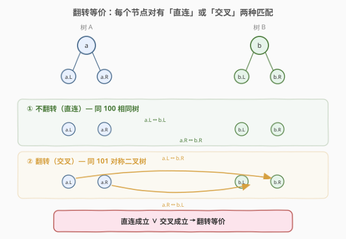
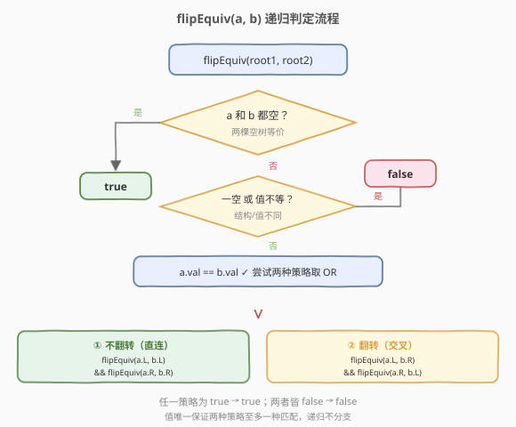
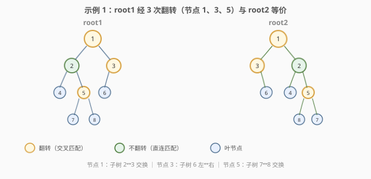

# 翻转等价二叉树

- **题目名称**：翻转等价二叉树
- **链接**：[951. 翻转等价二叉树](https://leetcode.cn/problems/flip-equivalent-binary-trees/)
- **难度**：中等
- **标签**：树、二叉树、深度优先搜索

## 1. 题目概述

定义「翻转操作」：选择二叉树中任意一个节点，交换它的左右子树。给定两棵二叉树的根节点 `root1` 和 `root2`，判断它们是否**翻转等价**——即能否通过若干次翻转操作（在任意一棵树上、任意节点处）使两棵树变得完全相同。

**示例 1**：

```text
输入：root1 = [1,2,3,4,5,6,null,null,null,7,8], root2 = [1,3,2,null,6,4,5,null,null,null,null,8,7]
输出：true
解释：在 root1 上翻转节点 1（交换子树 2、3）、节点 3（交换子树 6 和空）、节点 5（交换子树 7、8）后，与 root2 完全相同。

    root1                  root2
       1                      1
      / \                    / \
     2   3                  3   2
    / \  /                  \  / \
   4  5 6                   6 4   5
      / \                       / \
     7   8                     8   7
```

**示例 2**：

```text
输入：root1 = [], root2 = []
输出：true
解释：两棵空树天然等价。
```

**示例 3**：

```text
输入：root1 = [], root2 = [1]
输出：false
解释：一空一非空，结构不同。
```

**约束条件**：

- 每棵树节点数目范围 `[0, 100]`
- `0 <= Node.val <= 99`
- **每棵树内部节点值互不相同**

> 💡 本题是 [100 相同的树](../0001-0100/100_相同的树.md) 与 [101 对称二叉树](../0101-0200/101_对称二叉树.md) 的「合体升级」：相同树判「左对左、右对右」，对称树判「左对右、右对左」，而翻转等价则是「**两者取或**」——每个节点对要么直连匹配，要么交叉匹配，只要有一条路通就算等价。

---

## 2. 解题思路

### 2.1 暴力思路：枚举所有翻转组合

对 root1 的每个节点，枚举「翻 / 不翻」两种选择，共 $2^n$ 种组合，逐一验证翻转后是否与 root2 相同。指数级，完全不可行。

> ⚠️ 翻转操作可以在任意节点独立进行，组合爆炸。但翻转的**效果是局部的**——只影响当前节点的左右子树配对方式。我们不需要全局枚举，只需**逐节点做局部决策**。

### 2.2 核心观察：逐节点「直连 ∨ 交叉」二选一



关键洞察：把两棵树**同步递归**往下走，每到一对节点 `(a, b)`，在 `a.val == b.val` 的前提下，它的左右子树只有两种配对方式：

| 策略 | 配对方式 | 等价于 |
|------|---------|--------|
| **不翻转（直连）** | `a.left ↔ b.left` 且 `a.right ↔ b.right` | 100 相同树 |
| **翻转（交叉）** | `a.left ↔ b.right` 且 `a.right ↔ b.left` | 101 镜像 |

两种策略**取或**——只要有一种配对方式能让子树翻转等价，当前节点对就翻转等价。

> 💡 **为什么不会指数爆炸？** 题目保证每棵树内部节点值互不相同。因此对于节点对 `(a, b)`，`a.left.val` 至多等于 `b.left.val` 或 `b.right.val` 之一（不可能同时等于，否则 `b` 的两个孩子值相同）。这意味着两种策略**至多一种能匹配子节点值**，递归实际只走一条路，总访问节点数 $\le \min(n_1, n_2)$。

### 2.3 算法流程图



`flipEquiv(a, b)` 的判定步骤：

1. **都空**：`a == null && b == null` → `true`（两棵空树等价）
2. **一空一非空**：`a == null || b == null` → `false`（结构不同）
3. **值不等**：`a.val != b.val` → `false`
4. **两种策略取或**：
   - 直连：`flipEquiv(a.left, b.left) && flipEquiv(a.right, b.right)`
   - 交叉：`flipEquiv(a.left, b.right) && flipEquiv(a.right, b.left)`
   - 返回 `直连 || 交叉`

> ⚠️ 判断顺序与 [100 相同的树](../0001-0100/100_相同的树.md) 完全一致：先 `&&` 排除都空，再 `||` 判一空一非空，最后比值。唯一的区别在第 4 步——多了「交叉」这一条或分支。

### 2.4 示例演算

以示例 1 为例，两棵树如下（节点颜色标注翻转决策）：



递归调用过程（`✓` 表示值匹配，翻转/不翻转表示该节点对选择的策略）：

| flipEquiv(a, b) | a.val==b.val | 策略 | 子调用 | 结果 |
|-----------------|-------------|------|--------|------|
| flipEquiv(1, 1) | 1==1 ✓ | 翻转 | flipEquiv(2, 2) && flipEquiv(3, 3) | 递归 |
| flipEquiv(2, 2) | 2==2 ✓ | 不翻转 | flipEquiv(4, 4) && flipEquiv(5, 5) | 递归 |
| flipEquiv(4, 4) | 4==4 ✓ | — | 叶节点，无子树 | true |
| flipEquiv(5, 5) | 5==5 ✓ | 翻转 | flipEquiv(7, 7) && flipEquiv(8, 8) | 递归 |
| flipEquiv(7, 7) | 7==7 ✓ | — | 叶节点 | true |
| flipEquiv(8, 8) | 8==8 ✓ | — | 叶节点 | true |
| flipEquiv(3, 3) | 3==3 ✓ | 翻转 | flipEquiv(6, 6) && flipEquiv(∅, ∅) | 递归 |
| flipEquiv(6, 6) | 6==6 ✓ | — | 叶节点 | true |
| flipEquiv(∅, ∅) | — | — | 都空 | true |
| **汇总** | — | — | 所有子调用 true | **true** ✅ |

> 💡 三次翻转分别发生在**节点 1**（子树 2、3 交换）、**节点 3**（子树 6 从左移到右，空从右移到左）、**节点 5**（子树 7、8 交换）。节点 2 处选择「不翻转」因为左右子树本就对应相同。整棵树的翻转等价性 = 所有节点对的局部决策之合取。

---

## 3. 参考代码

### C++

```cpp
// 翻转等价二叉树.cpp —— 递归 DFS（直连 ∨ 交叉）
struct TreeNode {
    int val;
    TreeNode* left;
    TreeNode* right;
    TreeNode() : val(0), left(nullptr), right(nullptr) {}
    TreeNode(int x) : val(x), left(nullptr), right(nullptr) {}
    TreeNode(int x, TreeNode* l, TreeNode* r) : val(x), left(l), right(r) {}
};

class Solution {
public:
    bool flipEquiv(TreeNode* a, TreeNode* b) {
        if (a == nullptr && b == nullptr) return true;   // 都空
        if (a == nullptr || b == nullptr) return false;  // 一空一非空
        if (a->val != b->val) return false;              // 值不同
        return (flipEquiv(a->left, b->left) &&           // 直连
                flipEquiv(a->right, b->right))
            || (flipEquiv(a->left, b->right) &&          // 交叉
                flipEquiv(a->right, b->left));
    }
};
```

### Python

```python
from typing import Optional


class Solution:
    def flipEquiv(self, a: Optional[TreeNode], b: Optional[TreeNode]) -> bool:
        if not a and not b:          # 都空
            return True
        if not a or not b:           # 一空一非空
            return False
        if a.val != b.val:           # 值不同
            return False
        return (self.flipEquiv(a.left, b.left) and      # 直连
                self.flipEquiv(a.right, b.right)) \
            or (self.flipEquiv(a.left, b.right) and      # 交叉
                self.flipEquiv(a.right, b.left))
```

> 💡 代码结构与 [100 相同的树](../0001-0100/100_相同的树.md) 几乎一模一样——前三行判定完全相同，唯一区别是最后一行从 `&&`（直连）变成了 `直连 || 交叉`。如果记住了 100 的模板，本题只需加一个 `or` 分支。

---

## 4. 复杂度分析

| 维度 | 复杂度 | 说明 |
|------|--------|------|
| 时间复杂度 | $O(\min(n_1, n_2))$ | 每棵树内部值唯一，每个节点对至多一种策略匹配，递归只走一条路 |
| 空间复杂度 | $O(\min(h_1, h_2))$ | 递归栈深度 = 两棵树中较矮者的高度 |

> ⚠️ 若去掉「每棵树内部值唯一」的约束，最坏情况（所有节点同值且完全对称）两种策略都部分匹配，递归可能重复访问同一节点对，退化为 $O(n^2)$。此时可加记忆化（以 `(a 指针, b 指针)` 为键）保证 $O(n)$。

---

## 5. 扩展：迭代解法（BFS 双队列）

与 [101 对称二叉树](../0101-0200/101_对称二叉树.md) 的迭代版类似，可用队列同步 BFS。区别在于每次出队一对节点后，要**根据孩子值判定该翻还是不翻**，选择能匹配的那一种配对入队：

```python
from collections import deque
from typing import Optional


class Solution:
    def flipEquiv(self, a: Optional[TreeNode], b: Optional[TreeNode]) -> bool:
        q = deque([(a, b)])
        while q:
            n1, n2 = q.popleft()
            if not n1 and not n2:
                continue
            if not n1 or not n2:
                return False
            if n1.val != n2.val:
                return False
            if self._match(n1.left, n2.left) and self._match(n1.right, n2.right):
                q.append((n1.left, n2.left))              # 直连
                q.append((n1.right, n2.right))
            elif self._match(n1.left, n2.right) and self._match(n1.right, n2.left):
                q.append((n1.left, n2.right))             # 交叉
                q.append((n1.right, n2.left))
            else:
                return False
        return True

    @staticmethod
    def _match(x: Optional[TreeNode], y: Optional[TreeNode]) -> bool:
        if not x and not y:
            return True
        if not x or not y:
            return False
        return x.val == y.val
```

> 💡 迭代版利用「值唯一」约束，通过比较孩子值预先判定该翻还是不翻，避免在队列中同时探索两条路径。若值不唯一，迭代版需退回到与递归相同的「两种配对都入队」策略。

---

## 6. 面试要点

1. **翻转等价和相同树（100）、对称二叉树（101）的关系？**

   - 相同树：`左对左 && 右对右`（直连）。
   - 对称二叉树：`左对右 && 右对左`（交叉）。
   - 翻转等价：`直连 || 交叉`——两者取或。代码只需在 100 的基础上加一个 `or` 分支。

2. **为什么时间复杂度是 $O(\min(n_1, n_2))$ 而不是指数？**

   - 题目保证每棵树内部值唯一。对于节点对 `(a, b)`，`a.left.val` 至多等于 `b.left.val` 或 `b.right.val` 之一——否则 `b` 的两个孩子同值，违反唯一性。
   - 因此两种策略至多一种匹配，递归不分支，总访问量 $\le$ 较小树的节点数。

3. **判断顺序为什么是先 `&&` 后 `||`？**

   - 与 100/101 完全相同：先 `a==null && b==null` 排除都空（返回 true），剩下的 `a==null || b==null` 才精确表示「恰好一个为空」。顺序反了会导致都空时误判 false。

4. **翻转操作可以作用在任意节点，为什么递归只需看当前层？**

   - 翻转的效果是局部的：交换当前节点的左右子树，等价于在递归配对时选择「交叉」而非「直连」。子树内部的翻转由更深的递归层独立处理。因此全局翻转等价 = 逐层局部决策的合取。

5. **如果去掉「值唯一」约束怎么办？**

   - 两种策略可能都部分匹配，递归出现重叠子问题。加记忆化：以 `(id(a), id(b))` 为键缓存结果，保证每对节点只算一次，时间回到 $O(n)$。

> 💡 **一句话总结**：951 是 100（相同树）与 101（对称二叉树）的「或」——每个节点对要么直连匹配、要么交叉匹配，取或即可。值唯一性保证两种策略互斥，递归不分支，$O(\min(n_1, n_2))$ 一趟搞定。

---

## 7. 同类练习题

- [100. 相同的树](https://leetcode.cn/problems/same-tree/)（[题解](../0001-0100/100_相同的树.md)）：直连匹配的母题，951 的「或」左分支
- [101. 对称二叉树](https://leetcode.cn/problems/symmetric-tree/)（[题解](../0101-0200/101_对称二叉树.md)）：交叉匹配的母题，951 的「或」右分支
- [226. 翻转二叉树](https://leetcode.cn/problems/invert-binary-tree/)（[题解](../0201-0300/226_翻转二叉树.md)）：翻转操作本身，951 的基本动作
- [572. 另一棵树的子树](https://leetcode.cn/problems/subtree-of-another-tree/)：复用相同树判定做子树匹配
- [1367. 二叉树中的链表](https://leetcode.cn/problems/linked-list-in-binary-tree/)：树形递归 + 路径匹配的变体
