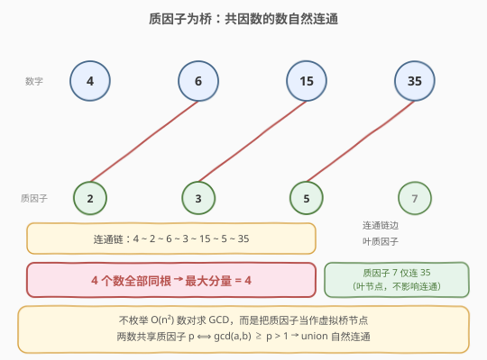
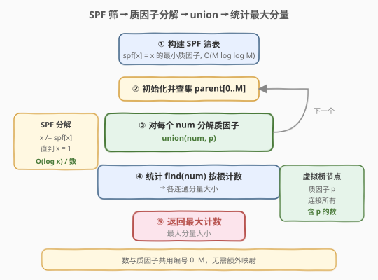
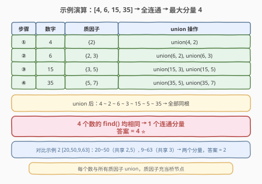

# 按公因数计算最大组件大小

- **题目名称**：按公因数计算最大组件大小
- **链接**：[952. 按公因数计算最大组件大小](https://leetcode.cn/problems/largest-component-size-by-common-factor/)
- **难度**：困难
- **标签**：并查集、数学、数论

## 1. 题目概述

给定一个由不同正整数组成的非空数组 `nums`，考虑下图：有 `nums.length` 个节点，分别对应 `nums[0]` 到 `nums[nums.length - 1]`；当且仅当 `nums[i]` 和 `nums[j]` 共用一个大于 1 的公因数时，两节点之间有一条边。返回图中最大连通组件的大小。

> 💡 本题的核心是**并查集 + 质因子分解**——如果直接枚举所有数对求 GCD，时间复杂度 $O(n^2 \log M)$，在 $n = 2\times10^4$ 时不可行。关键转化：把每个数的**质因子当作虚拟节点**，将数与其所有质因子 union，共享同一质因子的数自然连通。

**示例 1**：

```text
输入：nums = [4,6,15,35]
输出：4
解释：4=2², 6=2×3, 15=3×5, 35=5×7
  4 与 6 共享质因子 2 → 连通
  6 与 15 共享质因子 3 → 连通
  15 与 35 共享质因子 5 → 连通
  → 全部 4 个数同属一个连通分量
```

**示例 2**：

```text
输入：nums = [20,50,9,63]
输出：2
解释：20=2²×5, 50=2×5² → 共享 2,5 → 连通（分量大小 2）
  9=3², 63=3²×7 → 共享 3 → 连通（分量大小 2）
  两组互不连通 → 最大分量大小 = 2
```

**示例 3**：

```text
输入：nums = [2,3,6,7,4,12,21,39]
输出：8
解释：所有 8 个数通过共享质因子全部连通
```

**约束条件**：

- `1 <= nums.length <= 2 * 10^4`
- `1 <= nums[i] <= 10^5`
- `nums` 中所有值都 **不同**

---

## 2. 解题思路

### 2.1 暴力思路

枚举所有 $\binom{n}{2}$ 个数对 $(i, j)$，计算 $\gcd(\text{nums}[i], \text{nums}[j])$，若大于 1 则在 $i$、$j$ 之间连边。随后用并查集或 DFS 统计最大连通分量大小。

时间复杂度 $O(n^2 \log M)$（$M = \max(\text{nums})$），$n = 2\times10^4$ 时约 $4\times10^8$ 次 GCD 运算，TLE。

### 2.2 核心观察：质因子作虚拟桥节点



关键观察分两步：

**第一步：两数共因数 ⇔ 共享至少一个质因子。** 若 $\gcd(a, b) > 1$，则 $a$、$b$ 至少共享一个质因子 $p$（因为任何大于 1 的因数都含质因子）。反之，若 $a$、$b$ 共享质因子 $p$，则 $\gcd(a, b) \ge p > 1$。所以"有边"等价于"有公共质因子"。

**第二步：质因子可作虚拟桥节点。** 把每个质因子 $p$ 当作一个虚拟节点，对每个数 $\text{nums}[i]$ 分解质因子后执行 $\text{union}(\text{nums}[i], p)$。这样：
- 数 $a$ 与 $b$ 共享质因子 $p$ → $a$、$p$、$b$ 在同一集合 → $a$、$b$ 连通
- 数 $a$ 与 $b$ 不共享任何质因子 → 不经任何桥连通 → 不同集合

> 💡 这与 [947. 移除最多的同行或同列石头](./947_移除最多的同行或同列石头.md) 中用 `~y` 把列号映射到负数作虚拟节点的思路**异曲同工**——都是"引入虚拟桥节点将隐式关系转化为显式 union"。区别在于 947 的桥是坐标值（$O(n)$ 个），本题的桥是质因子（$O(M / \ln M)$ 个，约 $10^4$ 个）。

### 2.3 算法流程图



```
1. 求 M = max(nums)，构建 SPF（最小质因子）筛表，O(M log log M)
2. 初始化并查集，节点编号 0..M（数与质因子共用同一编号空间）
3. 对每个 num ∈ nums：
     用 SPF 表分解质因子（每次除尽最小质因子，O(log num)）
     对每个质因子 p：union(num, p)
4. 统计：对每个 num ∈ nums，find(num) 取根，按根计数
5. 返回最大计数
```

> ⚠️ **SPF 筛表**：埃氏筛的进阶版，`spf[x]` 存 $x$ 的最小质因子。分解时不断 `x /= spf[x]` 直到 $x = 1$，每个数分解只需 $O(\log x)$ 次。这比每次试除到 $\sqrt{x}$ 快得多，尤其当大量数需要分解时优势明显。

### 2.4 示例演算



以示例 1 `nums = [4, 6, 15, 35]` 为例：

| 步骤 | 数字 | 质因子分解 | union 操作 |
|------|------|-----------|------------|
| ① | 4 | $2^2$ → {2} | union(4, 2) |
| ② | 6 | $2 \times 3$ → {2, 3} | union(6, 2), union(6, 3) |
| ③ | 15 | $3 \times 5$ → {3, 5} | union(15, 3), union(15, 5) |
| ④ | 35 | $5 \times 7$ → {5, 7} | union(35, 5), union(35, 7) |

union 后的连通关系：

- 4 ~ 2 ~ 6 ~ 3 ~ 15 ~ 5 ~ 35 → **全部同根**

4 个数的 `find(num)` 均相同 → **1 个连通分量，大小 = 4** → 答案 = $\mathbf{4}$ ✅

---

## 3. 参考代码

### C++

```cpp
// 按公因数计算最大组件大小.cpp —— SPF 筛 + 并查集
#include <vector>
#include <unordered_map>
#include <algorithm>
#include <numeric>
using namespace std;

class Solution {
    vector<int> parent, sz;

    int find(int x) {
        if (parent[x] != x) parent[x] = find(parent[x]);  // 路径压缩
        return parent[x];
    }

    void unite(int x, int y) {
        int rx = find(x), ry = find(y);
        if (rx != ry) {
            if (sz[rx] < sz[ry]) swap(rx, ry);            // 按大小合并
            parent[ry] = rx;
            sz[rx] += sz[ry];
        }
    }

public:
    int largestComponentSize(vector<int>& nums) {
        int M = *max_element(nums.begin(), nums.end());

        // —— SPF 筛（最小质因子表）——
        vector<int> spf(M + 1);
        iota(spf.begin(), spf.end(), 0);
        for (int i = 2; (long long)i * i <= M; i++) {
            if (spf[i] == i) {                            // i 是质数
                for (int j = i * i; j <= M; j += i) {
                    if (spf[j] == j) spf[j] = i;          // 记录最小质因子
                }
            }
        }

        // —— 并查集初始化 ——
        parent.resize(M + 1);
        sz.resize(M + 1, 1);
        iota(parent.begin(), parent.end(), 0);

        // —— 每个数分解质因子并 union ——
        for (int num : nums) {
            int x = num;
            while (x > 1) {
                int p = spf[x];
                unite(num, p);                            // 数与质因子桥接
                while (x % p == 0) x /= p;                // 除尽该质因子
            }
        }

        // —— 统计每个根的数字个数 ——
        unordered_map<int, int> cnt;
        int ans = 0;
        for (int num : nums) {
            int r = find(num);
            ans = max(ans, ++cnt[r]);
        }
        return ans;
    }
};
```

### Python

```python
class Solution:
    def largestComponentSize(self, nums: list[int]) -> int:
        M = max(nums)

        # —— SPF 筛（最小质因子表）——
        spf = list(range(M + 1))
        i = 2
        while i * i <= M:
            if spf[i] == i:                               # i 是质数
                for j in range(i * i, M + 1, i):
                    if spf[j] == j:
                        spf[j] = i
            i += 1

        # —— 并查集 ——
        parent = list(range(M + 1))
        size = [1] * (M + 1)

        def find(x: int) -> int:
            while parent[x] != x:
                parent[x] = parent[parent[x]]             # 路径压缩
                x = parent[x]
            return x

        def union(x: int, y: int) -> None:
            rx, ry = find(x), find(y)
            if rx != ry:
                if size[rx] < size[ry]:
                    rx, ry = ry, rx
                parent[ry] = rx
                size[rx] += size[ry]

        # —— 每个数分解质因子并 union ——
        for num in nums:
            x = num
            while x > 1:
                p = spf[x]
                union(num, p)                             # 数与质因子桥接
                while x % p == 0:
                    x //= p                               # 除尽该质因子

        # —— 统计最大分量 ——
        from collections import Counter
        cnt = Counter(find(num) for num in nums)
        return max(cnt.values())
```

> 💡 **编号空间共用**：数和质因子都用自身值作节点编号（`0..M`），无需额外映射。质因子 $p \le M$ 天然在范围内，数 $\text{nums}[i] \le M$ 同理。数 1 无质因子，`while (x > 1)` 不执行，自成一集（分量大小 1）。

---

## 4. 复杂度分析

| 维度 | 复杂度 | 说明 |
|------|--------|------|
| **时间复杂度** | $O(M \log\log M + n \log M)$ | SPF 筛建表 $O(M \log\log M)$；$n$ 个数各分解 $O(\log M)$ 并做若干次 union（均摊 $O(\alpha)$）；最后 $n$ 次 find |
| **空间复杂度** | $O(M)$ | SPF 表 $O(M)$ + 并查集 `parent`/`size` 各 $O(M)$ |

> 💡 $M = \max(\text{nums}) \le 10^5$，$n \le 2\times10^4$。瓶颈在建筛表 $O(M \log\log M) \approx 10^5 \times 3 \approx 3\times10^5$，远优于暴力的 $O(n^2) \approx 4\times10^8$。

---

## 5. 扩展：不用 SPF 筛的简洁写法

如果不想预处理 SPF 表，可以直接对每个数试除分解质因子。每个数 $x$ 的质因子分解最多试除到 $\sqrt{x}$，但只需试除质数。简洁写法直接枚举 $2..\sqrt{x}$：

```python
class Solution:
    def largestComponentSize(self, nums: list[int]) -> int:
        parent = {}
        size = {}

        def find(x):
            if x not in parent:
                parent[x] = x
                size[x] = 1
                return x
            if parent[x] != x:
                parent[x] = find(parent[x])
            return parent[x]

        def union(x, y):
            rx, ry = find(x), find(y)
            if rx != ry:
                if size[rx] < size[ry]:
                    rx, ry = ry, rx
                parent[ry] = rx
                size[rx] += size[ry]

        def prime_factors(x):
            factors = set()
            d = 2
            while d * d <= x:
                while x % d == 0:
                    factors.add(d)
                    x //= d
                d += 1
            if x > 1:
                factors.add(x)
            return factors

        for num in nums:
            for p in prime_factors(num):
                union(num, p)

        from collections import Counter
        cnt = Counter(find(num) for num in nums)
        return max(cnt.values())
```

> ⚠️ 此写法每个数分解 $O(\sqrt{M})$，总计 $O(n\sqrt{M}) \approx 2\times10^4 \times 316 \approx 6.3\times10^6$，能通过但不如 SPF 版高效。面试中如果 $M$ 较小（$\le 10^5$）两者均可，$M$ 较大时必须用 SPF 筛。

---

## 6. 面试要点

1. **为什么不直接枚举所有数对求 GCD？**

   - $n$ 个数有 $\binom{n}{2} = O(n^2)$ 个数对，每对求 GCD 需 $O(\log M)$。$n = 2\times10^4$ 时约 $4\times10^8$ 次 GCD，TLE。引入质因子桥节点后，每个数只需分解一次质因子 $O(\log M)$ 并做 $O(\omega(M))$ 次 union（$\omega$ 为不同质因子个数，$\le 7$），总计 $O(n \log M)$。

2. **为什么质因子能当虚拟桥节点？**

   - 两数有大于 1 的公因数 ⇔ 至少共享一个质因子。把质因子 $p$ 当节点，$\text{union}(\text{num}, p)$ 后，共享 $p$ 的数自然在同一集合。质因子起到"中转站"的作用——这与图论中"二分图投影"的思想一致。

3. **SPF 筛和普通埃氏筛有什么区别？**

   - 埃氏筛只标记合数/质数（布尔），SPF 筛记录每个数的最小质因子。分解时不断 `x /= spf[x]` 即可得到所有质因子，$O(\log x)$ 次操作。普通试除法要枚举到 $\sqrt{x}$，$O(\sqrt{x})$。当大量数需要分解时 SPF 优势显著。

4. **数 1 怎么处理？**

   - 1 没有质因子，`while (x > 1)` 不执行，不做任何 union。1 自成一个分量，大小为 1。如果所有数都是 1，答案为 1。

5. **并查集的编号空间怎么设计？**

   - 数和质因子都用自身值作编号，范围 $0..M$。质因子 $p \le M$（因为 $p \mid \text{nums}[i]$ 且 $\text{nums}[i] \le M$），数本身 $\le M$，所以数组大小 $M+1$ 即可。用哈希表实现则无需预知范围。

> 💡 **一句话总结**：把每个数分解质因子，用质因子作虚拟桥节点 union，共享质因子的数自然连通。SPF 筛表让分解提速到 $O(\log M)$，整体 $O(M\log\log M + n\log M)$。这是"虚拟节点桥接"思想在数论场景的经典应用。

---

## 7. 同类练习题

- [947. 移除最多的同行或同列石头](https://leetcode.cn/problems/most-stones-removed-with-same-row-or-column/)（[题解](./947_移除最多的同行或同列石头.md)）：同一"虚拟桥节点"思想——用 `~y` 把列号映射到负数作桥，与本题用质因子作桥异曲同工
- [547. 省份数量](https://leetcode.cn/problems/number-of-provinces/)（[题解](../0501-0600/547_省份数量.md)）：并查集数连通分量的基础模板，本题在此基础上求最大分量
- [684. 冗余连接](https://leetcode.cn/problems/redundant-connection/)（[题解](../0601-0700/684_冗余连接.md)）：并查集判环，与本题"数分量"用法对照
- [204. 计数质数](https://leetcode.cn/problems/count-primes/)（[题解](../0201-0300/204_计数质数.md)）：埃氏筛模板，是本题 SPF 筛的基础
- [721. 账户合并](https://leetcode.cn/problems/accounts-merge/)：并查集 + 哈希映射合并字符串键，"虚拟桥节点"在字符串场景的延伸
