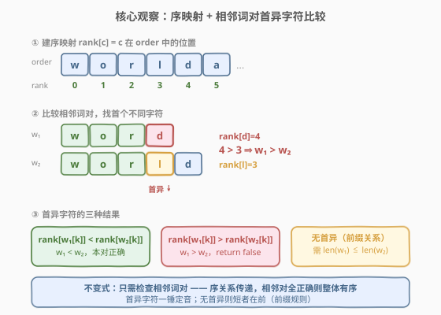
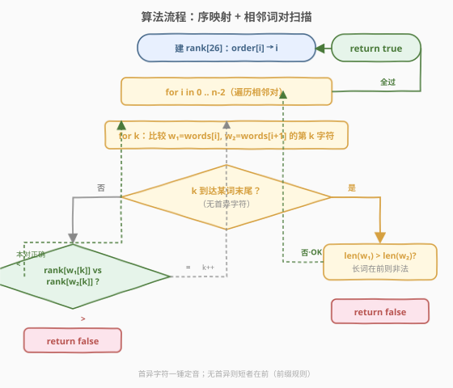
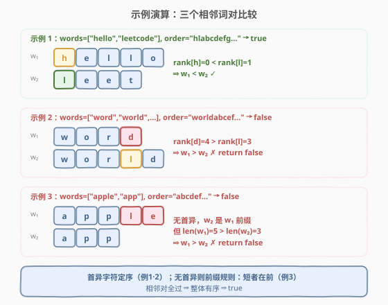

# LeetCode 验证外星语词典 题解

## 1. 题目概述

- **标题 / 题号**：验证外星语词典（#953，easy）
- **链接**：https://leetcode.cn/problems/verifying-an-alien-dictionary/
- **难度**：简单
- **标签**：数组、字符串、哈希表

**题意**：某种外星语也使用英文小写字母，但字母顺序可能与地球不同——给定一个 `order` 表示外星字母表的排列（`order` 是 26 个小写字母的某种排列）。给定一组用该外星语书写的单词列表 `words`，判断它们是否按外星字母表的字典序**升序排列**，是则返回 `true`。

> **本质**：把地球字典序里的「`a < b < … < z`」替换成「`order[0] < order[1] < … < order[25]`」，然后判断 `words` 是否有序。这是一道**自定义排序比较器**的判定题——不需要真正排序，只需逐对验证相邻词是否满足「前词 $\le$ 后词」。

**示例 1**：

```text
输入：words = ["hello","leetcode"], order = "hlabcdefgijkmnopqrstuvwxyz"
输出：true
解释：在外星字母表中 'h' 排在 'l' 前面（order[0]='h', order[1]='l'），
      所以 "hello" < "leetcode"，整体有序。

hello:  h e l l o
leetcode: l e e t c o d e
        ↑ 首字符 h(rank 0) < l(rank 1) → hello < leetcode ✓
```

**示例 2**：

```text
输入：words = ["word","world","row"], order = "worldabcefghijkmnpqstuvxyz"
输出：false
解释：比较 "word" 与 "world"，前 3 个字符相同，第 4 个字符 'd' vs 'l'，
      在外星序中 rank['d']=4 > rank['l']=3，故 "word" > "world"，顺序错误。

word:   w o r d
world:  w o r l d
            ↑ 首异字符 d(rank 4) > l(rank 3) → word > world ✗
```

**示例 3**：

```text
输入：words = ["apple","app"], order = "abcdefghijklmnopqrstuvwxyz"
输出：false
解释：前 3 个字符 "app" 完全相同，"app" 是 "apple" 的前缀且更短。
      字典序规定前缀词应排在前（短者在前），但此处 "apple" 排在 "app" 前面，顺序错误。

apple:  a p p l e
app:    a p p
          无首异字符，但 len(apple)=5 > len(app)=3 → apple > app ✗
```

**约束**：

- `1 <= words.length <= 100`
- `1 <= words[i].length <= 20`
- `order.length == 26`
- `words[i]` 和 `order` 中的所有字符都是英文小写字母

> 💡 本题是「自定义比较器」的入门题。核心在于把字母的**相对顺序**编码成一张**序映射表**（`rank[c]` = `c` 在 `order` 中的下标），之后任何两个字符的大小比较都变成查表比整数。这与 [269. 火星词典](https://leetcode.cn/problems/alien-dictionary/)（从词对**推导**未知字母序，需拓扑排序）方向相反——953 是**已知**字母序、**验证**词表有序，简单得多。

## 2. 解题思路

### 2.1 暴力思路：按外星序真正排序后比较

最直观的做法：用外星字母序定义一个**自定义比较器**，对 `words` 排序，然后检查排序结果是否与原数组相同。相同则说明原数组已有序。

这个思路正确且容易理解，但做了**多余的排序工作**——判定「数组是否有序」根本不需要排序，只需检查**相邻元素**是否满足 `words[i] <= words[i+1]`。排序是 $O(N \log N \cdot L)$ 次字符比较，而相邻检查只需 $O(N \cdot L)$ 次。

> ⚠️ 「先排序再比对」的问题在于：把一个**线性可判定**的问题（验证有序）退化成了**对数线性**（排序）。判定数组有序的正确姿势是「逐对验证相邻元素」——这正是 `std::is_sorted` 的做法。

### 2.2 核心观察：序映射 + 相邻词对首异字符比较



关键洞察分两步：

**第一步：建序映射。** 把 `order` 这串字母翻译成一张「字符 $\to$ 整数排名」的查找表 `rank[26]`：`rank[order[i]] = i`。建表后，比较两个字符 `c1`、`c2` 的大小就变成了比较两个整数 `rank[c1]`、`rank[c2]`——$O(1)$ 查表。

**第二步：只查相邻词对。** 序关系具有**传递性**：若 `words[0] <= words[1]` 且 `words[1] <= words[2]` 且 … 则整个数组有序。所以只需检查 $N-1$ 个相邻对，无需两两比较。

对每一对相邻词 $w_1$、$w_2$，比较策略是**找首个不同字符**：

1. 逐字符 $k$ 从 $0$ 开始比较 $w_1[k]$ 与 $w_2[k]$。
2. 若 $\text{rank}[w_1[k]] < \text{rank}[w_2[k]]$：$w_1 < w_2$，本对正确，跳到下一对。
3. 若 $\text{rank}[w_1[k]] > \text{rank}[w_2[k]]$：$w_1 > w_2$，**顺序错误，返回 `false`**。
4. 若 $\text{rank}[w_1[k]] == \text{rank}[w_2[k]]$：本位相同，$k{+}{+}$ 继续比下一位。
5. 若一直相同直到**某个词耗尽**（无首异字符）：说明短词是长词的前缀。字典序规定**前缀词排在前**——所以必须是 $w_1$ 更短（$w_1$ 是 $w_2$ 的前缀）。若 $\text{len}(w_1) > \text{len}(w_2)$ 则 $w_1 > w_2$，返回 `false`；否则本对正确。

> 💡 **为什么「首异字符一锤定音」？** 字典序的定义就是「从左到右逐位比较，首个不同的位置决定大小」。前 $k-1$ 位完全相同意味着它们对大小关系没有贡献，第 $k$ 位的差异是决定性的。一旦找到首异字符并判定出 $<$ 或 $>$，后续字符无需再看——这与人类查字典的行为完全一致。

### 2.3 算法流程图



**整体流程**：

1. **预处理**：遍历 `order`，建 `rank[26]` 表（`rank[order[i] - 'a'] = i`）。
2. **外层循环**：`for i in 0 .. n-2`，取 $w_1 = \text{words}[i]$、$w_2 = \text{words}[i+1]$。
3. **内层循环**：`for k in 0 .. min(len(w1), len(w2)) - 1`，逐字符比较：
   - 若 `rank[w1[k]] < rank[w2[k]]`：本对正确，`break` 到下一对。
   - 若 `rank[w1[k]] > rank[w2[k]]`：返回 `false`。
   - 若相等：继续 $k{+}{+}$。
4. **前缀检查**：内层循环正常结束（无首异），检查 `len(w1) > len(w2)` 则返回 `false`。
5. **收尾**：所有相邻对通过 → 返回 `true`。

> ⚠️ **前缀检查的边界**：内层循环的边界是 `min(len(w1), len(w2))`。循环正常退出有两种情况——`len(w1) < len(w2)`（$w_1$ 是 $w_2$ 前缀，正确）或 `len(w1) == len(w2)`（两词完全相同，正确）或 `len(w1) > len(w2)`（$w_2$ 是 $w_1$ 前缀，错误）。所以只需判 `len(w1) > len(w2)` 即可拦截唯一非法情况。

### 2.4 示例演算

以三个官方示例对照执行过程，用颜色编码区分首异字符与前缀关系：



**示例 1** `words = ["hello","leetcode"]`, `order = "hlabcdefgijkmnopqrstuvwxyz"` → `true`：

| 步骤 | `w1[k]` | `w2[k]` | rank 比较 | 判定 |
|------|---------|---------|-----------|------|
| k=0 | h | l | rank[h]=0 < rank[l]=1 | $w_1 < w_2$，本对正确 ✓ |

> 只比了第 0 位就分出胜负——`h` 在外星序中排第 0，`l` 排第 1，`hello < leetcode` 确认。后续字符无需比较。仅一对相邻词，全过 → `true`。

**示例 2** `words = ["word","world","row"]`, `order = "worldabcefghijkmnpqstuvxyz"` → `false`：

| 相邻对 | 步骤 | `w1[k]` | `w2[k]` | rank 比较 | 判定 |
|--------|------|---------|---------|-----------|------|
| word vs world | k=0 | w | w | 0 == 0 | 相同，继续 |
| | k=1 | o | o | 1 == 1 | 相同，继续 |
| | k=2 | r | r | 2 == 2 | 相同，继续 |
| | k=3 | **d** | **l** | rank[d]=**4** > rank[l]=**3** | $w_1 > w_2$ → **return false** ✗ |

> 第 3 位（`'d'` vs `'l'`）是首异字符。`'d'` 在 `order` 中排第 4，`'l'` 排第 3，`4 > 3` 所以 `"word" > "world"`，顺序错误。注意 `len(word)=4 < len(world)=5` 的前缀关系根本没机会触发——首异字符更早就定出了胜负。

**示例 3** `words = ["apple","app"]`, `order = "abcdefghijklmnopqrstuvwxyz"` → `false`：

| 相邻对 | 步骤 | `w1[k]` | `w2[k]` | rank 比较 | 判定 |
|--------|------|---------|---------|-----------|------|
| apple vs app | k=0 | a | a | 0 == 0 | 相同，继续 |
| | k=1 | p | p | 15 == 15 | 相同，继续 |
| | k=2 | p | p | 15 == 15 | 相同，继续 |
| | k=3 | w2 耗尽（len=3） | — | — | 无首异 |
| | 前缀检查 | len(w1)=5 > len(w2)=3 | — | — | $w_1 > w_2$ → **return false** ✗ |

> 前 3 位 `"app"` 完全相同，`w2` 先耗尽。此时无首异字符，进入前缀检查：`len(apple)=5 > len(app)=3`，说明 `"app"` 是 `"apple"` 的前缀但排在后面，违反「短者在前」规则 → `false`。

> 💡 **示例 2 vs 示例 3 的对比**：两者都返回 `false`，但拦截点不同。示例 2 被**首异字符**拦截（第 3 位 `d > l`），前缀规则未触发；示例 3 没有**首异字符**（前 3 位全等），被**前缀规则**拦截（长词在前）。这两条判定路径覆盖了字典序比较的全部边界。

## 3. 参考代码

### C++

```cpp
// 验证外星语词典.cpp —— 序映射 + 相邻词对首异字符比较
// 编译: g++ -O2 -std=c++17 验证外星语词典.cpp -o vad
#include <string>
#include <vector>
using namespace std;

class Solution {
  public:
    bool isAlienSorted(vector<string>& words, string order) {
        int rank[26];
        for (int i = 0; i < 26; ++i)
            rank[order[i] - 'a'] = i;              // 字符 -> 外星序排名

        for (int i = 0; i + 1 < (int)words.size(); ++i) {
            const string& w1 = words[i];
            const string& w2 = words[i + 1];
            int m = w1.size(), n = w2.size();
            int k = 0;
            for (; k < m && k < n; ++k) {          // 逐字符找首个不同
                int r1 = rank[w1[k] - 'a'];
                int r2 = rank[w2[k] - 'a'];
                if (r1 < r2) break;                // w1 < w2，本对正确
                if (r1 > r2) return false;         // w1 > w2，顺序错误
            }
            if (k == n && m > n) return false;     // 无首异且 w1 更长 → 前缀违规
        }
        return true;
    }
};
```

### Python

```python
class Solution:
    def isAlienSorted(self, words: list[str], order: str) -> bool:
        rank = {c: i for i, c in enumerate(order)}   # 字符 -> 外星序排名

        for i in range(len(words) - 1):
            w1, w2 = words[i], words[i + 1]
            m, n = len(w1), len(w2)
            for k in range(min(m, n)):               # 逐字符找首个不同
                r1, r2 = rank[w1[k]], rank[w2[k]]
                if r1 < r2:
                    break                            # w1 < w2，本对正确
                if r1 > r2:
                    return False                     # w1 > w2，顺序错误
            else:
                if m > n:                            # 无首异且 w1 更长 → 前缀违规
                    return False
        return True
```

> 💡 两份代码结构对称。注意 Python 版用了 `for…else` 语法——`else` 块在循环**未被 `break` 打断**时执行，恰好对应「无首异字符」的情况，此时做前缀检查 `m > n`。C++ 版则用 `k == n && m > n` 等价判断：内层循环走完 `min(m,n)` 次未 break，且 `m > n` 说明 `w1` 更长。

## 4. 复杂度分析

| 维度 | 复杂度 | 说明 |
|------|--------|------|
| **时间** | $O(C)$ | $C = \sum_i \text{len}(\text{words}[i])$ 为所有单词字符总数。每对相邻词最多比较到首异字符或短词末尾，整体字符访问不超过 $C$；建 `rank` 表 $O(26) = O(1)$ |
| **空间** | $O(1)$ | 仅用 26 个整数的 `rank` 表（字母表固定大小），与输入规模无关 |

> ⚠️ 时间复杂度的关键在于**每个字符至多被访问一次**：相邻对的比较一旦遇到首异字符就 `break`，不会回退重扫。最坏情况（所有词相同前缀极长）也只是把公共前缀逐位扫过一遍。相比「先排序再比对」的 $O(N \log N \cdot L)$，相邻检查的 $O(C)$ 是最优的。

## 5. 扩展：自定义比较器排序与拓扑排序对比

### 5.1 用自定义比较器真正排序

如果题目改成「请将词表按外星序排序」而非「验证是否有序」，只需把上面的 `rank` 比较逻辑封装成比较器，交给排序算法：

```python
def alien_sort(words: list[str], order: str) -> list[str]:
    rank = {c: i for i, c in enumerate(order)}
    def cmp(w1: str, w2: str) -> int:
        for k in range(min(len(w1), len(w2))):
            r1, r2 = rank[w1[k]], rank[w2[k]]
            if r1 != r2:
                return -1 if r1 < r2 else 1
        return -1 if len(w1) < len(w2) else (1 if len(w1) > len(w2) else 0)
    import functools
    return sorted(words, key=functools.cmp_to_key(cmp))
```

比较器的逻辑与判定版完全一致——「首异字符定序，无首异则短者在前」就是字典序比较的通用模板。判定有序只是「排序后比对」的线性退化版本。

### 5.2 与火星词典（269）的对比

本题与 [269. 火星词典](https://leetcode.cn/problems/alien-dictionary/) 同属「外星字母序」主题，但方向相反：

| 维度 | 953 验证外星语词典 | 269 火星词典 |
|------|-------------------|-------------|
| 已知 / 未知 | 字母序**已知**（给定 `order`） | 字母序**未知**（需推导） |
| 任务 | **验证**词表是否按此序有序 | **推导**出字母序（可能无解） |
| 核心方法 | 序映射 + 相邻对比较，$O(C)$ | 建图 + 拓扑排序，$O(C)$ |
| 难度 | 简单 | 困难 |
| 前缀规则 | 需处理（短者在前） | 需处理（前缀词非法则无序） |

269 把「相邻词对的字符差异」当作**图的边**（首异字符 $c_1$ vs $c_2$ 给出偏序 $c_1 < c_2$），收集所有偏序后做拓扑排序得到完整字母序。953 则是 269 的「逆问题」——字母序已经给你了，只需验证偏序是否被满足。掌握 953 的相邻词对比较逻辑是理解 269 建图过程的基础。

## 6. 面试要点

1. **为什么不需要排序，只查相邻对就够了？**

   - 序关系具有**传递性**：$w_1 \le w_2$ 且 $w_2 \le w_3$ 蕴含 $w_1 \le w_3$。要验证整个数组有序，只需验证所有相邻对 $w_i \le w_{i+1}$，共 $N-1$ 对。
   - 排序是 $O(N \log N \cdot L)$ 次字符比较，而相邻检查只需 $O(C)$（$C$ 为总字符数）。把线性可判定的「验证有序」退化成排序是浪费。

2. **首异字符为什么「一锤定音」？**

   - 字典序的定义就是「从左到右逐位比较，首个不同的位置决定大小」。前 $k-1$ 位完全相同意味着它们对大小关系零贡献，第 $k$ 位的差异是决定性的。
   - 一旦判定 $w_1[k] < w_2[k]$ 或 $w_1[k] > w_2[k]$，后续字符无需再看。这与 `std::string::compare` 的短路逻辑一致。

3. **前缀规则怎么处理？为什么 `len(w1) > len(w2)` 才非法？**

   - 当两词在前 `min(len)` 个字符上完全相同（无首异），短词是长词的前缀。字典序规定**前缀词排在前**（更短的更小），因为前缀词「先耗尽」。
   - 合法情况：$w_1$ 是 $w_2$ 的前缀（`len(w1) < len(w2)`）→ $w_1 < w_2$ ✓；或两词相同（`len(w1) == len(w2)`）→ $w_1 == w_2$ ✓。
   - 非法情况：$w_2$ 是 $w_1$ 的前缀（`len(w1) > len(w2)`）→ $w_1 > w_2$ ✗。所以只需判 `len(w1) > len(w2)`。

4. **序映射表为什么用数组/哈希而不是每次在 `order` 里查找？**

   - 在 `order` 中 `find` 某字符是 $O(26)$，每次字符比较都查一次，总开销 $O(26 \cdot C)$。预建 `rank[26]` 表后每次比较 $O(1)$，总开销 $O(C)$，且建表仅 $O(26)$。
   - 字母表固定 26 个小写字母，数组 `rank[26]` 天然是 $O(1)$ 空间。这是「空间换时间」的最小代价——用 26 个 `int` 换掉每次比较的 26 倍常数。

5. **内层循环的边界为什么是 `min(len(w1), len(w2))` 而不是 `max`？**

   - 越过短词末尾后，比较的是「字符 vs 不存在」——这不再是字符大小关系，而是前缀规则。前缀规则由循环后的 `len` 检查统一处理，不能混在字符比较里。
   - 所以字符比较只覆盖两词都有字符的范围 `min(len)`，循环正常退出（未 break）才进入前缀判定。逻辑边界清晰，不会越界访问。

> 💡 **一句话总结**：953 的核心是「序映射 $O(1)$ 查表 + 相邻词对首异字符一锤定音 + 前缀规则兜底」。序关系传递性把问题降到线性相邻检查，首异字符的短路逻辑保证每个字符至多访问一次。这是自定义字典序比较的通用模板，也是理解 269 火星词典建图过程的基础。

## 同类练习题

| # | 题目 | 与本题的关联 |
|---|------|-------------|
| 269 | [火星词典](https://leetcode.cn/problems/alien-dictionary/) | 方向相反的姐妹题——字母序未知，从相邻词对的首异字符提取偏序边做拓扑排序推导字母序，本题的比较逻辑是其建图基础 |
| 242 | [有效的字母异位词](https://leetcode.cn/problems/valid-anagram/) | 同样用 26 元素计数表刻画字母信息，练习「字母表固定大小 → $O(1)$ 空间」的建表技巧 |
| 1859 | [将句子排序](https://leetcode.cn/problems/sorting-the-sentence/) | 按单词尾部的位置标记重排句子，同属「自定义排序键 + 逐元素处理」的简单字符串题 |
| 791 | [自定义排序字符串](https://leetcode.cn/problems/custom-sort-string/) | 给定自定义字母序对字符串排序，与本题同源（序映射表），但需求是「排序」而非「验证有序」 |
