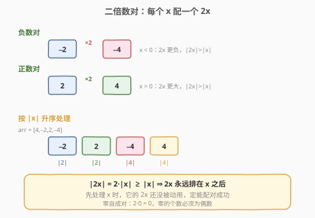
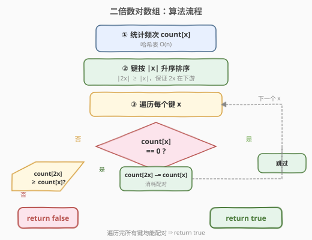

# LeetCode 二倍数对数组 题解

## 1. 题目概述

- **标题 / 题号**：二倍数对数组（#954，medium）
- **链接**：https://leetcode.cn/problems/array-of-doubled-pairs/
- **难度**：中等
- **标签**：贪心、数组、哈希表、排序

**题意**：给定一个长度为偶数的整数数组 `arr`，只有对 `arr` 进行重组后可以满足「对于每个 `0 <= i < len(arr) / 2`，都有 `arr[2 * i + 1] = 2 * arr[2 * i]`」时，返回 `true`；否则返回 `false`。

换言之，能否把数组两两分组，使得每一对 `(x, 2x)` 中第二个数恰好是第一个数的两倍。

> 💡 本题是「**贪心 + 排序 + 哈希计数**」的招牌题。核心直觉是：每个数 `x` 都要找一个 `2x` 配对，而 `2x` 的绝对值总是大于等于 `x` 的绝对值——因此**按绝对值升序处理**，就能保证轮到 `x` 时它的 `2x` 还没被别人抢走。负数的处理是本题最易踩坑的点。

**示例 1**：

```text
输入：arr = [3,1,3,6]
输出：false
解释：1 需要配 2，但 2 不在数组中，无法配对。
```

**示例 2**：

```text
输入：arr = [2,1,2,6]
输出：false
解释：1 配 2（消耗一个 2），剩 [2,6]；2 需配 4，4 不在数组中，失败。
```

**示例 3**：

```text
输入：arr = [4,-2,2,-4]
输出：true
解释：可用 [-2,-4] 和 [2,4] 这两组组成 [-2,-4,2,4] 或是 [2,4,-2,-4]。
```

**约束**：

- `0 <= arr.length <= 3 * 10^4`
- `arr.length` 是偶数
- `-10^5 <= arr[i] <= 10^5`

## 2. 解题思路

### 2.1 暴力思路

枚举所有两两分组的方案（全排列后每相邻两位成一对），逐一验证每对是否满足 `arr[2i+1] = 2 * arr[2i]`。方案数为 $(n-1)!! = (n-1)(n-3)\dots 1$，$n = 3 \times 10^4$ 时天文数字，完全不可行。

### 2.2 核心观察：按绝对值升序贪心配对



关键洞察分两步：

**第一步：配对关系是「x ↔ 2x」。** 把每个数看作一个待配对的键，`x` 必须消耗一个 `2x`。用哈希表统计每个值的出现次数 `count`，逐个键去匹配即可——无需真的枚举排列，只需保证「每个 `x` 都能找到足够的 `2x`」。

**第二步：按绝对值升序处理。** 这是正确性的关键。因为 $|2x| = 2|x| \ge |x|$，`2x` 的绝对值**永远不小于** `x`。所以若按键的绝对值升序遍历，轮到 `x` 时，所有绝对值更小的键已处理完毕，而 `2x`（绝对值更大）还没被动用过，必定可供 `x` 消耗。

> 💡 为什么要按**绝对值**而非数值本身排序？考虑负数：`x = -2` 要配 `2x = -4`。按数值升序得 `[-4, -2, ...]`，会先处理 `-4`（它去找 `-8`，不在数组里就误判失败），而 `-2` 的配对 `-4` 可能被错误提前消耗。按绝对值升序得 `[-2, 2, -4, 4]`，`-2` 先于 `-4` 处理，`-4` 此时完整保留供 `-2` 消耗，逻辑正确。

> ⚠️ **零的特殊性**：$2 \times 0 = 0$，零只能与零配对，因此 `0` 的出现次数为奇数时答案必为 `false`。处理 `x = 0` 时，`count[2 \cdot 0] >= count[0]` 即 `count[0] >= count[0]` 恒成立，执行 `count[0] -= count[0]` 一次性归零。奇数个零不会从这一步漏出——总长度为偶数时，零为奇数意味着非零元素也为奇数，必有非零链失衡被 greedy 在别处拦截（详见 §6）。

### 2.3 算法流程图



```
1. 用哈希表统计 arr 中每个值的出现次数 count
2. 取 count 的所有键，按 |x| 升序排序（|x| 相同则 x 本身升序）
3. 对每个键 x（升序）：
      若 count[x] == 0：跳过（已被前面的 x 消耗完）
      若 count[2x] < count[x]：return false   // 2x 不够配
      count[2x] -= count[x]                   // 消耗配对
4. return true
```

> 💡 第 2 步的排序键 `|x|` 保证「小绝对值先处理」；同绝对值时按 `x` 升序，使 `-2` 排在 `2` 前，但两者互不干扰（`-2` 配 `-4`，`2` 配 `4`），顺序无所谓，仅保持确定性。

### 2.4 示例演算

![示例演算：arr = [4,-2,2,-4]](../images/doubled_pairs_walkthrough.svg)

以示例 3 `arr = [4,-2,2,-4]` 为例。先统计频次 `count = {-2:1, 2:1, -4:1, 4:1}`，按键的绝对值升序得 `[-2, 2, -4, 4]`：

| 步骤 | x | 2x | count[x] | count[2x]（前） | 判定 | count[2x]（后） |
|------|----|----|----------|----------------|------|----------------|
| ① | −2 | −4 | 1 | 1 | 1 ≥ 1 ✓ | 0 |
| ② | 2 | 4 | 1 | 1 | 1 ≥ 1 ✓ | 0 |
| ③ | −4 | — | 0 | — | 跳过 | — |
| ④ | 4 | — | 0 | — | 跳过 | — |

`-2` 消耗一个 `-4`，`2` 消耗一个 `4`；轮到 `-4`、`4` 时 `count` 已归零，跳过。所有键处理完毕，配成 `(−2,−4)` 与 `(2,4)` 两组 → `return true` ✅

## 3. 参考代码

### C++

```cpp
// 二倍数对数组.cpp —— 计数 + 按 |x| 排序 + 贪心消耗
#include <vector>
#include <unordered_map>
#include <algorithm>
#include <cmath>
using namespace std;

class Solution {
public:
    bool canReorderDoubled(vector<int>& arr) {
        unordered_map<int, int> cnt;
        for (int v : arr) cnt[v]++;

        vector<int> keys;
        keys.reserve(cnt.size());
        for (auto& [v, _] : cnt) keys.push_back(v);

        // 按绝对值升序；同绝对值按值升序（保证 -2 在 2 前，确定性）
        sort(keys.begin(), keys.end(), [](int a, int b) {
            if (abs(a) != abs(b)) return abs(a) < abs(b);
            return a < b;
        });

        for (int x : keys) {
            if (cnt[x] == 0) continue;          // 已被消耗完
            int dbl = 2 * x;
            if (cnt[dbl] < cnt[x]) return false; // 2x 不够配对
            cnt[dbl] -= cnt[x];                 // 消耗
        }
        return true;
    }
};
```

### Python

```python
class Solution:
    def canReorderDoubled(self, arr: list[int]) -> bool:
        from collections import Counter
        cnt = Counter(arr)

        for x in sorted(cnt, key=lambda v: (abs(v), v)):
            if cnt[x] == 0:
                continue                       # 已被消耗完
            dbl = 2 * x
            if cnt[dbl] < cnt[x]:
                return False                   # 2x 不够配对
            cnt[dbl] -= cnt[x]                 # 消耗
        return True
```

> 💡 **一个易错点**：遍历的是 `count` 的键（去重后的不同值），而非原数组每个元素。若按原数组逐元素处理，会遇到「同一个值重复判定」的混乱——用键遍历 + 一次性 `count[2x] -= count[x]` 批量消耗，逻辑清晰且高效。`count[x] == 0` 的跳过判断负责处理「已被前面消耗光」的键（如示例 3 的 `-4`、`4`）。

## 4. 复杂度分析

| 维度 | 复杂度 | 说明 |
|------|--------|------|
| **时间复杂度** | $O(n \log n)$ | 哈希计数 $O(n)$；对至多 $n$ 个键排序 $O(n \log n)$ 主导；逐键消耗均摊 $O(n)$ |
| **空间复杂度** | $O(n)$ | 哈希表存至多 $n$ 个键值对，键数组至多 $n$ 个 |

> 💡 键的个数不超过 $n$（数组长度），排序与遍历都以此为规模。哈希表单次操作均摊 $O(1)$，不增加渐近复杂度。

## 5. 扩展：为什么按绝对值排序是正确的——交换论证

直觉上「按绝对值升序」能保证 `2x` 在 `x` 之后处理，但严谨的正确性可用**交换论证**刻画：

设存在一种合法的配对方案。考虑其中绝对值最小的某个键 `x`：

- 若 `x = 0`：它只能配 `0`，方案中所有 `0` 两两配对，与我们的「`count[0]` 一次性归零」一致。
- 若 `x ≠ 0`：`x` 必须配 `2x`（因为 $|x|/2$ 的绝对值更小，若存在则应在「更小的绝对值」里被先配掉；而 `x` 是当前最小未配键，故 $x/2$ 已耗尽或不存在，`x` 只能向上找 `2x`）。

因此在每一步，「当前绝对值最小的未配键 `x`」的唯一合法选择是 `2x`。贪心消耗 `count[2x] -= count[x]` 不丢失任何合法方案：若某方案让某个 `2x` 配给了别的键，由于 `2x` 只能由 `x` 或 $x/2$ 配对，而 $x/2$ 已处理，该 `2x` 必须留给 `x`，交换后仍是合法方案。故贪心不会把任何合法选择「堵死」。

> ⚠️ 这也解释了为何按数值（非绝对值）排序会出错：负数区间里「数值最小」的 `-4` 并非「绝对值最小」，它的合法配对 `-8` 可能不存在，但 `-4` 本应留给 `-2`——按数值排序会先错误地处理 `-4`，破坏上述不变式。

## 6. 面试要点

1. **为什么要按绝对值而不是按数值排序？**

   - 负数对中 `2x` 比更负（如 `x=-2` 配 `2x=-4`）。按数值排序会让 `-4` 排在 `-2` 前，先处理 `-4`（去找 `-8`，可能不存在或误消耗），破坏配对。按绝对值排序使 `-2`（`|·|=2`）先于 `-4`（`|·|=4`），保证 `x` 先于 `2x` 处理，`2x` 完整保留供消耗。

2. **零是怎么处理的？需要特判吗？**

   - 不需要。$2 \times 0 = 0$，零只能与零配对。按绝对值排序时零排在最前，`x=0` 时 `count[0] >= count[0]` 恒成立，执行 `count[0] -= count[0]` 归零，自然把零两两消耗。

   - **奇数个零会不会漏判？** 不会。题目保证总长度为偶数，若 `count[0]` 为奇数，则非零元素总数也为奇数——奇数个非零元素无法两两配成 `(x, 2x)`，至少有一条非零链失衡，其顶端元素找不到可用的 `2x`，greedy 必在该非零键处触发 `count[2x] < count[x]` 返回 `false`。换言之，零的奇偶性被非零链**间接兜住**，无需 `count[0] % 2 == 0` 显式判断（已用暴力对拍验证）。

3. **为什么遍历键而非原数组元素？**

   - 同一个值可能出现多次，按原数组逐元素处理会重复触发匹配逻辑且难以追踪「剩余可用的 `2x`」。按键遍历 + 批量 `count[2x] -= count[x]` 一次消耗所有相同 `x`，配合 `count[x] == 0` 跳过已耗尽的键，逻辑清晰且 $O(1)$ 摊还每键。

4. **如果数组长度为奇数会怎样？**

   - 题目保证 `arr.length` 是偶数。若为奇数，必然无法两两配对，直接 `return false`。本题约束已排除此情况，代码无需处理。

> 💡 **一句话总结**：二倍数对数组的招牌解法是「**哈希计数 + 按绝对值升序贪心消耗 `2x`**」——利用 $|2x| \ge |x|$ 保证 `2x` 永远在 `x` 之后被处理。负数须按绝对值排序，零自成对且奇偶性由非零链兜底，均无需特判。

## 同类练习题

| # | 题目 | 与本题的关联 |
|---|------|-------------|
| 451 | [根据字符出现频率排序](https://leetcode.cn/problems/sort-characters-by-frequency/) | 哈希计数 + 按值排序的同类套路，巩固「计数后按键处理」范式 |
| 945 | [使数组唯一的最小增量](../0901-1000/945_使数组唯一的最小增量.md) | 排序 + 贪心递推，与本题共享「排序确定处理顺序、贪心局部最优即全局最优」的思想 |
| 2007 | [从双倍数组中还原原数组](https://leetcode.cn/problems/find-original-array-from-doubled-array/) | 几乎同构的题目（`2x` 配对还原原数组），直接套用本题按绝对值排序 + 计数消耗模板 |
| 740 | [删除并获得点数](../0701-0800/740_删除并获得点数.md) | 值域建桶 + 相邻值互斥 DP，与本题「按值域组织、处理值与 2x 关系」对照 |
| 1 | [两数之和](../0001-0100/1_两数之和.md) | 哈希表一次遍历找配对值，配对思想的入门版（本题是「全员两两配对」的进阶） |
