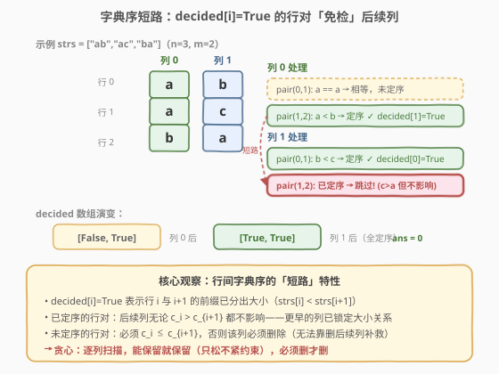
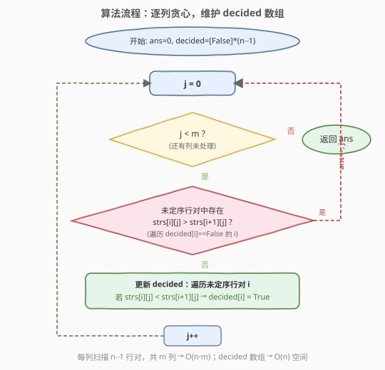

# 删列造序 II

- **题目名称**：删列造序 II
- **链接**：[955. 删列造序 II](https://leetcode.cn/problems/delete-columns-to-make-sorted-ii/)
- **难度**：中等
- **标签**：贪心、数组、字符串

## 1. 题目概述

给定 `n` 个**等长小写字符串**组成的数组 `strs`，将其看作 `n × m` 的字符矩阵（`m` 为字符串长度）。

一次「删列」操作会**删除某一整列**（所有行的同一位置字符）。删除后，剩余列保持原相对顺序拼成新的字符串数组。

目标是：删除**尽量少**的列，使得删后的数组按**字典序非降**排列（即 $\text{strs}[0] \le \text{strs}[1] \le \cdots \le \text{strs}[n-1]$）。返回最少删除列数。

> 💡 **与 944 的关键区别**：944 要求「每个保留列**列内**非降」，列与列相互独立；955 要求「**行间**字典序非降」，列与列通过字典序的短路比较产生交互——前缀相同的行段会推迟到后续列决断。这使得 955 不能逐列独立判定，而需要贪心维护「已定序的行对」。

**示例 1**：

```text
输入：strs = ["ca","bb","ac"]
输出：1
解释：矩阵如下（3 行 × 2 列）
  c a
  b b
  a c
删第 0 列后 strs = ["a","b","c"]，字典序非降 ✓
```

**示例 2**：

```text
输入：strs = ["xc","yb","za"]
输出：0
解释：第 0 列 x,y,z 已使所有相邻行对定序（x<y, y<z），无需删任何列。
```

**示例 3**：

```text
输入：strs = ["zyx","wvu","tsr"]
输出：3
解释：每列第一行对就违反（z>w, y>v, x>u），全部删除。
```

**约束条件**：

- $n = \text{strs.length}$
- $1 \le n \le 100$
- $1 \le \text{strs[i].length} \le 100$
- $\text{strs[i]}$ 由小写英文字母组成
- 所有字符串长度相同

---

## 2. 解题思路

### 2.1 暴力思路

枚举所有列的子集（保留哪些列），对每个子集检查删后数组是否字典序非降，取最小删除数。共 $2^m$ 种子集，每种检查 $O(n \cdot m)$，总计 $O(2^m \cdot n \cdot m)$，$m \le 100$ 时完全不可行。

### 2.2 核心观察：字典序短路 + decided 数组贪心



解决本题需要两个关键观察：

**观察 1：字典序的「短路」特性。** 比较两个字符串的字典序时，从左到右逐字符比较，**首个不同的字符**即决定大小关系——后续字符无论是什么都不影响。因此，如果行 $i$ 与行 $i+1$ 在已保留的前若干列中已经分出大小（$\text{strs}[i] < \text{strs}[i+1]$），则后续列对这对行的相对顺序**完全无影响**。

**观察 2：decided 数组——标记已定序的行对。** 维护一个布尔数组 $\text{decided}[i]$（$0 \le i < n-1$），表示行 $i$ 与行 $i+1$ 是否已通过已保留的列**严格定序**（$\text{strs}[i] < \text{strs}[i+1]$）。处理每一列 $j$ 时：

- **只检查未定序的行对**（$\text{decided}[i] == \text{False}$）：若 $\text{strs}[i][j] > \text{strs}[i+1][j]$，该列**必须删除**（保留会导致 $\text{strs}[i] > \text{strs}[i+1]$，违反字典序）。
- 若无违反（保留该列）：对每个未定序行对，若 $\text{strs}[i][j] < \text{strs}[i+1][j]$，标记 $\text{decided}[i] = \text{True}$（该行对从此定序）；若相等，保持未定序（留给后续列决断）。

> 💡 **为何已定序的行对可以「免检」？** 以 `["ab","ac","ba"]` 为例：列 0 的 `a < b` 使行 1、2 定序（`"ac" < "ba"` 已由首位 `a < b` 锁定）。列 1 中行 1、2 的字符是 `c` vs `a`（`c > a`），看似违反——但因为行 1、2 已定序，列 1 的 `c > a` 完全不影响字典序。`"ac" < "ba"` 仍然成立。这正是字典序短路的威力。

> ⚠️ **与 944 的本质区别**：944 中列与列独立（每列只看自身纵向非降），955 中列间通过字典序交互。944 可以无条件逐列判定；955 必须维护 `decided` 状态，只检查未定序的行对，否则会把已定序行对中的 `c > a` 误判为违反。

**贪心正确性（交换论证）**：

贪心策略是「能保留就保留，必须删才删」。正确性分两步：

1. **必须删的情况无选择**：若列 $j$ 对某未定序行对有 $\text{strs}[i][j] > \text{strs}[i+1][j]$，保留该列会立即违反字典序，且删后续列无法补救（该列字符仍在）。故必须删。

2. **能保留时保留是占优选择**：设最优解 OPT 删除了一个无违反的列 $j$。将 OPT 改为保留 $j$：保留后 `decided` 集合只增不减（更多行对定序），后续列的约束只松不紧。OPT 原本能保留的后续列，在 `decided` 更大的条件下必然仍可保留。故修改后的解仍可行且删除数不增，保持最优。

> 💡 **一句话**：保留无违反列 = 只松不紧约束 = 后续列更容易保留 = 删除数不会更多。因此贪心保留总是占优。

### 2.3 算法流程图



1. 初始化 `ans = 0`，`decided = [False] * (n - 1)`，列数 `m = strs[0]` 的长度。
2. 对每一列 $j$ 从 $0$ 到 $m-1$：
   - **检查可行性**：遍历所有 $\text{decided}[i] == \text{False}$ 的行对 $i$，若存在 $\text{strs}[i][j] > \text{strs}[i+1][j]$，则该列必须删除。
   - **若必须删**：`ans += 1`，`decided` 不变（删除的列不影响已保留列的定序状态），跳到下一列。
   - **若可保留**：遍历所有未定序行对 $i$，若 $\text{strs}[i][j] < \text{strs}[i+1][j]$，置 $\text{decided}[i] = \text{True}$。
3. 返回 `ans`。

### 2.4 示例演算

![示例演算：strs = ["ca","bb","ac"]](../images/delcols2_walkthrough.svg)

以 `strs = ["ca","bb","ac"]`（$n=3, m=2$）为例：

**列 $j=0$**：字符 `c, b, a`，`decided = [F, F]`

| 行对 $i$ | 字符比较 | decided 状态 | 判定 |
|----------|----------|-------------|------|
| 0 | `c` vs `b` | F（未定序） | `c > b` → **违反!** break |

列 0 必须删除。`ans = 1`，`decided` 不变（仍 `[F, F]`）。

**列 $j=1$**：字符 `a, b, c`，`decided = [F, F]`（列 0 已删，不影响）

| 行对 $i$ | 字符比较 | decided 状态 | 判定 |
|----------|----------|-------------|------|
| 0 | `a` vs `b` | F | `a < b` ✓ → `decided[0] = True` |
| 1 | `b` vs `c` | F | `b < c` ✓ → `decided[1] = True` |

无违反，保留列 1。`ans = 1`，`decided = [T, T]`。

**最终**：删后 `strs = ["a","b","c"]`，字典序非降 ✓，`ans = 1`。

---

## 3. 参考代码

### C++

```cpp
class Solution {
public:
    int minDeletionSize(vector<string>& strs) {
        int n = strs.size();
        int m = strs[0].size();
        vector<bool> decided(n - 1, false);
        int ans = 0;
        for (int j = 0; j < m; ++j) {
            bool keep = true;
            for (int i = 0; i + 1 < n; ++i) {
                if (!decided[i] && strs[i][j] > strs[i + 1][j]) {
                    keep = false;
                    break;
                }
            }
            if (!keep) {
                ++ans;
            } else {
                for (int i = 0; i + 1 < n; ++i) {
                    if (!decided[i] && strs[i][j] < strs[i + 1][j]) {
                        decided[i] = true;
                    }
                }
            }
        }
        return ans;
    }
};
```

### Python

```python
class Solution:
    def minDeletionSize(self, strs: List[str]) -> int:
        n, m = len(strs), len(strs[0])
        decided = [False] * (n - 1)
        ans = 0
        for j in range(m):
            keep = True
            for i in range(n - 1):
                if not decided[i] and strs[i][j] > strs[i + 1][j]:
                    keep = False
                    break
            if not keep:
                ans += 1
            else:
                for i in range(n - 1):
                    if not decided[i] and strs[i][j] < strs[i + 1][j]:
                        decided[i] = True
        return ans
```

> ⚠️ **两个易错点**：
> 1. **判定违反用 `>`（严格大于）**：相等不算违反（字典序允许 $\le$）。若误写成 `>=`，会把前缀完全相同的行对误判为违反。
> 2. **删除列时不更新 `decided`**：删除的列「不存在」，不影响已保留列建立的定序关系。只有保留的列才可能让未定序行对变为已定序。

> 💡 **两趟扫描能否合并？** 不能。必须先完整检查所有未定序行对确认无违反，再更新 `decided`。若边检查边更新，会在检查行对 $i$ 时把 $i$ 标记为定序，导致后续行对 $i+1$ 的检查跳过本该检查的行对——逻辑错误。先检查后更新是正确做法。

---

## 4. 复杂度分析

| 维度 | 复杂度 | 说明 |
|------|--------|------|
| 时间复杂度 | $O(n \cdot m)$ | 每列最多扫描 $n-1$ 个行对，共 $m$ 列；每列检查阶段和更新阶段各最多 $n-1$ 次 |
| 空间复杂度 | $O(n)$ | `decided` 数组长度 $n-1$ |

> 💡 **下界论证**：考虑输入 `["aaa...a", "aaa...a"]`（两行全相同字符），每列每行对都相等，无违反无定序，必须完整扫描每列的每个字符才能确认——$\Omega(nm)$。故 $O(nm)$ 已最优。

---

## 5. 扩展：「删列造序」三部曲

955 是该系列的**进阶篇**，三题难度递增，核心差异在于「列间交互」的程度：

| 题号 | 题目 | 难度 | 目标 | 列间关系 |
|------|------|------|------|----------|
| 944 | 删列造序 | 简单 | 每列列内非降 | **独立**——逐列判定即可 |
| 955 | 删列造序 II | 中等 | 行间字典序非降 | **交互**——字典序短路，贪心维护 decided |
| 959 | 删列造序 III | 困难 | 删后可重排为同一非降序列 | **强交互**——DP 求最长可保留列链 |

**944 → 955 的关键升级**：944 的约束是逐列定义的（列内非降），列间无交互；955 的约束是行间字典序非降，字典序的短路特性让前缀相同的行段推迟到后续列决断，引入列间交互。`decided` 数组正是管理这种交互的核心工具——它记录「哪些行对已被前缀锁定大小」，让后续列只关注尚未定序的行对。

---

## 6. 面试要点

1. **为什么这道题用贪心？核心贪心策略是什么？**

   贪心策略是「逐列从左到右，能保留就保留，必须删才删」。正确性基于交换论证：保留无违反列只会让 `decided` 集合增大（更多行对定序），后续列约束只松不紧，删除数不会更多。而必须删的情况（违反字典序）无选择余地。两者结合，贪心即最优。

2. **`decided` 数组的作用是什么？能否省略？**

   `decided[i]` 标记行 $i$ 与 $i+1$ 是否已通过前缀严格定序。省略它会导致逐列无条件检查所有行对——但已定序行对的后续列比较可能 `c > a`（如 `"ac"` vs `"ba"` 的列 1），会被误判为违反。`decided` 正是区分 944 与 955 的关键：944 列独立无需它，955 列间交互必须有它。

3. **为什么删除列时不更新 `decided`，只有保留时才更新？**

   删除的列从结果中移除，相当于「从未存在」——它不贡献任何字符到最终的字符串，自然不能改变行间的定序状态。只有保留的列才参与最终字符串的构成，其字符比较才可能让未定序行对变为已定序。

4. **检查阶段和更新阶段能否合并为一趟扫描？**

   不能。必须先完整确认该列对所有未定序行对无违反，才能保留并更新 `decided`。若边检查边更新，会在检查行对 $i$ 时提前将其标记为定序，导致扫描到行对 $i+1$ 时错误跳过——但 $i+1$ 此时仍应被检查。两趟扫描（先检查后更新）是正确做法，代价仅为常数因子 2。

5. **数据范围（$n, m \le 100$）下有无性能风险？**

   $nm \le 10^4$，$O(nm)$ 在毫秒级完成，毫无压力。即使 $n, m \le 1000$（$nm = 10^6$）也在 1 秒内。空间 $O(n)$ 也极小。

---

## 7. 同类练习题

- [944. 删列造序](https://leetcode.cn/problems/delete-columns-to-make-sorted/)（[站内题解](../0901-1000/944_删列造序.md)）：三部曲入门篇，列独立判定非降，对照理解 955 为何需要 `decided` 数组
- [959. 删列造序 III](https://leetcode.cn/problems/delete-columns-to-make-sorted-iii/)：三部曲最难篇，DP 求最长可保留列链，列间强交互
- [14. 最长公共前缀](https://leetcode.cn/problems/longest-common-prefix/)（[站内题解](../0001-0100/14_最长公共前缀.md)）：同样按列扫描字符串数组，纵向比较字符，与字典序前缀概念相关
- [1752. 检查数组是否经排序和轮转得到](https://leetcode.cn/problems/check-if-array-is-sorted-and-rotated/)：判定非降数组的变体，同属「单调性检查」套路
