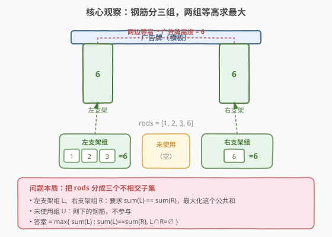
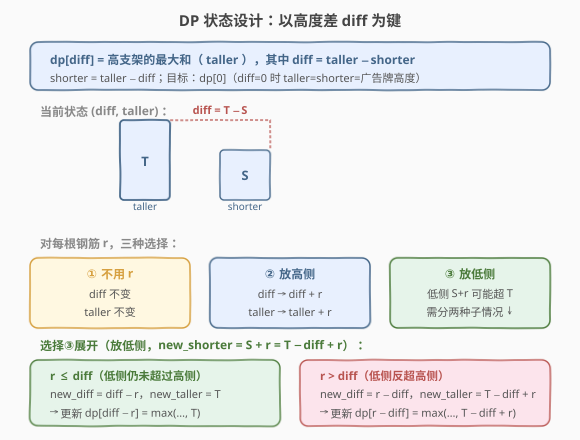
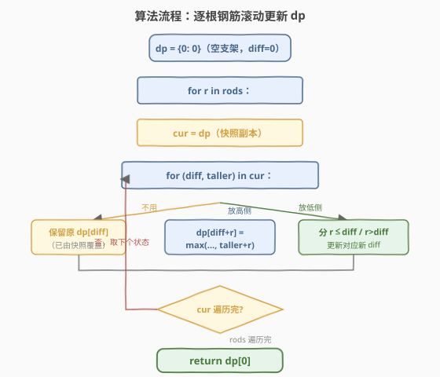

# 最高的广告牌

- **题目名称**：最高的广告牌
- **链接**：[956. 最高的广告牌](https://leetcode.cn/problems/tallest-billboard/)
- **难度**：困难
- **标签**：动态规划、状态压缩、Meet in the Middle

## 1. 题目概述

你正在安装一个广告牌，它由**两个等高的钢制支架**支撑。给你一堆可以焊接在一起的钢筋 `rods`，每根钢筋可以：
- 焊入**左支架**、焊入**右支架**、或**不用**。

两个支架各自由若干钢筋焊接而成（总长 = 所含钢筋长度之和），要求 `sum(左) == sum(右)`。返回这个公共和的**最大值**（即广告牌的最大安装高度）；无法安装时返回 `0`。

> 💡 本题本质是一个**三路划分问题**：把 `rods` 分成三个不相交子集 L、R、U，在 `sum(L) == sum(R)` 的前提下最大化 `sum(L)`。它和「分割等和子集」（416）同属**子集和家族**，但多了一个「等高配对」的约束，难度陡升——需要用**高度差 DP** 来消除配对约束。

**示例 1**：

```text
输入：rods = [1,2,3,6]
输出：6
解释：左支架 = {1,2,3} 和 = 6，右支架 = {6} 和 = 6，等高。
```

**示例 2**：

```text
输入：rods = [1,2,3,4,5,6]
输出：10
解释：左支架 = {2,3,5} 和 = 10，右支架 = {4,6} 和 = 10，等高。
```

**示例 3**：

```text
输入：rods = [1,2]
输出：0
解释：无法分成两个等和子集。
```

**约束条件**：

- `0 <= rods.length <= 20`
- `1 <= rods[i] <= 1000`
- `sum(rods[i]) <= 5000`

---

## 2. 解题思路

### 2.1 暴力思路

每根钢筋有三种选择（左 / 右 / 不用），`n = 20` 时决策树规模 $3^{20} \approx 3.5 \times 10^9$，不可行。即便剪枝（左右差超过剩余钢筋总和时回退），最坏仍指数级。

### 2.2 核心观察：以高度差 diff 为键的 DP



关键洞察是：**不需要分别记录左右支架的绝对高度，只需记录它们的差值 `diff = |sum(左) - sum(右)|`**，同时维护在给定差值下**较高一侧的最大和**。

> 💡 为什么差值就够？因为我们只关心「最终 diff = 0 时的最大和」。中间过程中，两边的绝对值可以通过 `taller` 和 `diff` 完全恢复（`shorter = taller - diff`）。用 `(diff, taller)` 这对信息就能完整描述一个状态，而 `diff` 的取值范围是 `[0, sum(rods)] ≤ 5000`，状态空间被压缩到可接受的 `O(n × sum)` 级别。

### 2.3 状态定义与转移



**状态**：`dp[diff]` = 在高度差为 `diff` 时，较高支架的最大和 `taller`（较低支架 `shorter = taller - diff`）。

**初始**：`dp[0] = 0`（两边都空，差为 0，高侧和为 0）。

**转移**——对每根钢筋 `r`，从旧状态 `(diff, taller)` 出发有三种选择：

| 选择 | 新 diff | 新 taller | 说明 |
|------|---------|-----------|------|
| ① 不用 `r` | `diff` | `taller` | 保持不变（由快照副本天然覆盖） |
| ② 放高侧 | `diff + r` | `taller + r` | 高侧更高，差拉大 |
| ③ 放低侧，`r ≤ diff` | `diff − r` | `taller` | 低侧追近但未反超，高侧不变 |
| ③ 放低侧，`r > diff` | `r − diff` | `taller − diff + r` | 低侧反超高侧，新的高侧 = 旧低侧 + r |

> ⚠️ **放低侧分两种子情况**的原因：低侧加上 `r` 后可能超过原高侧，此时「谁是高侧」发生翻转。`new_shorter = (taller - diff) + r`，若 `new_shorter ≤ taller`（即 `r ≤ diff`），高侧不变、差缩小；若 `new_shorter > taller`（即 `r > diff`），原低侧成为新高侧，差 = `new_shorter - taller = r - diff`。

**目标**：`dp[0]`——差为 0 时 `taller = shorter`，即为广告牌高度。

### 2.4 算法流程图



```
1. dp = {0: 0}
2. for r in rods:
      cur = dp 的快照副本          // 读旧状态，写新状态，避免同轮污染
      for (diff, taller) in cur:
          // ② 放高侧
          dp[diff + r] = max(dp[diff + r], taller + r)
          // ③ 放低侧
          if r <= diff:
              dp[diff - r] = max(dp[diff - r], taller)
          else:
              dp[r - diff] = max(dp[r - diff], taller - diff + r)
          // ① 不用：已由 cur 副本保留
3. return dp[0]
```

> 💡 **为什么需要快照副本？** 同一根钢筋 `r` 不能同时放高侧又放低侧。如果不复制，先更新的 `dp[diff+r]` 可能被同一轮后续迭代读取，导致一根钢筋被「用了两次」。用 `cur = dp`（副本）读旧状态、写回 `dp`，保证每根钢筋只基于上一轮的结果做一次决策。

### 2.5 示例演算

以 `rods = [1, 2, 3, 6]` 为例，逐步跟踪 `dp` 的变化（只列关键状态）：

![示例演算：rods = [1, 2, 3, 6]](../images/billboard_walkthrough.svg)

| 轮次 | 关键转移 | dp 变化（仅列关键键） |
|------|----------|----------------------|
| 初始 | — | `{0: 0}` |
| `r=1` | 从 `(0,0)`：放高→`(1,1)`；放低(r>0)→`(1,1)` | `{0:0, 1:1}` |
| `r=2` | 从 `(1,1)`：放低(r>1)→`(1, 1-1+2)=（1,2)` | `dp[1]` 升到 `2`（左{2} 右{1}） |
| `r=3` | 从 `(3,3)`：放低(r≤3)→`(0, 3)` ★ | `dp[0]=3`（左{1,2} 右{3}，首次等高！） |
| `r=6` | 从 `(6,6)`：放低(r≤6)→`(0, 6)` ★★ | `dp[0]=6`（左{1,2,3} 右{6}，最终答案） |

> 💡 **关键转折**在第 3 轮：处理 `r=3` 时，状态 `(diff=3, taller=3)` 表示左{1,2}=3、右{}=0。把 `r=3` 放低侧（右），`r ≤ diff` 成立，新 `diff=0`、`taller` 不变 = 3——**两边等高了**！第 4 轮同理，状态 `(diff=6, taller=6)` 表示左{1,2,3}=6、右{}=0，放 `r=6` 到低侧后 `diff=0`、`taller=6`。

---

## 3. 参考代码

### C++

```cpp
// 最高的广告牌.cpp —— 高度差 DP
#include <vector>
#include <unordered_map>
#include <algorithm>
using namespace std;

class Solution {
public:
    int tallestBillboard(vector<int>& rods) {
        unordered_map<int, int> dp;
        dp[0] = 0;
        for (int r : rods) {
            auto cur = dp;                  // 快照副本：读旧状态
            for (auto& [diff, taller] : cur) {
                // ② 放高侧
                dp[diff + r] = max(dp[diff + r], taller + r);
                // ③ 放低侧
                if (r <= diff) {
                    dp[diff - r] = max(dp[diff - r], taller);
                } else {
                    dp[r - diff] = max(dp[r - diff], taller - diff + r);
                }
                // ① 不用 r：dp 已由 cur 副本保留原值
            }
        }
        return dp[0];
    }
};
```

### Python

```python
class Solution:
    def tallestBillboard(self, rods: list[int]) -> int:
        dp = {0: 0}                        # diff -> max taller
        for r in rods:
            cur = dict(dp)                  # 快照副本：读旧状态
            for diff, taller in cur.items():
                # ② 放高侧
                dp[diff + r] = max(dp.get(diff + r, 0), taller + r)
                # ③ 放低侧
                if r <= diff:
                    dp[diff - r] = max(dp.get(diff - r, 0), taller)
                else:
                    dp[r - diff] = max(dp.get(r - diff, 0), taller - diff + r)
                # ① 不用 r：dp 已由 cur 副本保留原值
        return dp[0]
```

> ⚠️ **易错点**：必须用 `cur = dict(dp)`（或 C++ 的 `auto cur = dp`）做快照。若直接遍历 `dp` 同时修改它，会导致同一根钢筋的转移结果被当作本轮旧状态再次读取，相当于一根钢筋用了两次。这是「**滚动 DP 读旧写新**」的经典陷阱。

---

## 4. 复杂度分析

| 维度 | 复杂度 | 说明 |
|------|--------|------|
| **时间复杂度** | $O(n \cdot S)$ | `n` 根钢筋，每轮遍历至多 `S` 个 diff 值（`S = sum(rods) ≤ 5000`），每次转移 `O(1)`；总计 `O(nS) = O(20 \times 5000) = 10^5` |
| **空间复杂度** | $O(S)$ | `dp` 字典 / 哈希表至多存 `S + 1` 个键值对（diff 范围 `[0, S]`），快照副本同规模 |

> 💡 用哈希表（`unordered_map` / `dict`）而非定长数组，是因为很多 diff 值实际不会出现，稀疏存储更省空间。若用数组则需开 `2S + 1` 大小（diff 可达 `S`），空间 `O(S)` 但常数更小、速度更快。

---

## 5. 扩展：Meet in the Middle（折半搜索）

当 `n` 较大而 `sum` 也很大时（本题约束 `n ≤ 20, sum ≤ 5000` 已足够小，标准 DP 即可），可以用**折半搜索**进一步优化：

**思路**：把 `rods` 分成两半 `A` 和 `B`（各约 `n/2` 根），对每半独立枚举所有 $3^{|A|}$ / $3^{|B|}$ 种分配方案，记录 `(diff, max_taller)`。然后在两半的结果中，按 diff 配对（`diff_A == diff_B` 时可合并为 `diff=0`），取 `taller_A + taller_B` 的最大值。

- 每半 $3^{10} \approx 6 \times 10^4$，合并用哈希表 `O(3^{n/2})`，总体 $O(3^{n/2})$。
- 本题 `n ≤ 20`，$3^{10} \approx 6 \times 10^4$，比 DP 的 $10^5$ 略快，但实现更复杂。

```cpp
// 折半搜索版（思路框架）
// 1. 枚举前半 rods[0..m]，生成 map<diff, max_taller> leftMap
// 2. 枚举后半 rods[m..n]，生成 map<diff, max_taller> rightMap
// 3. for (d, t) in leftMap: ans = max(ans, t + rightMap[d])
//    （左半 diff=d + 右半 diff=d，合起来 diff=2d？需仔细处理符号）
// 实际实现需区分 diff 的正负方向，此处从略
```

> ⚠️ 折半搜索的难点在于 diff 的**符号处理**：左半的「高侧」和右半的「高侧」未必在同一根支架上。需要让两半的 diff 同号才能直接相加。实现细节比 DP 复杂得多，面试中除非被追问否则 DP 版已足够。

---

## 6. 面试要点

1. **为什么用「高度差」作为状态键，而不是直接记左右各自的和？**

   - 直接记 `(sum_left, sum_right)` 的状态空间是 $O(S^2)$（$S \leq 5000$，$S^2 = 2.5 \times 10^7$），再乘 `n` 轮达到 $5 \times 10^8$，勉强但常数大。
   - 用 `diff = |left - right|` 加 `taller = max(left, right)` 可以**无损压缩**：`shorter = taller - diff` 完全可恢复。状态数降到 $O(S)$，乘 `n` 仅 $10^5$。这是「**找冗余维度消除**」的经典 DP 优化思路。

2. **放低侧为什么要分 `r ≤ diff` 和 `r > diff` 两种情况？**

   - 放低侧后 `new_shorter = shorter + r = (taller - diff) + r`。若 `new_shorter ≤ taller`（`r ≤ diff`），高侧不变、差缩小到 `diff - r`；若 `new_shorter > taller`（`r > diff`），原低侧反超高侧，新高侧 = `new_shorter`、新差 = `r - diff`。
   - 不分情况会导致**新 taller 计算错误**——该变没变或不该变变了，答案出错。

3. **为什么需要快照副本 `cur = dp`？能边遍历边修改吗？**

   - 不能。同一根钢筋 `r` 对每个旧状态做转移，如果边遍历 `dp` 边修改，前面转移产生的新状态 `(diff', taller')` 会被后面的迭代读取，相当于这根钢筋被用了两次。
   - 快照副本保证「**读旧写新**」：所有转移都基于上一轮结束时的状态，互不干扰。这是背包类滚动 DP 的通用范式。

4. **答案为什么是 `dp[0]` 而不是 `max(dp.values())`？**

   - `dp[0]` 表示差为 0，即 `taller == shorter`，两边等高——这正是广告牌的安装条件。`dp[0]` 的值就是等高时的最大支架高度。
   - 其他 `dp[diff]`（`diff > 0`）表示两边不等高，无法安装广告牌，不参与答案。

5. **面试官追问「`n` 更大怎么办」怎么答？**

   - 指出本题 `n ≤ 20, sum ≤ 5000`，DP 的 $O(nS)$ 已最优。若 `n` 增大到 40 而 `sum` 也很大，DP 不再可行，改用**折半搜索** $O(3^{n/2})$（见第 5 节）。关键是能说出两种方法各自的适用边界。

> 💡 **一句话总结**：最高的广告牌的招牌解法是「**高度差 DP**」——用 `dp[diff] = max taller` 压缩状态空间，每根钢筋三选一（不用 / 放高侧 / 放低侧），放低侧时按是否反超分两种转移。读旧写新的快照副本是正确性的关键。$O(nS)$ 时间、$O(S)$ 空间。

---

## 7. 同类练习题

- [416. 分割等和子集](https://leetcode.cn/problems/partition-equal-subset-sum/)（[题解](../0401-0500/416_分割等和子集.md)）：子集和家族的基础题，0-1 背包判定能否二等分；本题是它的「三路划分 + 等高配对」升级版
- [1049. 最后一块石头的重量 II](https://leetcode.cn/problems/last-stone-weight-ii/)（[题解](../1001-1100/1049_最后一块石头的重量II.md)）：同样是「分两组最小化差」的子集和变体，对照本题「最大化等高和」的目标方向
- [2035. 将数组分成两个数组并最小化数组和的差](https://leetcode.cn/problems/partition-array-into-two-arrays-to-minimize-sum-difference/)：`n = 30` 的二等分问题，DP 不可行时必须用折半搜索，是本题扩展章节的实战版
- [1755. 最接近目标值的子序列和](https://leetcode.cn/problems/closest-subsequence-sum/)：折半搜索 + 排序双指针的模板题，配合 2035 理解 Meet in the Middle 范式
