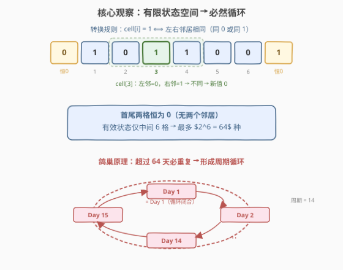
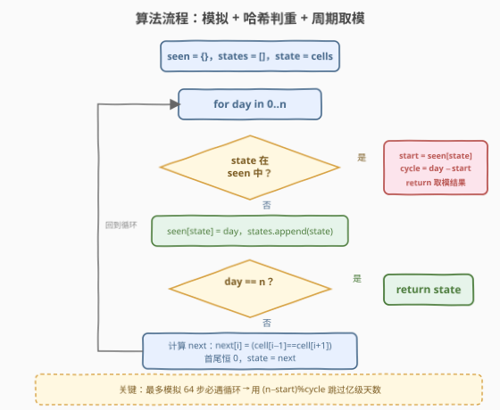
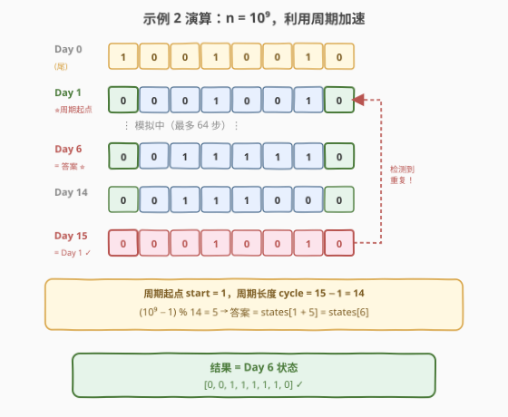

# N 天后的牢房

- **题目名称**：N 天后的牢房
- **链接**：[957. N 天后的牢房](https://leetcode.cn/problems/prison-cells-after-n-days/)
- **难度**：中等
- **标签**：数组、哈希表、位运算、周期检测

## 1. 题目概述

监狱中 `8` 间牢房排成一排，每间牢房可能被占用（`1`）或空置（`0`）。每天，牢房按以下规则变更：

> 如果一间牢房的两个相邻房间都被占用或都为空，则该牢房被占用（`1`）；否则空置（`0`）。

注意：**首尾两格**（下标 `0` 和 `7`）不存在两个相邻房间，因此**每天恒变为 `0`**。

**示例 1**：

```text
输入：cells = [0,1,0,1,1,0,0,1], n = 7
输出：[0,0,1,1,0,0,0,0]
解释：
Day 0: [0, 1, 0, 1, 1, 0, 0, 1]
Day 1: [0, 1, 1, 0, 0, 0, 0, 0]
Day 2: [0, 0, 0, 0, 1, 1, 1, 0]
Day 3: [0, 1, 1, 0, 0, 1, 0, 0]
Day 4: [0, 0, 0, 0, 0, 1, 0, 0]
Day 5: [0, 1, 1, 1, 0, 1, 0, 0]
Day 6: [0, 0, 1, 0, 1, 1, 0, 0]
Day 7: [0, 0, 1, 1, 0, 0, 0, 0]
```

**示例 2**：

```text
输入：cells = [1,0,0,1,0,0,1,0], n = 1000000000
输出：[0,0,1,1,1,1,1,0]
```

**约束条件**：

- `cells.length == 8`
- `cells[i]` 为 `0` 或 `1`
- `1 <= n <= 10^9`

> 💡 本题的标志特征是 **$n$ 高达 $10^9$**——直接逐天模拟必然超时。突破口在于「8 格 + 首尾恒 0」将状态空间压缩到极小，**有限状态 + 确定性转移 = 必然循环**。这是「大步数模拟」类问题的通用套路：找周期、取模跳过。

---

## 2. 解题思路

### 2.1 暴力思路：逐天模拟

从 Day 0 开始，每天根据规则逐格计算新状态，重复 $n$ 次。时间 $O(8n) = O(n)$，当 $n = 10^9$ 时直接超时。

> ⚠️ 暴力的瓶颈是「**做了大量重复计算**」——由于状态空间极小，绝大多数天数都在绕圈子。我们需要识别出这个圈子，然后一步跳过。

### 2.2 核心观察：有限状态空间 → 必然循环



三个关键事实串成一条推理链：

1. **首尾恒 0**：下标 `0` 和 `7` 从 Day 1 起永远为 `0`——它们没有两个邻居，规则不适用。
2. **有效状态仅中间 6 格**：去掉恒 0 的首尾后，只有下标 `1`–`6` 的 6 个格子会变化，共 $2^6 = 64$ 种可能状态。
3. **鸽巢原理**：转移函数是**确定性**的（给定当前状态，下一状态唯一）。从 Day 1 起，序列在 64 种状态中流转，**第 65 天必然与之前某天重复**。一旦重复，后续序列就进入**周期循环**。

> 💡 **为什么确定性 + 有限状态必然循环？** 确定性转移意味着「同一状态的后继唯一」。如果状态 $S_a$ 在第 $a$ 天和第 $b$ 天（$a < b$）出现，那么第 $a+1$ 天和第 $b+1$ 天的状态也必然相同——于是从 $a$ 到 $b-1$ 这段就是循环体，长度为 $b - a$。这就是 [202 快乐数](https://leetcode.cn/problems/happy-number/) 中 Floyd 判圈思想的同源应用，只是这里用哈希表直接记录首次出现日。

**周期加速**：一旦检测到状态 $S$ 在第 `day` 天重复（上次出现在第 `start` 天），周期长度 `cycle = day - start`。对于任意 $n \geq \text{start}$，答案就是：

$$\text{states}[\text{start} + (n - \text{start}) \bmod \text{cycle}]$$

### 2.3 算法流程图



1. **初始化**：`seen = {}`（状态 → 首次出现日），`states = []`（按序记录所有状态）。
2. **逐天循环** `day = 0, 1, 2, …, n`：
   - **判重**：若 `state` 已在 `seen` 中 → 找到周期，`start = seen[state]`，`cycle = day - start`，返回 `states[start + (n - start) % cycle]`。
   - **记录**：`seen[state] = day`，`states.append(state)`。
   - **终止检查**：若 `day == n`（未触发周期即到达终点），直接返回 `state`。
   - **转移**：计算 `next[i] = 1 if state[i-1] == state[i+1] else 0`（首尾恒 0），更新 `state = next`。

> ⚠️ 注意**先判重再记录**的顺序：每次循环开头检查的是「当前 state 是否曾出现」，确保 `start` 指向周期内第一个状态。若先记录再判重，会漏掉「自身命中」的退化情况。

### 2.4 示例演算

以示例 2 `cells = [1,0,0,1,0,0,1,0], n = 10^9` 为例：



关键步骤：

| 天 | 状态 | 事件 |
|----|------|------|
| Day 0 | `[1,0,0,1,0,0,1,0]` | 初始状态（尾，不参与周期） |
| Day 1 | `[0,0,0,1,0,0,1,0]` | 进入有效状态空间，记录 `seen[state] = 1` |
| Day 2–6 | `…` | 逐天模拟并记录 |
| Day 6 | `[0,0,1,1,1,1,1,0]` | ⭐ 这恰好是最终答案 |
| Day 14 | `[0,0,1,1,1,0,0,0]` | 周期最后一个状态 |
| Day 15 | `[0,0,0,1,0,0,1,0]` | **与 Day 1 相同！** 检测到重复 |

**计算**：`start = 1`，`cycle = 15 - 1 = 14`。

$$\text{目标天} = 1 + (10^9 - 1) \bmod 14 = 1 + 5 = 6$$

返回 `states[6] = [0,0,1,1,1,1,1,0]` ✓。

> 💡 注意 **Day 0 不参与周期**——初始状态可能首尾非 0（如本例 `cell[0]=1`），而 Day 1 起首尾恒 0，状态空间才收缩到 64 种。所以周期通常从 Day 1 开始，Day 0 只是「尾巴」。

---

## 3. 参考代码

### C++

```cpp
// N天后的牢房.cpp —— 模拟 + 哈希判重 + 周期取模
// 编译: g++ -O2 -std=c++17 N天后的牢房.cpp -o prison
#include <vector>
#include <map>
using namespace std;

class Solution {
  public:
    vector<int> prisonAfterNDays(vector<int>& cells, int n) {
        map<vector<int>, int> seen;        // 状态 → 首次出现日
        vector<vector<int>> states;        // 按序记录所有状态

        for (int day = 0; day <= n; ++day) {
            auto it = seen.find(cells);
            if (it != seen.end()) {        // 周期检测命中
                int start = it->second;
                int cycle = day - start;
                return states[start + (n - start) % cycle];
            }
            seen[cells] = day;
            states.push_back(cells);

            if (day == n) return cells;    // 未触发周期即到达终点

            vector<int> next(8, 0);        // 首尾恒 0
            for (int i = 1; i < 7; ++i)
                next[i] = (cells[i - 1] == cells[i + 1]) ? 1 : 0;
            cells = next;
        }
        return cells;                      // 不可达
    }
};
```

### Python

```python
from typing import List


class Solution:
    def prisonAfterNDays(self, cells: List[int], n: int) -> List[int]:
        seen = {}                           # 状态元组 → 首次出现日
        states = []                         # 按序记录所有状态
        state = tuple(cells)

        for day in range(n + 1):            # day 0 = 初始, day n = 答案
            if state in seen:               # 周期检测命中
                start = seen[state]
                cycle = day - start
                return list(states[start + (n - start) % cycle])

            seen[state] = day
            states.append(state)

            if day == n:                    # 未触发周期即到达终点
                return list(state)

            nxt = [0] * 8                   # 首尾恒 0
            for i in range(1, 7):
                nxt[i] = 1 if state[i - 1] == state[i + 1] else 0
            state = tuple(nxt)

        return list(state)                  # 不可达
```

> 💡 Python 用 `tuple(cells)` 作为哈希键——`list` 不可哈希，需转为不可变类型。C++ 中 `vector<int>` 可直接作为 `map` 的键（字典序比较），但开销略高于 `unordered_map` + 自定义哈希；本题状态最多 64 种，`map` 足够。

---

## 4. 复杂度分析

| 维度 | 复杂度 | 说明 |
|------|--------|------|
| 时间复杂度 | $O(\min(n, 2^6)) = O(1)$ | 最多模拟 65 天（64 种状态 + 1 次重复检测），之后直接取模返回。与 $n$ 无关 |
| 空间复杂度 | $O(2^6) = O(1)$ | `seen` 与 `states` 最多存 65 条记录，每条 8 个元素 |

> ⚠️ 严格说每次状态转移扫描 6 格（$O(6)$），总时间 $O(65 \times 6) = O(390)$，是常数。对 $n = 10^9$ 的问题，这是从 $O(n)$ 到 $O(1)$ 的质变。

---

## 5. 扩展：位运算编码优化

中间 6 格只有 0/1，可以压缩为一个 6 位整数（`0`–`63`），用 `int` 作为哈希键，避免 `vector` / `tuple` 的开销：

```python
class Solution:
    def prisonAfterNDays(self, cells: List[int], n: int) -> List[int]:
        seen = {}
        states = []

        def encode(c):
            mask = 0
            for i in range(1, 7):
                mask = (mask << 1) | c[i]
            return mask

        def decode(mask):
            c = [0] * 8
            for i in range(6, 0, -1):
                c[i] = mask & 1
                mask >>= 1
            return c

        code = encode(cells)
        for day in range(n + 1):
            if code in seen:
                start = seen[code]
                cycle = day - start
                return decode(states[start + (n - start) % cycle])
            seen[code] = day
            states.append(code)
            if day == n:
                return decode(code)
            # 位运算转移：next[i] = ~(cell[i-1] ^ cell[i+1])
            cur = states[-1]
            left = (cur << 1) & 0x3F       # 左邻居移到对应位
            right = cur >> 1
            code = (~(left ^ right)) & 0x3F  # 相同→0(异或为0取反为1)
        return decode(code)
```

> 💡 位运算技巧：`cell[i-1] == cell[i+1]` 等价于 `cell[i-1] ^ cell[i+1] == 0`，取反后该位为 1。`left = cur << 1`（带掩码截断）、`right = cur >> 1` 将左右邻居对齐到当前位置，一次异或 + 取反完成全部 6 格转移。性能提升约 3–5 倍，但面试中**可读性优先**，数组版为主解，位运算版作为扩展提及即可。

---

## 6. 面试要点

1. **为什么 $n = 10^9$ 不能直接模拟？**

   - 每天转移 $O(8)$，总时间 $O(n) = O(10^9)$，远超时限。需要利用状态空间的有限性找到周期，用取模将 $O(n)$ 降为 $O(1)$。

2. **为什么状态空间只有 64 种？**

   - 首尾两格（下标 0 和 7）从 Day 1 起恒为 0（没有两个邻居，规则不适用）。有效变化的只有中间 6 格，$2^6 = 64$ 种。鸽巢原理保证第 65 天必重复。

3. **Day 0 为什么可能不参与周期？**

   - 初始状态首尾可能非 0（如示例 2 的 `cell[0]=1`），而 Day 1 起首尾恒 0。所以 Day 0 是「尾巴」，周期通常从 Day 1 开始。算法不依赖这个假设——哈希判重会自动找到正确的 `start`。

4. **取模公式 `start + (n - start) % cycle` 的含义？**

   - `start` 是周期起点，`cycle` 是周期长度。对于 $n \geq \text{start}$，第 $n$ 天的状态等于周期内第 $(n - \text{start}) \bmod \text{cycle}$ 个位置，加上 `start` 的偏移即得到在 `states` 数组中的下标。

5. **和 Floyd 判圈（快慢指针）有什么区别？**

   - [202 快乐数](https://leetcode.cn/problems/happy-number/) 用快慢指针检测隐式链表的环，只需 $O(1)$ 空间但无法直接定位环的起点。本题状态可直接哈希（`tuple` / `vector` 作键），用哈希表一步定位 `start` 和 `cycle`，代码更简洁。若状态不可哈希或空间受限，可改用 Floyd。

> 💡 **一句话总结**：957 的核心是把「$10^9$ 天模拟」转化为「**有限状态周期检测 + 取模**」。识别出首尾恒 0 → 64 种状态 → 鸽巢循环，用哈希表记录首次出现日，检测到重复即用 `(n - start) % cycle` 跳过亿级天数。这是「大步数 + 有限状态」问题的通用模板。

---

## 7. 同类练习题

- [202. 快乐数](https://leetcode.cn/problems/happy-number/)（[题解](../0201-0300/202_快乐数.md)）：隐式链表判环，Floyd 快慢指针 $O(1)$ 空间，与本题哈希判重同属「周期检测」家族
- [287. 寻找重复数](https://leetcode.cn/problems/find-the-duplicate-number/)：Floyd 判圈找隐式链表中的重复值，同源思想不同场景
- [166. 分数到小数](https://leetcode.cn/problems/fraction-to-recurring-decimal/)（[题解](../0101-0200/166_分数到小数.md)）：长除法 + 哈希检测循环节，与本题「有限余数 → 必然循环」同构
- [180. 连续出现的数字](https://leetcode.cn/problems/consecutive-numbers/)：状态连续性判定，对比本题的离散状态周期
