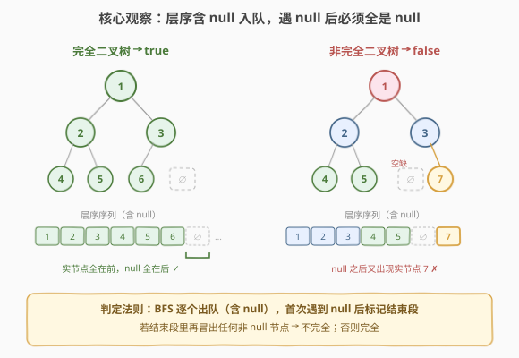
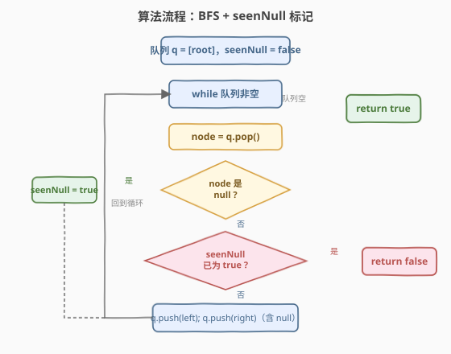

# LeetCode 二叉树的完全性检验 题解

## 1. 题目概述

- **标题 / 题号**：二叉树的完全性检验（#958，medium）
- **链接**：https://leetcode.cn/problems/check-completeness-of-a-binary-tree/
- **难度**：中等
- **标签**：树、二叉树、广度优先搜索（BFS）

**题意**：给定二叉树的根节点 `root`，判断它是否是一棵**完全二叉树**。

> **完全二叉树**的定义：除最后一层外，每一层都被完全填满；并且最后一层的所有节点都**尽可能靠左**（中间不能有空缺）。

**示例 1**：

```text
输入：root = [1,2,3,4,5,6]
输出：true
解释：最后一层节点 [4,5,6] 从左到右连续排满，无空缺。
        1
       / \
      2   3
     / \  /
    4  5 6
```

**示例 2**：

```text
输入：root = [1,2,3,4,5,null,7]
输出：false
解释：节点 7 不是「尽可能靠左」——它左边还有一个 null 空位，因此不完全。
        1
       / \
      2   3
     / \   \
    4   5   7
```

**约束**：

- 树中节点数目在范围 `[1, 100]` 内
- `1 <= Node.val <= 1000`

> 💡 本题是 [Day 3 层序遍历](../0101-0200/102_二叉树的层序遍历.md) 模板的直接应用。完全性的本质是「**层序序列里所有实节点必须连续排在所有 `null` 之前**」——一旦出现 `null`，后面就不能再有任何真实节点。掌握这个判定，你就把 BFS `while + for(size)` 骨架从「遍历」升级到了「**结构校验**」。

## 2. 解题思路

### 2.1 暴力思路：按层统计 + 末层左对齐校验

逐层 BFS，对每一层记录非空节点个数与 `null` 分布，最后单独处理末层是否「靠左」。这个思路**规则繁琐**：要区分「满层」与「末层」、要判断末层中间是否插了 `null`、还要处理末层右侧的 `null` 是否合法。边界多、易写错，面试中难一次写对。

> ⚠️ 「按层分别判」看似贴合定义，实则把问题复杂化了——完全性是一个**全局性质**，不需要分层校验。我们需要一个能「**一眼看出**是否所有实节点都排在 null 之前」的统一视角。

### 2.2 核心观察：层序含 null 入队，遇 null 后必须全是 null



关键洞察：把 `null` 孩子**也当作普通元素入队**做一次完整的层序遍历。那么一棵树是完全二叉树，当且仅当这条「含 `null` 的层序序列」满足：

> **所有真实节点都排在所有 `null` 之前**——即首次遇到 `null` 后，队列里剩下的元素必须**全部是 `null`**。

- **完全树** `[1,2,3,4,5,6]`：序列 `1,2,3,4,5,6,null,null,…`，实节点全在前，`null` 全在后 → `true`。
- **非完全树** `[1,2,3,4,5,null,7]`：序列 `1,2,3,4,5,null,7,…`，`null` 之后又冒出实节点 `7` → `false`。

> 💡 **为什么这样等价？** 完全二叉树的层序序列本质上是「按满二叉树位置从左到右、从上到下填空」。真实节点必须**占据最靠前的一段连续位置**，`null` 只能出现在末尾。只要序列中出现了 `null` 又出现非 `null`，就说明中间有「空位被后面的实节点跳过」——正是非完全的标志。这个判定把「靠左」「满层」等零散规则统一成一句「**实节点连续在前**」。

### 2.3 算法流程图



用一个布尔标记 `seenNull` 记录「是否已经进入 `null` 段」：

1. **初始化**：队列 `q = [root]`，`seenNull = false`。
2. **while 队列非空**：
   - `node = q.pop()`（队头出队）
   - **若 `node == null`**：置 `seenNull = true`，继续下一次循环。
   - **若 `node != null`**：检查 `seenNull`——若已为 `true`，说明 `null` 段后又出现实节点，**直接 `return false`**。
   - 否则（`seenNull` 仍 `false`）：把 `node.left`、`node.right` **无论是否为 `null` 都入队**。
3. 队列空仍未返回 → `return true`。

> 💡 注意与普通层序遍历的两个区别：① **`null` 孩子也入队**（作为标记，不是跳过）；② **不再按层 `for(size)` 切分**——本题只关心出队顺序，逐个 pop 即可，无需锁定层边界。

### 2.4 示例演算

以示例 2 `root = [1,2,3,4,5,null,7]` 为例，逐出队过程如下：

![示例演算：root = [1,2,3,4,5,null,7] → false](../images/completeness_example_walkthrough.svg)

| 步 | 出队 node | seenNull | 入队（含 null） | 出队后队列 |
|----|-----------|----------|-----------------|-----------|
| 1 | 1 | false | 2, 3 | [2, 3] |
| 2 | 2 | false | 4, 5 | [3, 4, 5] |
| 3 | 3 | false | ∅, 7 | [4, 5, ∅, 7] |
| 4 | 4 | false | ∅, ∅ | [5, ∅, 7, ∅, ∅] |
| 5 | 5 | false | ∅, ∅ | [∅, 7, ∅, ∅, ∅, ∅] |
| 6 | **∅** | **true ⭐** | — | [7, ∅, ∅, ∅, ∅] |
| 7 | **7** | true | — | **return false ✗** |

第 6 步首次出队 `null`，`seenNull` 翻转为 `true`；第 7 步出队的 `7` 是非 `null`，触发 `seenNull == true` 分支 → `return false`。

> 💡 对比完全树 `[1,2,3,4,5,6]`：第 6 步首次出队 `null` 后，队列里**只剩 `null`**，循环正常走完 → `return true`。差别全在「`null` 之后还有没有实节点」。

## 3. 参考代码

### C++

```cpp
// 二叉树的完全性检验.cpp —— BFS + seenNull 标记
// 编译: g++ -O2 -std=c++17 二叉树的完全性检验.cpp -o iscomplete
#include <queue>
using namespace std;

struct TreeNode {
    int val;
    TreeNode* left;
    TreeNode* right;
    TreeNode() : val(0), left(nullptr), right(nullptr) {
    }
    TreeNode(int x) : val(x), left(nullptr), right(nullptr) {
    }
    TreeNode(int x, TreeNode* l, TreeNode* r) : val(x), left(l), right(r) {
    }
};

class Solution {
  public:
    bool isCompleteTree(TreeNode* root) {
        queue<TreeNode*> q;
        q.push(root);
        bool seenNull = false;          // 是否已进入 null 段
        while (!q.empty()) {
            TreeNode* node = q.front();
            q.pop();
            if (node == nullptr) {
                seenNull = true;        // 首次遇到 null，标记结束段开始
                continue;
            }
            if (seenNull) {             // null 段后又出现实节点 → 不完全
                return false;
            }
            q.push(node->left);         // 无论是否为 null 都入队
            q.push(node->right);
        }
        return true;                    // 全程未违规，完全
    }
};
```

### Python

```python
from collections import deque
from typing import Optional


class Solution:
    def isCompleteTree(self, root: Optional[TreeNode]) -> bool:
        q = deque([root])
        seen_null = False                # 是否已进入 null 段
        while q:
            node = q.popleft()
            if node is None:
                seen_null = True         # 首次遇到 null，标记结束段开始
                continue
            if seen_null:                # null 段后又出现实节点 → 不完全
                return False
            q.append(node.left)          # 无论是否为 None 都入队
            q.append(node.right)
        return True                      # 全程未违规，完全
```

> 💡 Python 用 `is None` 判空而非 `not node`——虽然本题 `val >= 1` 两者等价，但 `is None` 语义更精确，避免「节点对象本身为 falsy」的潜在歧义。

## 4. 复杂度分析

| 维度 | 复杂度 | 说明 |
|------|--------|------|
| 时间复杂度 | `O(n)` | 每个真实节点及其 `null` 孩子各入队/出队一次，总操作数与节点数同阶 |
| 空间复杂度 | `O(n)` | 队列最坏存一层节点 + 它们的 `null` 孩子；满二叉树最后一层约 `n/2` 个节点 |

> ⚠️ 因 `null` 孩子也入队，队列元素数会比普通层序遍历略多，但**量级仍是 `O(n)`**——最后一层每个真实节点最多贡献 2 个 `null` 入队，总数不超过 `2n`。

## 5. 扩展：编号法判定完全性

本题还有另一种与 [662. 二叉树最大宽度](../0601-0700/662_二叉树最大宽度.md) 同源的解法——**满二叉树编号**。给每个节点一个位置编号（根为 `1`，左孩子 `2i`，右孩子 `2i+1`，1-indexed），BFS 时**只对真实节点编号并计数**。一棵 `n` 个节点的树是完全二叉树，当且仅当**所有节点的编号恰好是 `1, 2, …, n`**（即最大编号等于节点数、无空洞）：

```python
class Solution:
    def isCompleteTree(self, root: Optional[TreeNode]) -> bool:
        q = deque([(root, 1)])
        expect = 1                       # 期望编号从 1 开始连续递增
        while q:
            node, idx = q.popleft()
            if idx != expect:            # 编号出现空洞 → 不完全
                return False
            expect += 1
            if node.left:
                q.append((node.left, 2 * idx))
            if node.right:
                q.append((node.right, 2 * idx + 1))
        return True
```

> 💡 两种解法同构：`seenNull` 法判「实节点是否连续在前」，编号法判「编号是否连续无空洞」——前者从「序列顺序」切入，后者从「位置编号」切入，本质都在校验「**没有空位被后面的节点跳过**」。面试中 `seenNull` 法代码更短、更直观，作为主解；编号法可作为「与 662 联系」的扩展提一句。

## 6. 面试要点

1. **为什么把 `null` 孩子也入队？**

   - 普通层序遍历跳过 `null`，丢失了「位置信息」——无法判断末层是否靠左。
   - 把 `null` 当标记入队，层序序列就还原了「按满二叉树位置填空」的顺序。于是完全性化为一句判定：**实节点全在 `null` 之前**。

2. **`seenNull` 标记的作用是什么？**

   - 它划分出「实节点段」和「`null` 段」两个阶段。一旦翻为 `true`，就进入「只允许 `null`」的结束段；若此后又出队到非 `null`，即判定不完全。
   - 等价于在序列里找「第一个 `null`」，然后检查其后是否还有实节点。

3. **这题和普通层序遍历的 `for(size)` 分层有何不同？**

   - 普通层序用 `size` 快照锁定「当前层」，按层收集结果。
   - 本题**不需要分层**——只关心「出队顺序里实节点是否连续在前」，逐个 pop 即可，`for(size)` 反而是多余的结构。

4. **编号法和 `seenNull` 法哪个更好？**

   - 两者时间都是 `O(n)`。`seenNull` 法代码更短、不依赖编号公式，适合作为主解快速写出；编号法与 [662 二叉树最大宽度](../0601-0700/662_二叉树最大宽度.md)、[222 完全二叉树的节点个数](https://leetcode.cn/problems/count-complete-tree-nodes/) 同属「编号体系」，便于面试中串联讲解。C++ 编号法用 `int` 在 `n <= 100` 时无溢出风险，但深树需注意改 `long long`。

5. **完全二叉树和满二叉树、平衡二叉树的区别？**

   - **满二叉树**：每层都填满，节点数恰好 $2^{h}-1$（`h` 为高度）。
   - **完全二叉树**：除末层外全满，末层靠左连续——满二叉树是其特例。
   - **平衡二叉树**：任意节点左右子树高度差 $\le 1$，与「是否靠左」无关——平衡树末层可以不靠左，仍算平衡。
   - 本题判的是「完全」，不是「满」也不是「平衡」。

> 💡 **一句话总结**：958 的核心是把「完全性」翻译成「**含 `null` 的层序序列里实节点连续在前**」。用一个 `seenNull` 标记 + 普通 BFS 队列就能 `O(n)` 一趟判定，是层序遍历从「遍历」走向「结构校验」的典型示例。

## 同类练习题

| # | 题目 | 与本题的关联 |
|---|------|-------------|
| 102 | [二叉树的层序遍历](https://leetcode.cn/problems/binary-tree-level-order-traversal/)（[题解](../0101-0200/102_二叉树的层序遍历.md)） | BFS `while + for(size)` 模板的母题，本题骨架来源 |
| 662 | [二叉树最大宽度](https://leetcode.cn/problems/maximum-width-of-binary-tree/)（[题解](../0601-0700/662_二叉树最大宽度.md)） | 满二叉树编号体系，与本题编号法同源 |
| 222 | [完全二叉树的节点个数](https://leetcode.cn/problems/count-complete-tree-nodes/) | 利用完全性 + 编号性质二分求节点数，同属「编号体系」应用 |
| 199 | [二叉树的右视图](https://leetcode.cn/problems/binary-tree-right-side-view/)（[题解](../0101-0200/199_二叉树的右视图.md)） | 复用 BFS 每层取最右节点，模板同源 |
