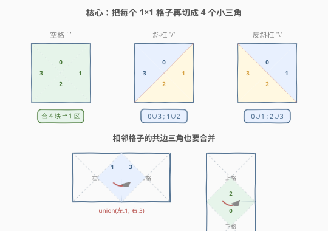
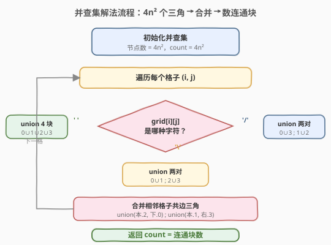

# 由斜杠划分区域

- **题目名称**：由斜杠划分区域
- **链接**：[959. 由斜杠划分区域](https://leetcode.cn/problems/regions-cut-by-slashes/)
- **难度**：中等
- **标签**：并查集、图、深度优先搜索

## 1. 题目概述

在由 `1 x 1` 方格组成的 `n x n` 网格 `grid` 中，每个 `1 x 1` 方块由 `' '`、`'/'` 或 `'\'` 构成。这些字符会将方块划分为一些**共边的区域**。

给定网格 `grid` 表示为一个字符串数组，返回**区域的数量**。

> 注意：反斜杠字符是转义的，因此 `'\'` 用 `'\\'` 表示。

**示例 1**：

```text
输入：grid = [" /","/ "]
输出：2
解释：
  / 
/   
两条斜杠把 2×2 网格分成上下两块不相邻的区域。
```

**示例 2**：

```text
输入：grid = [" /","  "]
输出：1
解释：只有左上角有一条 '/'，其余为空格，整片区域仍连通为 1 块。
```

**示例 3**：

```text
输入：grid = ["/\\","\\/"]
输出：5
解释："/\\" 表示 /\，"\\/" 表示 \/。四条斜杠在中心交叉，把网格切成 5 块。
/\
\/
```

**约束条件**：

- `n == grid.length == grid[i].length`
- `1 <= n <= 30`
- `grid[i][j]` 是 `' '`、`'\'`、或 `'/'`

> 💡 本题是 [Day 547 省份数量](../0501-0600/547_省份数量.md) 并查集模板的进阶应用。难点不在并查集本身，而在于**如何把「斜杠划分区域」翻译成「图上的连通性问题」**——一旦找到合适的节点建模，剩下的就是套模板数连通块。

---

## 2. 解题思路

### 2.1 暴力思路：像素放大 + DFS 染色

把每个 `1 x 1` 格子放大成 `3 x 3`（或更大）的像素网格，将 `' '`、`'/'`、`'\'` 在像素网格里画成墙（`1`）或通路（`0`），然后对通路做 DFS/BFS 数连通块。这能过，`n <= 30` 放大 3 倍后是 `90 x 90 = 8100` 像素，规模可控。

> ⚠️ 但放大倍数要谨慎：太小（如 2 倍）会让斜杠的像素化产生「假连通」，必须至少 3 倍才能让 `/` 和 `\` 不互相串扰。这种「凑倍数」的 trick 不优雅，且本质上是回避了问题的结构。

### 2.2 核心观察：每个格子切成 4 个三角，并查集合并



关键洞察：**把每个 `1 x 1` 格子沿两条对角线切成 4 个小三角**，编号为：

- `0` = 上（top）
- `1` = 右（right）
- `2` = 下（bottom）
- `3` = 左（left）

于是 `n x n` 网格共有 `4n²` 个三角，每个三角是一个并查集节点。斜杠和空格的作用就是决定**格子内部哪几个三角互相连通**：

| 字符 | 格内合并 | 含义 |
|------|----------|------|
| `' '`（空格） | `0∪1∪2∪3` | 没有斜杠，4 个三角全连通，整格是一个区域 |
| `'/'` | `0∪3`；`1∪2` | 斜杠从左下到右上，隔开「上+左」与「右+下」 |
| `'\'` | `0∪1`；`2∪3` | 反斜杠从左上到右下，隔开「上+右」与「下+左」 |

此外，**相邻格子的共边三角天然连通**（它们共享一条边，中间没有斜杠阻挡）：

- 当前格的**下三角(2)** 与正下方格的**上三角(0)** 合并：`union(get(i,j,2), get(i+1,j,0))`
- 当前格的**右三角(1)** 与正右方格的**左三角(3)** 合并：`union(get(i,j,1), get(i,j+1,3))`

> 💡 **为什么切 4 块就够了？** 一个格子最多被一条斜杠一分为二。斜杠只有两种朝向（`/` 和 `\`），加上空格（不切），共 3 种状态。4 个三角恰好能用「两两合并」表达这 3 种状态：空格全合、`/` 合对角对 `(0,3)+(1,2)`、`\` 合另一对对角对 `(0,1)+(2,3)`。少于 4 块无法区分两种斜杠朝向，多于 4 块则冗余。

> 💡 **为什么不直接把格子当节点？** 因为一个格子里可能同时存在两个区域（有斜杠时），单节点无法表达「格内分裂」。切成 4 个三角后，每个三角只属于一个区域，节点粒度刚好。

### 2.3 算法流程图



具体步骤：

1. **初始化**并查集，节点数 `4n²`，`count = 4n²`。
2. **遍历每个格子 `(i, j)`**，根据 `grid[i][j]` 做格内合并（见上表），每次成功 `union` 让 `count--`。
3. **合并相邻格子的共边三角**：下↔上、右↔左。
4. 返回 `count`。

节点编号公式：`get(i, j, k) = (i * n + j) * 4 + k`，其中 `k ∈ {0,1,2,3}`。

### 2.4 示例演算

![示例演算：grid = [" /","/ "] → 2 个区域](../images/regions_slashes_example_walkthrough.svg)

以 `grid = [" /","/ "]` 为例，`n = 2`，共 `16` 个三角：

| 步骤 | 操作 | count |
|------|------|-------|
| 初始 | `4n² = 16` 个三角，各自独立 | 16 |
| `(0,0) = ' '` | 格内合 4 块：`union(0,1), union(0,2), union(0,3)` | 13 |
| `(0,1) = '/'` | 格内合两对：`union(4,7), union(5,6)` | 11 |
| `(1,0) = '/'` | 格内合两对：`union(8,11), union(9,10)` | 9 |
| `(1,1) = ' '` | 格内合 4 块：`union(12,13), union(12,14), union(12,15)` | 6 |
| 相邻合并 | `union(1,7)`、`union(2,8)`、`union(6,12)`、`union(9,15)` | **2** |

最终 `count = 2`：区域 A（蓝色，左上片）与区域 B（绿色，右下片），两条斜杠不交叉，恰好把网格一分为二。

---

## 3. 参考代码

### C++（并查集 + 路径压缩 + 按秩合并）

```cpp
// 由斜杠划分区域.cpp —— 并查集，每个格子切 4 个三角
// 编译: g++ -O2 -std=c++17 由斜杠划分区域.cpp -o regions
#include <vector>
#include <string>
using namespace std;

class UnionFind {
  public:
    vector<int> parent;
    vector<int> rank_;
    int count;

    UnionFind(int n) : count(n) {
        parent.resize(n);
        rank_.assign(n, 0);
        for (int i = 0; i < n; i++) parent[i] = i;
    }

    int find(int x) {
        if (parent[x] != x) parent[x] = find(parent[x]); // 路径压缩
        return parent[x];
    }

    void unite(int x, int y) {
        int rx = find(x), ry = find(y);
        if (rx == ry) return;
        if (rank_[rx] < rank_[ry]) parent[rx] = ry;       // 按秩合并
        else if (rank_[rx] > rank_[ry]) parent[ry] = rx;
        else { parent[ry] = rx; rank_[rx]++; }
        count--;
    }
};

class Solution {
  public:
    int regionsBySlashes(vector<string>& grid) {
        int n = grid.size();
        UnionFind uf(4 * n * n);          // 4n² 个三角节点

        for (int i = 0; i < n; i++) {
            for (int j = 0; j < n; j++) {
                int base = (i * n + j) * 4;   // 该格子 4 个三角的起始编号
                char c = grid[i][j];

                // 格内合并
                if (c == ' ') {               // 空格：4 块全连通
                    uf.unite(base + 0, base + 1);
                    uf.unite(base + 0, base + 2);
                    uf.unite(base + 0, base + 3);
                } else if (c == '/') {        // '/'：0∪3, 1∪2
                    uf.unite(base + 0, base + 3);
                    uf.unite(base + 1, base + 2);
                } else {                      // '\'：0∪1, 2∪3
                    uf.unite(base + 0, base + 1);
                    uf.unite(base + 2, base + 3);
                }

                // 相邻格子合并：下 ↔ 上
                if (i + 1 < n) {
                    int downBase = ((i + 1) * n + j) * 4;
                    uf.unite(base + 2, downBase + 0);    // 本.下 ↔ 下格.上
                }
                // 相邻格子合并：右 ↔ 左
                if (j + 1 < n) {
                    int rightBase = (i * n + (j + 1)) * 4;
                    uf.unite(base + 1, rightBase + 3);   // 本.右 ↔ 右格.左
                }
            }
        }
        return uf.count;
    }
};
```

### Python（并查集 + 路径压缩 + 按秩合并）

```python
class Solution:
    def regionsBySlashes(self, grid: List[str]) -> int:
        n = len(grid)
        parent = list(range(4 * n * n))
        rank_ = [0] * (4 * n * n)
        count = 4 * n * n

        def find(x):
            while parent[x] != x:
                parent[x] = parent[parent[x]]   # 隔代压缩
                x = parent[x]
            return x

        def union(x, y):
            nonlocal count
            rx, ry = find(x), find(y)
            if rx == ry:
                return
            if rank_[rx] < rank_[ry]:
                parent[rx] = ry
            elif rank_[rx] > rank_[ry]:
                parent[ry] = rx
            else:
                parent[ry] = rx
                rank_[rx] += 1
            count -= 1

        for i in range(n):
            for j in range(n):
                base = (i * n + j) * 4
                c = grid[i][j]

                if c == ' ':                    # 空格：4 块全连通
                    union(base + 0, base + 1)
                    union(base + 0, base + 2)
                    union(base + 0, base + 3)
                elif c == '/':                  # '/'：0∪3, 1∪2
                    union(base + 0, base + 3)
                    union(base + 1, base + 2)
                else:                           # '\'：0∪1, 2∪3
                    union(base + 0, base + 1)
                    union(base + 2, base + 3)

                if i + 1 < n:                   # 本.下 ↔ 下格.上
                    union(base + 2, ((i + 1) * n + j) * 4 + 0)
                if j + 1 < n:                   # 本.右 ↔ 右格.左
                    union(base + 1, (i * n + (j + 1)) * 4 + 3)

        return count
```

### 扩展写法：像素放大 + DFS

```python
class Solution:
    def regionsBySlashes(self, grid: List[str]) -> int:
        n = len(grid)
        # 放大 3 倍：斜杠画成墙(1)，空格留通路(0)
        g = [[0] * (3 * n) for _ in range(3 * n)]
        for i in range(n):
            for j in range(n):
                if grid[i][j] == '/':
                    g[3 * i][3 * j + 2] = 1
                    g[3 * i + 1][3 * j + 1] = 1
                    g[3 * i + 2][3 * j] = 1
                elif grid[i][j] == '\\':
                    g[3 * i][3 * j] = 1
                    g[3 * i + 1][3 * j + 1] = 1
                    g[3 * i + 2][3 * j + 2] = 1

        def dfs(x, y):
            if x < 0 or x >= 3 * n or y < 0 or y >= 3 * n or g[x][y] != 0:
                return
            g[x][y] = 2                        # 标记已访问
            for dx, dy in ((1, 0), (-1, 0), (0, 1), (0, -1)):
                dfs(x + dx, y + dy)

        ans = 0
        for i in range(3 * n):
            for j in range(3 * n):
                if g[i][j] == 0:
                    dfs(i, j)
                    ans += 1
        return ans
```

> 💡 像素放大法直观但**放大倍数不能小于 3**：2 倍时 `/` 占据 `(0,1)` 和 `(1,0)`，`\` 占据 `(0,0)` 和 `(1,1)`，两条斜杠在同一个 2×2 块里的像素会互相接触产生假连通；3 倍时每条斜杠独占一条对角线像素，互不干扰。

---

## 4. 复杂度分析

| 维度 | 复杂度 | 说明 |
|------|--------|------|
| 时间复杂度 | $O(n^2 \alpha(n))$ | 遍历 $n^2$ 个格子，每格最多 5 次 `union/find`，均摊 $O(\alpha(n))$ |
| 空间复杂度 | $O(n^2)$ | `parent` 与 `rank` 数组各 $O(4n^2) = O(n^2)$ |

> 💡 像素放大法的时间空间均为 $O(9n^2) = O(n^2)$，与并查集同阶，但常数更大（9 倍像素 + DFS 栈）。$n \le 30$ 时两种方法都轻松通过，差异不显著；并查集法的优势在于**建模更精确**（不依赖凑倍数 trick）。

---

## 5. 扩展：为何切 4 块而不是 2 块或更多

一个自然的疑问：既然斜杠只把格子一分为二，为什么不直接用 2 个节点（左半/右半）？

- **2 块不够**：`/` 和 `\` 的分割线朝向不同，2 块节点无法区分「左上是左半还是右半」。需要至少 4 块才能用两对对角的组合表达两种朝向。
- **4 块刚好**：恰好覆盖一个格子的 4 条边方向（上/右/下/左），与相邻格子的共边合并天然对齐——当前格的「下」三角接下方格的「上」三角，语义清晰。
- **更多块冗余**：6 块或 8 块也能做，但合并规则更繁琐，且没有额外表达能力。

> 💡 这种「按方向切分」的建模思想在网格类并查集题中很常见——把每个格子的**出入方向**都设为节点，相邻格子的同方向边自然合并。本质上是把「格子的连通性」分解到「格子的边界」粒度。

---

## 6. 面试要点

1. **为什么要把每个格子切成 4 个三角？**

   - 一个格子最多被一条斜杠一分为二，但斜杠有两种朝向（`/` 和 `\`），需要 4 个三角才能用「两两合并」区分两种朝向。切 4 块后，每个三角只属于一个区域，节点粒度恰好表达「格内分裂」。

2. **`'/'` 和 `'\'` 的格内合并规则分别是什么？为什么？**

   - `'/'` 从左下到右上，隔开「上+左」与「右+下」，所以合并 `0∪3` 和 `1∪2`。
   - `'\'` 从左上到右下，隔开「上+右」与「下+左」，所以合并 `0∪1` 和 `2∪3`。
   - 记忆：斜杠把对角的两个三角推到一起，与斜杠同侧的三角连通。

3. **相邻格子怎么合并？为什么只合并下和右两个方向？**

   - 当前格的「下三角(2)」与下方格的「上三角(0)」共享一条横边；当前格的「右三角(1)」与右方格的「左三角(3)」共享一条竖边。只合下和右是为了**避免重复**——遍历每个格子时各负责一次，(i,j) 合 (i+1,j) 和 (i,j+1) 就覆盖了所有相邻对。

4. **并查集法和像素放大法哪个更好？**

   - 并查集法建模精确、常数小，是面试首选；像素放大法直观易懂、好解释，但放大倍数需 ≥ 3 否则产生假连通。两者复杂度同阶 $O(n^2)$，并查集法更显建模功底。

5. **如果不切 4 块，直接把格子当节点会怎样？**

   - 有斜杠的格子里存在两个区域，单节点无法表达「格内分裂」——只能记录「这个格子被切了」，却不知道哪边属于哪个区域，合并相邻格子时会错误连通。

> 💡 **一句话总结**：959 的核心是**把网格的「区域划分」翻译成「图连通块计数」**——每个格子切 4 个三角做节点，斜杠决定格内合并、共边决定格间合并，最后数并查集的连通块数即为答案。

---

## 7. 同类练习题

- [547. 省份数量](https://leetcode.cn/problems/number-of-provinces/)（[题解](../0501-0600/547_省份数量.md)）：并查集模板母题，本题的并查集骨架来源
- [684. 冗余连接](https://leetcode.cn/problems/redundant-connection/)：并查集判环，加边时两端已同根即为冗余边
- [200. 岛屿数量](https://leetcode.cn/problems/number-of-islands/)（[题解](../0201-0300/200_岛屿数量.md)）：DFS/BFS 求连通分量，可与本题像素放大法对照
- [765. 情侣牵手](https://leetcode.cn/problems/couples-holding-hands/)：并查集求交换次数，同属「图连通块 → 最少操作」范式
- [990. 等式方程的可满足性](https://leetcode.cn/problems/satisfiability-of-equality-equations/)：先 union 等式、再查不等式是否冲突，并查集建模进阶
