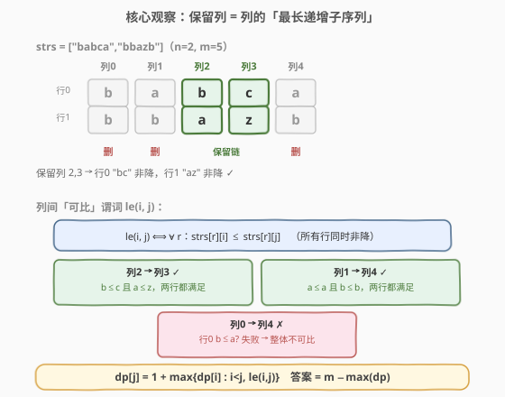
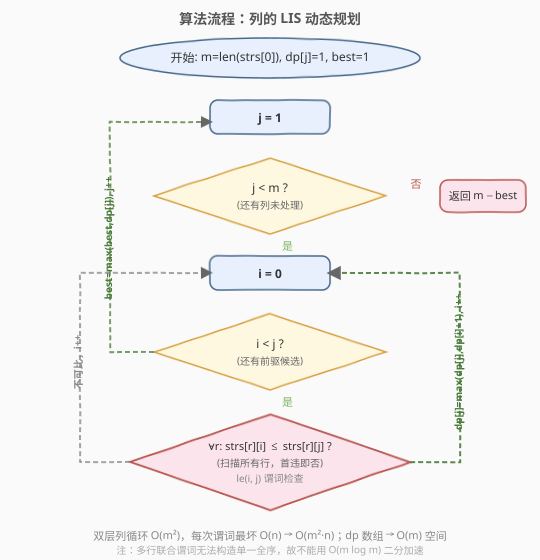

# LeetCode 删列造序 III 题解

## 1. 题目概述

- **标题 / 题号**：删列造序 III（#960，hard）
- **链接**：https://leetcode.cn/problems/delete-columns-to-make-sorted-iii/
- **难度**：困难
- **标签**：动态规划、最长递增子序列、数组、矩阵

**题意**：给定 `n` 个**等长小写字符串**组成的数组 `strs`，看作 `n × m` 的字符矩阵（`m` 为字符串长度）。

一次「删列」操作会**删除某一整列**（所有行的同一位置字符），剩余列保持原相对顺序拼成新字符串。

目标是：删除**尽量少**的列，使得**剩余每一行**自身从左到右**字典序非降**（即对任意行 $r$ 与保留列中的相邻列 $i < j$，都有 $\text{strs}[r][i] \le \text{strs}[r][j]$）。返回必须删除的列数。

> ⚠️ **注意方向**：960 要求的是「**行内**左到右非降」，即删除后每个字符串本身是非降字符串。这与 944（列内上到下非降）、955（行间字典序非降）方向都不同。注意题目只约束每行自身非降，**不要求行与行之间**字典序非降（示例 1 中删后 `strs[0]="bc" > strs[1]="az"` 也合法）。

**示例 1**：

```text
输入：strs = ["babca","bbazb"]
输出：3
解释：矩阵（2 行 × 5 列）
  b a b c a
  b b a z b
删除第 0、1、4 列，保留第 2、3 列：
  b c
  a z
两行各自非降（b≤c，a≤z）。注意 "bc" > "az"，但题目不要求行间有序。
```

**示例 2**：

```text
输入：strs = ["edcba"]
输出：4
解释：单行 "edcba" 严格递减，最多保留 1 列，删 4 列。
```

**示例 3**：

```text
输入：strs = ["ghi","def","abc"]
输出：0
解释：三行均已非降，无需删除。
```

**约束**：

- $n = \text{strs.length}$
- $1 \le n \le 100$
- $1 \le \text{strs[i].length} \le 100$
- $\text{strs[i]}$ 由小写英文字母组成
- 所有字符串长度相同

## 2. 解题思路

### 2.1 暴力思路

枚举所有列的子集（保留哪些列），共有 $2^m$ 种。对每个子集检查：保留列按原顺序排列后，每一行字符是否非降。取满足条件的最大保留列数 $k$，答案为 $m - k$。

$m \le 100$ 时 $2^{100}$ 完全不可行，必须利用**子结构**避免枚举所有子集。

### 2.2 核心观察：保留列 = 列的「最长递增子序列」



关键转换在于把「**删除最少列**」翻转为「**保留最多列**」：

$$\text{答案} = m - \max(\text{可保留列数})$$

而「可保留列」必须满足：**对每一行，按保留列的原序，字符非降**。这等价于在列序列 $0, 1, \dots, m-1$ 上选一个**最长的子序列** $i_1 < i_2 < \dots < i_k$，使得任意相邻保留列 $i_t, i_{t+1}$ 都满足——

$$\forall r,\ \text{strs}[r][i_t] \le \text{strs}[r][i_{t+1}]$$

这正是 **最长递增子序列（LIS）**，只不过「递增」的判定从「单点数值比较」升级为「**整列跨所有行同时非降**」的**复合谓词**。

> 💡 **为什么相邻满足就够了？** 子序列中若任意相邻保留列都满足「各行非降」，由 $\le$ 的传递性，任意两个保留列（不止相邻）也满足各行非降。因此只需在转移时校验相邻前驱，这是 LIS 的标准性质。

定义列间的「可比」谓词（列 $i$ 能接在列 $j$ 之前作为前驱）：

$$\text{le}(i, j) \iff \forall r \in [0, n),\ \text{strs}[r][i] \le \text{strs}[r][j]$$

于是状态定义为：

$$dp[j] = \text{以列 } j \text{ 结尾的最长可保留列子序列长度}$$

$$dp[j] = 1 + \max\{ dp[i] \mid 0 \le i < j,\ \text{le}(i, j) \}$$

**单列恒可保留**（$dp[j] \ge 1$），即不接任何前驱。最终：

$$\text{答案} = m - \max_{0 \le j < m} dp[j]$$

> 💡 **与 944/955 的本质区别**：944 列与列相互独立，逐列判定即可；955 列间通过「行间字典序」短路交互，需贪心；960 列间通过「行内字典序」交互——一列能否保留取决于它与**前一保留列**在所有行上的逐字符比较，是一个**全序的传递性**结构，恰好落入 LIS 的 DP 框架。

### 2.3 算法流程图



1. 令 $m = \text{strs[0].length}$，$n = \text{strs.length}$。
2. 初始化 `dp[j] = 1`（$0 \le j < m$），`best = 1`。
3. 对每个 $j$ 从 $1$ 到 $m-1$：
   - 对每个 $i$ 从 $0$ 到 $j-1$：
     - 检查 `le(i, j)`：扫描所有行 $r$，若存在 $\text{strs}[r][i] > \text{strs}[r][j]$ 则不满足，跳过；
     - 若满足：`dp[j] = max(dp[j], dp[i] + 1)`。
   - `best = max(best, dp[j])`。
4. 返回 `m - best`。

### 2.4 示例演算

![示例演算：strs = ["babca","bbazb"] 的 dp 表](../images/delcols3_walkthrough.svg)

以 `strs = ["babca","bbazb"]`（$n=2, m=5$）为例。各列字符（行 0、行 1）：

| 列 $j$ | 0 | 1 | 2 | 3 | 4 |
|--------|---|---|---|---|---|
| 行 0 | b | a | b | c | a |
| 行 1 | b | b | a | z | b |

`le(i, j)` 矩阵（✓ 表示列 $i$ 可作列 $j$ 前驱，即两行都满足 $\le$）：

| $i \backslash j$ | 1 | 2 | 3 | 4 |
|------------------|---|---|---|---|
| 0 | b≤a? ✗ | b≤b✓ b≤a✗ | b≤c✓ b≤z✓ | b≤a? ✗ |
| 1 | — | a≤b✓ b≤a✗ | a≤c✓ b≤z✓ | a≤a✓ b≤b✓ |
| 2 | — | — | b≤c✓ a≤z✓ | b≤a? ✗ |
| 3 | — | — | — | c≤a? ✗ |

逐列求 `dp`：

| 列 $j$ | 候选前驱 $i$（le 成立） | $dp[j]$ | best |
|--------|-------------------------|---------|------|
| 0 | （无，单列） | 1 | 1 |
| 1 | 无（列 0 不满足 b≤a） | 1 | 1 |
| 2 | 无（列 0、1 均因行 1 的 b≤a/a≤a 失败） | 1 | 1 |
| 3 | 0, 1, 2 均满足 → $\max(1,1,1)+1$ | 2 | 2 |
| 4 | 仅 1 满足（a≤a 且 b≤b）→ $dp[1]+1$ | 2 | 2 |

`best = 2`，答案 $= 5 - 2 = 3$（删第 0、1、4 列，保留第 2、3 列）。

> 💡 **第 4 列为何只接第 1 列？** 第 4 列字符为 (a, b)。列 0 (b,b) 因 b≤a 失败；列 2 (b,a) 因 b≤a 失败；列 3 (c,z) 因 c≤a 失败；只有列 1 (a,b) 满足 a≤a 且 b≤b。可见「可比」是**所有行同时满足**的与条件，任一行违反即整体不可比。

## 3. 参考代码

### C++

```cpp
class Solution {
public:
    int minDeletionSize(vector<string>& strs) {
        int n = strs.size();
        int m = strs[0].size();
        vector<int> dp(m, 1);
        int best = 1;
        for (int j = 1; j < m; ++j) {
            for (int i = 0; i < j; ++i) {
                bool ok = true;
                for (int r = 0; r < n; ++r) {
                    if (strs[r][i] > strs[r][j]) { ok = false; break; }
                }
                if (ok) dp[j] = max(dp[j], dp[i] + 1);
            }
            best = max(best, dp[j]);
        }
        return m - best;
    }
};
```

### Python

```python
class Solution:
    def minDeletionSize(self, strs: List[str]) -> int:
        n, m = len(strs), len(strs[0])
        dp = [1] * m
        best = 1
        for j in range(1, m):
            for i in range(j):
                if all(strs[r][i] <= strs[r][j] for r in range(n)):
                    dp[j] = max(dp[j], dp[i] + 1)
            best = max(best, dp[j])
        return m - best
```

> ⚠️ **比较方向**：谓词用 `strs[r][i] <= strs[r][j]`（前驱 ≤ 后继），判定违反用 `>`（严格大于）。题目允许相等（非降），切勿误写 `>=`，否则会把「两列各行全相等」的合法前驱误判为不可比，漏掉等值链。

> 💡 **`all(...)` 的短路**：Python 的 `all` 遇到首个 `False` 即停止，等价于 C++ 中 `break`，避免无效扫描。

## 4. 复杂度分析

| 维度 | 复杂度 | 说明 |
|------|--------|------|
| 时间复杂度 | $O(m^2 \cdot n)$ | 双层列循环 $O(m^2)$，每次谓词检查最坏遍历 $n$ 行 |
| 空间复杂度 | $O(m)$ | `dp` 数组长度等于列数 |

> 💡 **范围核算**：$m, n \le 100$，$m^2 n \le 10^6$，毫秒级通过。即使 $m$ 升到 $10^3$、$n$ 到 $10^2$，$10^8$ 仍可接受。

> 💡 **能否做到 $O(m \log m)$？** 标准 LIS 的二分加速依赖「**单点可比较大小的全序**」——维护若干尾元素，二分找首个 $\ge$ 当前值的位置替换。这里「可比」是跨 $n$ 行的**多键联合**谓词：两列可能在某行 $i<j$ 成立、另一行相反，无法构造单一全序的尾元素数组进行二分。因此 $O(m \log m)$ 加速不适用，$O(m^2)$ 已是最优 DP 形式。

## 5. 扩展：「删列造序」三部曲对比

960 是该系列的最难篇，与 944/955 的核心差异在于「**约束方向**」与「**列间交互方式**」：

| 题号 | 题目 | 难度 | 约束方向 | 列间交互 | 解法 |
|------|------|------|----------|----------|------|
| 944 | 删列造序 | 简单 | 列内（上→下）非降 | 无（列独立） | 逐列扫描判定，$O(nm)$ |
| 955 | 删列造序 II | 中等 | 行间字典序非降 | 字典序短路（前缀相同才看后续列） | 贪心保留列 + 行段维护 |
| 960 | 删列造序 III | 困难 | 行内（左→右）非降 | 行内传递性（列间可比谓词） | 列的 LIS，$O(m^2 n)$ |

**为什么 960 落入 LIS 而 955 落入贪心？**

- 960 的约束是**逐行定义的传递性**：只要相邻保留列在各行都 $\le$，由传递性整段就合法，天然具备**最优子结构**（以列 $j$ 结尾的最优解可由更短前驱拼出），故 DP/LIS 适用。
- 955 的约束是**行间字典序**：两行在前若干列相等时，后续列才生效（短路），「能否保留某列」依赖于之前保留列造成的**行段划分状态**，不具备以单列结尾的独立子结构，故用贪心逐步确定行段。

## 6. 面试要点

1. **如何把「删列」问题转化为 LIS？**

   翻转视角：「删最少」$=$「留最多」。保留列须使每行左到右非降，等价于在列序列上选一个子序列，使任意相邻保留列对所有行都满足 $\text{strs}[r][i] \le \text{strs}[r][j]$。由 $\le$ 传递性，只需校验相邻前驱，正是 LIS 的 DP 形式，状态 $dp[j]$ = 以列 $j$ 结尾的最长可保留子序列长度。

2. **为什么不能用 $O(m \log m)$ 的二分 LIS？**

   二分 LIS 要求元素间存在单一全序，可维护「各长度的最小尾元素」数组二分替换。本题「可比」是 $n$ 行的**多键联合谓词**，两列在不同行上可能方向相反，无法定义单一全序，故无法构造可二分的尾数组。$O(m^2)$ 已是此 DP 框架下的最优。

3. **谓词检查 `le(i, j)` 的复杂度与剪枝？**

   单次检查最坏 $O(n)$，可遇首个违反即 `break`（C++）或靠 `all` 短路（Python）。整体 $O(m^2 n)$。当 $n$ 很小（如 $n=1$）时退化为标准单行 LIS，但代码无需改动。

4. **$n=1$（单行）时退化成什么？**

   退化为「求一个字符串的最长非降子序列（允许相等）」，即标准 LIS。示例 2 `"edcba"` 严格递减，LIS 长度 1，答案 $5-1=4$。可作为 sanity check。

5. **初始化为什么 `dp[j]=1`、`best=1`？**

   每列单独保留恒合法（一个字符自身非降），故 $dp[j] \ge 1$。`best` 至少为 1（$m \ge 1$ 时总可保留一列），避免空输入下的未定义；本题 $m \ge 1$ 恒成立。

## 同类练习题

| # | 题目 | 与本题的关联 |
|---|------|-------------|
| 944 | [删列造序](https://leetcode.cn/problems/delete-columns-to-make-sorted/)（[站内题解](../0901-1000/944_删列造序.md)） | 三部曲入门篇，列独立判定列内非降，对照 960 的列间交互 |
| 955 | [删列造序 II](https://leetcode.cn/problems/delete-columns-to-make-sorted-ii/) | 三部曲中篇，行间字典序非降，贪心保留列，对照 960 的 LIS DP |
| 300 | [最长递增子序列](https://leetcode.cn/problems/longest-increasing-subsequence/)（[站内题解](../0201-0300/300_最长递增子序列.md)） | LIS 母题，960 是把「单点比较」升级为「多行联合谓词」的泛化版 |
| 354 | [俄罗斯套娃信封问题](https://leetcode.cn/problems/russian-doll-envelopes/) | 二维 LIS（先按一维排序降维，再对另一维求 LIS），同属「复合谓词的 LIS」家族 |
| 1691 | [堆叠长方体的最大高度](https://leetcode.cn/problems/maximum-height-by-stacking-cuboids/) | 多维可比谓词下的最长链 DP，与 960 的「列间多行联合可比」思想一致 |
