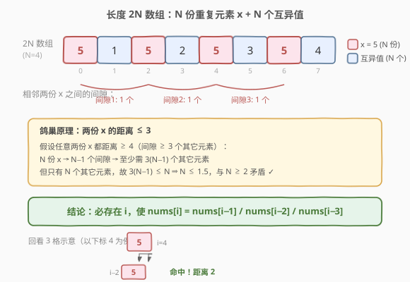
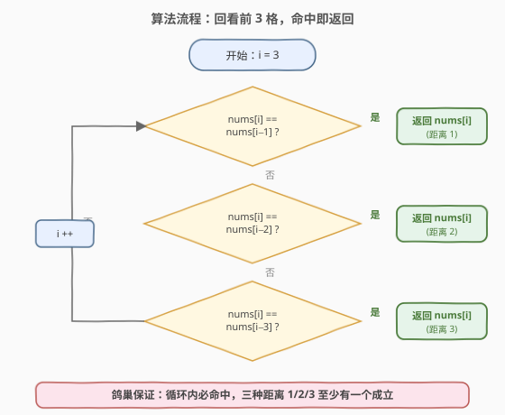

# LeetCode 在长度 2N 的数组中重复 N 次的元素 题解

## 1. 题目概述

- **标题 / 题号**：在长度 2N 的数组中重复 N 次的元素（#961，easy）
- **链接**：https://leetcode.cn/problems/n-repeated-element-in-size-2n-array/
- **难度**：简单
- **标签**：数组、哈希表

**题意**：给定一个长度为 $2N$ 的整数数组 `nums`，其中：

- 恰好有 $N+1$ 个**不同的**元素；
- 恰好有**一个**元素重复了 $N$ 次（其余 $N$ 个元素各出现一次）。

要求返回那个**重复 $N$ 次的元素**。

> 💡 **题意要点**：数组共 $2N$ 个位置，其中 $N$ 个位置被同一个值 $x$ 占据，剩下 $N$ 个位置各放一个互不相同且不等于 $x$ 的值。换句话说，「$N$ 份 $x$」+「$N$ 个互异的其他值」= $2N$。我们要找的就是那个出现次数最多的 $x$。

**示例 1**：

```text
输入：nums = [1,2,3,3]
输出：3
解释：2N = 4，故 N = 2。3 出现 2 次（= N），其余 1、2 各一次。答案为 3。
```

**示例 2**：

```text
输入：nums = [2,1,2,5,3,2]
输出：2
解释：2N = 6，故 N = 3。2 出现 3 次（= N），其余 1、5、3 各一次。答案为 2。
```

**示例 3**：

```text
输入：nums = [5,1,5,2,5,3,5,4]
输出：5
解释：2N = 8，故 N = 4。5 出现 4 次（= N），其余 1、2、3、4 各一次。答案为 5。
```

**约束**：

- $2 \le N \le 5000$
- $\text{nums.length} = 2N$
- $0 \le \text{nums}[i] \le 10^4$
- `nums` 中恰好有 $N + 1$ 个不同的元素，其中一个元素重复 $N$ 次

> ⚠️ **进阶要求**：能否用 $O(1)$ 额外空间解决？这是本题的核心考点——直接哈希计数虽对，但浪费了「$N$ 份重复 + $N$ 个互异」这一特殊结构。第 2 节给出 $O(1)$ 空间解法。

## 2. 解题思路

### 2.1 直观思路：哈希集合记首次出现

最直观的做法：边遍历边用哈希集合记录见过的值，**第一个在集合中已存在的值即为答案**——因为只有 $x$ 会出现第二次，其余值各出现一次，永远不会「重复出现」。

- 时间 $O(N)$，空间 $O(N)$。

这在工程中完全合理，但**没有利用题目给出的特殊结构**。面试官通常会追问「能否 $O(1)$ 空间？」，于是引出下面的鸽巢观察。

### 2.2 核心观察：鸽巢原理——两份拷贝距离不超过 3



关键转化：**我们不需要数出每个值的出现次数，只需找到任意一对相邻很近的相同值。** 因为唯一可能「成对出现」的值就是 $x$，找到任何一对相同值即可定位 $x$。

那么「最近的一对相同值」最远能隔多远？由**鸽巢原理**给出上界：

> 设重复元素 $x$ 出现 $N$ 次。若 $x$ 的任意两份拷贝之间都至少隔 3 个其它元素（即距离 $\ge 4$），则 $N$ 份拷贝产生 $N-1$ 个间隙，至少需要 $3(N-1)$ 个其它元素来填充。但数组中只有 $N$ 个其它元素（总数 $2N$ 减去 $N$ 份 $x$）。于是 $3(N-1) \le N$，即 $2N \le 3$，$N \le 1.5$，与 $N \ge 2$ 矛盾。

因此**必然存在两份 $x$ 的拷贝，距离不超过 3**。也就是说，从某个下标 $i$ 往前看 1、2、3 格，必定能撞到一个与 `nums[i]` 相同的值：

$$\exists\ i,\quad \text{nums}[i] = \text{nums}[i-1]\ \text{或}\ \text{nums}[i-2]\ \text{或}\ \text{nums}[i-3]$$

> 💡 **为何上界是 3 而非 2？** 考虑 $N=2$ 的边界用例 `[x, a, b, x]`（$x,a,b$ 三者互异）：两份 $x$ 分别在下标 0 和 3，距离恰为 3。此时 `nums[i]==nums[i-1]`、`nums[i]==nums[i-2]` 均不成立，必须检查到 `nums[i-3]` 才命中。这正是上界取 3 的原因——距离 2 在 $N\ge 3$ 时已够，但 $N=2$ 需要 3。

### 2.3 算法流程图



1. 从 $i = 3$ 开始遍历（前 3 格无法回看满 3 格，跳过；若数组极短，$N=2$ 时下标 3 即首个可回看到 0 的位置）。
2. 对每个 $i$，依次比较 `nums[i]` 与 `nums[i-1]`、`nums[i-2]`、`nums[i-3]`：
   - 若相等，**立即返回** `nums[i]`（即为 $x$）。
3. 由 2.2 的证明，循环内必然命中，无需兜底返回。

> ⚠️ **边界**：$N=2$ 时数组长度为 4，循环从 $i=3$ 起执行一次，比较 `nums[3]` 与 `nums[2]/nums[1]/nums[0]`，恰好覆盖 `[x,a,b,x]` 这种距离 3 的情形。

### 2.4 示例演算

![示例演算：nums = [5,1,5,2,5,3,5,4]，i=3 时即命中](../images/nrepeated_walkthrough.svg)

以 `nums = [5,1,5,2,5,3,5,4]`（$N=4$，答案 5）为例：

| $i$ | `nums[i]` | `nums[i-1]` | `nums[i-2]` | `nums[i-3]` | 命中？ |
|-----|-----------|-------------|-------------|-------------|--------|
| 3 | 2 | 5 | 1 | 5 | 否（2 与三者均不等） |
| 4 | 5 | 2 | 5 | 1 | ✅ `nums[4]==nums[2]`（距离 2），返回 5 |

可见 $i=4$ 时回看第 2 格即命中，无需继续扫描。答案 **5**。

> 💡 **更紧凑的对照**：示例 2 `nums = [2,1,2,5,3,2]` 中，5 出现在下标 0、2、5。$i=2$ 时 `nums[2]==nums[0]`（距离 2）即命中。而 $N=2$ 的 `[1,2,3,3]` 在 $i=3$ 时 `nums[3]==nums[2]`（距离 1）命中——三种距离（1/2/3）各有对应用例。

## 3. 参考代码

### C++

```cpp
class Solution {
public:
    int repeatedNTimes(vector<int>& nums) {
        for (int i = 3; i < nums.size(); ++i) {
            if (nums[i] == nums[i - 1] ||
                nums[i] == nums[i - 2] ||
                nums[i] == nums[i - 3]) {
                return nums[i];
            }
        }
        return nums[0];
    }
};
```

### Python

```python
class Solution:
    def repeatedNTimes(self, nums: List[int]) -> int:
        for i in range(3, len(nums)):
            if nums[i] == nums[i - 1] or nums[i] == nums[i - 2] or nums[i] == nums[i - 3]:
                return nums[i]
        return nums[0]
```

> 💡 **两个实现细节**：
> 1. **循环从 $i=3$ 起**：保证 `i-3` 不越界。由鸽巢证明，命中点必然存在于 $i \ge 3$ 的位置（$N=2$ 时下标 3 的 `nums[3]==nums[0]` 是距离 3 的命中）。
> 2. **末尾 `return nums[0]` 是兜底**：理论上循环内必命中（证明保证距离 $\le 3$ 的成对相同值存在），但编译器/类型检查要求函数有返回值，故加一行不可达兜底，逻辑上从不执行。

> ⚠️ **对照哈希集合写法**（$O(N)$ 空间，工程上更稳更易读，面试可先写此版再优化）：
> ```python
> class Solution:
>     def repeatedNTimes(self, nums: List[int]) -> int:
>         seen = set()
>         for x in nums:
>             if x in seen:
>                 return x
>             seen.add(x)
> ```
> 两种写法时间都是 $O(N)$，差别在空间：哈希集合 $O(N)$，回看法 $O(1)$。

## 4. 复杂度分析

| 维度 | 复杂度 | 说明 |
|------|--------|------|
| 时间复杂度 | $O(N)$ | 单趟扫描，每位至多 3 次比较；由鸽巢保证命中点不远，常数级即停 |
| 空间复杂度 | $O(1)$ | 仅用循环索引与若干临时比较，无额外数据结构 |

> 💡 **为何时间也是 $O(N)$ 而非更优？** 虽然命中点在期望意义下很靠前（$N$ 份 $x$ 散布在 $2N$ 槽中，最近一对的期望距离是常数级），但最坏构造下命中点可以推迟到下标 3（$N=2$ 的 `[x,a,b,x]`）。对一般 $N$，命中点始终在前几个位置内出现，故实际运行近乎 $O(1)$，但渐近界仍记 $O(N)$（扫描趟数上界）。

## 5. 扩展：上界 3 的紧致性与变体

**上界 3 是否紧致？** 是。$N=2$ 时的 `[x, a, b, x]` 给出了一个**确实需要回看到第 3 格**的实例：前两格 `nums[i-1]=b`、`nums[i-2]=a` 都不等于 $x$，只有 `nums[i-3]=x` 命中。故「回看 3 格」不能缩减为「回看 2 格」，上界 3 紧致。

**为何 $N \ge 3$ 时回看 2 格就够？** 若 $N \ge 3$ 且任意两份 $x$ 距离 $\ge 3$（即间隔 $\ge 2$ 个其它元素），则 $N$ 份 $x$ 产生 $N-1$ 个间隙需 $\ge 2(N-1)$ 个其它元素。由 $2(N-1) \le N$ 得 $N \le 2$，与 $N \ge 3$ 矛盾。故 $N \ge 3$ 时必有两份 $x$ 距离 $\le 2$，回看 2 格即可。本题统一回看 3 格是为了兼容 $N=2$ 的边界。

> ⚠️ **不要混淆本题与 287. 寻找重复数**。287 中数组长度为 $N+1$、值域 $[1, N]$、只有一个重复元素（可能重复多次），约束「值域等于下标域」使得可用**下标即值**的 Floyd 快慢指针判环法 $O(1)$ 空间求解。而 961 的值域 $[0, 10^4]$ 与下标域无关，判环法不适用，需用**鸽巢 + 距离上界**这一不同思路。两者都是「$O(1)$ 空间找重复」，但依据的数学性质截然不同。

## 6. 面试要点

1. **为什么回看 3 格就一定能找到答案？**

   由鸽巢原理：若重复元素 $x$ 的任意两份拷贝都距离 $\ge 4$（间隔 $\ge 3$ 个其它元素），则 $N$ 份拷贝需要 $\ge 3(N-1)$ 个其它元素填充间隙，但只有 $N$ 个其它元素，导出 $3(N-1) \le N$ 即 $N \le 1.5$，与 $N \ge 2$ 矛盾。故必有两份 $x$ 距离 $\le 3$，回看前 3 格必命中。

2. **回看 2 格为什么不够？**

   $N=2$ 的边界用例 `[x, a, b, x]`（$x,a,b$ 互异）中，两份 $x$ 距离恰为 3，回看 1、2 格都 miss，必须看到第 3 格。故上界 3 紧致，不能减到 2。

3. **为什么不用「摩尔投票」或「快慢指针」？**

   摩尔投票适用于「出现次数超过一半」的多数元素（169），本题 $x$ 恰占一半（$N/2N = 1/2$），未过半，摩尔投票不保证正确。快慢指针（287）依赖「值域=下标域」把数组视作函数图判环，本题值域与下标无关，无法构造该映射。本题的 $O(1)$ 解法依赖的是**鸽巢给出的距离上界**，与前两者原理不同。

4. **哈希集合解法是否可接受？**

   完全可接受，且工程上更稳健、可读性更好。面试建议**先写哈希集合版本讲清思路，再被追问时用鸽巢优化到 $O(1)$**，体现「先正确后优化」的工程意识。两版时间都是 $O(N)$。

5. **如果去掉「其余 $N$ 个元素各出现一次」的保证（允许其它值也重复），鸽巢法还成立吗？**

   不成立。鸽巢证明的关键是「$N$ 个其它位置互异」，由此推出间隙只能填 $x$ 之外的不同值。若其它值也可重复，间隙填充更自由，两份 $x$ 的距离可能超过 3，回看 3 格会漏判。此时退回哈希计数（统计频次找等于 $N$ 的那个）是唯一通用解，空间 $O(N)$。

## 同类练习题

| # | 题目 | 与本题的关联 |
|---|------|-------------|
| 287 | [寻找重复数](https://leetcode.cn/problems/find-the-duplicate-number/)（[站内题解](../0201-0300/287_寻找重复数.md)） | 同样 $O(1)$ 空间找重复，但依赖「值域=下标域」用 Floyd 快慢指针判环，与本题鸽巢距离上界思路对照 |
| 442 | [数组中重复的数据](https://leetcode.cn/problems/find-all-duplicates-in-an-array/)（[站内题解](../0401-0500/442_数组中重复的数据.md)） | 值域=下标域时用「下标取负」原地标记找所有重复，与本题「特殊结构换 $O(1)$ 空间」同主题 |
| 448 | [找到所有数组中消失的数字](https://leetcode.cn/problems/find-all-numbers-disappeared-in-an-array/)（[站内题解](../0401-0500/448_找到所有数组中消失的数字.md)） | 下标当哈希键原地编码，另一类「值域=下标域」的 $O(1)$ 空间技巧 |
| 217 | [存在重复元素](https://leetcode.cn/problems/contains-duplicate/)（[站内题解](../0201-0300/217_存在重复元素.md)） | 判定是否存在任意重复的哈希集合入门题，对照本题「找特定的那个重复」 |
