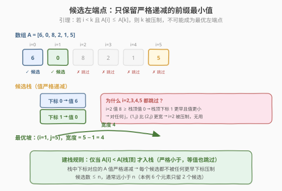
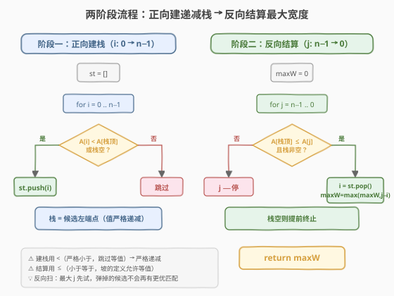

# 最大宽度坡

- **题目名称**：最大宽度坡
- **链接**：[962. 最大宽度坡](https://leetcode.cn/problems/maximum-width-ramp/)
- **难度**：中等
- **标签**：数组、单调栈

## 1. 题目概述

给定一个整数数组 `A`，**坡**（ramp）是一个元组 `(i, j)`，满足 `i < j` 且 `A[i] <= A[j]`。坡的**宽度**为 `j - i`。求 `A` 中坡的**最大宽度**，不存在则返回 `0`。

**示例 1**：

```text
输入：[6,0,8,2,1,5]
输出：4
解释：最大宽度的坡为 (i, j) = (1, 5)：A[1] = 0 <= A[5] = 5，宽度 = 5 - 1 = 4。
```

**示例 2**：

```text
输入：[9,8,1,0,1,9,4,0,4,1]
输出：7
解释：最大宽度的坡为 (i, j) = (2, 9)：A[2] = 1 <= A[9] = 1，宽度 = 9 - 2 = 7。
```

**约束条件**：

- `2 <= A.length <= 50000`
- `0 <= A[i] <= 50000`

> 💡 本题是 **单调栈** 的经典应用，但与 [每日温度](../0701-0800/739_每日温度.md)、[股票价格跨度](../0901-1000/901_股票价格跨度.md) 的「找右边第一个更大」不同——它要找的是「**最远的**不小于自己的位置」，目标是**最大化距离**而非找到最近的一个。因此栈的用法是**两阶段**的：先正向扫描建一个「候选左端点」的递减栈，再反向扫描用右端点去「消耗」栈中候选。这种「正向建栈 + 反向结算」的双扫描骨架是本题最值得掌握的模板。

---

## 2. 解题思路

### 2.1 暴力思路：枚举所有对

最直观的做法：对每个左端点 `i`，从最右端 `j = n-1` 向左找第一个满足 `A[i] <= A[j]` 的 `j`，记录 `j - i` 的最大值。

```text
maxW = 0
for i in range(n):
    for j in range(n-1, i, -1):
        if A[i] <= A[j]:
            maxW = max(maxW, j - i)
            break
```

最坏情况（如 `[1,1,1,...,1]` 全相等），内层每次扫到尾，总代价 $O(n^2)$。`n = 50000` 时约 $2.5 \times 10^9$，**超时**。

> ⚠️ 暴力法的核心浪费：大量左端点 `i` 根本**不可能**是最优解。例如 `A = [6, 0, 8, ...]`，`A[0]=6`、`A[1]=0`：对于任何右端点 `j`，若 `A[0] <= A[j]` 成立，则 `A[1] <= A[0] <= A[j]` 也成立，且 `1 < 0` 不成立——但 `1` 作为更靠后的下标，宽度 `j - 1 < j - 0`，所以 `0` 比 `1` 更优。反过来说，`A[2]=8 >= A[1]=0`，对于任何 `j > 2` 若 `A[2] <= A[j]` 则 `A[1] <= A[j]` 且 `1 < 2`，所以 `(1, j)` 比 `(2, j)` 更宽——**`i=2` 永远不可能成为最优左端点**。能成为候选的，只有那些值「**严格递减**」的前缀最小值位置。

### 2.2 核心观察：候选左端点必在「严格递减栈」中

**关键引理**：若 `i < k` 且 `A[i] <= A[k]`，则 `k` **不可能是**最优坡的左端点。

> **证明**：对任意 `j > k`，若 `A[k] <= A[j]`（`(k, j)` 是合法坡），则由 `A[i] <= A[k] <= A[j]` 知 `A[i] <= A[j]`，故 `(i, j)` 也是合法坡，且宽度 `j - i > j - k`。所以 `k` 永远被 `i`「压制」，无需考虑。

由引理，**有用的左端点候选**是这样一个下标序列：每个候选的 `A` 值比前一个候选**严格更小**。这正是数组从左到右的「前缀严格最小值」序列。我们用一个**严格递减栈**（存下标）来收集它们：

- 遍历 `i` 从 `0` 到 `n-1`：仅当栈空或 `A[i] < A[栈顶]` 时，将 `i` 入栈。
- 入栈条件用**严格小于**（`<`）：相等的也跳过，因为更早的等值下标宽度更大。



收集到候选栈后，**反向**从 `j = n-1` 扫到 `0`：对每个 `j`，只要栈顶候选的值 `A[栈顶] <= A[j]`，就弹出并更新 `maxW = max(maxW, j - 栈顶)`。

> 💡 **为什么反向扫描时可以「弹掉」栈顶？** 我们从最大的 `j` 开始试。对某个栈顶候选 `i`，若当前最大的 `j` 已经满足 `A[i] <= A[j]`，那么 `j - i` 就是这个左端点 `i` 能配到的**最大宽度**——后续更小的 `j` 只会更差，所以 `i` 的使命完成，安全弹出。若当前 `j` 不满足（`A[i] > A[j]`），则 `i` 留在栈中等待更小的 `j` 来匹配——但注意 `j` 越小宽度越差，所以真正有意义的是「最大的能匹配的 `j`」。

### 2.3 算法流程图



**完整步骤**：

1. **阶段一·建栈**：`st = []`，遍历 `i` 从 `0` 到 `n-1`：
   - 若 `st` 为空或 `A[i] < A[st.top()]`：`st.push(i)`。
   - 否则跳过（`A[i] >= A[栈顶]`，被栈顶压制，无用）。
   - **不变式**：栈中下标对应的 `A` 值**严格递减**（栈底最大，栈顶最小）。
2. **阶段二·结算**：`maxW = 0`，遍历 `j` 从 `n-1` 到 `0`：
   - `while st 非空 且 A[st.top()] <= A[j]`：
     - `i = st.pop()`
     - `maxW = max(maxW, j - i)`
   - 栈空即可提前终止（没有候选左端点了）。
3. 返回 `maxW`。

> ⚠️ 两个比较方向别搞反：**建栈用 `<`（严格小于，跳过等值）**，**结算用 `<=`（小于等于，坡的定义）**。建栈时严格递减是为了排除被压制的候选；结算时 `<=` 是因为坡允许 `A[i] <= A[j]`（相等也算）。

### 2.4 示例演算

以示例 2 `[9,8,1,0,1,9,4,0,4,1]`（`n = 10`）为例：

![示例演算：建栈得到 [0,1,2,3]，反向扫描在 j=9 连弹两个候选得宽度 7](../images/maxwidth_ramp_example_walkthrough.svg)

**阶段一·建栈**（只收严格递减的前缀最小值）：

| `i` | `A[i]` | 栈顶 `A` | 动作 | 栈（底→顶） |
|-----|--------|----------|------|-------------|
| 0 | 9 | —（空） | 入栈 | `[0]` |
| 1 | 8 | 9 | 8 < 9 → 入栈 | `[0, 1]` |
| 2 | 1 | 8 | 1 < 8 → 入栈 | `[0, 1, 2]` |
| 3 | 0 | 1 | 0 < 1 → 入栈 | `[0, 1, 2, 3]` |
| 4 | 1 | 0 | 1 ≥ 0 → 跳过 | `[0, 1, 2, 3]` |
| 5 | 9 | 0 | 9 ≥ 0 → 跳过 | `[0, 1, 2, 3]` |
| 6 | 4 | 0 | 4 ≥ 0 → 跳过 | `[0, 1, 2, 3]` |
| 7 | 0 | 0 | 0 ≥ 0 → 跳过（等值也跳） | `[0, 1, 2, 3]` |
| 8 | 4 | 0 | 4 ≥ 0 → 跳过 | `[0, 1, 2, 3]` |
| 9 | 1 | 0 | 1 ≥ 0 → 跳过 | `[0, 1, 2, 3]` |

候选左端点：下标 `[0,1,2,3]`，对应值 `[9,8,1,0]`（严格递减）。

**阶段二·反向结算**：

| `j` | `A[j]` | 弹栈过程 | `maxW` | 栈（底→顶） |
|-----|--------|---------|--------|-------------|
| 9 | 1 | 栈顶 3：`A=0 <= 1` → 弹，`w=9-3=6`；栈顶 2：`A=1 <= 1` → 弹，`w=9-2=7`；栈顶 1：`A=8 > 1` → 停 | **7** | `[0, 1]` |
| 8 | 4 | 栈顶 1：`A=8 > 4` → 停 | 7 | `[0, 1]` |
| 7 | 0 | 栈顶 1：`A=8 > 0` → 停 | 7 | `[0, 1]` |
| 6 | 4 | 栈顶 1：`A=8 > 4` → 停 | 7 | `[0, 1]` |
| 5 | 9 | 栈顶 1：`A=8 <= 9` → 弹，`w=5-1=4`；栈顶 0：`A=9 <= 9` → 弹，`w=5-0=5`；栈空 → 停 | 7 | `[]` |
| 4 及以下 | — | 栈空，提前终止 | 7 | `[]` |

关注 `j = 9` 这一步：它一次性弹出候选 `3`（值 0）和候选 `2`（值 1），分别得到宽度 6 和 7。**候选 `2` 的值 1 与 `A[9] = 1` 相等**，`<=` 判定让等值坡也成立——这正是示例答案 `(2, 9)` 宽度 7 的来源。

> 💡 对比暴力法：暴力要对 10 个左端点各从右端扫描，最坏约 50 次比较；单调栈阶段一 10 次比较 + 4 次入栈，阶段二至多 4 次弹出，总计约 18 次操作。`n = 50000` 时优势呈数量级放大。

---

## 3. 参考代码

### C++

```cpp
// 最大宽度坡.cpp —— 单调栈两阶段：正向建递减栈 + 反向结算
// 编译: g++ -O2 -std=c++17 最大宽度坡.cpp -o maxwidthramp
#include <vector>
#include <stack>
#include <algorithm>
using namespace std;

class Solution {
  public:
    int maxWidthRamp(vector<int>& A) {
        int n = A.size();
        stack<int> st;
        // 阶段一：收集候选左端点，A 值严格递减
        for (int i = 0; i < n; i++) {
            if (st.empty() || A[i] < A[st.top()]) {
                st.push(i);
            }
        }
        // 阶段二：从右向左结算最大宽度
        int maxW = 0;
        for (int j = n - 1; j >= 0; j--) {
            while (!st.empty() && A[st.top()] <= A[j]) {
                maxW = max(maxW, j - st.top());
                st.pop();
            }
            if (st.empty()) break;   // 候选耗尽，提前终止
        }
        return maxW;
    }
};
```

### Python

```python
class Solution:
    def maxWidthRamp(self, A: List[int]) -> int:
        n = len(A)
        st = []
        # 阶段一：收集候选左端点，A 值严格递减
        for i in range(n):
            if not st or A[i] < A[st[-1]]:
                st.append(i)
        # 阶段二：从右向左结算最大宽度
        max_w = 0
        for j in range(n - 1, -1, -1):
            while st and A[st[-1]] <= A[j]:
                max_w = max(max_w, j - st.pop())
            if not st:               # 候选耗尽，提前终止
                break
        return max_w
```

> 💡 Python 用 `list` 当栈，`st[-1]` 取栈顶下标，`A[st[-1]]` 取对应值。`st.pop()` 返回并移除栈顶下标，`j - st.pop()` 一步算出宽度。注意 `range(n - 1, -1, -1)` 是从 `n-1` 到 `0` 的反向遍历惯用写法。

---

## 4. 复杂度分析

| 维度 | 复杂度 | 说明 |
|------|--------|------|
| **时间复杂度** | $O(n)$ | 阶段一每个元素至多入栈 1 次（比较 1 次）；阶段二每个候选至多弹出 1 次，`j` 循环 `n` 轮但内层 `while` 总弹出 $\leq n$ 次。总计 $\leq 3n$ |
| **空间复杂度** | $O(n)$ | 栈最坏存 `n` 个下标（数组严格递减时，如 `[5,4,3,2,1]`，每个都入栈） |

> ⚠️ 阶段二的 `for j` 外层看似 `n` 轮、内层 `while` 看似再 `n` 次，但**均摊分析**：每个候选下标只在阶段一入栈 1 次、阶段二出栈 1 次，总操作数 $\leq 2n$。`j` 循环里没有弹出时是 `O(1)` 跳过，所以整体严格 $O(n)$。与 [每日温度](../0701-0800/739_每日温度.md) 的「每元素均摊 O(1)」同理。

---

## 5. 扩展：排序法与单调栈法的对比

### 5.1 排序法（$O(n \log n)$）

另一种直观思路：把下标按 `A[i]` 排序，排序后同值按原下标升序。扫一遍排序后的下标序列，维护「已见过的最小下标」`min_idx`，对当前下标 `i`，若 `min_idx < i` 则 `A[min_idx] <= A[i]`（排序保证值不大于当前），宽度 `i - min_idx` 是合法坡。

```python
def maxWidthRamp(self, A):
    idx_sorted = sorted(range(len(A)), key=lambda i: (A[i], i))
    min_idx = len(A)
    max_w = 0
    for i in idx_sorted:
        if min_idx < i:
            max_w = max(max_w, i - min_idx)
        min_idx = min(min_idx, i)
    return max_w
```

排序保证：在排序序列中，排在前面的 `A` 值 $\le$ 排在后面的 `A` 值；同值按下标升序，所以更小下标先出现、先被记入 `min_idx`。于是 `min_idx` 对应的值必然 $\le$ 当前值，`(min_idx, i)` 是合法坡。

### 5.2 两种方法对比

| 维度 | 单调栈法 | 排序法 |
|------|---------|--------|
| 时间复杂度 | $O(n)$ | $O(n \log n)$ |
| 空间复杂度 | $O(n)$ | $O(n)$（排序辅助） |
| 核心思想 | 剔除被压制的左端点，只留严格递减候选 | 排序后值有序，最小下标即为最优左端点 |
| 代码量 | 两阶段，稍长但每步清晰 | 单趟扫描，简洁 |
| 可迁移性 | 「正向建栈 + 反向结算」骨架可迁移 | 「排序 + 维护极值」通用思路 |

> 💡 当 $n = 50000$ 时两种方法都能通过。单调栈法在 $n$ 更大时（如 $10^6$）优势明显。面试中先讲排序法展示思路、再优化到单调栈体现深度，是较好的回答节奏。

### 5.3 与「下一个更大元素」系列的区别

本题与 [每日温度](../0701-0800/739_每日温度.md)、[下一个更大元素 I](../0401-0500/496_下一个更大元素 I.md) 同属单调栈家族，但目标不同：

- **每日温度 / 下一个更大元素**：找右边**第一个**更大值，目标是「最近」——一遍正向扫描，遇到更大就结算。
- **最大宽度坡**：找右边**最远**的不小于自己的值，目标是「最远」——需要两阶段：先筛候选左端点，再从最右端反向匹配。

> 💡 口诀：**找最近用单遍弹栈，找最远用两遍建栈+反向结算**。目标方向决定了扫描方向——要最远的右端点，就从最右开始扫。

---

## 6. 面试要点

1. **为什么只需保留「严格递减」的候选左端点？**

   - 引理：若 `i < k` 且 `A[i] <= A[k]`，则 `k` 被压制——对任何 `j > k`，`(k, j)` 合则 `(i, j)` 也合法且更宽。
   - 所以有用的左端点只剩「前缀严格最小值」序列，用严格递减栈收集。等值也跳过，因为更早的等值下标宽度更大。

2. **建栈用 `<` 还是 `<=`？结算用哪个？**

   - **建栈用 `<`（严格小于）**：`A[i] < A[栈顶]` 才入栈，保证栈中值严格递减，等值被更早下标压制而跳过。
   - **结算用 `<=`（小于等于）**：坡的定义是 `A[i] <= A[j]`，相等也算合法坡，所以弹出条件用 `<=`。
   - 两个方向不能混——建栈若用 `<=` 会漏掉等值的更优候选，结算若用 `<` 会漏掉等值坡。

3. **为什么反向扫描时弹栈是安全的？**

   - 从最大的 `j` 开始。栈顶候选 `i` 若被当前 `j` 匹配（`A[i] <= A[j]`），则 `j - i` 是 `i` 能配到的最大宽度——更小的 `j` 只会更差。
   - 弹掉 `i` 后，新的栈顶值更大（栈递减），可能不满足 `<= A[j]` 而停下，等更小的 `j` 再试。每个候选只弹一次，总弹出 $\leq n$。

4. **时间复杂度为什么是 $O(n)$ 而非 $O(n^2)$？**

   - 阶段一：`n` 次比较 + 至多 `n` 次入栈。
   - 阶段二：`j` 循环 `n` 轮，但 `while` 的总弹出次数 $\leq$ 栈大小 $\leq n$（每个候选只弹一次）。
   - 总操作 $\leq 3n$，严格 $O(n)$。这是「栈的均摊分析」标准范式。

5. **排序法的思路是什么？何时选排序法？**

   - 把下标按 `(A[i], i)` 排序，扫描时维护最小下标。排序保证前面的值 $\le$ 后面，最小下标的值 $\le$ 当前值，宽度 `i - min_idx` 合法。
   - $O(n \log n)$，代码更短。当 $n$ 不极端大、或想快速 AC 时优选；追求 $O(n)$ 或面试展示深度时用单调栈。

> 💡 **一句话总结**：最大宽度坡用「**正向建严格递减栈筛候选左端点 + 反向扫描用最大右端点结算**」两阶段把 $O(n^2)$ 降到 $O(n)$。核心是引理「被更大或等值的前缀压制的下标无用」——这正是单调栈「剔除被压制元素」思想在「求最远距离」场景下的应用。记住口诀：**找最近用单遍弹栈，找最远用两遍建栈+反向结算**。

---

## 7. 同类练习题

- [739. 每日温度](https://leetcode.cn/problems/daily-temperatures/)（[题解](../0701-0800/739_每日温度.md)）：单调栈找「最近」的更大值，对比本题找「最远」的不小于值
- [503. 下一个更大元素 II](https://leetcode.cn/problems/next-greater-element-ii/)（[题解](../0501-0600/503_下一个更大元素%20II.md)）：环形数组单调栈，正向单遍弹栈结算
- [84. 柱状图中最大的矩形](https://leetcode.cn/problems/largest-rectangle-in-histogram/)（[题解](../0001-0100/84_柱状图中最大的矩形.md)）：单调栈两阶段（左右扫描算边界），骨架与本题类似
- [496. 下一个更大元素 I](https://leetcode.cn/problems/next-greater-element-i/)（[题解](../0401-0500/496_下一个更大元素%20I.md)）：单调栈 + 哈希查表，单遍正向弹栈
