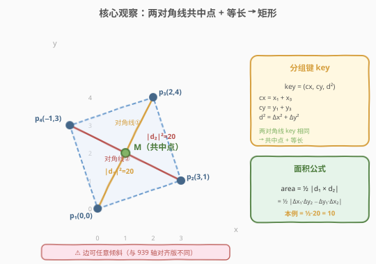
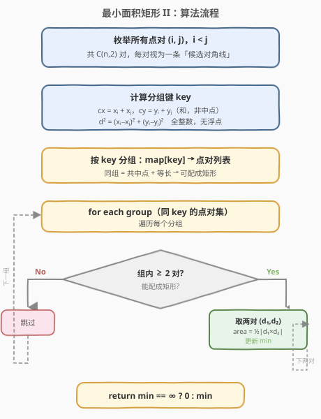
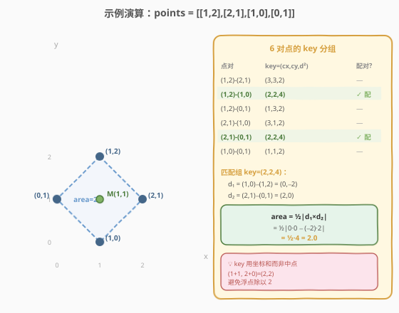

# LeetCode 最小面积矩形 II 题解

## 1. 题目概述

- **标题 / 题号**：最小面积矩形 II（#963，medium）
- **链接**：https://leetcode.cn/problems/minimum-area-rectangle-ii/
- **难度**：中等
- **标签**：几何、数组、哈希表、数学

**题意**：给定 X-Y 平面上的点数组 `points`，其中 `points[i] = [xi, yi]`。返回由这些点形成的任意矩形的**最小面积**，矩形的边**不一定**平行于 X 轴和 Y 轴。如果不存在这样的矩形，返回 `0`。

答案只需在 $10^{-5}$ 的误差范围内即可被视作正确。

**示例 1**：

```text
输入：points = [[1,2],[2,1],[1,0],[0,1]]
输出：2.00000
解释：最小面积矩形由 [1,2]、[2,1]、[1,0]、[0,1] 组成，其面积为 2。
```

**示例 2**：

```text
输入：points = [[0,1],[2,1],[1,1],[1,0],[2,0]]
输出：1.00000
解释：最小面积矩形由 [1,0]、[1,1]、[2,1]、[2,0] 组成，其面积为 1。
```

**示例 3**：

```text
输入：points = [[0,3],[1,2],[3,1],[1,3],[2,1]]
输出：0
解释：无法由这些点组成任何矩形。
```

**约束**：

- `1 <= points.length <= 50`
- `points[i].length == 2`
- `0 <= xi, yi <= 4 * 10^4`
- 所有给定的点都是**唯一**的。

> ⚠️ **与 [939. 最小面积矩形](../0901-1000/939_最小面积矩形.md) 的关键区别**：939 要求矩形边平行于坐标轴，可 $O(n^2)$ 用对角点交叉查两角；本题边可任意倾斜，交叉法失效，需换用**对角线中点 + 等长**这一更一般的矩形判定。同时本题 $n \le 50$（939 为 500），约束更宽松。

## 2. 解题思路

### 2.1 暴力思路

枚举所有 4 个点的组合 $C(n, 4)$，对每组检查能否构成矩形（任取两条对角线配对，验证中点重合且长度相等）。当 $n = 50$ 时 $C(50, 4) \approx 23 \times 10^4$，每组检查 $O(1)$，总计约 $2.3 \times 10^5$ 次操作——可行但未利用矩形结构，且常数较大。

> 💡 更糟的暴力是 $O(n^3)$：枚举 3 个点作为矩形的 3 个角，由向量关系推出第 4 个角坐标并查点集。$C(50, 3) \approx 2 \times 10^4$，也可通过。但下面的**对角线配对**法更优雅且天然 $O(n^2)$ 建组。

### 2.2 核心观察：对角线共中点 + 等长配对

矩形有一个根本性质：**两条对角线互相平分（共中点）且长度相等**。反之亦然——两条共中点且等长的线段，其四个端点必构成矩形。



**必要性**（矩形 → 共中点 + 等长）：矩形是平行四边形的特例，平行四边形对角线互相平分（共中点）；而「对角线相等」正是矩形区别于一般平行四边形的特征性质。

**充分性**（共中点 + 等长 → 矩形）：两条线段共中点 → 四端点构成**平行四边形**（对角线互相平分是平行四边形的充要条件）；再加上对角线等长 → 该平行四边形是**矩形**（等对角线的平行四边形是矩形）。

> 💡 **为什么这比 939 的「交叉查角」更一般？** 939 利用轴对齐约束，两对角点的 $x$、$y$ 交叉即得另两角。本题边可倾斜，交叉法不再适用，但「共中点 + 等长」对**任意朝向**的矩形都成立——它是矩形最本质的刻画。

### 2.3 分组键设计：坐标和 + 距离平方

将每个点对 $(p_i, p_j)$ 视为一条「候选对角线」，计算分组键：

$$\text{key} = (\underbrace{x_i + x_j}_{c_x},\ \underbrace{y_i + y_j}_{c_y},\ \underbrace{(x_i - x_j)^2 + (y_i - y_j)^2}_{d^2})$$

> ⚠️ **用坐标和 $c_x = x_i + x_j$ 而非中点 $\frac{x_i + x_j}{2}$**：两个点对共中点当且仅当坐标和相等，用和可保持全整数运算，避免浮点误差导致的分组错位。$d^2$ 也是整数。坐标上限 $4 \times 10^4$，$d^2$ 最大 $2 \times (4 \times 10^4)^2 = 3.2 \times 10^9$，超出 `int` 范围，需用 `long long`。

同一 key 的所有点对两两组合，每组都构成一个矩形。面积由两条对角线的**叉积**给出：

$$\text{area} = \frac{1}{2}|\mathbf{d}_1 \times \mathbf{d}_2| = \frac{1}{2}|\Delta x_1 \cdot \Delta y_2 - \Delta y_1 \cdot \Delta x_2|$$

**推导**：设矩形边向量为 $\mathbf{a}$、$\mathbf{b}$（$\mathbf{a} \perp \mathbf{b}$），则两条对角线 $\mathbf{d}_1 = \mathbf{a} + \mathbf{b}$，$\mathbf{d}_2 = \mathbf{a} - \mathbf{b}$。叉积展开：

$$\mathbf{d}_1 \times \mathbf{d}_2 = (\mathbf{a}+\mathbf{b}) \times (\mathbf{a}-\mathbf{b}) = -2(\mathbf{a} \times \mathbf{b})$$

而矩形面积 $= |\mathbf{a} \times \mathbf{b}|$（因 $\mathbf{a} \perp \mathbf{b}$，即 $|\mathbf{a}||\mathbf{b}|$），故 $\text{area} = \frac{1}{2}|\mathbf{d}_1 \times \mathbf{d}_2|$。

### 2.4 算法流程图



1. 枚举所有 $C(n, 2)$ 对点，计算 key $= (c_x, c_y, d^2)$，加入哈希表分组。
2. 遍历每个分组，若组内 $\ge 2$ 对点，取每两组（两条对角线）计算面积 $= \frac{1}{2}|\text{cross}|$，更新最小值。
3. 遍历完毕返回最小面积（无矩形则返回 `0`）。

### 2.5 示例演算

以示例 1 `points = [[1,2],[2,1],[1,0],[0,1]]` 为例，枚举全部 6 对点并计算 key：



| 点对 | $c_x$ | $c_y$ | $d^2$ | key | 配对？ |
|------|-------|-------|-------|-----|--------|
| (1,2)–(2,1) | 3 | 3 | 2 | (3,3,2) | — |
| (1,2)–(1,0) | 2 | 2 | 4 | (2,2,4) | ✓ |
| (1,2)–(0,1) | 1 | 3 | 2 | (1,3,2) | — |
| (2,1)–(1,0) | 3 | 1 | 2 | (3,1,2) | — |
| (2,1)–(0,1) | 2 | 2 | 4 | (2,2,4) | ✓ |
| (1,0)–(0,1) | 1 | 1 | 2 | (1,1,2) | — |

key `(2,2,4)` 组内有 2 对：$(1,2)$–$(1,0)$ 与 $(2,1)$–$(0,1)$。

- $\mathbf{d}_1 = (1,0) - (1,2) = (0, -2)$
- $\mathbf{d}_2 = (2,1) - (0,1) = (2, 0)$
- $\text{cross} = 0 \times 0 - (-2) \times 2 = 4$
- $\text{area} = \frac{1}{2} \times 4 = 2.0$

最终最小面积为 `2.0`。

> 💡 **验证矩形正确性**：$(1,2)$、$(1,0)$ 是竖直对角线（$x=1$），$(2,1)$、$(0,1)$ 是水平对角线（$y=1$），二者在 $(1,1)$ 处相交且垂直，构成一个边长 $\sqrt{2}$ 的正方形，面积 $= 2$ ✓。

## 3. 参考代码

### C++

```cpp
class Solution {
  public:
    double minAreaFreeRect(vector<vector<int>>& points) {
        int n = points.size();
        map<tuple<int, int, long long>, vector<pair<int, int>>> mp;

        for (int i = 0; i < n; ++i) {
            for (int j = i + 1; j < n; ++j) {
                int cx = points[i][0] + points[j][0];
                int cy = points[i][1] + points[j][1];
                long long dx = points[i][0] - points[j][0];
                long long dy = points[i][1] - points[j][1];
                long long d2 = dx * dx + dy * dy;
                mp[{cx, cy, d2}].push_back({i, j});
            }
        }

        double ans = 1e18;
        for (auto& [key, pairs] : mp) {
            int m = pairs.size();
            for (int a = 0; a < m; ++a) {
                long long dx1 = points[pairs[a].first][0] - points[pairs[a].second][0];
                long long dy1 = points[pairs[a].first][1] - points[pairs[a].second][1];
                for (int b = a + 1; b < m; ++b) {
                    long long dx2 = points[pairs[b].first][0] - points[pairs[b].second][0];
                    long long dy2 = points[pairs[b].first][1] - points[pairs[b].second][1];
                    long long cross = dx1 * dy2 - dy1 * dx2;
                    if (cross < 0) cross = -cross;
                    ans = min(ans, 0.5 * (double)cross);
                }
            }
        }
        return ans > 1e17 ? 0.0 : ans;
    }
};
```

### Python

```python
class Solution:
    def minAreaFreeRect(self, points: List[List[int]]) -> float:
        n = len(points)
        groups = {}
        for i in range(n):
            xi, yi = points[i]
            for j in range(i + 1, n):
                xj, yj = points[j]
                cx = xi + xj
                cy = yi + yj
                d2 = (xi - xj) ** 2 + (yi - yj) ** 2
                groups.setdefault((cx, cy, d2), []).append((i, j))

        ans = float('inf')
        for pairs in groups.values():
            m = len(pairs)
            for a in range(m):
                i1, j1 = pairs[a]
                dx1 = points[i1][0] - points[j1][0]
                dy1 = points[i1][1] - points[j1][1]
                for b in range(a + 1, m):
                    i2, j2 = pairs[b]
                    dx2 = points[i2][0] - points[j2][0]
                    dy2 = points[i2][1] - points[j2][1]
                    cross = abs(dx1 * dy2 - dy1 * dx2)
                    ans = min(ans, 0.5 * cross)

        return 0.0 if ans == float('inf') else ans
```

> 💡 **实现细节**：
> 1. **key 全整数**：用 $c_x = x_i + x_j$（和）而非中点 $\frac{x_i+x_j}{2}$，避免浮点；$d^2$ 用 `long long`（C++）防溢出。
> 2. **叉积绝对值**：$\text{cross} = \Delta x_1 \cdot \Delta y_2 - \Delta y_1 \cdot \Delta x_2$，取绝对值后乘 $0.5$ 即面积。cross 可能为奇数，故结果可能是半整数，用 `double` 存储。
> 3. **C++ 用 `map`** 而非 `unordered_map`：`tuple` 天然支持 `operator<`，$n=50$ 时 $C(50,2)=1225$ 对，`map` 的 $O(\log n)$ 开销可忽略，代码更简洁。

## 4. 复杂度分析

| 维度 | 复杂度 | 说明 |
|------|--------|------|
| 时间复杂度 | $O(n^2 + \sum k_i^2)$ | $C(n,2)$ 对点建组 $O(n^2)$；每组 $k_i$ 对点两两组合 $O(k_i^2)$。由 $\sum k_i = C(n,2)$ 且 $k_i \le n/2$，$\sum k_i^2 \le \frac{n}{2} \cdot C(n,2) = O(n^3)$ |
| 空间复杂度 | $O(n^2)$ | 哈希表存储 $C(n,2)$ 对点 |

> ⚠️ **最坏情况**：若大量点对共享同一 key（如点对称分布在圆上），组大小 $k$ 可达 $O(n)$，单组贡献 $O(n^2)$ 个矩形。但 $n \le 50$ 时 $O(n^3) \approx 1.25 \times 10^5$，远在时限内。

> 💡 **C++ `map` vs `unordered_map`**：`map` 单次操作 $O(\log C(n,2))$，总建组 $O(n^2 \log n)$；`unordered_map` 需自定义 `tuple` 哈希（如 `cx * 60001 + cy` 组合再与 $d^2$ 拼接），可降到 $O(n^2)$。$n=50$ 时差异微乎其微，优先可读性。

## 5. 扩展：$O(n^3)$ 三点定矩形 + 对照 939

### 5.1 三点定第四点法

另一种思路：枚举任意 3 个点 $A$、$B$、$C$，若 $\vec{AB} \perp \vec{AC}$（点积为零），则第四点 $D = B + C - A$（由 $\vec{AD} = \vec{AB} + \vec{AC}$），检查 $D$ 是否在点集中。

- 时间 $O(n^3)$（枚举三元组）+ 每组 $O(1)$ 哈希查点 = $O(n^3)$。
- $n = 50$ 时 $C(50,3) \approx 19600$，同样可行。

> 💡 **对比**：三点法直观但需处理「哪两个点构成直角边」的三种配对（$\angle A$、$\angle B$、$\angle C$ 分别为直角）；对角线配对法只需一次建组，逻辑更统一，且面积公式优雅（叉积直接给出）。面试推荐对角线法。

### 5.2 与 939 轴对齐版的对照

| 维度 | 939（轴对齐） | 963（任意朝向） |
|------|---------------|-----------------|
| 边约束 | 必须平行于坐标轴 | 可任意倾斜 |
| 核心性质 | 对角点 $x$、$y$ 交叉即得另两角 | 对角线共中点 + 等长 |
| 分组键 | 无需分组，直接 $O(n^2)$ 枚举对角点对 | $(c_x, c_y, d^2)$ 三元组分组 |
| 面积公式 | $\|x_1-x_2\| \times \|y_1-y_2\|$ | $\frac{1}{2}\|\mathbf{d}_1 \times \mathbf{d}_2\|$ |
| 时间复杂度 | $O(n^2)$ | $O(n^2 + \sum k_i^2) \le O(n^3)$ |
| $n$ 上限 | 500 | 50 |

> 💡 939 的轴对齐约束是 963 的**特例**：轴对齐矩形的两条对角线必然共中点且等长，但 939 额外利用了「$x$、$y$ 各自配对」的结构将 $O(n^3)$ 压到 $O(n^2)$。963 没有此结构可用，退回 $O(n^3)$，故 $n$ 上限降为 50。

## 6. 面试要点

1. **为什么「共中点 + 等长」能判定矩形？**

   - **必要**：矩形是平行四边形，对角线互相平分（共中点）；矩形的对角线相等（区别于菱形/一般平行四边形）。
   - **充分**：两条线段共中点 → 四端点构成平行四边形（对角线互相平分是平行四边形的充要条件）；再加等长 → 该平行四边形是矩形（等对角线的平行四边形是矩形）。

2. **为什么用坐标和 $c_x = x_i + x_j$ 而非中点 $\frac{x_i + x_j}{2}$ 作 key？**

   两个点对共中点当且仅当坐标和相等。用和可保持全整数运算，避免浮点除法产生的精度误差导致本应同组的点对被分到不同组。$d^2$ 同理用平方距离（整数）而非实际距离（浮点）。

3. **面积公式 $\frac{1}{2}|\mathbf{d}_1 \times \mathbf{d}_2|$ 怎么来的？**

   设矩形边向量为 $\mathbf{a} \perp \mathbf{b}$，则对角线 $\mathbf{d}_1 = \mathbf{a}+\mathbf{b}$、$\mathbf{d}_2 = \mathbf{a}-\mathbf{b}$。叉积 $\mathbf{d}_1 \times \mathbf{d}_2 = -2(\mathbf{a} \times \mathbf{b})$，而面积 $= |\mathbf{a} \times \mathbf{b}|$，故 $\text{area} = \frac{1}{2}|\mathbf{d}_1 \times \mathbf{d}_2|$。

4. **与 939 有何区别？为什么 939 能 $O(n^2)$ 而 963 是 $O(n^3)$？**

   939 的轴对齐约束使得两对角点的 $x$、$y$ 交叉直接给出另两角坐标，$O(1)$ 查点即完成，总 $O(n^2)$。963 边可倾斜，无法由两角推出另两角，必须依赖「共中点 + 等长」分组，组内两两配对带来 $O(n^3)$ 上界。

5. **$d^2$ 为什么用 `long long`？**

   坐标上限 $4 \times 10^4$，最大坐标差 $4 \times 10^4$，$d^2 = \Delta x^2 + \Delta y^2 \le 2 \times (4 \times 10^4)^2 = 3.2 \times 10^9$，超过 `int` 上限 $2.1 \times 10^9$。同理叉积 $\Delta x_1 \cdot \Delta y_2$ 单项可达 $1.6 \times 10^9$，差值可达 $3.2 \times 10^9$，也需 `long long`。

## 同类练习题

| # | 题目 | 与本题的关联 |
|---|------|-------------|
| 939 | [最小面积矩形](https://leetcode.cn/problems/minimum-area-rectangle/)（[站内题解](../0901-1000/939_最小面积矩形.md)） | 轴对齐版本，$O(n^2)$ 对角点交叉查角，与本题任意朝向版对照 |
| 149 | [直线上最多的点数](https://leetcode.cn/problems/max-points-on-a-line/)（[站内题解](../0101-0200/149_直线上最多的点数.md)） | 几何 + 哈希化简斜率，同属「坐标点 + 哈希分组」家族 |
| 587 | [安装栅栏](https://leetcode.cn/problems/erect-the-fence/) | 凸包问题，几何点集处理的另一经典题型 |
| 1401 | [圆和矩形是否有重叠](https://leetcode.cn/problems/circle-and-rectangle-overlapping/) | 几何判定，矩形性质的运用 |
