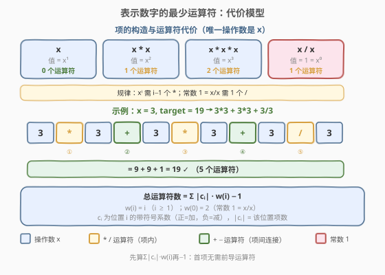
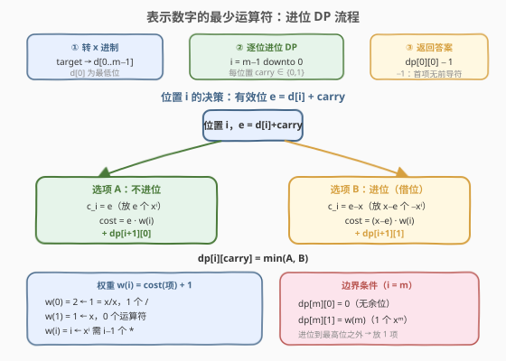
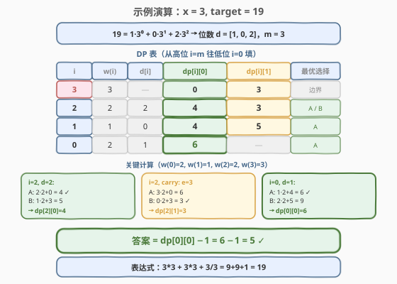

# 表示数字的最少运算符

- **题目名称**：表示数字的最少运算符
- **链接**：[964. 表示数字的最少运算符](https://leetcode.cn/problems/least-operators-to-express-number/)
- **难度**：困难
- **标签**：动态规划、数学、贪心

## 1. 题目概述

给定正整数 $x$，我们要写出一个形如 $x\ (op_1)\ x\ (op_2)\ x\ (op_3)\ x\ \cdots$ 的表达式，其中每个运算符 $op_i$ 可以是加、减、乘、除（`+`、`-`、`*`、`/`）之一。

**规则**：

- 除法返回**有理数**（不取整）。
- **无括号**，使用通常的运算优先级（先乘除后加减）。
- **不允许一元负号**（如 `-x` 非法，但 `x - x` 合法）。
- 目标：使表达式值等于 `target`，且**运算符总数最少**。

**示例 1**：

```text
输入：x = 3, target = 19
输出：5
解释：3 * 3 + 3 * 3 + 3 / 3 = 9 + 9 + 1 = 19，共 5 个运算符。
```

**示例 2**：

```text
输入：x = 5, target = 501
输出：8
解释：5 * 5 * 5 * 5 - 5 * 5 * 5 + 5 / 5 = 625 - 125 + 1 = 501，共 8 个运算符。
```

**示例 3**：

```text
输入：x = 100, target = 100000000
输出：3
解释：100 * 100 * 100 * 100 = 10^8，共 3 个运算符。
```

**约束条件**：

- $2 \le x \le 100$
- $1 \le \text{target} \le 2 \times 10^8$

> 💡 唯一的操作数是 $x$。$x^k$ 要靠 $k-1$ 个 `*` 连乘得到，常数 $1$ 要靠 $x/x$ 得到。突破口是把 `target` 转成 $x$ 进制，逐位决策「正向放几项」还是「借位进上去」。

---

## 2. 解题思路

### 2.1 暴力思路

枚举所有可能的表达式树（运算符序列长度从 0 递增），验证是否等于 `target`。每个位置有 4 种运算符选择，长度 $L$ 的序列有 $4^L$ 种组合，加上运算优先级带来的解析复杂度，完全不可行。

> ⚠️ 暴力的瓶颈在于「逐条表达式展开」——但所有表达式共享同一套操作数 $x$，不同表达式的项之间存在**结构重叠**。突破口是：把 `target` 按 $x$ 的幂次拆解，只关心每个幂次位置放几项，不展开具体表达式。

### 2.2 核心观察：代价模型 + 进制拆解 + 进位 DP



#### 第一步：建立代价模型

表达式的结构是**若干个项用 `+`/`-` 连接**，每个项是若干个 $x$ 用 `*`/`/` 连接的乘积。由运算优先级，项内的 `*`/`/` 先算，项间的 `+`/`-` 后算。

**单项代价**——构造值为 $x^i$ 的单项所需的运算符数：

| 项的值 | 写法 | 运算符数 | 记为 $\text{cost}(i)$ |
|--------|------|----------|----------------------|
| $x^1 = x$ | `x` | 0 | $\text{cost}(1) = 0$ |
| $x^2$ | `x * x` | 1 | $\text{cost}(2) = 1$ |
| $x^i\ (i \ge 1)$ | `x * ... * x`（$i$ 个 $x$） | $i - 1$ | $\text{cost}(i) = i - 1$ |
| $x^0 = 1$ | `x / x` | 1 | $\text{cost}(0) = 1$ |

> ⚠️ **常数 1 是特例**：没有 $x^0$ 这个操作数，只能用 $x/x$ 构造，代价是 1 而非 $-1$。

**总代价公式**：若表达式由 $n$ 个项 $t_1, \ldots, t_n$（每个 $t_j = \pm x^{e_j}$）用 $n - 1$ 个 `+`/`-` 连接而成，则总运算符数 $=$ 项内运算符之和 $+$ 项间连接符：

$$\text{总运算符} = \sum_{j=1}^{n} \text{cost}(e_j) + (n - 1)$$

令 $w(i) = \text{cost}(i) + 1$，则 $w(i) = i$（$i \ge 1$），$w(0) = 2$。设位置 $i$ 放了 $|c_i|$ 个项（$c_i$ 带符号：正为加、负为减），总项数 $n = \sum |c_i|$，则：

$$\boxed{\text{总运算符} = \sum_{i} |c_i| \cdot w(i) - 1}$$

> 💡 **$-1$ 的由来**：第一个项前面没有 `+`/`-` 连接符，所以连接符数是 $n - 1$ 而非 $n$。这个 $-1$ 是全局的，最后统一减去。

**验证示例 1**：$x=3$，$\text{target}=19 = 2 \cdot 3^2 + 1 \cdot 3^0$，即 $c_2 = 2,\ c_0 = 1$：

$$\sum |c_i| \cdot w(i) - 1 = 2 \cdot w(2) + 1 \cdot w(0) - 1 = 2 \cdot 2 + 1 \cdot 2 - 1 = 5 \quad \checkmark$$

#### 第二步：将 target 转 $x$ 进制

将 `target` 写成 $x$ 进制：$\text{target} = d_0 + d_1 \cdot x + d_2 \cdot x^2 + \cdots + d_{m-1} \cdot x^{m-1}$，其中 $0 \le d_i < x$。

最直觉的方案是每个位置 $i$ 放 $d_i$ 个 $x^i$（$c_i = d_i$）。但有时**借位更省**：若 $d_i$ 很大（接近 $x$），放 $d_i$ 个项很贵，不如放 $x - d_i$ 个**负项**（$c_i = d_i - x$），再向高位进 1（$d_{i+1}$ 加 1）。这正是「凑整」思想。

**验证示例 2**：$x=5$，$\text{target}=501$，$x$ 进制 $d = [1, 0, 0, 4]$（$501 = 1 + 4 \cdot 125$）：

- 不借位：$c_3 = 4$（4 个 $5^3$）。代价 $= 4 \cdot w(3) = 4 \times 3 = 12$，太贵。
- 借位：$c_3 = 4 - 5 = -1$（减 1 个 $5^3$），进位使 $c_4 = 1$（1 个 $5^4$）。代价 $= 1 \cdot w(3) + 1 \cdot w(4) = 3 + 4 = 7$，省 5。

#### 第三步：进位 DP

每个位置有两个选择（放 $d_i$ 个正项，或放 $x - d_i$ 个负项并进位），且进位会影响高位，形成**逐位决策 + 进位传递**的结构——经典的数位 DP。

### 2.3 算法流程图



算法三步走：

1. **转 $x$ 进制**：将 `target` 逐位除以 $x$，得到位数 $d[0..m-1]$（$d[0]$ 为最低位）。
2. **逐位 DP**：从高位 $i = m$ 往低位 $i = 0$ 填表。状态 `dp[i][carry]` = 位置 $i \ldots m{-}1$ 在进位标志 `carry` $\in \{0, 1\}$ 下的最小 $\sum |c_j| \cdot w(j)$。
   - 有效位 $e = d[i] + \text{carry}$
   - **选项 A（不进位）**：$c_i = e$，$\text{cost} = e \cdot w(i) + \text{dp}[i{+}1][0]$
   - **选项 B（进位）**：$c_i = e - x$，$|c_i| = x - e$，$\text{cost} = (x - e) \cdot w(i) + \text{dp}[i{+}1][1]$
   - $\text{dp}[i][\text{carry}] = \min(A, B)$
3. **返回答案**：$\text{dp}[0][0] - 1$。

**边界条件**：$\text{dp}[m][0] = 0$（无余位），$\text{dp}[m][1] = w(m)$（进位到最高位之外 → 放 1 个 $x^m$）。

> 💡 **为什么从高位往低位填？** 因为进位是从低位传向高位的——低位的选择（是否进位）决定了高位看到的有效位 $e$。但我们填表时反过来：先算高位 $\text{dp}[i{+}1]$，低位 $\text{dp}[i]$ 根据高位的两个结果做选择。这样每个位置只需看 $d[i]$ 和 `carry`，无需模拟进位传播。

### 2.4 示例演算



以 $x = 3$，$\text{target} = 19$ 为例：

**进制转换**：$19 = 1 \cdot 3^0 + 0 \cdot 3^1 + 2 \cdot 3^2$，位数 $d = [1, 0, 2]$，$m = 3$。

**权重**：$w(0) = 2,\ w(1) = 1,\ w(2) = 2,\ w(3) = 3$。

**从 $i = m = 3$ 往 $i = 0$ 填表**：

| $i$ | $w(i)$ | $d[i]$ | $\text{dp}[i][0]$ | $\text{dp}[i][1]$ | 计算过程 |
|-----|--------|--------|-------------------|-------------------|----------|
| 3 | 3 | — | 0 | 3 | 边界：进位则放 1 个 $3^3$，代价 $w(3)=3$ |
| 2 | 2 | 2 | **4** | **3** | $[0]$: $\min(2{\cdot}2{+}0,\ 1{\cdot}2{+}3) = \min(4,5)=4$（A）；$[1]$: $e{=}3{=}x$，$\min(3{\cdot}2{+}0,\ 0{\cdot}2{+}3) = \min(6,3)=3$（B） |
| 1 | 1 | 0 | **4** | 5 | $[0]$: $\min(0{+}4,\ 3{\cdot}1{+}3) = \min(4,6)=4$（A）；$[1]$: $e{=}1$，$\min(1{+}4,\ 2{\cdot}1{+}3) = \min(5,5)=5$ |
| 0 | 2 | 1 | **6** | — | $[0]$: $\min(1{\cdot}2{+}4,\ 2{\cdot}2{+}5) = \min(6,9)=6$（A） |

**答案**：$\text{dp}[0][0] - 1 = 6 - 1 = \mathbf{5}$。✓

> 💡 **最优路径全选 A（不进位）**：$c_0 = 1,\ c_1 = 0,\ c_2 = 2$，即 $1 \cdot 3^0 + 2 \cdot 3^2 = 1 + 18 = 19$。对应表达式 `3/3 + 3*3 + 3*3`（或 `3*3 + 3*3 + 3/3`），5 个运算符。位置 1 的 $d[1] = 0$ 无需放任何项。

---

## 3. 参考代码

### C++

```cpp
// 964. 表示数字的最少运算符.cpp —— 进制转换 + 进位 DP
// 编译: g++ -O2 -std=c++17 964.cpp -o leastops
class Solution {
  public:
    int leastOpsExpressTarget(int x, int target) {
        // 将 target 转为 x 进制，d[0] 为最低位
        vector<int> d;
        for (int t = target; t > 0; t /= x)
            d.push_back(t % x);
        int m = d.size();
        // w(i) = i (i>=1)；w(0) = 2（常数 1 = x/x 需 1 个 /）
        auto w = [](int i) { return i >= 1 ? i : 2; };
        // 滚动：dp0 = dp[i+1][0], dp1 = dp[i+1][1]
        long long dp0 = 0, dp1 = w(m);       // i = m 的边界
        for (int i = m - 1; i >= 0; --i) {
            int e0 = d[i];                    // carry = 0 时的有效位
            int e1 = d[i] + 1;                // carry = 1 时的有效位
            long long next0 = min((long long)e0 * w(i) + dp0,
                                  (long long)(x - e0) * w(i) + dp1);
            long long next1 = min((long long)e1 * w(i) + dp0,
                                  (long long)(x - e1) * w(i) + dp1);
            dp0 = next0;
            dp1 = next1;
        }
        return dp0 - 1;                       // 首项无前导运算符，全局 -1
    }
};
```

### Python

```python
class Solution:
    def leastOpsExpressTarget(self, x: int, target: int) -> int:
        # 将 target 转为 x 进制，d[0] 为最低位
        d = []
        t = target
        while t > 0:
            d.append(t % x)
            t //= x
        m = len(d)
        # w(i) = i (i>=1)；w(0) = 2
        def w(i):
            return i if i >= 1 else 2
        # 滚动：dp0 = dp[i+1][0], dp1 = dp[i+1][1]
        dp0, dp1 = 0, w(m)                    # i = m 的边界
        for i in range(m - 1, -1, -1):
            e0, e1 = d[i], d[i] + 1           # carry=0 / carry=1 的有效位
            next0 = min(e0 * w(i) + dp0, (x - e0) * w(i) + dp1)
            next1 = min(e1 * w(i) + dp0, (x - e1) * w(i) + dp1)
            dp0, dp1 = next0, next1
        return dp0 - 1                        # 首项无前导运算符，全局 -1
```

> ⚠️ **C++ 溢出注意**：$x \le 100$，$w(i) \le 28$，$e \le 100$，单步乘积 $\le 2800$，累加 $\le 28 \times 2800 \approx 8 \times 10^4$，用 `long long` 绰绰有余。关键是 `(long long)` 强转避免 `int` 乘法溢出（虽然本题数据范围下 `int` 也够，但 `long long` 更安全）。

> 💡 **滚动数组**：`dp[i]` 只依赖 `dp[i+1]`，压成两个变量 `dp0`/`dp1`。每轮同时算 `next0`/`next1`（都读旧的 `dp0`/`dp1`），再一起更新，避免覆盖。

---

## 4. 复杂度分析

| 维度 | 复杂度 | 说明 |
|------|--------|------|
| **时间复杂度** | $O(\log_x \text{target})$ | 位数 $m = \lfloor \log_x \text{target} \rfloor + 1$，每位 $O(1)$ 两个选择 |
| **空间复杂度** | $O(\log_x \text{target})$ | 存 $x$ 进制位数 $d$；滚动后 DP 只用 $O(1)$ 额外空间 |
| **数据范围** | $m \le 28$ | $\text{target} \le 2 \times 10^8$，$x \ge 2$ → $m \le 28$，极快 |

> 💡 本题时间复杂度是对数级的——位数 $m$ 很小（最多 28），即使 `target` 扩大到 $10^{18}$ 也只需约 60 次迭代。

---

## 5. 扩展：递归记忆化写法

除了从高位往低位填的迭代 DP，也可以用**自顶向下的递归 + 记忆化**，从 `target` 出发逐层除以 $x$，更贴近「进制拆解」的直觉：

```python
from functools import lru_cache

class Solution:
    def leastOpsExpressTarget(self, x: int, target: int) -> int:
        @lru_cache(maxsize=None)
        def dfs(t: int, k: int) -> int:
            """返回位置 k.. 的最小 Σ|cⱼ|·w(j)，t 为待表示的剩余值。"""
            if t == 0:
                return 0
            wk = k if k >= 1 else 2          # w(k)
            if t < x:
                # 基准：t 是当前位置的digit
                # A: 放 t 个正项；B: 放 x-t 个负项 + 进位(1个 x^{k+1})
                wnext = k + 1                 # w(k+1) = k+1 (k+1 >= 1)
                return min(t * wk, (x - t) * wk + wnext)
            q, r = divmod(t, x)
            # A: r 个正项 + 递归处理 q
            # B: (x-r) 个负项 + 递归处理 q+1（进位）
            return min(r * wk + dfs(q, k + 1),
                       (x - r) * wk + dfs(q + 1, k + 1))
        return dfs(target, 0) - 1
```

**递归 vs 迭代对比**：

| 维度 | 迭代 DP | 递归记忆化 |
|------|---------|-----------|
| 方向 | 高位 → 低位 | 低位 → 高位（除 $x$ 递进） |
| 状态数 | $O(m)$（每位 2 个） | $O(m)$（`lru_cache` 去重） |
| 基准处理 | `dp[m][1] = w(m)` 显式边界 | `t < x` 时直接算，避免无限递归 |
| 可读性 | 表格填充，直观 | 贴近数学递推，优雅 |

> ⚠️ **递归的基准陷阱**：当 $t < x$ 时必须单独处理——否则选项 B 的进位会使 $q + 1 = 1 < x$，再次进入 $t < x$ 分支的选项 B，形成 $t = 1$ 的无限进位链。基准中直接用 $w(k+1) = k+1$ 表示「进位到 $k+1$ 就放 1 个 $x^{k+1}$」，终止递归。

---

## 6. 面试要点

1. **为什么总代价是 $\sum |c_i| \cdot w(i) - 1$？$-1$ 从哪来？**

   每个项 $x^{e_j}$ 内部需 $\text{cost}(e_j)$ 个运算符（`*`/`/`），$n$ 个项之间需 $n - 1$ 个 `+`/`-` 连接。总运算符 $= \sum \text{cost}(e_j) + (n - 1) = \sum (\text{cost}(e_j) + 1) - 1 = \sum w(e_j) - 1$。$-1$ 是因为**首项前面没有连接符**。按位置聚合：位置 $i$ 有 $|c_i|$ 个项，贡献 $|c_i| \cdot w(i)$，求和后减 1。

2. **借位（进位）为什么能省运算符？**

   当某位 $d_i$ 接近 $x$ 时，放 $d_i$ 个正项代价 $= d_i \cdot w(i)$；改为放 $x - d_i$ 个负项（代价 $(x - d_i) \cdot w(i)$）并向高位进 1（高位多 1 个项，代价 $w(i+1)$）。当 $d_i$ 较大时 $x - d_i \ll d_i$，节省超过 $w(i+1)$ 的额外开销。本质是「**用少量负项凑整，换高位的 1 个正项**」。

3. **DP 为什么只需要 2 个状态（carry = 0 / 1）？**

   进位最多为 1：每位 $d_i < x$，选项 B 产生的进位是 $+1$，叠加到下一位使 $e = d_{i+1} + 1 \le x$。即使 $e = x$，选项 B 再进位也只产生 $+1$（$c_i = 0$，代价 0）。所以进位永远不会超过 1，两状态足够。

4. **常数 1（$x^0$）的代价为什么是 2 而不是 1？**

   $w(0) = \text{cost}(0) + 1 = 1 + 1 = 2$。$\text{cost}(0) = 1$ 是因为 $1 = x/x$ 需要 1 个 `/`。而 $w(0) = 2$ 意味着「放 1 个常数 1 项」在 $\sum |c_i| \cdot w(i)$ 中贡献 2——1 个 `/`（项内）$+$ 1 个 `+`/`-`（项间连接，首项除外）。这就是为什么 $x = \text{target}$ 时答案为 0（单写 `x`），而 $\text{target} = 1$ 时答案为 1（写 `x/x`）。

5. **为什么不直接用贪心，而要 DP？**

   贪心（每位独立选更便宜的）会失败，因为**进位会传播**：某位借位后，高位 $d_{i+1}$ 变成 $d_{i+1} + 1$，可能触发再借位。例如 $x = 5$，$d = [\ldots, 4]$ 时，低位借位使 $e = 5 = x$，此时选项 B 代价为 0（不放项，继续进位），这是贪心无法预见的连锁效应。DP 的 `carry` 状态恰好捕获了这种传播。

> 💡 **一句话总结**：964 的核心是**将 target 转 $x$ 进制，每位做「正向放 vs 借位进」的二选一 DP**。代价模型 $w(i) = i$（$i \ge 1$）、$w(0) = 2$ 是推导的关键，进位传播用 `carry` 状态捕获，最后全局 $-1$ 修正首项无前导符。

---

## 7. 同类练习题

- [168. Excel表列名称](https://leetcode.cn/problems/excel-sheet-column-title/)（[题解](../0001-0100/168_Excel表列名称.md)）：1-indexed 进制转换，与本题的 $x$ 进制转换 + 借位处理有相似的「非标准进位」难点（先减 1 再取余）
- [400. 第 N 位数字](https://leetcode.cn/problems/nth-digit/)（[题解](../0301-0400/400_第N位数字.md)）：按位数分层定位，与本题「按 $x$ 的幂次分层拆解 target」的逐位处理思想同源
- [279. 完全平方数](https://leetcode.cn/problems/perfect-squares/)（[题解](../0201-0300/279_完全平方数.md)）：最少项数 DP，与本题「最少运算符」的最优化目标同构（最小化凑成目标的项数）
- [343. 整数拆分](https://leetcode.cn/problems/integer-break/)（[题解](../0301-0400/343_整数拆分.md)）：切分型 DP，与本题「将 target 拆成 $x$ 的幂之和」的拆分思想相关
- [166. 分数到小数](https://leetcode.cn/problems/fraction-to-recurring-decimal/)（[题解](../0101-0200/166_分数到小数.md)）：长除法逐位模拟 + 进位/余数传递，与本题的逐位进位 DP 有相似的数位处理结构
