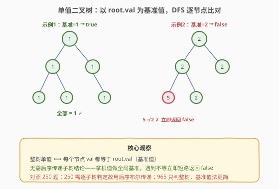
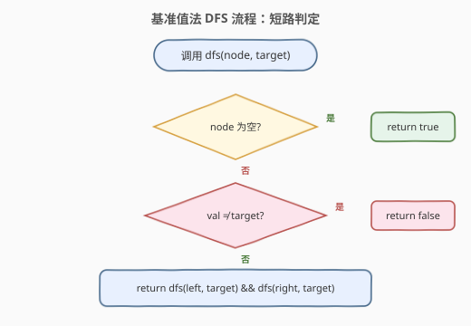
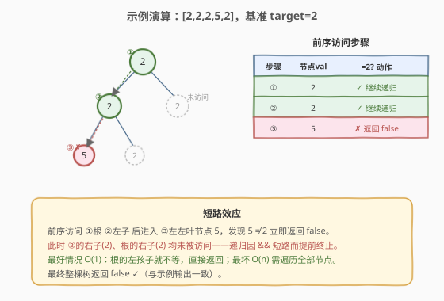

# LeetCode 单值二叉树 题解

## 1. 题目概述

- **标题 / 题号**：单值二叉树（#965，easy）
- **链接**：https://leetcode.cn/problems/univalued-binary-tree/
- **难度**：简单
- **标签**：树、二叉树、深度优先搜索、广度优先搜索

**题意**：如果二叉树**每个节点都具有相同的值**，那么该二叉树就是单值二叉树。只有给定的树是单值二叉树时，才返回 `true`；否则返回 `false`。

**示例 1**：

```text
输入：root = [1,1,1,1,1,null,1]
输出：true

        1
       / \
      1   1
     / \   \
    1   1   1
```

所有节点值均为 `1`，是单值二叉树。

**示例 2**：

```text
输入：root = [2,2,2,5,2]
输出：false

        2
       / \
      2   2
     / \
    5   2
```

左下叶子节点值为 `5`，与其余节点的 `2` 不一致，不是单值二叉树。

**约束**：

- 给定树的节点数范围是 `[1, 100]`。
- 每个节点的值都是整数，范围为 `[0, 99]`。

> 💡 本题是 [250. 统计同值子树](../0201-0300/250_统计同值子树.md) 的「退化单子树」版：250 要统计**所有**同值子树的数量（需逐子树判定），而 965 只问**整棵树**是否同值——只需拿根值当全局基准做一次遍历即可，无需后序布尔传递，是树形判定的入门题。

## 2. 解题思路

### 2.1 朴素思路：收集所有值再判重

最直观的做法：任意遍历（前序/中序/后序/BFS 均可）把所有节点值收集到一个列表，再用集合去重——若集合大小为 `1` 即单值。

```python
vals = []
def dfs(node):
    if node:
        vals.append(node.val)
        dfs(node.left); dfs(node.right)
dfs(root)
return len(set(vals)) == 1
```

时间 $O(n)$，能过。但有两个浪费：

1. **空间 $O(n)$**：必须存下全部值才能判重，而判定单值其实只需记住一个基准值；
2. **无法提前终止**：即便根的左孩子就不等，也得把整棵树遍历完。

> ⚠️ 更糟的暴力是「对每个节点重新遍历子树检查是否全等」，$O(n^2)$，完全没利用任何结构——这里不展开。

### 2.2 核心观察：基准值法 + 短路 DFS



**关键洞察**：整棵树单值，等价于**每个节点的值都等于 `root.val`**。

> 整树单值 ⟺ ∀ node, `node.val == root.val`

于是只需拿 `root.val` 作**基准值** `target`，做一次 DFS：遇到任何 `node.val != target` 立即返回 `false` 并停止递归（短路）；全部遍历完仍无异议则返回 `true`。

> 💡 **为什么 965 不需要 250 那套「后序布尔传递」？** 250 要对**每个子树**分别判定是否同值，子树结论必须向上传给父节点，故用后序返回值。965 只关心**整棵树**这一个结论，基准值 `root.val` 是全局常量，任意遍历序都能直接比对——前序最自然（先看根再递归孩子），且天然支持短路。

### 2.3 算法流程图



**DFS 完整步骤**（函数 `dfs(node, target)` 返回 `bool`）：

1. **空节点**：返回 `true`（空子树不妨碍「所有节点值相同」——空真为真）；
2. **值不等**：若 `node.val != target`，返回 `false`（发现异值，整树必非单值）；
3. **值相等**：递归 `dfs(left, target) && dfs(right, target)`，两子树都单值才返回 `true`。

> ⚠️ **短路的威力**：第 3 步用 `&&` 连接，左子树返回 `false` 时右子树根本不会被访问。最好情况 $O(1)$（根的左孩子就不等），最坏 $O(n)$。

### 2.4 示例演算

以 `root = [2,2,2,5,2]`、`target = 2` 为例，前序 DFS 访问过程：



| 前序访问 | 节点值 | `== 2`? | 动作 |
|---------|--------|---------|------|
| ① 根 | 2 | ✓ | 继续递归左子 |
| ② 左子 | 2 | ✓ | 继续递归左左叶 |
| ③ 左左叶 | 5 | ✗ | **立即返回 `false`** |

到 ③ 时发现 `5 != 2`，递归沿调用链返回 `false`。此时 ② 的右子（值 2）与根的右子（值 2）**均未被访问**——`&&` 短路使整棵右子树被跳过。最终结果 `false` ✓。

> 💡 **对照示例 1**：`[1,1,1,1,1,null,1]` 全为 1，前序遍历访问每个节点都满足 `val == 1`，无短路发生，遍历完整棵树后返回 `true`。这是「最坏情况」$O(n)$，但也是「全部一致」的唯一情形。

## 3. 参考代码

### C++

```cpp
class Solution {
  public:
    bool isUnivalTree(TreeNode* root) {
        if (!root) return true;
        int target = root->val;
        return dfs(root, target);
    }

    bool dfs(TreeNode* node, int target) {
        if (!node) return true;                  // 空节点：空真为真
        if (node->val != target) return false;   // 发现异值，短路返回
        return dfs(node->left, target) &&
               dfs(node->right, target);         // 两子树都单值才真
    }
};
```

### Python

```python
class Solution:
    def isUnivalTree(self, root: Optional[TreeNode]) -> bool:
        if not root:
            return True
        target = root.val

        def dfs(node: Optional[TreeNode]) -> bool:
            if not node:
                return True                     # 空节点：空真为真
            if node.val != target:
                return False                    # 发现异值，短路返回
            return dfs(node.left) and dfs(node.right)  # 两子树都单值才真

        return dfs(root)
```

> 💡 两版等价。`target` 在入口处取 `root.val` 后作为闭包常量传入递归，无需每层重新取根值。`&&` / `and` 的短路语义保证了「一假即停」。

## 4. 复杂度分析

| 维度 | 复杂度 | 说明 |
|------|--------|------|
| 时间复杂度 | $O(n)$ | 最坏情况遍历全部 $n$ 个节点；最好情况 $O(1)$（根的左孩子就不等即短路） |
| 空间复杂度 | $O(h)$ | 递归栈深度 = 树高 $h$；平衡树 $O(\log n)$，退化链状 $O(n)$ |
| 最坏情况 | $O(n)$ 时间 / 空间 | 树退化为单侧链且全部同值时，递归深度与遍历数均达 $n$ |

> ⚠️ 朴素收集法的时间也是 $O(n)$，但空间是 $O(n)$（需存全部值）且无提前终止。基准值法把空间压到 $O(h)$ 并引入短路——**时间渐进相同，常数与空间更优**，是「同复杂度阶下的工程改进」。

## 5. 扩展：BFS 与「与孩子比对」两种变体

### 5.1 BFS 写法

DFS 递归不是唯一选择，BFS（层序）同样能做基准值比对，适合树极深（递归栈溢出风险）的场景：

```python
from collections import deque

class Solution:
    def isUnivalTree(self, root: Optional[TreeNode]) -> bool:
        if not root:
            return True
        target = root.val
        q = deque([root])
        while q:
            node = q.popleft()
            if node.val != target:
                return False            # 发现异值立即返回
            if node.left:
                q.append(node.left)
            if node.right:
                q.append(node.right)
        return True
```

时间 $O(n)$，空间 $O(w)$（$w$ 为树的最大宽度，最坏 $O(n)$）。与 DFS 的 $O(h)$ 空间互补——**宽树用 DFS 更省，深树用 BFS 更稳**。

### 5.2 不传基准值：直接与孩子比对

也可以不显式存 `target`，而在每个节点处检查「孩子值是否等于自己」：

```python
class Solution:
    def isUnivalTree(self, root: Optional[TreeNode]) -> bool:
        if not root:
            return True
        left_ok = (not root.left or
                   (root.left.val == root.val and self.isUnivalTree(root.left)))
        right_ok = (not root.right or
                    (root.right.val == root.val and self.isUnivalTree(root.right)))
        return left_ok and right_ok
```

> 💡 这版更接近 250 的「与孩子比对」骨架，但不返回子树结论——它只是把基准值比对**分散到每条父子边**上：每条边都验证 `child.val == parent.val`，等价于全树等值（值沿边逐层相等 ⟺ 全部等于根值）。逻辑等价，但可读性不如基准值法直观，**面试推荐基准值法**。

## 6. 面试要点

1. **为什么拿 `root.val` 作基准值就够？**

   > 整树单值的定义是「所有节点值相同」。若所有节点值都等于某个基准 $c$，则它们两两相等；反之若两两相等，则任取根值作 $c$ 必然满足。取 `root.val` 作基准是最自然的选择——它一定在树中，且入口即可获得。

2. **本题和 250（统计同值子树）的本质区别？**

   > 965 只判**整棵树**这一个布尔结论，基准值是全局常量，任意遍历序都能直接比对，前序 + 短路即可。250 要对**每个子树**分别计数，子树结论必须向上传递给父节点，故必须用后序 + 布尔返回值。965 是 250 的「单子树退化」版——把 250 的 `dfs` 调用到根节点看返回值，恰好就是 965 的答案。

3. **短路 `&&` 在这里起什么作用？**

   > `dfs(left) && dfs(right)`：左子树返回 `false` 时，右子树不会被访问。这使得「发现异值后立即停止」，避免无意义遍历。最好情况 $O(1)$（根的左孩子不等），最坏 $O(n)$（全树同值需遍历完）。注意短路是**性能优化**，不改变最坏复杂度。

4. **空节点为什么返回 `true`？**

   > 空子树不含任何节点，「所有节点值相同」对空集空真为真（vacuous truth）。更实际地，空节点不应拖累父节点——若返回 `false`，任何缺左/右子的节点都会被误判为非单值。这与「空树是 BST / 平衡树」的约定一脉相承。

5. **DFS 和 BFS 该选哪个？**

   > 两者时间都是 $O(n)$ 且都支持提前返回。空间上 DFS 为 $O(h)$（递归栈），BFS 为 $O(w)$（队列宽度）。**宽矮树**用 DFS 更省空间，**深窄树**用 BFS 避免栈溢出。面试中树规模小（$n \le 100$），DFS 递归最简洁，推荐首选；被追问「栈溢出」时再上 BFS。

> 💡 **一句话总结**：965 的灵魂是「**全局基准值 + 短路遍历**」——拿 `root.val` 当不变量，任意遍历序逐节点比对，遇异值即停。它用「全局基准」替代了 250 的「后序子树结论传递」，是树形判定题最简的入门形态。

## 同类练习题

| # | 题目 | 与本题的关联 |
|---|------|-------------|
| 250 | [统计同值子树](https://leetcode.cn/problems/count-univalue-subtrees/)（[题解](../0201-0300/250_统计同值子树.md)） | 本题的「逐子树计数」升级版，需后序布尔返回值传递子树同值性，965 是其单子树退化 |
| 100 | [相同的树](https://leetcode.cn/problems/same-tree/) | 同步递归两棵树逐节点比对，是本题「与基准值比对」的双树版本（把「与 root.val 比」换成「与另一棵树对应节点比」） |
| 226 | [翻转二叉树](https://leetcode.cn/problems/invert-binary-tree/) | 同样的前序 DFS 递归骨架，体现「自顶向下逐节点处理」的树形遍历入门套路 |
| 687 | [最长同值路径](https://leetcode.cn/problems/longest-univalue-path/) | 「同值」概念在路径维度上的延伸，需后序传递以本节点为端点的同值路径长度，与 965 的「同值判定」互为表里 |
| 101 | [对称二叉树](https://leetcode.cn/problems/symmetric-tree/) | 递归比对左右子树是否镜像，同样利用「逐节点比对 + 短路」的判定骨架 |
