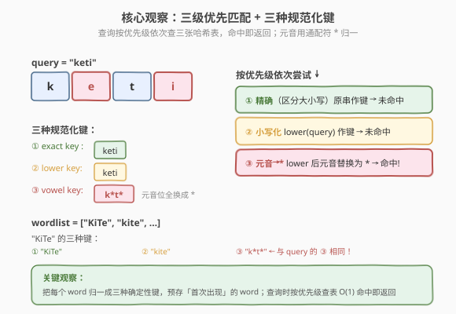
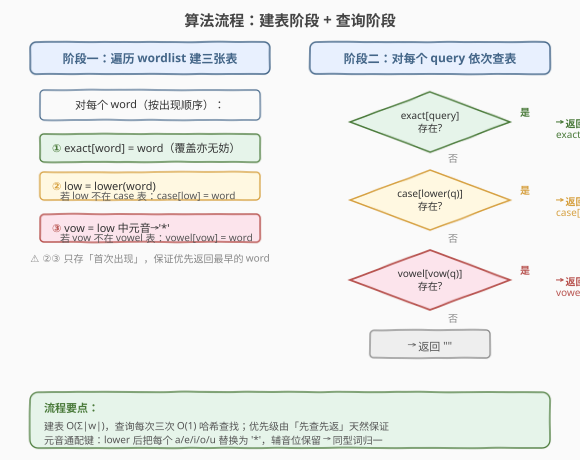
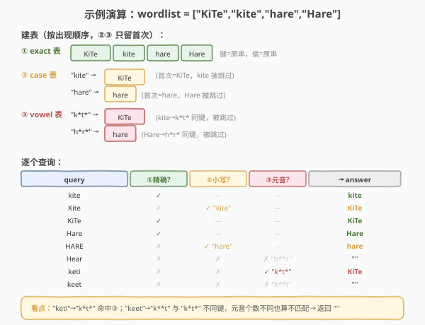

# 元音拼写检查器

- **题目名称**：元音拼写检查器
- **链接**：[966. 元音拼写检查器](https://leetcode.cn/problems/vowel-spellchecker/)
- **难度**：中等
- **标签**：哈希表、字符串

## 1. 题目概述

给定单词列表 `wordlist` 和查询列表 `queries`，对每个查询单词 `query`，按下列**优先级**返回正确单词：

1. **精确匹配**（区分大小写）：`query` 与 `wordlist` 中某单词完全相同 → 返回该单词；
2. **大小写不敏感匹配**：`query` 与某单词忽略大小写后相同 → 返回 `wordlist` 中**第一个**这样的匹配项；
3. **元音错误匹配**：把 `query` 和单词中的元音 `('a','e','i','o','u')` 都视作「可任意替换的通配位」后（仍忽略大小写）能匹配 → 返回 `wordlist` 中**第一个**这样的匹配项；
4. 都不匹配 → 返回 `""`。

> 💡 **元音替换的精确含义**：把 `query` 中每个元音**分别**替换成**任意一个**元音后能与某单词匹配即可。等价地说——把 `query` 和单词都小写化，再把所有元音位统一抹成同一个通配符，两者归一后的「模式」相同即视为匹配。注意**元音个数必须相同**（位置一一对应），多一个少一个都不算匹配。

**示例 1**：

```text
输入：wordlist = ["KiTe","kite","hare","Hare"], queries = ["kite","Kite","KiTe","Hare","HARE","Hear","hear","keti","keet","keto"]
输出：["kite","KiTe","KiTe","Hare","hare","","","KiTe","","KiTe"]
解释：
- "kite"   → 精确命中 wordlist[1]              → "kite"
- "Kite"   → 大小写不敏感命中 wordlist[0] "KiTe" → "KiTe"
- "KiTe"   → 精确命中 wordlist[0]              → "KiTe"
- "Hare"   → 精确命中 wordlist[3]              → "Hare"
- "HARE"   → 大小写不敏感命中 wordlist[2] "hare" → "hare"
- "Hear"   → 三级都不命中                      → ""
- "hear"   → 三级都不命中                      → ""
- "keti"   → 元音通配命中 "KiTe"（k*t*）        → "KiTe"
- "keet"   → 元音通配模式 k**t ≠ k*t*           → ""
- "keto"   → 元音通配命中 "KiTe"（k*t*）        → "KiTe"
```

**示例 2**：

```text
输入：wordlist = ["yellow"], queries = ["YellOw"]
输出：["yellow"]
解释：大小写不敏感命中（元音位无差异也归第二级处理）。
```

**约束条件**：

- $1 \le \text{wordlist.length}, \text{queries.length} \le 5000$
- $1 \le \text{wordlist[i].length}, \text{queries[i].length} \le 7$
- `wordlist[i]` 和 `queries[i]` 只包含英文字母

> ⚠️ **数据规模要点**：单词长度上限仅 7，但 `wordlist` 和 `queries` 各可达 5000。若对每个 query 在 `wordlist` 里线性扫描比对，最坏 $5000 \times 5000 \times 7 \approx 1.75 \times 10^8$ 次字符比较，会超时。必须把匹配判定降到 $O(1)$——这正是哈希表的用武之地。

---

## 2. 解题思路

### 2.1 暴力思路

对每个 `query`，按优先级在 `wordlist` 里从头扫描：

- 先找有没有完全相等的；找不到再找忽略大小写相等的（返回首个）；再找不到就把 `query` 与每个单词做「元音通配比对」（忽略大小写 + 元音位任意），返回首个匹配的；都没有返回 `""`。

单次元音通配比对 $O(L)$，整体 $O(Q \cdot N \cdot L)$，$Q=N=5000$、$L=7$ 时约 $1.75 \times 10^8$，常数虽小但有超时风险，且代码啰嗦。问题根源在于「**重复判定**」——同样的 `query`、同样的 `word` 被反复比对。

### 2.2 核心观察：三种规范化键 + 预建三张哈希表



把「匹配判定」从**查询时逐个比对**转变为**建表时预处理 + 查询时 $O(1)$ 查表**，关键是给每个单词定义**三种确定性的规范化键**：

| 键类型 | 规范化函数 | 哈希表 | 存储策略 |
|--------|-----------|--------|---------|
| **exact** | $f_1(w) = w$（原串） | `exact` | 键→值都是原串；精确命中直接返回 |
| **case** | $f_2(w) = \text{lower}(w)$ | `case` | 键为小写串，值存**首次出现**的 `word` |
| **vowel** | $f_3(w) = \text{lower}(w)$ 中元音替换为 `'*'` | `vowel` | 键为元音通配模式，值存**首次出现**的 `word` |

> 💡 **为何 ②③ 只存「首次出现」？** 题目要求大小写匹配和元音匹配都返回 `wordlist` 中**第一个**这样的匹配项。遍历 `wordlist` 时按出现顺序处理，只在键不存在时写入，天然让哈希表里存的就是「最早出现的那个」——无需排序或额外记下标。

**元音通配键的构造**：把小写串里每个属于 `aeiou` 的字符换成 `'*'`，辅音位原样保留。于是：

- `"KiTe"` → `lower` → `"kite"` → 元音位 `i`、`e` 换 `*` → `"k*t*"`
- `"keti"` → `"k*ti"`？错！注意 `"keti"` 小写后是 `k-e-t-i`，元音位是第 2、4 位 → `"k*t*"` ✓
- `"keto"` → `"k*t*"` ✓（与上同模式，故都命中 `"KiTe"`）
- `"keet"` → `k-e-e-t` → `"k**t"`（两个连续元音位），与 `"k*t*"` **不同键** → 不匹配 ✓

这正解释了示例中 `"keet"` 返回 `""` 而 `"keti"`/`"keto"` 命中 `"KiTe"`：**元音个数必须相同**，多一个少一个归一后的 `*` 个数/位置就不同。

### 2.3 算法流程图



**阶段一·建表**（遍历 `wordlist` 一次）：

1. `exact[word] = word`（精确表直接覆盖无妨，因为精确命中返回的就是该 word 本身）；
2. `low = lower(word)`；若 `low` 不在 `case` 表，则 `case[low] = word`；
3. `vow = low` 中元音替换为 `'*'`；若 `vow` 不在 `vowel` 表，则 `vowel[vow] = word`。

**阶段二·查询**（对每个 `query`，按优先级依次查表，命中即返回）：

1. 若 `query` 在 `exact` 表 → 返回 `exact[query]`；
2. 否则若 `lower(query)` 在 `case` 表 → 返回 `case[lower(query)]`；
3. 否则若 `vowel_key(query)` 在 `vowel` 表 → 返回 `vowel[vowel_key(query)]`；
4. 否则返回 `""`。

> 💡 **优先级由「先查先返」天然保证**：三张表独立，查询时按 ①→②→③ 顺序尝试，第一个命中的级别就是答案级别，无需在一张表里混存级别。`exact` 表存了所有出现（含重复），故精确级总能命中正确的那一个（即使是后出现的重复词，精确匹配返回它自己也合题意）。

### 2.4 示例演算



以 `wordlist = ["KiTe","kite","hare","Hare"]` 为例，建表结果：

| 表 | 内容 |
|----|------|
| `exact` | `{"KiTe":"KiTe", "kite":"kite", "hare":"hare", "Hare":"Hare"}` |
| `case` | `{"kite":"KiTe", "hare":"hare"}`（`"kite"` 首次是 `"KiTe"`，`"hare"` 首次是 `"hare"`，`"Hare"` 被跳过） |
| `vowel` | `{"k*t*":"KiTe", "h*r*":"hare"}`（`"kite"`→`"k*t*"` 同键被跳过，`"Hare"`→`"h*r*"` 同键被跳过） |

逐查询（摘关键行）：

- `"Hear"` → 精确无 → `lower="hear"` 不在 `case` → `vowel="h**r"`（两个元音位）不在 `vowel`（表里只有 `h*r*`）→ `""` ✓
- `"keti"` → 精确无 → `lower="keti"` 不在 `case` → `vowel="k*t*"` 在 `vowel` → `"KiTe"` ✓
- `"keet"` → `vowel="k**t"` ≠ `"k*t*"` → `""` ✓

最终输出 `["kite","KiTe","KiTe","Hare","hare","","","KiTe","","KiTe"]`，与官方一致。

---

## 3. 参考代码

### C++

```cpp
class Solution {
  public:
    vector<string> spellchecker(vector<string>& wordlist, vector<string>& queries) {
        unordered_map<string, string> exact, ci, vowel;

        for (const string& w : wordlist) {
            exact[w] = w;
            string low = toLower(w);
            if (!ci.count(low)) ci[low] = w;
            string vk = vowelKey(low);
            if (!vowel.count(vk)) vowel[vk] = w;
        }

        vector<string> ans;
        ans.reserve(queries.size());
        for (const string& q : queries) {
            if (exact.count(q)) {
                ans.push_back(exact[q]);
                continue;
            }
            string low = toLower(q);
            if (ci.count(low)) {
                ans.push_back(ci[low]);
                continue;
            }
            string vk = vowelKey(low);
            if (vowel.count(vk)) {
                ans.push_back(vowel[vk]);
                continue;
            }
            ans.push_back("");
        }
        return ans;
    }

  private:
    static string toLower(const string& s) {
        string t = s;
        for (char& c : t) c = tolower((unsigned char)c);
        return t;
    }
    static string vowelKey(const string& low) {
        string t = low;
        for (char& c : t)
            if (c == 'a' || c == 'e' || c == 'i' || c == 'o' || c == 'u') c = '*';
        return t;
    }
};
```

### Python

```python
class Solution:
    def spellchecker(self, wordlist: List[str], queries: List[str]) -> List[str]:
        exact, ci, vowel = {}, {}, {}
        vowels = set("aeiou")

        for w in wordlist:
            exact[w] = w
            low = w.lower()
            if low not in ci:
                ci[low] = w
            vk = "".join("*" if c in vowels else c for c in low)
            if vk not in vowel:
                vowel[vk] = w

        ans = []
        for q in queries:
            if q in exact:
                ans.append(exact[q])
                continue
            low = q.lower()
            if low in ci:
                ans.append(ci[low])
                continue
            vk = "".join("*" if c in vowels else c for c in low)
            if vk in vowel:
                ans.append(vowel[vk])
                continue
            ans.append("")
        return ans
```

> 💡 **三个实现细节**：
> 1. **三张表用同一份 `wordlist` 一次遍历建好**，避免反复扫描；`exact` 表直接覆盖（`=`）无妨，因为精确命中返回的是该 word 自身，重复词谁覆盖谁都对。
> 2. **②③ 用 `if key not in dict` 守卫**，保证只存「首次出现」，从而返回值天然是最早的 `word`，无需记下标。
> 3. **`vowelKey` 只在小写串上做**：元音判定只判小写 `aeiou` 五个即可，因为 `toLower` 已统一大小写，避免同时判 `AEIOU` 的繁琐。

---

## 4. 复杂度分析

| 维度 | 复杂度 | 说明 |
|------|--------|------|
| 时间复杂度 | $O((N + Q) \cdot L)$ | 建表遍历 $N$ 个单词每个 $O(L)$ 归一；查询 $Q$ 个每个 $O(L)$ 归一 + 三次 $O(1)$ 哈希查找 |
| 空间复杂度 | $O(N \cdot L)$ | 三张哈希表共存 $O(N)$ 条键值对，每条长度 $O(L)$ |

其中 $N, Q \le 5000$、$L \le 7$，总字符操作约 $7 \times 10^4$ 量级，远低于暴力法的 $1.75 \times 10^8$，轻松通过。

---

## 5. 扩展：为何元音通配用「逐位替换」而非「去元音」？

一个常见的错误思路是：把元音**全部删掉**再比小写串，以为这样也能判定元音错误。但这会引入假阳性：

- `"keet"` 去元音 → `"kt"`；`"kite"` 去元音 → `"kt"`。两者相同，于是 `"keet"` 会被误判为命中 `"KiTe"`。

然而题意说「把 `query` 中元音**分别**替换为任何元音后能匹配」。要把 `"keet"` 替换成 `"kite"`，需要把第 3 位的 `e` 变成 `t`——但 `t` 不是元音，无法通过「替换元音为元音」实现。**因此元音位的位置必须一一对应**：只有「元音位所在下标完全相同」的两个词才能互相替换。

「逐位替换为 `*`」恰好保留了元音位的**位置信息**：辅音位原样保留，元音位统一成 `*`。于是两个词归一后相同 $\iff$ 辅音完全一致且元音位下标集合相同 $\iff$ 可通过逐位替换元音相互转化：

- `"keet"` → `"k**t"`（元音在第 2、3 位）；`"kite"` → `"k*t*"`（元音在第 2、4 位）。两键不同 → 正确地不匹配 ✓
- `"keti"` → `"k*t*"`；`"kite"` → `"k*t*"`。两键相同 → 正确匹配 ✓

而「去元音」丢失了元音位的位置与个数，会把 `"keet"` 和 `"kite"` 错误地归为同一类。**保留位置信息**是本题的关键洞察。

---

## 6. 面试要点

1. **为什么需要三张独立的哈希表，而不是一张？**

   三级匹配的**优先级**和**返回值来源**不同：精确级返回 `word` 自身（重复词谁命中返回谁），大小写级和元音级都返回「首次出现的 `word`」。若混存成一张表，难以在一次查找里同时表达「精确优先于大小写优先于元音」且各自取首个。三张表 + 查询时按序尝试，逻辑清晰且每张表语义单一。

2. **②③ 表为什么只存「首次出现」？**

   题目明确要求大小写匹配和元音匹配返回 `wordlist` 中**第一个**这样的匹配项。建表时按出现顺序遍历，用 `if key not in dict` 守卫，让先到的 `word` 占住键，后来的同键词自动被忽略——这样查询时取到的值天然就是最早的，无需额外记下标或事后排序。

3. **元音通配键为什么是「逐位替换为 `*`」而不是「删除元音」？**

   「逐位替换」保留了元音位的**位置与个数**：两个词归一后相同 $\iff$ 辅音完全一致且元音位下标集合相同 $\iff$ 能通过逐位替换元音相互转化。「删除元音」会丢位置信息，把 `"keet"`（元音在第 2、3 位）和 `"kite"`（元音在第 2、4 位）误判为同类，产生假阳性。

4. **精确级为什么允许 `exact` 表被重复词覆盖？**

   精确匹配返回的是 `word` 自身，重复词的值就是它自己，谁覆盖谁都正确——查询 `query` 精确命中时返回 `exact[query] = query` 本身。这与 ②③「取首个」的语义不冲突，因为精确级不存在「选哪个」的歧义。

5. **如果 `wordlist` 里同一个 `word` 出现多次，大小写级会返回哪个？**

   返回**第一次出现**的那个 `word`。因为 `case[low]` 在 `low` 首次出现时写入后就不再更新。例如 `wordlist = ["Ab", "ab"]`，`case["ab"] = "Ab"`，查询 `"AB"` 返回 `"Ab"`（第一个），符合题意。

---

## 7. 同类练习题

- [49. 字母异位词分组](https://leetcode.cn/problems/group-anagrams/)：同样「规范化到标准键 + 哈希分组」范式，把每串排序成规范键后归组，与本题「三套规范化键」思路一致
- [205. 同构字符串](https://leetcode.cn/problems/isomorphic-strings/)（[站内题解](../0201-0300/205_同构字符串.md)）：用双射哈希把两串归约到同一编码判定同构，对照本题「归一到通配模式」判定等价
- [929. 独特的电子邮件地址](https://leetcode.cn/problems/unique-email-addresses/)（[站内题解](../0901-1000/929_独特的电子邮件地址.md)）：字符串规范化（截断 `+`、删 `.`）+ 哈希去重，与本题「确定性归一函数 + 哈希表」同套路
- [819. 最常见的单词](https://leetcode.cn/problems/most-common-word/)：字符串清洗（去标点、小写化）+ 哈希计数，规范化思想的另一应用
