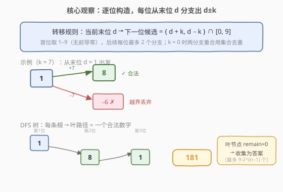
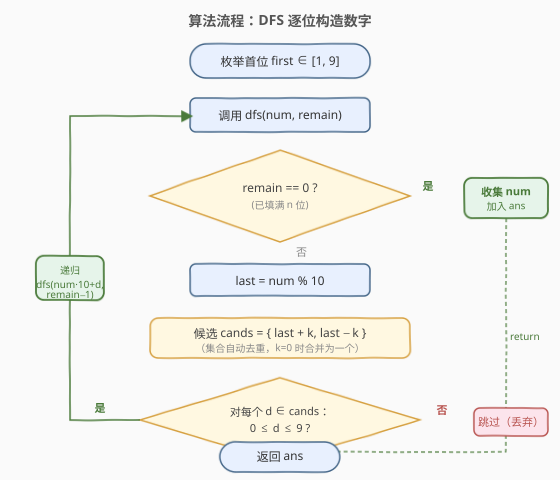
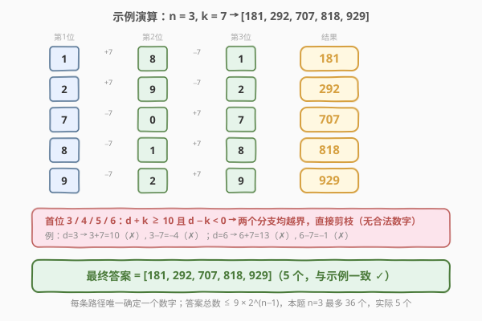

# LeetCode 连续差相同的数字 题解

## 1. 题目概述

- **标题 / 题号**：连续差相同的数字（#967，medium）
- **链接**：https://leetcode.cn/problems/numbers-with-same-consecutive-differences/
- **难度**：中等
- **标签**：深度优先搜索、广度优先搜索、回溯

**题意**：返回所有长度为 $n$ 且满足**每两个连续位上的数字之间的差的绝对值为 $k$** 的非负整数。

> ⚠️ **前导零限制**：除了数字 `0` 本身之外，答案中的每个数字都**不能有前导零**。例如 `01` 无效，但 `0` 有效。由于约束 $n \ge 2$，首位必为 $1$–$9$，`0` 永远不会出现在首位。

**示例 1**：

```text
输入：n = 3, k = 7
输出：[181,292,707,818,929]
解释：注意，070 不是一个有效的数字，因为它有前导零。
```

**示例 2**：

```text
输入：n = 2, k = 1
输出：[10,12,21,23,32,34,43,45,54,56,65,67,76,78,87,89,98]
```

**示例 3**：

```text
输入：n = 2, k = 0
输出：[11,22,33,44,55,66,77,88,99]
```

**示例 4**：

```text
输入：n = 2, k = 2
输出：[13,20,24,31,35,42,46,53,57,64,68,75,79,86,97]
```

**约束**：

- $2 \le n \le 9$
- $0 \le k \le 9$

> 💡 $n \le 9$、每位仅 $0$–$9$ 共 10 个数字，且从任意末位出发的合法后继**至多 2 个**（$d+k$ 与 $d-k$）。这天然构成一棵深度为 $n$、分叉 $\le 2$ 的搜索树，叶子总数 $\le 9 \times 2^{n-1} \le 2304$，DFS/BFS 完全可行。

## 2. 解题思路

### 2.1 暴力思路

枚举所有 $n$ 位十进制数（共 $9 \times 10^{n-1}$ 个），逐一检查相邻两位差的绝对值是否都等于 $k$。对 $n = 9$ 需检查约 $9 \times 10^8$ 个数，每个检查 $O(n)$，总计 $\sim 8 \times 10^9$ 次操作，超时。

> ⚠️ 暴力的浪费在于「无视约束地展开全部数字再过滤」——绝大多数数字在第二位就违反了 $|d_i - d_{i-1}| = k$，却仍被完整枚举。突破口是**边构造边用约束剪枝**：只沿合法分支深入。

### 2.2 核心观察：逐位构造的 DFS 搜索树



将问题建模为一棵**搜索树**：

- **第 1 层（根）**：首位取 $1$–$9$（无前导零），共 9 个起点。
- **第 $i$ 层（$i \ge 2$）**：对上一层末位 $d$，下一位候选为 $d + k$ 与 $d - k$，**仅保留落在 $[0, 9]$ 内的**。
- **叶节点（第 $n$ 层）**：从根到叶拼接出的 $n$ 位数即一个合法答案。

> 💡 **关键观察一**：从末位 $d$ 出发的合法后继**至多 2 个**——$d + k$（若 $\le 9$）和 $d - k$（若 $\ge 0$）。树的分叉 $\le 2$，深度 $n \le 9$，叶子总数 $\le 9 \times 2^{n-1} \approx 2304$，规模极小。

> 💡 **关键观察二（$k = 0$ 去重）**：当 $k = 0$ 时 $d + k = d - k = d$，两个候选相同，会生成重复数字（如 `111` 被收集两次）。解法是**用集合去重**（Python `{d+k, d-k}`）或**当 $k = 0$ 时只取一个分支**（C++ 显式跳过）。示例 3 的 $k=0$ 正体现这一点：每位都和首位相同，结果是 `11, 22, ..., 99`。

> 💡 **关键观察三（前导零自动避免）**：首位只取 $1$–$9$，后续位虽可取 $0$（如 $n=2,k=2$ 时的 `20`、$n=3,k=7$ 时的 `707`），但 $0$ 只出现在非首位，永远不构成前导零。无需额外处理。

**状态转移**：设当前已构造的前缀为 $\text{num}$，剩余需填 $\text{remain}$ 位，末位为 $\text{last} = \text{num} \bmod 10$，则：

$$\text{next}(\text{num}, \text{last}) = \{\, \text{num} \times 10 + d \mid d \in \{\text{last}+k,\ \text{last}-k\} \cap [0,9] \,\}$$

### 2.3 算法流程图



算法步骤：

1. **枚举首位**：对 $\text{first} \in [1, 9]$，调用 $\text{dfs}(\text{first},\ n-1)$。
2. **递归 dfs(num, remain)**：
   - 若 $\text{remain} = 0$：将 $\text{num}$ 加入答案，返回。
   - 否则取 $\text{last} = \text{num} \bmod 10$，计算候选 $\{\text{last}+k,\ \text{last}-k\}$（去重）。
   - 对每个落在 $[0, 9]$ 内的候选 $d$，递归 $\text{dfs}(\text{num} \times 10 + d,\ \text{remain}-1)$。
3. **返回**收集到的全部答案。

> 💡 **为何是树而非图？** 状态 $\text{num}$ 每步严格增长（左移一位再补数），不会回退、不会重复访问同一前缀，因此无环、无环检测需求，比一般 DFS 更简单。

### 2.4 示例演算



以 $n = 3,\ k = 7$ 为例，逐首位展开 DFS 树：

| 首位 | 第 2 位（$\text{last}\pm 7$） | 第 3 位 | 结果 |
|------|------------------------------|---------|------|
| 1 | 8（$1+7$；$1-7=-6$ ✗） | 1（$8-7$；$8+7=15$ ✗） | **181** |
| 2 | 9（$2+7$；$2-7=-5$ ✗） | 2（$9-7$；$9+7=16$ ✗） | **292** |
| 3 | $3+7=10$ ✗，$3-7=-4$ ✗ | — | 剪枝 |
| 4 | $11$ ✗，$-3$ ✗ | — | 剪枝 |
| 5 | $12$ ✗，$-2$ ✗ | — | 剪枝 |
| 6 | $13$ ✗，$-1$ ✗ | — | 剪枝 |
| 7 | 0（$7-7$；$7+7=14$ ✗） | 7（$0+7$；$0-7=-7$ ✗） | **707** |
| 8 | 1（$8-7$；$8+7=15$ ✗） | 8（$1+7$；$1-7=-6$ ✗） | **818** |
| 9 | 2（$9-7$；$9+7=16$ ✗） | 9（$2+7$；$2-7=-5$ ✗） | **929** |

求和得 $\mathbf{[181, 292, 707, 818, 929]}$，与示例一致。

> 💡 **$k=7$ 的特点**：$k$ 越大，$d \pm k$ 越容易越界，分支越少。$k=7$ 时首位 $3$–$6$ 的两个候选全部越界（$d+7 \ge 10$ 且 $d-7 < 0$），直接剪枝，无任何后代。而 $k=1$ 时几乎所有分支都合法（仅 $0-1$ 与 $9+1$ 越界），叶子最多。

## 3. 参考代码

### C++

```cpp
// 967. 连续差相同的数字.cpp —— DFS 逐位构造 + 剪枝
// 编译: g++ -O2 -std=c++17 967.cpp -o numsSameConsecDiff
class Solution {
  public:
    vector<int> numsSameConsecDiff(int n, int k) {
        vector<int> ans;
        for (int first = 1; first <= 9; ++first)   // 首位 1-9，无前导零
            dfs(first, n - 1, k, ans);
        return ans;
    }
  private:
    void dfs(int num, int remain, int k, vector<int>& ans) {
        if (remain == 0) {                         // 已填满 n 位
            ans.push_back(num);
            return;
        }
        int last = num % 10;
        if (last + k <= 9)                         // 分支一：d + k
            dfs(num * 10 + (last + k), remain - 1, k, ans);
        if (k != 0 && last - k >= 0)               // 分支二：d - k（k=0 时与分支一重复，跳过）
            dfs(num * 10 + (last - k), remain - 1, k, ans);
    }
};
```

### Python

```python
class Solution:
    def numsSameConsecDiff(self, n: int, k: int) -> List[int]:
        ans = []
        def dfs(num: int, remain: int) -> None:
            if remain == 0:
                ans.append(num)
                return
            last = num % 10
            for d in {last + k, last - k}:          # 集合自动去重（k=0 时合并为一个）
                if 0 <= d <= 9:
                    dfs(num * 10 + d, remain - 1)
        for first in range(1, 10):                  # 首位 1-9，无前导零
            dfs(first, n - 1)
        return ans
```

> 💡 **两种语言的去重策略**：
> - **Python** 用集合字面量 `{last + k, last - k}`，$k=0$ 时两元素相等自动合并为一个，写法最简洁。
> - **C++** 显式判断 `k != 0` 才走第二分支，避免引入 `unordered_set` 的开销，且语义清晰。

> ⚠️ **整数大小**：$n \le 9$ 时最大数字 $\le 999\,999\,999 < 2^{31}$，`int` 不会溢出。若 $n$ 扩展到 $\ge 10$，C++ 需改用 `long long`。

## 4. 复杂度分析

| 维度 | 复杂度 | 说明 |
|------|--------|------|
| **时间复杂度** | $O(2^n)$ | 搜索树分叉 $\le 2$、深度 $n$，节点总数 $\le 9 \times (2^n - 1) < 4608$；每个节点 $O(1)$ 处理 |
| **空间复杂度** | $O(n)$ | 递归栈深度 $n$（不含答案存储）；答案本身占 $O(2^n)$ 但属输出空间 |
| **答案规模** | $\le 9 \times 2^{n-1}$ | $n=9, k=1$ 时最大约 $2304$ 个数字 |

> 💡 $n \le 9$ 时 $2^9 = 512$，即使乘以 9 个起点也仅千级，DFS 毫无压力。复杂度瓶颈完全在输出规模本身——任何算法都至少要 $\Omega(|\text{ans}|)$ 来写出答案。

## 5. 扩展：BFS 层序构造

DFS 是「一条路径走到底再回溯」，BFS 则「按位数一层层扩展」，两者访问的节点集合相同，只是顺序不同。

**思路**：维护当前层（长度为 $i$ 的所有合法前缀），逐层向下一层扩展——对每个前缀的末位 $d$ 追加 $d \pm k$ 落在 $[0,9]$ 内的候选。

```python
class Solution:
    def numsSameConsecDiff(self, n: int, k: int) -> List[int]:
        cur = list(range(1, 10))            # 第 1 层：首位 1-9
        for _ in range(n - 1):              # 还需扩展 n-1 层
            nxt = []
            for num in cur:
                last = num % 10
                for d in {last + k, last - k}:
                    if 0 <= d <= 9:
                        nxt.append(num * 10 + d)
            cur = nxt                        # 进入下一层
        return cur                           # 第 n 层即全部答案
```

**DFS vs BFS 对比**：

| 维度 | DFS（递归） | BFS（层序） |
|------|------------|------------|
| 时间 | $O(2^n)$ | $O(2^n)$ |
| 空间 | $O(n)$ 递归栈 | $O(2^n)$ 当层队列 |
| 输出顺序 | 深度优先（同前缀聚拢） | 层序（同位数聚拢） |
| 实现 | 递归天然回溯 | 显式队列/列表 |
| 适用 | 需要路径语义、剪枝灵活 | 需按层处理、求最短/最小层数 |

> 💡 本题 DFS 与 BFS 等价（都要遍历整棵树），选哪个看口味。面试中 DFS 更常见，因为代码更短且递归语义直观；若被追问「能否迭代」，BFS 是自然的替代。

## 6. 面试要点

1. **为什么首位只取 $1$–$9$？后续位为什么可以取 $0$？**

   题目禁止前导零（除 `0` 本身外），而 $n \ge 2$ 时首位为 $0$ 的「数字」（如 `012`）实际是 $12$，位数不足 $n$，无效。故首位必须 $1$–$9$。后续位取 $0$ 完全合法——例如 $n=2,k=2$ 的 `20`、$n=3,k=7$ 的 `707`，$0$ 在非首位不构成前导零。

2. **$k = 0$ 时如何避免重复？**

   $k=0$ 时 $d+k = d-k = d$，两个候选相同，会沿同一分支递归两次产生重复数字。Python 用集合 `{last+k, last-k}` 自动合并；C++ 用 `if (k != 0 && ...)` 显式跳过第二分支。两者都保证每位只扩展一次相同候选。

3. **为什么是搜索树而不是图？需要 visited 集合吗？**

   状态 $\text{num}$ 每步执行 $\text{num} \times 10 + d$，严格单调增长，绝不会回到更小的前缀，因此搜索空间无环。无需 `visited` 去环，比一般图 DFS 更简单。若把状态定义为「末位 $d$」，则确实会重复经过同一末位（如 $1 \to 8 \to 1$ 中末位 $1$ 出现两次），但它们前缀不同、代表不同数字，不是真正的「重复状态」。

4. **DFS 和 BFS 哪个更好？**

   本题两者等价（都要遍历整棵树，时间 $O(2^n)$）。DFS 空间 $O(n)$（递归栈），BFS 空间 $O(2^n)$（当层队列），DFS 略优。但 $n \le 9$ 时差异可忽略。面试建议先写 DFS（代码短、语义直观），被追问再给出 BFS 迭代版。

5. **如果 $n$ 很大（如 $n = 10^5$）怎么办？**

   此时不能枚举所有数字（$2^{10^5}$ 天文数字）。若只需求**方案数**而非全部数字，可转为计数 DP：$\text{dp}[i][d]$ = 长度 $i$、末位 $d$ 的合法数字个数，转移 $\text{dp}[i][d] = \text{dp}[i-1][d-k] + \text{dp}[i-1][d+k]$（边界内），$O(10n)$ 时间、$O(1)$ 空间，进一步可用矩阵快速幂优化到 $O(\log n)$。这与 935. 骑士拨号器的计数 DP 同源——本题是「枚举所有方案」，935 是「统计方案数」。

> 💡 **一句话总结**：967 的核心是**把「相邻位差为 $k$」的约束转化为搜索树的分支规则（$d \to d \pm k$），用 DFS 边构造边剪枝**。前导零靠首位 $1$–$9$ 自动规避，$k=0$ 靠集合去重。$n \le 9$ 规模极小，DFS/BFS 均可。

## 同类练习题

| # | 题目 | 与本题的关联 |
|---|------|-------------|
| 17 | [电话号码的字母组合](https://leetcode.cn/problems/letter-combinations-of-a-phone-number/)（[站内题解](../0001-0100/17_电话号码的字母组合.md)） | 同为「逐位构造 + DFS 回溯」，每位候选由映射表决定，与本题「每位候选由末位 $\pm k$ 决定」结构同构 |
| 129 | [求根节点到叶节点数字之和](https://leetcode.cn/problems/sum-root-to-leaf-numbers/)（[站内题解](../0101-0200/129_求根节点到叶节点数字之和.md)） | DFS 前缀累积构造数字（$\text{num} \times 10 + d$），与本题的数字拼接方式完全一致，区别仅在分支来自树结构而非差值约束 |
| 935 | [骑士拨号器](https://leetcode.cn/problems/knight-dialer/)（[站内题解](935_骑士拨号器.md)） | 同为「按位构造数字 + 末位决定后继」，但求方案数用计数 DP，与本题「枚举全部方案」互为对照——同一转移结构的两种问法 |
| 257 | [二叉树的所有路径](https://leetcode.cn/problems/binary-tree-paths/)（[站内题解](../0201-0300/257_二叉树的所有路径.md)） | DFS 收集所有根到叶路径，与本题「收集搜索树所有根到叶路径」的回溯模板同源，叶节点即答案 |
