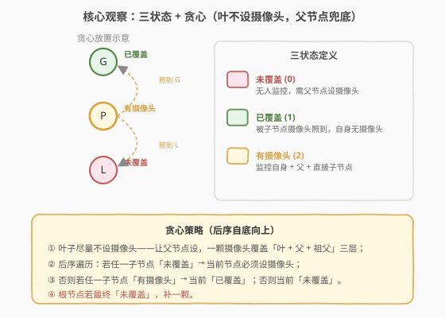
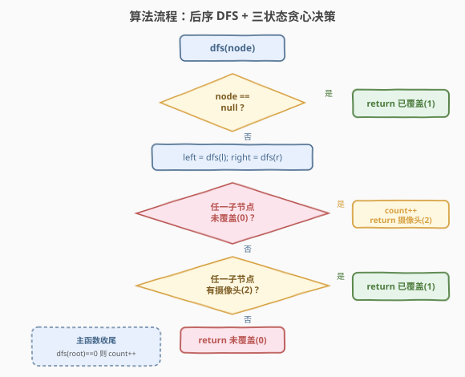

# LeetCode 监控二叉树 题解

## 1. 题目概述

- **标题 / 题号**：监控二叉树（#968，hard）
- **链接**：https://leetcode.cn/problems/binary-tree-cameras/
- **难度**：困难
- **标签**：树、二叉树、深度优先搜索、动态规划、贪心

**题意**：给定一个二叉树，我们在树的节点上安装摄像头。节点上的每个摄像头都可以监视**它的父节点、它自身以及它的直接子节点**。请计算监控整棵树所需的**最少摄像头数量**。

**示例 1**：

```text
输入：root = [0,0,null,0,0]
输出：1
解释：如图所示，一颗摄像头（蓝色节点）足以监控所有节点。
    0
   /
  0      ← 摄像头装在此节点，可监视父、自身、两子
 / \
0   0
```

**示例 2**：

```text
输入：root = [0,0,null,0,0,0,null,null,null,0,0]
输出：2
解释：需要两颗摄像头。
        0
       /
      0          ← 摄像头 ⑤
     / \
    0   0        ← 右内节点装摄像头 ④
       / \
      0   0
```

**约束**：

- 树中节点的数量在范围 $[1, 1000]$ 内
- 树中每个节点的值都为 $0$

> 💡 本题是「**树形贪心 / 树形 DP**」的招牌题。每个节点只有三种角色：未覆盖、已覆盖、有摄像头。从叶向根做后序遍历，只在「不得不放」时才放摄像头——这是贪心能取到最优的关键，也是它与 [337. 打家劫舍 III](../0301-0400/337_打家劫舍III.md) 同属「后序 + 状态返回值」家族的体现。

## 2. 解题思路

### 2.1 暴力思路：枚举每个节点放或不放

最朴素的想法是：对每个节点决定「放摄像头」或「不放」，用回溯枚举所有 $2^n$ 种组合，过滤出「所有节点都被监控」的方案，取最少摄像头数。时间 $O(2^n)$，节点稍多就爆炸。

稍加优化可转为树形 DP：对每个节点记录三种状态下的最小摄像头数（见第 5 节扩展），正确但状态转移繁琐。我们需要一个更直观的视角——**贪心**。

> ⚠️ 暴力枚举的问题在于没有利用「摄像头可监视三层」这一结构。事实上，**把摄像头尽量放在中间层**（而非叶子或根）能覆盖更多节点。这个「尽量往上挪一挪」的直觉，正是贪心的起点。

### 2.2 核心观察：三状态 + 贪心（叶不设摄像头，父节点兜底）



为每个节点定义**三种状态**：

| 状态 | 含义 | 颜色 |
|------|------|------|
| **未覆盖 (0)** | 该节点未被任何摄像头监视，需要父节点来兜底 | 红 |
| **已覆盖 (1)** | 该节点被子节点的摄像头监视到，自身无摄像头 | 绿 |
| **有摄像头 (2)** | 该节点自身装有摄像头，可监视父、自身、直接子 | 橙 |

**贪心原则**：摄像头装在叶子节点只能覆盖「叶子 + 父」两层；而装在叶子的父节点能覆盖「叶子 + 父 + 祖父」三层。因此**叶子尽量不设摄像头**，让父节点来兜底——这正是「自底向上」的理由。

具体地，后序遍历（先左、右子，再根）时，根据子节点返回的状态决定当前节点的状态：

> 1. **若任一子节点「未覆盖」** → 当前节点**必须设摄像头**（否则那个未覆盖的孩子永远没人管）→ 返回 `有摄像头(2)`，计数 +1；
> 2. **否则若任一子节点「有摄像头」** → 当前节点被照到了 → 返回 `已覆盖(1)`；
> 3. **否则**（两个子节点都只是「已覆盖」，谁也没摄像头）→ 当前节点没人管 → 返回 `未覆盖(0)`，留给父节点处理。

> 💡 **空节点返回「已覆盖(1)」**：这样叶子节点的两个孩子（null）都是「已覆盖」，叶子既不被迫放摄像头、也不被照到 → 叶子返回 `未覆盖(0)`，恰好驱动其父节点放摄像头。这是整个贪心能从叶子「冷启动」的关键约定。

### 2.3 算法流程图



完整步骤：

1. **`dfs(node)`** 返回该节点的状态（0/1/2）；
2. **空节点**：返回 `1`（已覆盖）——使叶子天然成为「未覆盖」；
3. **递归**：`left = dfs(node.left)`，`right = dfs(node.right)`；
4. **判定一**：若 `left == 0` 或 `right == 0` → `count += 1`，返回 `2`；
5. **判定二**：若 `left == 2` 或 `right == 2` → 返回 `1`；
6. **否则**：返回 `0`；
7. **主函数收尾**：若 `dfs(root) == 0`（根最终未覆盖，没有父节点兜底）→ `count += 1`。

> ⚠️ 第 7 步容易遗漏——根节点没有父节点，若它最终是「未覆盖」，必须自行补一颗。这对应贪心中「最高层无人兜底」的边界。

### 2.4 示例演算

以示例 2 `root = [0,0,null,0,0,0,null,null,null,0,0]` 为例（树形见下图），后序遍历顺序为 ①→⑥：

![示例演算：[0,0,null,0,0,0,null,null,null,0,0] → 2](../images/btcam_walkthrough.svg)

| 步 | 节点 | 左态 | 右态 | 判定 | 当前状态 | count |
|----|------|------|------|------|---------|-------|
| ① | 左叶 | 1(null) | 1(null) | 两子已覆盖、无摄像头 | 未覆盖(0) | 0 |
| ② | 右左叶 | 1(null) | 1(null) | 同上 | 未覆盖(0) | 0 |
| ③ | 右右叶 | 1(null) | 1(null) | 同上 | 未覆盖(0) | 0 |
| ④ | 右内 | 0(②) | 0(③) | 有未覆盖子 → 设摄像头 | 有摄像头(2) | 1 |
| ⑤ | 左内 | 0(①) | 2(④) | 有未覆盖子 → 设摄像头 | 有摄像头(2) | 2 |
| ⑥ | 根 | 2(⑤) | 1(null) | 子有摄像头 → 已覆盖 | 已覆盖(1) | 2 |

根返回 `已覆盖(1)`，无需补摄像头。最终 `count = 2` ✓。

> 💡 **观察贪心的体现**：①②③ 三个叶子都返回「未覆盖」，没有在叶子上浪费摄像头；④ 因两子未覆盖被迫设摄像头（覆盖 ②③ 和 ④ 自身）；⑤ 因左子 ① 未覆盖再设一颗（覆盖 ①、⑤ 自身、以及根）。两颗摄像头覆盖了全部 6 个节点，恰好最优。

## 3. 参考代码

### C++

```cpp
// 监控二叉树.cpp —— 后序 DFS + 三状态贪心
// 编译: g++ -O2 -std=c++17 监控二叉树.cpp -o btcam
class Solution {
    int count = 0;

    // 返回节点状态：0=未覆盖, 1=已覆盖, 2=有摄像头
    int dfs(TreeNode* node) {
        if (!node) return 1;               // 空节点视为已覆盖
        int left  = dfs(node->left);
        int right = dfs(node->right);
        if (left == 0 || right == 0) {     // 有未覆盖的孩子 → 必须设摄像头
            count++;
            return 2;
        }
        if (left == 2 || right == 2) {     // 孩子有摄像头 → 当前已覆盖
            return 1;
        }
        return 0;                          // 孩子都只是已覆盖 → 当前未覆盖
    }

  public:
    int minCameraCover(TreeNode* root) {
        count = 0;
        if (dfs(root) == 0) count++;       // 根若未覆盖，补一颗
        return count;
    }
};
```

### Python

```python
class Solution:
    def minCameraCover(self, root: Optional[TreeNode]) -> int:
        count = 0

        def dfs(node: Optional[TreeNode]) -> int:
            nonlocal count
            if not node:
                return 1                   # 空节点视为已覆盖
            left = dfs(node.left)
            right = dfs(node.right)
            if left == 0 or right == 0:    # 有未覆盖的孩子 → 设摄像头
                count += 1
                return 2
            if left == 2 or right == 2:    # 孩子有摄像头 → 已覆盖
                return 1
            return 0                       # 孩子都只是已覆盖 → 未覆盖

        if dfs(root) == 0:
            count += 1                     # 根未覆盖，补一颗
        return count
```

> 💡 两版完全等价。`dfs` 用返回值传递状态、用 `count` 记副作用——这是「布尔/数值返回 + 副作用计数」的树形统计惯用法，与 [250. 统计同值子树](../0201-0300/250_统计同值子树.md) 的模板一脉相承，只是返回值从 `bool` 升级为三值枚举。

## 4. 复杂度分析

| 维度 | 复杂度 | 说明 |
|------|--------|------|
| 时间复杂度 | $O(n)$ | 每个节点访问一次，每次做 $O(1)$ 状态判定 |
| 空间复杂度 | $O(h)$ | 递归栈深度 = 树高 $h$；平衡树 $O(\log n)$，退化链 $O(n)$ |
| 最坏情况 | $O(n)$ 空间 | 树退化为单侧链时递归深度达 $n$ |

> ⚠️ 贪心的正确性依赖「摄像头覆盖三层」这一条件：装在叶子的父节点能同时覆盖叶子、自身、祖父，永远不劣于装在叶子本身。可用**交换论证**严格证明——任何最优解中若某摄像头装在叶子，把它上移到父节点不会减少覆盖范围，故存在一个所有摄像头都不在叶子的最优解，正是贪心产出的方案。

## 5. 扩展：树形 DP 显式三状态

贪心解法本质上是一棵简化的树形 DP——每个节点维护三种状态，只是转移被压缩成了一条「只在被迫时放」的贪心规则。若把三种状态的最小摄像头数显式写出，就是标准的树形 DP：

对节点 `node`，记：

- $a$：`node` 自身放摄像头时，以其为根的子树的最少摄像头数；
- $b$：`node` 不放摄像头、但被某个子节点的摄像头覆盖时，子树的最少摄像头数；
- $c$：`node` 不放摄像头、且未被任何子节点覆盖（需父节点兜底）时，子树的最少摄像头数。

转移（设左右孩子的对应值为 $a_l, b_l, c_l, a_r, b_r, c_r$）：

$$
\begin{aligned}
a &= 1 + \min(a_l, b_l, c_l) + \min(a_r, b_r, c_r) \\
b &= \min(a_l + \min(a_r, b_r),\ a_r + \min(a_l, b_l)) \\
c &= b_l + b_r
\end{aligned}
$$

- **$a$**：`node` 有摄像头，孩子可以处于任意状态（都会被照到）；
- **$b$**：`node` 被孩子覆盖 → 至少一个孩子有摄像头（$a$），另一个孩子不能未覆盖（否则需 `node` 有摄像头，矛盾）→ 取 $a$ 或 $b$；
- **$c$**：`node` 未被覆盖 → 两个孩子都不能有摄像头（否则 `node` 会被照到），且也不能未覆盖（否则需 `node` 兜底）→ 两子都取 $b$。

答案为 $\min(a_{root}, b_{root})$（根不能处于 $c$，因为没有父节点兜底）。

```python
class Solution:
    def minCameraCover(self, root: Optional[TreeNode]) -> int:
        def dp(node):
            if not node:
                return (float('inf'), 0, float('inf'))
            la, lb, lc = dp(node.left)
            ra, rb, rc = dp(node.right)
            a = 1 + min(la, lb, lc) + min(ra, rb, rc)
            b = min(la + min(ra, rb), ra + min(la, lb))
            c = lb + rb
            return (a, b, c)
        a, b, _ = dp(root)
        return min(a, b)
```

> 💡 **贪心 vs DP**：DP 显式枚举三状态取最小，正确性一目了然但转移公式繁琐；贪心把「$a$ vs $b$ vs $c$ 的取舍」压缩成「只在子节点未覆盖时才放」，利用了「覆盖三层」的结构性质直接得到最优。两者结果相同，面试中**贪心写法更简洁**，DP 可作为「正确性论证」的补充或备选。

## 6. 面试要点

1. **为什么空节点返回「已覆盖(1)」而不是 0 或 2？**

   > 若返回 `0`（未覆盖），叶子会因为「孩子未覆盖」被迫放摄像头——违背「叶不设」的贪心原则；若返回 `2`（有摄像头），叶子会被「孩子有摄像头」判为已覆盖，同样跳过了让父节点兜底的机会。只有返回 `1`（已覆盖），叶子才既不被迫放、也不被照到，恰好成为 `未覆盖(0)`，驱动父节点放摄像头。

2. **贪心为什么是最优的？**

   > 摄像头覆盖「父 + 自身 + 子」三层。装在叶子的父节点比装在叶子多覆盖一层（祖父），所以「不在叶子放」永远不劣。交换论证：任何最优解中装在叶子的摄像头都可上移到其父而不减少覆盖范围，故存在「无叶子摄像头」的最优解，正是贪心产出的方案。更严格地，后序遍历保证「一旦子节点未覆盖就必须在当前节点放」，这是唯一不浪费的选择。

3. **根节点为什么可能需要补一颗？**

   > 根没有父节点。若 `dfs(root)` 返回 `未覆盖(0)`，说明根的子树里没人给它兜底（子节点都只是「已覆盖」，没有摄像头），只能自行补一颗。这是贪心「自底向上」在最高层的边界处理。

4. **贪心和第 5 节的树形 DP 有何关系？**

   > 贪心是 DP 的「特例化简」：DP 显式维护三状态的最小摄像头数并取 $\min$；贪心利用「覆盖三层」的结构，把取舍规则固化为「子未覆盖才放」，省去了 $\min$ 比较。两者等价——贪心的每一步都在执行 DP 的最优转移，只是把「$a$ 何时严格优于 $b, c$」提前判定为「子节点未覆盖时」。

5. **这题和 [337. 打家劫舍 III](../0301-0400/337_打家劫舍III.md) 的套路有何异同？**

   > 同：都是「后序 DFS + 节点返回状态」的树形 DP——子问题结果决定父决策，状态压缩在返回值里向上传递。异：337 的状态是「偷/不偷」二值且偷了父就不能偷子（互斥约束），状态转移是 $\max$；本题状态是三值且约束是「覆盖关系」（摄像头可监视邻居），状态转移是 $\min$ / 贪心。两者都是「树形结构上的局部约束 → 后序传递」范式。

> 💡 **一句话总结**：968 的灵魂是「**三状态 + 后序贪心**」——每个节点返回未覆盖/已覆盖/有摄像头之一，只在子节点未覆盖时被迫放摄像头，把「覆盖三层」的结构性质压成一条贪心规则，一次后序遍历 $O(n)$ 求出最少摄像头数。

## 同类练习题

| # | 题目 | 与本题的关联 |
|---|------|-------------|
| 337 | [打家劫舍 III](https://leetcode.cn/problems/house-robber-iii/)（[题解](../0301-0400/337_打家劫舍III.md)） | 后序 DFS + 二状态返回值（偷/不偷），树形 DP 招牌题，与本题同属「后序传递状态」家族 |
| 250 | [统计同值子树](https://leetcode.cn/problems/count-univalue-subtrees/)（[题解](../0201-0300/250_统计同值子树.md)） | 后序 DFS + 布尔返回值传递子结构结论，本题「数值返回 + 副作用计数」模板的 bool 版前身 |
| 124 | [二叉树中的最大路径和](https://leetcode.cn/problems/binary-tree-maximum-path-sum/)（[题解](../0101-0200/124_二叉树中的最大路径和.md)） | 后序传递子树最大贡献值，在节点处聚合，经典「后序 + 返回值」骨架 |
| 979 | [在二叉树中分配硬币](https://leetcode.cn/problems/distribute-coins-in-binary-tree/) | 后序 DFS 传递子树「过剩/不足」流量，在节点处统计移动次数，与本题同属「后序传递状态 + 副作用累计」范式 |
| 1373 | [二叉搜索子树的最大键值和](https://leetcode.cn/problems/maximum-sum-bst-in-binary-tree/) | 后序 DFS 返回多值状态（是否 BST / 最小 / 最大 / 和），在节点处聚合判定，状态传递更复杂但骨架相同 |
