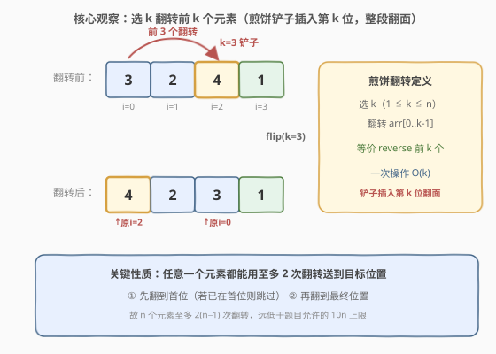

# LeetCode 煎饼排序 题解

## 1. 题目概述

- **标题 / 题号**：煎饼排序（#969，medium）
- **链接**：https://leetcode.cn/problems/pancake-sorting/
- **难度**：中等
- **标签**：数组、排序、贪心、模拟

**题意**：给定一个长度为 $n$ 的整数数组 `arr`，它是 $1$ 到 $n$ 的一个**排列**。要求通过若干次「**煎饼翻转**」操作把数组排序成升序。

> **煎饼翻转**：选择一个整数 $k$（$1 \le k \le n$），将数组**前 $k$ 个元素**整体反转，即对 `arr[0..k-1]` 执行 `reverse`。直观上像用铲子从第 $k$ 张煎饼下方插入、把上面那一摞整体翻面。

返回**任意一个**能使数组最终升序的翻转序列 $[k_1, k_2, \dots, k_m]$。题目只要求结果正确，**翻转序列不唯一**。

**示例 1**：

```text
输入：arr = [3,2,4,1]
输出：[4,2,4,3]
解释：执行 k=4 → [1,4,2,3]；k=2 → [4,1,2,3]；k=4 → [3,2,1,4]；k=3 → [1,2,3,4]。
```

> 💡 注意：示例输出只是**一个合法答案**，本题的合法答案很多，只要执行后数组升序即可。

**示例 2**：

```text
输入：arr = [1,2,3]
输出：[]
解释：数组已经升序，无需任何翻转。
```

**约束**：

- $1 \le n \le 100$
- $1 \le \text{arr}[i] \le n$，且 `arr` 是 $1 \sim n$ 的**排列**（所有元素互异）

> ⚠️ **答案长度限制**：题目保证「在 $10 \cdot n$ 次翻转内一定能排序」。这意味着我们不必追求最优翻转次数，只要给出一个**构造性**的正确序列即可——这大大降低了难度，提示本题是**构造/贪心**题而非最优化题。

## 2. 解题思路

### 2.1 直观思路：模拟选择排序

既然只要求「能排好就行」而非「翻转最少」，最朴素的策略是**选择排序**思想：每一轮把当前未排序部分的最大值送到它最终该在的位置。区别在于，普通选择排序用「交换」搬元素，而这里唯一的搬运工具是「翻转前缀」。

那么如何用前缀翻转把任意一个元素搬到任意目标位置？关键观察见 2.2。

### 2.2 核心观察：两次翻转送一个元素归位



由于排列中**值 $x$ 的最终位置就是下标 $x-1$**（升序排列里 $1$ 放在 $0$ 号位、$2$ 放在 $1$ 号位……$n$ 放在 $n-1$ 号位），我们要做的就是把每个 $x$ 搬到下标 $x-1$。

一次前缀翻转只能改变**前缀**的顺序，无法直接把中间某元素送到尾部。但有一个巧妙的「两段式搬运」：

> 设当前要把值 $x$ 归位到下标 $x-1$，且 $x$ 此刻在下标 $\text{idx}$。
>
> 1. **第①步：把 $x$ 翻到首位。** 若 $\text{idx} \ne 0$，执行 `flip(idx+1)`——翻转前 $\text{idx}+1$ 个元素，原先在下标 $\text{idx}$ 的 $x$ 被翻到下标 $0$。
> 2. **第②步：把 $x$ 翻到目标位。** 执行 `flip(x)`——翻转前 $x$ 个元素，首位的 $x$ 被翻到下标 $x-1$，恰好归位。

这样**每个元素至多 2 次翻转**就能归位。为了避免后续翻转「打乱已归位的元素」，我们**从最大值 $n$ 开始递减归位**：先放好 $n$（翻到末尾），再放 $n-1$（翻到倒数第二位）……因为后归位的元素只动前缀、且翻转长度 $\le$ 当前待归位值 $x$，**不会触及已锁定的尾部**（尾部下标 $\ge x$ 的位置不动）。

> 💡 **为何递减归位能保护尾部？** 归位 $x$ 时执行的最大翻转是 `flip(x)`，只翻转下标 $0 \sim x-1$。而已经归位的 $x+1, x+2, \dots, n$ 都在下标 $x, x+1, \dots, n-1$，完全落在翻转范围之外，因此绝不被破坏。这是「递减 + 前缀翻转」配合的关键。

### 2.3 算法流程图


1. 令 $x$ 从 $n$ 递减到 $1$，对每个 $x$：
2. 找到值 $x$ 的当前下标 $\text{idx}$（线性扫描，或用位置数组 $O(1)$ 查询）。
3. 若 $\text{idx} == x-1$：已归位，跳过本轮。
4. 否则：
   - 若 $\text{idx} \ne 0$：执行 `flip(idx+1)`，记录 $k = \text{idx}+1$（把 $x$ 翻到首位）。
   - 执行 `flip(x)`，记录 $k = x$（把 $x$ 翻到下标 $x-1$ 归位）。
5. 全部归位后返回记录的 $k$ 序列。

> ⚠️ **记录顺序**：必须**先记录 $k$ 再执行翻转**（或同步），且两次翻转的 $k$ 都要记录。若 $\text{idx}=0$（$x$ 已在首位），第①步跳过，只执行第②步 `flip(x)`。

### 2.4 示例演算

![示例演算：arr=[3,2,4,1]，x 从 4 递减，绿色区域从右向左锁定](../images/pancake_sorting_walkthrough.svg)

以 `arr = [3,2,4,1]` 为例，完整追踪如下：

| $x$ | 当前数组 | $\text{idx}$ | 操作 | 归位后 |
|-----|----------|--------------|------|--------|
| 4 | `[3,2,4,1]` | 2 | `flip(3)`→`[4,2,3,1]`，`flip(4)`→`[1,3,2,4]` | `[1,3,2,`**`4`**`]` |
| 3 | `[1,3,2,4]` | 1 | `flip(2)`→`[3,1,2,4]`，`flip(3)`→`[2,1,3,4]` | `[2,1,`**`3,4`**`]` |
| 2 | `[2,1,3,4]` | 0 | 已在首位，跳过第①步，`flip(2)`→`[1,2,3,4]` | `[1,`**`2,3,4`**`]` |
| 1 | `[1,2,3,4]` | 0 | $\text{idx}==x-1==0$，已归位，跳过 | `[`**`1,2,3,4`**`]` |

记录的 $k$ 序列为 $[3,4,2,3,2]$，长度 $5 \le 10 \times 4 = 40$。执行后数组升序 `[1,2,3,4]`。✓

> 💡 **观察「绿色锁定区」**：每归位一个 $x$，右侧就多锁定一格。$x=4$ 时锁定末位，$x=3$ 时锁定倒数第二位……到 $x=1$ 时全部锁定。这正是「递减归位」的视觉效果——锁定区从右向左扩张，前缀翻转永不入侵已锁定区。

## 3. 参考代码

### C++

```cpp
class Solution {
public:
    vector<int> pancakeSort(vector<int>& arr) {
        vector<int> ans;
        int n = arr.size();
        for (int x = n; x >= 1; --x) {
            int idx = 0;
            for (int i = 0; i < n; ++i) {
                if (arr[i] == x) { idx = i; break; }
            }
            if (idx == x - 1) continue;
            if (idx != 0) {
                ans.push_back(idx + 1);
                reverse(arr.begin(), arr.begin() + idx + 1);
            }
            ans.push_back(x);
            reverse(arr.begin(), arr.begin() + x);
        }
        return ans;
    }
};
```

### Python

```python
class Solution:
    def pancakeSort(self, arr: List[int]) -> List[int]:
        ans = []
        for x in range(len(arr), 0, -1):
            idx = arr.index(x)
            if idx == x - 1:
                continue
            if idx != 0:
                ans.append(idx + 1)
                arr[:idx + 1] = arr[:idx + 1][::-1]
            ans.append(x)
            arr[:x] = arr[:x][::-1]
        return ans
```

> 💡 **两个实现细节**：
> 1. **外层从 $n$ 递减**：保证归位顺序从最大值开始，后续翻转长度 $\le x$，不破坏已锁定尾部。若改成从小到大归位，后续翻转会打乱已归位的小值。
> 2. **`idx == x - 1` 提前跳过**：元素恰好在目标位时无需翻转（如示例中 $x=1$）。这能把翻转次数压到下确界，避免无意义的「翻到首位再翻回来」。

> ⚠️ **`arr.index(x)` 的时间**：Python 内层 `arr.index` 是 $O(n)$ 线性扫描，整体 $O(n^2)$。对 $n \le 100$ 完全够用。若追求更优，可用位置数组 `pos` 把查询降到 $O(1)$（见第 5 节），但翻转更新 `pos` 仍是 $O(k)$，总复杂度仍是 $O(n^2)$。

## 4. 复杂度分析

| 维度 | 复杂度 | 说明 |
|------|--------|------|
| 时间复杂度 | $O(n^2)$ | 共 $n$ 轮；每轮找下标 $O(n)$ + 至多两次翻转各 $O(n)$，总计 $O(n^2)$ |
| 空间复杂度 | $O(n)$ | 答案数组至多 $2(n-1)$ 个 $k$ 值；不计答案则 $O(1)$（原地翻转） |
| 翻转次数 | $\le 2(n-1)$ | 每个元素至多 2 次翻转，远低于题目允许的 $10n$ |

> 💡 **为何时间无法低于 $O(n^2)$？** 即使用位置数组把「找下标」降到 $O(1)$，单次前缀翻转 `reverse` 本身是 $O(k)$ 的，而所有翻转的总长度 $\sum k$ 在最坏情况下是 $O(n^2)$ 量级（每轮翻转长度接近 $n$）。故 $O(n^2)$ 是该构造法的本质下界，对 $n \le 100$ 完全无压力。

## 5. 扩展：位置数组优化与翻转次数下界

### 5.1 位置数组 `pos`：把查下标降到 $O(1)$

线性扫描找下标虽简单，但每轮 $O(n)$。可维护一个反向映射 `pos[v] = 值 v 的当前下标`，查询变 $O(1)$。难点在于每次翻转后要同步更新 `pos`——翻转前缀 `arr[0..k-1]` 等价于把这段下标镜像，对应 `pos` 也要镜像更新：

```cpp
// 翻转前 k 个元素，并同步维护 pos 数组
void flip(vector<int>& arr, vector<int>& pos, int k, vector<int>& ans) {
    ans.push_back(k);
    for (int i = 0, j = k - 1; i < j; ++i, --j) {
        swap(arr[i], arr[j]);
        pos[arr[i]] = i;
        pos[arr[j]] = j;
    }
}
```

更新 `pos` 的代价与翻转本身同为 $O(k)$，因此**总复杂度仍是 $O(n^2)$**，只是常数更优、代码更「工程化」。面试中可先写朴素版讲清思路，再被追问时补上 `pos` 优化。

### 5.2 煎饼排序的翻转次数下界

本题只要求 $\le 10n$ 次，构造法给出 $\le 2(n-1)$ 次已绰绰有余。但「**最少翻转次数**」本身是一个经典的难题：

- 已知任意 $n$ 元排列可在**至多 $\frac{5n+5}{3}$ 次**翻转内排序（Gates & Papadimitriou, 1979）。
- 而存在排列**至少需要 $\frac{15n}{14}$ 次翻转**。
- 精确的最少翻转次数（所谓「煎饼数」$P(n)$）至今仍是组合数学中的开放问题，对大 $n$ 无闭式解。

> ⚠️ 本题不考「最少翻转」，只考「合法构造」。若面试官追问「能否做到少于 $2n$ 次」，可回答：构造法给出 $2(n-1)$ 的上界已足够；追求最优是 NP-hard 级别的难题，超出本题范围。这正是题目放宽到 $10n$ 的原因——把「排序正确性」与「翻转最优化」解耦。

## 6. 面试要点

1. **为什么从最大值 $n$ 开始递减归位，而不是从小到大？**

   因为前缀翻转只动前缀、不动尾部。递减归位时，归位 $x$ 的最大翻转是 `flip(x)`，只翻转下标 $0 \sim x-1$，而已归位的 $x+1 \dots n$ 都在下标 $x \dots n-1$，落在翻转范围外，不会被破坏。若从小到大归位，归位 $2$ 后再归位 $3$ 时 `flip(3)` 会把已归位的 $1$、$2$ 一起翻乱。

2. **为什么每个元素至多 2 次翻转就能归位？**

   设 $x$ 在下标 $\text{idx}$。第①步 `flip(idx+1)` 把 $x$ 从下标 $\text{idx}$ 翻到下标 $0$（首位）；第②步 `flip(x)` 把首位的 $x$ 翻到下标 $x-1$（目标位）。若 $\text{idx}=0$ 则第①步可省，只需第②步。故上界是 2 次。

3. **翻转序列不唯一，判题如何保证正确？**

   LeetCode 的判题器会**真正执行你返回的 $k$ 序列**，检查最终数组是否升序，而非比对序列本身。所以任意合法构造都通过。这也是为何示例 1 给出的 `[4,2,4,3]` 与我们的 `[3,4,2,3,2]` 不同——两者执行后都得到升序数组。

4. **题目为什么放宽到 $10n$ 次而非要求最少？**

   最少翻转次数（煎饼数问题）是组合数学难题，对大 $n$ 无高效精确算法。放宽到 $10n$ 把问题从「最优化」降级为「构造」，让中等难度的构造法（$2(n-1)$ 次）足以通过，考察的是**贪心构造能力**而非组合优化。

5. **如果不保证 `arr` 是 $1 \sim n$ 的排列（值域任意），该构造法还成立吗？**

   不成立。构造法依赖「值 $x$ 的目标位是 $x-1$」这一排列性质来定位目标。若值域任意，需先排序得到目标顺序、再建立「值→目标位」映射，或改用「按目标排名归位」（先离散化）。核心的两次翻转搬运技巧仍可用，但「目标下标」需额外计算。

## 同类练习题

| # | 题目 | 与本题的关联 |
|---|------|-------------|
| 912 | [排序数组](https://leetcode.cn/problems/sort-an-array/)（[站内题解](../0901-1000/912_排序数组.md)） | 手撕快排/归并/堆排，对照本题「受限操作下的排序」——912 用任意交换，969 只能用前缀翻转 |
| 31 | [下一个排列](https://leetcode.cn/problems/next-permutation/) | 基于「部分翻转」的构造题，将后段降序翻转成升序的思想与本题前缀翻转同源 |
| 189 | [轮转数组](https://leetcode.cn/problems/rotate-array/) | 用三次 `reverse`（整体翻 + 前段翻 + 后段翻）实现轮转，是前缀翻转操作的另一经典应用 |
| 942 | [增减字符串匹配](https://leetcode.cn/problems/di-string-match/)（[站内题解](../0901-1000/942_增减字符串匹配.md)） | 构造题，贪心放置最大/最小值满足符号约束，与本题「贪心构造合法序列」思路相近 |
