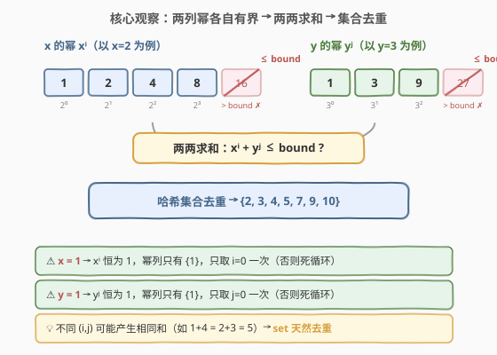
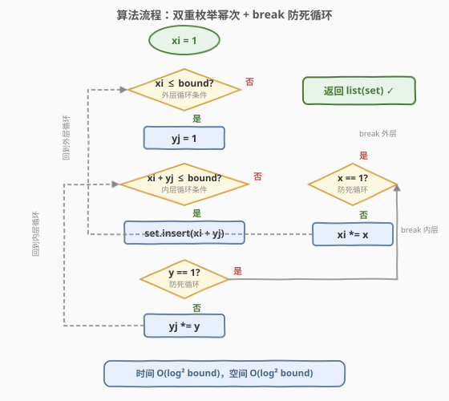
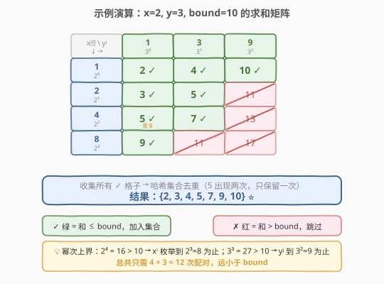

# LeetCode 强整数 题解

## 1. 题目概述

- **标题 / 题号**：强整数（#970，medium）
- **链接**：https://leetcode.cn/problems/powerful-integers/
- **难度**：中等
- **标签**：数学、哈希表、枚举

**题意**：给定三个整数 `x`、`y` 和 `bound`，返回所有值**小于或等于 `bound`** 的**强整数**组成的列表。

如果某一整数可以表示为 $x^i + y^j$，其中整数 $i \ge 0$ 且 $j \ge 0$，那么该整数是一个**强整数**。

可以按**任意顺序**返回答案，每个值**最多出现一次**。

**示例 1**：

```text
输入：x = 2, y = 3, bound = 10
输出：[2, 3, 4, 5, 7, 9, 10]
解释：
2 = 2⁰ + 3⁰
3 = 2¹ + 3⁰
4 = 2⁰ + 3¹
5 = 2¹ + 3¹
7 = 2² + 3¹
9 = 2³ + 3⁰
10 = 2⁰ + 3²
```

**示例 2**：

```text
输入：x = 3, y = 5, bound = 15
输出：[2, 4, 6, 8, 10, 14]
```

**约束**：

- $1 \le x, y \le 100$
- $0 \le bound \le 10^6$

> 💡 **关键约束**：$x, y \ge 1$ 意味着 $x^0 = y^0 = 1$ 恒成立，所以最小的强整数是 $1 + 1 = 2$。当 $bound < 2$ 时结果为空。而 $x = 1$ 或 $y = 1$ 是需要特别处理的边界——底数为 1 时幂恒为 1，不 break 会死循环。

## 2. 解题思路

### 2.1 暴力思路：无脑双重枚举 i, j

最直觉的做法：枚举 $i$ 从 $0$ 开始，$j$ 从 $0$ 开始，计算 $x^i + y^j$，若 $\le bound$ 则加入结果集。

```text
for i = 0, 1, 2, ...:
    for j = 0, 1, 2, ...:
        val = x^i + y^j
        if val <= bound: 加入集合
        else: break 内层
```

问题：**$i$ 和 $j$ 的上界是什么？** 当 $x > 1$ 时 $x^i$ 指数增长，很快超过 $bound$，循环自然终止。但当 $x = 1$ 时 $x^i = 1$ 恒成立，$i$ 可以无限增大——**死循环**。

> 💡 转机：底数为 1 时幂恒为 1，只需取 $i = 0$ 一次。底数 $> 1$ 时幂次上界极小（$\le \log_2(10^6) \approx 20$），枚举总量很少。核心是**正确处理底数为 1 的 break**。

### 2.2 核心观察：幂次有界 + 哈希去重



三个关键观察将问题化繁为简：

1. **幂次上界有限**：$x \ge 2$ 时 $x^i \le bound$ 意味着 $i \le \log_x(bound) \le \log_2(10^6) \approx 20$。即每列幂最多约 20 个值，两两配对最多约 400 次——远小于 $bound$。

2. **底数为 1 时幂恒为 1**：$x = 1$ 时 $x^i = 1$ 对所有 $i$ 成立，只需取 $i = 0$ 一次。若不 break，$x^i$ 永远等于 1，乘以 $x$ 不增长，**死循环**。$y = 1$ 同理。

3. **不同 $(i, j)$ 可能产生相同和**：例如 $x=2, y=3$ 时 $2^0 + 3^1 = 4$ 和 $2^1 + 3^0 = 3$ 不同，但 $2^0 + 3^2 = 10$ 和 $2^3 + 3^0 = 9$ 不同……而 $2^0 + 3^1 = 4$ 唯一。不过更一般地，如 $x=2, y=2$ 时 $2^0 + 2^2 = 5$ 和 $2^2 + 2^0 = 5$ 完全相同。用**哈希集合**天然去重，无需手动判重。

> 💡 **问题转化**：枚举所有 $x^i \le bound$ 和 $y^j \le bound$（底数为 1 时只取一次），双重循环求和，$\le bound$ 的加入 `set`，最后转 `list` 返回。

### 2.3 算法流程图



算法是**两层嵌套循环**，每层都有两道关：

- **外层**（枚举 $x^i$）：循环条件 `xi <= bound`，循环体结束后 `xi *= x` 推进。若 `x == 1` 则 break（否则 `xi` 永远为 1，死循环）。
- **内层**（枚举 $y^j$）：循环条件 `xi + yj <= bound`（直接用和 $\le bound$ 判定，无需单独判 $yj \le bound$），循环体结束后 `yj *= y` 推进。若 `y == 1` 则 break。

每次内层命中（`xi + yj <= bound`）就将和插入集合。两层循环结束后，集合转列表返回。

> ⚠️ **break 的位置**：`if (y == 1) break;` 放在内层循环体**末尾**（插入之后），保证 $y = 1$ 时仍把 $x^i + 1$ 加入集合再退出。`if (x == 1) break;` 同理放在外层末尾。

### 2.4 示例演算



以示例 1（$x=2, y=3, bound=10$）为例，列出所有 $x^i$ 和 $y^j$ 及其两两求和：

| | $y^0 = 1$ | $y^1 = 3$ | $y^2 = 9$ |
|------|-----------|-----------|-----------|
| $x^0 = 1$ | **2** ✓ | **4** ✓ | **10** ✓ |
| $x^1 = 2$ | **3** ✓ | **5** ✓ | 11 ✗ |
| $x^2 = 4$ | **5** ✓（重复） | **7** ✓ | 13 ✗ |
| $x^3 = 8$ | **9** ✓ | 11 ✗ | 17 ✗ |

- $x^4 = 16 > 10$，外层到此为止（只枚举到 $x^3 = 8$）。
- $y^3 = 27 > 10$，内层到此为止（只枚举到 $y^2 = 9$）。
- 绿色格子（和 $\le 10$）收集入集合：$\{2, 3, 4, 5, 7, 9, 10\}$。
- 注意 $5$ 出现两次（$2^0 + 3^1$ 和 $2^1 + 3^0$... 不对，这里是 $1+3=4$ 和 $2+3=5$，以及 $4+1=5$），`set` 自动去重。

> ⚠️ 上表中 $x^0 + y^1 = 1 + 3 = 4$，$x^1 + y^0 = 2 + 1 = 3$；而 $5 = x^1 + y^1 = 2 + 3$ 也 $= x^2 + y^0 = 4 + 1$，确实重复。这正说明了集合去重的必要性。

## 3. 参考代码

### C++

```cpp
class Solution {
  public:
    vector<int> powerfulIntegers(int x, int y, int bound) {
        unordered_set<int> res;
        for (int xi = 1; xi <= bound; xi *= x) {
            for (int yj = 1; xi + yj <= bound; yj *= y) {
                res.insert(xi + yj);
                if (y == 1) break; // y=1 时 y^j 恒为 1，避免死循环
            }
            if (x == 1) break;     // x=1 时 x^i 恒为 1，避免死循环
        }
        return vector<int>(res.begin(), res.end());
    }
};
```

### Python

```python
class Solution:
    def powerfulIntegers(self, x: int, y: int, bound: int) -> List[int]:
        res = set()
        xi = 1
        while xi <= bound:
            yj = 1
            while xi + yj <= bound:
                res.add(xi + yj)
                if y == 1:
                    break          # y=1 时 y^j 恒为 1，避免死循环
                yj *= y
            if x == 1:
                break              # x=1 时 x^i 恒为 1，避免死循环
            xi *= x
        return list(res)
```

> 💡 **一行核心**：`for (xi = 1; xi <= bound; xi *= x)` 同时完成「初始化为 $x^0 = 1$」「判定 $x^i \le bound$」「推进为 $x^{i+1} = x^i \times x$」三件事。`xi *= x` 是幂次的滚动递推，无需调用 `pow()`。内层用 `xi + yj <= bound` 而非 `yj <= bound` 作循环条件——因为我们要的是**和**不超过 `bound`，而非 $y^j$ 单独不超过（虽然两者等价，但前者语义更直接）。

## 4. 复杂度分析

| 维度 | 复杂度 | 说明 |
|------|--------|------|
| **时间复杂度** | $O(\log^2(\text{bound}))$ | 外层 $\le \log_x(\text{bound})$ 次，内层 $\le \log_y(\text{bound})$ 次，乘积 $\le \log_2(10^6)^2 \approx 400$ |
| **空间复杂度** | $O(\log^2(\text{bound}))$ | 哈希集合最多存 $\log_x(\text{bound}) \times \log_y(\text{bound})$ 个不同的和 |

> ⚠️ 严格来说，集合大小不超过 $\min(\text{bound}, \log_x(\text{bound}) \times \log_y(\text{bound}))$。但 $x, y \ge 2$ 时配对数 $\le 400$，而 $x = 1$ 或 $y = 1$ 时退化为 $O(\log(\text{bound}))$。最坏情况是 $x = y = 2$，配对数约 $20 \times 20 = 400$，但很多配对和相同（如 $2^0 + 2^3 = 2^3 + 2^0 = 9$），集合实际更小。

## 5. 扩展：预收集幂列表再配对

上面的写法把「生成幂」和「求和」耦合在双重循环里。也可以**分两步**：先各自收集所有 $\le bound$ 的幂到列表，再双重循环配对——代码更清晰，空间多 $O(\log(\text{bound}))$。

```cpp
class Solution {
  public:
    vector<int> powerfulIntegers(int x, int y, int bound) {
        // 第一步：预收集所有 x^i <= bound
        vector<int> px;
        for (int v = 1; v <= bound; v *= x) {
            px.push_back(v);
            if (x == 1) break;
        }
        // 第二步：预收集所有 y^j <= bound
        vector<int> py;
        for (int v = 1; v <= bound; v *= y) {
            py.push_back(v);
            if (y == 1) break;
        }
        // 第三步：两两求和，去重
        unordered_set<int> res;
        for (int a : px)
            for (int b : py)
                if (a + b <= bound)
                    res.insert(a + b);
        return vector<int>(res.begin(), res.end());
    }
};
```

| 写法 | 优点 | 缺点 |
|------|------|------|
| **内联双重循环**（主代码） | 简洁，一步到位 | 生成与求和耦合 |
| **预收集列表**（扩展） | 逻辑分层清晰，易调试 | 多用 $O(\log(\text{bound}))$ 空间存两个列表 |

> 💡 两种写法时间复杂度相同，面试中内联版更简洁，预收集版更适合讲解时分步说明。若需对结果排序返回，预收集版在最后一步加 `sort` 更自然。

## 6. 面试要点

1. **为什么 $x = 1$ 或 $y = 1$ 时需要 break？**

   - $x = 1$ 时 $x^i = 1^i = 1$ 对所有 $i$ 成立，`xi *= x` 后 `xi` 仍为 1，外层循环条件 `xi <= bound` 永远为真——死循环。
   - `if (x == 1) break;` 在取完 $x^0 = 1$ 后立即退出，保证只枚举一次。$y = 1$ 同理在内层 break。

2. **幂次的上界是多少？需要用 $\log$ 函数计算吗？**

   - 不需要。$x \ge 2$ 时 $x^i$ 指数增长，循环条件 `xi <= bound` 自然终止。$bound \le 10^6$ 时最多约 $\log_2(10^6) \approx 20$ 次迭代。
   - 用 `xi *= x` 滚动递推比调用 `pow(x, i)` 更简洁，且无浮点误差。

3. **为什么用 `set` 而不是直接排序去重？**

   - 不同 $(i, j)$ 可能产生相同和（如 $x=2, y=2$ 时 $2^0 + 2^3 = 2^3 + 2^0$），`set` 在插入时 $O(1)$ 平均去重，无需后续排序。
   - 若要求结果有序，可在 `return` 前对 `vector` 排序，但题目允许任意顺序。

4. **`bound = 0` 时结果是什么？**

   - 空列表。因为最小强整数是 $x^0 + y^0 = 1 + 1 = 2 > 0$。代码中 `xi = 1`，内层条件 `xi + yj <= bound` 即 `2 <= 0` 为假，内层不执行，结果为空。

5. **内层循环条件用 `xi + yj <= bound` 还是 `yj <= bound`？**

   - 两者等价（因为 $xi \ge 1$，$yj \le bound - xi \le bound$），但 `xi + yj <= bound` 语义更直接——我们要的是**和**不超过 `bound`。同时它能在 $yj$ 还没超过 $bound$ 但 $xi + yj$ 已超时提前终止内层，减少无效迭代。

> 💡 **一句话总结**：用滚动递推 `xi *= x`、`yj *= y` 枚举所有不超过 `bound` 的幂，两两求和入 `set` 去重，底数为 1 时 break 防死循环——$O(\log^2(\text{bound}))$ 一步到位。

## 同类练习题

| # | 题目 | 与本题的关联 |
|---|------|-------------|
| 264 | [丑数 II](https://leetcode.cn/problems/ugly-number-ii/)（[站内题解](../0201-0300/264_丑数II.md)） | 三指针多路归并生成只含指定质因子的序列，与本题「枚举幂次生成候选值」思想相通 |
| 231 | [2 的幂](https://leetcode.cn/problems/power-of-two/)（[站内题解](../0201-0300/231_2的幂.md)） | 判定单个数是否为 2 的幂，用 `n & (n-1)` 位运算，与本题「幂次枚举」互补（一个是判定、一个是生成） |
| 254 | [因子的组合](https://leetcode.cn/problems/factor-combinations/)（[站内题解](../0201-0300/254_因子的组合.md)） | 回溯枚举因子组合 + 去重，与本题「枚举 + 集合去重」范式同类 |
| 50 | [Pow(x, n)](https://leetcode.cn/problems/powx-n/)（[站内题解](../0001-0100/50_Powx_n.md)） | 快速幂计算 $x^n$，是幂运算的基础工具，本题用滚动乘法替代了快速幂（因 $n$ 极小） |
| 326 | [3 的幂](https://leetcode.cn/problems/power-of-three/) | 判定单个数是否为 3 的幂，非 2 底数无法用位运算，改用最大幂取模，与 231 对照 |
