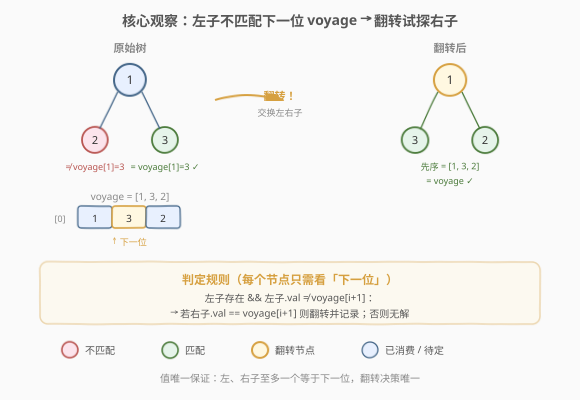
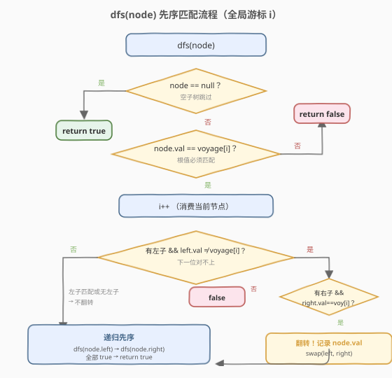
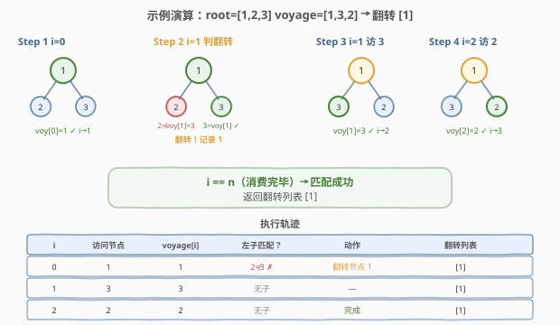

# 翻转二叉树以匹配先序遍历

- **题目名称**：翻转二叉树以匹配先序遍历
- **链接**：[971. 翻转二叉树以匹配先序遍历](https://leetcode.cn/problems/flip-binary-tree-to-match-preorder-traversal/)
- **难度**：中等
- **标签**：树、二叉树、深度优先搜索

## 1. 题目概述

给定一棵有 `n` 个节点的二叉树，每个节点的值互不相同且在 `[1, n]` 范围内。再给定一个长度为 `n` 的整数数组 `voyage`，表示**期望的先序遍历序列**。

你可以对任意节点执行「翻转操作」——交换它的左右子树，次数不限。请返回需要翻转的**节点值列表**（任意顺序）。如果无法使先序遍历结果等于 `voyage`，返回 `[-1]`。

**示例 1**：

```text
输入：root = [1,2], voyage = [2,1]
输出：[-1]
解释：根节点值为 1，但 voyage[0] = 2，根值就不匹配，无解。
```

**示例 2**：

```text
输入：root = [1,2,3], voyage = [1,3,2]
输出：[1]
解释：翻转节点 1（交换子树 2、3），先序遍历变为 [1,3,2]，匹配 voyage。
```

**示例 3**：

```text
输入：root = [1,2,3], voyage = [1,2,3]
输出：[]
解释：无需翻转，原始先序遍历已匹配。
```

**约束条件**：

- 树中节点数目 `n` 范围 `[1, 100]`
- 每个节点值互不相同，且 `1 <= Node.val <= n`
- `voyage.length == n`

> 💡 本题是 [226 翻转二叉树](../0201-0300/226_翻转二叉树.md) 与先序遍历的结合：翻转不再是「全部翻转」，而是「按需翻转」——沿着先序方向走，遇到左子与 `voyage` 下一位对不上时，翻转试探右子。与 [951 翻转等价二叉树](./951_翻转等价二叉树.md) 同属「翻转 + 匹配」家族，但 951 判两棵树等价、本题要求精确还原一串先序序列。

---

## 2. 解题思路

### 2.1 暴力思路：枚举所有翻转组合

对每个节点枚举「翻 / 不翻」，共 $2^n$ 种组合，逐一先序遍历验证是否等于 `voyage`。指数级，完全不可行。

> ⚠️ 翻转可以发生在任意节点，组合爆炸。但翻转的**决策是局部的**——只影响当前节点的左右子谁先被访问。我们只需**沿先序方向逐节点做局部决策**，无需全局枚举。

### 2.2 核心观察：每个节点只看「下一位」即可决策



关键洞察：用全局游标 `i` 指向 `voyage` 中**下一个待匹配的位置**，按先序 DFS 遍历树。每到节点 `node`：

1. **根值必须匹配**：`node.val` 必须等于 `voyage[i]`，否则整棵子树无解。
2. **消费当前节点**：`i++`。
3. **决定是否翻转**——只看 `voyage[i]`（即下一个待匹配值）与左子值的关系：

| 条件 | 决策 | 说明 |
|------|------|------|
| 无左子，或 `left.val == voyage[i]` | **不翻转** | 左子天然匹配下一位，正常先左后右 |
| 有左子且 `left.val ≠ voyage[i]`，但有右子且 `right.val == voyage[i]` | **翻转** | 交换左右子，让右子顶上来当先序下一个 |
| 有左子且 `left.val ≠ voyage[i]`，且右子也不匹配 | **无解** | 左右子都对不上，返回 `[-1]` |

> 💡 **为什么只需看下一位就能决策？** 先序遍历的顺序是「根 → 左 → 右」。消费根之后，下一个被访问的必定是左子（若存在）。所以翻转与否，完全取决于「左子的值是否等于 `voyage[i]`」。又因为**节点值唯一**，左、右子至多一个等于下一位，翻转决策唯一——不存在「翻与不翻都对」的歧义，也不需要回溯。

### 2.3 算法流程图



`dfs(node)` 的判定步骤：

1. **空节点**：`node == null` → `true`（空子树不消费 voyage，自然跳过）
2. **根值不匹配**：`node.val != voyage[i]` → `false`（无解）
3. **消费**：`i++`
4. **翻转判定**：若 `node.left` 存在且 `left.val != voyage[i]`：
   - 若 `node.right` 存在且 `right.val == voyage[i]` → 翻转，记录 `node.val`，交换左右子
   - 否则 → `false`（无解）
5. **递归先序**：`dfs(node.left) && dfs(node.right)`，两者都成功才继续
6. 全程成功且 `i == n` → 返回翻转列表；任一步失败 → `[-1]`

### 2.4 示例演算

以示例 2 为例：`root = [1,2,3]`，`voyage = [1,3,2]`：



| 游标 i | 访问节点 | voyage[i] | 左子匹配？ | 动作 | 翻转列表 |
|--------|----------|-----------|-----------|------|----------|
| 0 | 1 | 1 | 2 ≠ 3 ✗ | 翻转节点 1（右子 3 匹配） | [1] |
| 1 | 3 | 3 | 无子 | — | [1] |
| 2 | 2 | 2 | 无子 | 完成 | [1] |

> 💡 翻转发生在**节点 1**：原始左子 2 与下一位 `voyage[1]=3` 不符，但右子 3 恰好匹配，于是交换左右子。翻转后先序为 `[1,3,2]`，与 `voyage` 完全一致。

---

## 3. 参考代码

### C++

```cpp
#include <vector>

struct TreeNode {
    int val;
    TreeNode* left;
    TreeNode* right;
    TreeNode() : val(0), left(nullptr), right(nullptr) {}
    TreeNode(int x) : val(x), left(nullptr), right(nullptr) {}
    TreeNode(int x, TreeNode* l, TreeNode* r) : val(x), left(l), right(r) {}
};

class Solution {
    int i = 0;                 // voyage 的全局游标
    std::vector<int> ans;      // 翻转记录

    bool dfs(TreeNode* node, const std::vector<int>& voyage) {
        if (node == nullptr) return true;              // 空子树跳过

        if (node->val != voyage[i]) return false;      // 根值不匹配 → 无解
        ++i;                                            // 消费当前节点

        // 左子存在且与下一位不符 → 尝试翻转
        if (node->left && node->left->val != voyage[i]) {
            if (node->right && node->right->val == voyage[i]) {
                ans.push_back(node->val);               // 记录翻转
                std::swap(node->left, node->right);     // 交换左右子
            } else {
                return false;                           // 左右都不匹配 → 无解
            }
        }

        return dfs(node->left, voyage) && dfs(node->right, voyage);
    }

public:
    std::vector<int> flipMatchVoyage(TreeNode* root, std::vector<int>& voyage) {
        i = 0;
        ans.clear();
        if (dfs(root, voyage))
            return ans;
        return {-1};
    }
};
```

### Python

```python
from typing import List, Optional


class Solution:
    def flipMatchVoyage(self, root: Optional[TreeNode], voyage: List[int]) -> List[int]:
        self.i = 0      # voyage 的全局游标
        self.ans = []   # 翻转记录

        def dfs(node: Optional[TreeNode]) -> bool:
            if not node:
                return True                           # 空子树跳过

            if node.val != voyage[self.i]:
                return False                          # 根值不匹配 → 无解
            self.i += 1                               # 消费当前节点

            # 左子存在且与下一位不符 → 尝试翻转
            if node.left and node.left.val != voyage[self.i]:
                if node.right and node.right.val == voyage[self.i]:
                    self.ans.append(node.val)         # 记录翻转
                    node.left, node.right = node.right, node.left
                else:
                    return False                      # 左右都不匹配 → 无解

            return dfs(node.left) and dfs(node.right)

        return self.ans if dfs(root) else [-1]
```

> 💡 Python 用闭包捕获 `self.i`，比传引用列表更简洁。C++ 用成员变量 `i` 避免传引用参数。核心逻辑只有 3 步：**匹配根值 → 判翻转 → 递归左右**，与先序遍历模板完全同构。

---

## 4. 复杂度分析

| 维度 | 复杂度 | 说明 |
|------|--------|------|
| 时间复杂度 | $O(n)$ | 每个节点访问一次，游标 `i` 单调递增至 `n`，无回溯 |
| 空间复杂度 | $O(h)$ | 递归栈深度 = 树高 `h`；最坏链状 $O(n)$，平衡 $O(\log n)$ |

> ⚠️ 值唯一性保证了翻转决策的唯一性——左、右子至多一个等于下一位 `voyage[i]`，因此不存在「两种选择都可行」导致的回溯。若去掉唯一性约束，最坏需回溯搜索，退化为 $O(2^n)$。

---

## 5. 扩展：迭代解法（显式栈）

将递归改为显式栈模拟先序遍历，避免极深树的栈溢出。翻转判定逻辑不变，只是用栈手动管理访问顺序：

```python
from typing import List, Optional


class Solution:
    def flipMatchVoyage(self, root: Optional[TreeNode], voyage: List[int]) -> List[int]:
        ans = []
        i = 0
        stack = [root]
        while stack:
            node = stack.pop()
            if not node:
                continue
            if node.val != voyage[i]:
                return [-1]
            i += 1
            # 左子存在且与下一位不符 → 尝试翻转
            if node.left and node.left.val != voyage[i]:
                if node.right and node.right.val == voyage[i]:
                    ans.append(node.val)
                    node.left, node.right = node.right, node.left
                else:
                    return [-1]
            # 先序：先右后左入栈（出栈时先左后右）
            stack.append(node.right)
            stack.append(node.left)
        return ans
```

> 💡 栈是 LIFO，要实现先序「先左后右」，入栈顺序必须反过来——先压右、再压左。这与 [144 二叉树的前序遍历](../0101-0200/144_二叉树的前序遍历.md) 的迭代写法一致。

---

## 6. 面试要点

1. **为什么只需看 `voyage[i]` 一个值就能决定翻转？**

   - 先序遍历「根 → 左 → 右」，消费根之后下一个必访左子。所以翻转与否完全取决于左子的值是否等于下一位 `voyage[i]`。配合节点值唯一，左右子至多一个匹配，决策唯一。

2. **翻转判定后为什么要真正交换左右子指针？**

   - 交换后后续递归 `dfs(node.left)` 自然走原右子树，`dfs(node.right)` 走原左子树，无需在递归参数里手动指定「该走哪边」。代码与普通先序遍历保持同构，简洁不易错。

3. **什么时候返回 `[-1]`？**

   - 两种情形：① 根值 `node.val != voyage[i]`（当前节点就对不上）；② 左子对不上下一位、右子也对不上（两子都无救）。任一发生即整题无解，返回 `[-1]`。

4. **和 951 翻转等价二叉树的区别？**

   - 951 判两棵树是否翻转等价，每个节点对「直连 ∨ 交叉」取或，是**判定问题**。本题要求精确匹配一串先序序列，且翻转决策由 `voyage` 驱动——不是「能否等价」而是「具体翻哪些」。951 靠值唯一保证不分支，本题同样靠值唯一保证决策唯一。

5. **全局游标 `i` 为什么不会越界？**

   - 树恰有 `n` 个节点，`voyage` 长度也是 `n`。每次访问非空节点 `i` 加 1，空节点不加。只要匹配成功，`i` 最终恰好等于 `n`，访问 `voyage[i]` 时 `i` 始终 `< n`（因为还有未访问的非空节点）。翻转判定处 `voyage[i]` 的 `i` 也对应一个即将访问的真实节点，不会越界。

> 💡 **一句话总结**：971 = 先序遍历 + 逐节点翻转决策。用全局游标 `i` 对齐 `voyage`，消费根后看左子是否匹配下一位——不匹配且右子匹配就翻转记录，否则无解。值唯一保证决策唯一，一趟 $O(n)$ 搞定。

---

## 7. 同类练习题

- [226. 翻转二叉树](https://leetcode.cn/problems/invert-binary-tree/)（[题解](../0201-0300/226_翻转二叉树.md)）：翻转操作本身，971 的基本动作
- [951. 翻转等价二叉树](https://leetcode.cn/problems/flip-equivalent-binary-trees/)（[题解](./951_翻转等价二叉树.md)）：翻转 + 匹配判定，971 的同族问题
- [144. 二叉树的前序遍历](https://leetcode.cn/problems/binary-tree-preorder-traversal/)（[题解](../0101-0200/144_二叉树的前序遍历.md)）：先序遍历模板，971 的遍历骨架
- [105. 从前序与中序遍历序列构造二叉树](https://leetcode.cn/problems/construct-binary-tree-from-preorder-and-inorder-traversal/)（[题解](../0101-0200/105_从前序与中序遍历序列构造二叉树.md)）：先序序列驱动树结构，方向相反（构造 vs 匹配）
- [100. 相同的树](https://leetcode.cn/problems/same-tree/)（[题解](../0001-0100/100_相同的树.md)）：树形同步递归匹配的母题
