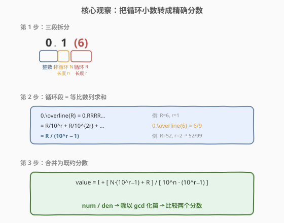
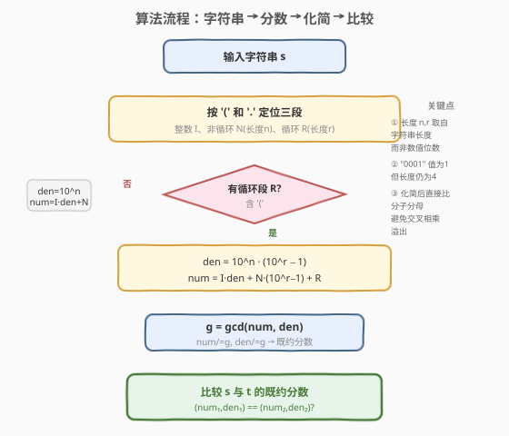
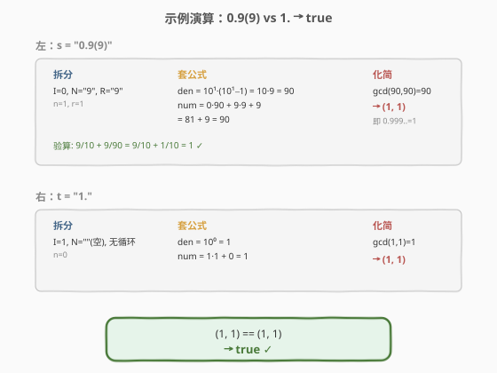

# 相等的有理数

- **题目名称**：相等的有理数
- **链接**：[972. 相等的有理数](https://leetcode.cn/problems/equal-rational-numbers/)
- **难度**：困难
- **标签**：数学、字符串、解析

## 1. 题目概述

给定两个字符串 `s` 和 `t`，每个字符串代表一个**非负有理数**，只有当它们表示相同的数字时才返回 `true`。字符串中可以用括号来表示小数的**循环部分**。

一个有理数最多由三部分组成：**整数部分** `<IntegerPart>`、**小数非循环部分** `<NonRepeatingPart>` 和**小数循环部分** `<(RepeatingPart)>`。数字可用以下三种形式之一表示：

- `<IntegerPart>`：如 `0`、`12`、`123`
- `<IntegerPart><.><NonRepeatingPart>`：如 `0.5`、`1.`、`2.12`、`123.0001`
- `<IntegerPart><.><NonRepeatingPart><(><RepeatingPart><)>`：如 `0.1(6)`、`1.(9)`、`123.00(1212)`

> 💡 同一个有理数可以有多种合法写法，例如 $\frac{1}{6} = 0.166666\ldots = 0.1(6) = 0.1666(6) = 0.166(66)$，它们的十进制展开完全相同。

**示例 1**：

```text
输入：s = "0.(52)", t = "0.5(25)"
输出：true
解释："0.(52)" = 0.52525252...，"0.5(25)" = 0.525252525...，二者相同。
```

**示例 2**：

```text
输入：s = "0.1666(6)", t = "0.166(66)"
输出：true
```

**示例 3**：

```text
输入：s = "0.9(9)", t = "1."
输出：true
解释："0.9(9)" = 0.999999... 永远重复，等于 1。"1." 表示整数 1。
```

**约束条件**：

- 每个部分仅由数字组成
- 整数部分 `<IntegerPart>` 不会以零开头（`0` 本身除外）
- $1 \le \text{IntegerPart.length} \le 4$
- $0 \le \text{NonRepeatingPart.length} \le 4$
- $1 \le \text{RepeatingPart.length} \le 4$

> 💡 本题是 [166. 分数到小数](../0101-0200/166_分数到小数.md) 的**逆问题**：166 把分数展开成循环小数字符串，972 把循环小数字符串还原成分数。二者共享「循环小数 ↔ 分数」的等价变换，方向相反。

---

## 2. 解题思路

### 2.1 暴力思路：浮点数比较

最直觉的做法是把字符串转成 `double` 再比较。但 `double` 只有约 15~17 位有效数字，而循环小数是无限的——`0.9(9)` 截断为 `0.9999999999999999` 后并不严格等于 `1.0`，浮点误差会导致误判。即便补齐很多位再比较，也难以确定「到底多少位才够」，缺乏数学严谨性。

正确思路是**把每个字符串精确还原为既约分数**，再比较两个分数是否相等——既无精度损失，又天然处理 `0.999\ldots = 1` 这类边界。

### 2.2 核心观察：循环段 = 等比数列求和



把字符串拆成三段：整数 $I$、非循环 $N$（长度 $n$）、循环 $R$（长度 $r$）。关键是把**循环段**转化为精确分数。

**循环段的等比数列推导**：设 $x = 0.\overline{R}$（即 $0.RRRR\ldots$），则：

$$
10^r \cdot x = R.\overline{R} = R + x \implies x = \frac{R}{10^r - 1}
$$

> 💡 这就是经典的小数化分数技巧：循环段 $R$ 除以「$r$ 个 9」（即 $10^r - 1$）。例：$0.\overline{6} = 6/9 = 2/3$，$0.\overline{52} = 52/99$。

循环段在非循环段之后开始，需要再除以 $10^n$ 位移。把整数、非循环、循环三部分通分合并到同一分母 $10^n \cdot (10^r - 1)$：

$$
\text{value} = I + \frac{N}{10^n} + \frac{R}{10^n(10^r - 1)} = \frac{I \cdot 10^n(10^r-1) + N(10^r-1) + R}{10^n(10^r - 1)}
$$

于是：

- $\text{num} = I \cdot 10^n(10^r-1) + N(10^r-1) + R$
- $\text{den} = 10^n \cdot (10^r - 1)$

若**没有循环段**，则退化为 $\text{num} = I \cdot 10^n + N$，$\text{den} = 10^n$。

最后用 $\gcd$ 化简为既约分数，**两个既约分数相等当且仅当分子分母分别相等**——无需交叉相乘，规避了 $10^{12} \times 10^8 = 10^{20}$ 的 64 位溢出风险。

> ⚠️ **长度陷阱**：公式中的 $n$、$r$ 是**字符串长度**，不是数值位数。例如 `123.0001` 的非循环段 `"0001"` 数值为 $1$，但长度 $n = 4$（决定位移量）。必须把字符串长度单独记录，不能从数值反推。

### 2.3 算法流程图



具体步骤：

1. **解析**：定位 `'('` 与 `')'` 取出循环段 $R$；定位 `'.'` 取出整数 $I$ 与非循环 $N$。
2. **计算分数**：按是否有循环段套用上述公式，得到 $(\text{num}, \text{den})$。
3. **化简**：$g = \gcd(\text{num}, \text{den})$，返回 $(\text{num}/g,\ \text{den}/g)$。
4. **比较**：$s$ 与 $t$ 的既约分数 $(\text{num}_1, \text{den}_1)$ 与 $(\text{num}_2, \text{den}_2)$ 逐分量比较。

### 2.4 示例演算



以 `s = "0.9(9)"`、`t = "1."` 为例（示例 3，最反直觉的边界）：

**左：s = "0.9(9)"**

| 段 | 值 | 说明 |
|------|-----|------|
| $I$ | $0$ | 整数部分 |
| $N$ | $9$ | 非循环部分，$n = 1$ |
| $R$ | $9$ | 循环部分，$r = 1$ |

- $\text{den} = 10^1 \cdot (10^1 - 1) = 10 \times 9 = 90$
- $\text{num} = 0 \times 90 + 9 \times 9 + 9 = 81 + 9 = 90$
- $g = \gcd(90, 90) = 90 \Rightarrow$ 既约分数 $(1,\ 1)$

验算：$0.9 + 0.0\overline{9} = \frac{9}{10} + \frac{9}{90} = \frac{9}{10} + \frac{1}{10} = 1$ ✓

**右：t = "1."**

| 段 | 值 | 说明 |
|------|-----|------|
| $I$ | $1$ | 整数部分 |
| $N$ | $""$ | 空非循环部分，$n = 0$ |
| $R$ | 无 | 无循环段 |

- $\text{den} = 10^0 = 1$
- $\text{num} = 1 \times 1 + 0 = 1$
- $g = \gcd(1, 1) = 1 \Rightarrow$ 既约分数 $(1,\ 1)$

**比较**：$(1, 1) == (1, 1) \Rightarrow$ `true` ✓

> 💡 $0.999\ldots = 1$ 不是浮点近似，而是**精确的数学恒等式**：循环节 $9$ 的等比级数 $\sum_{k=1}^{\infty} 9 \cdot 10^{-k} = \frac{0.9}{1-0.1} = 1$。这正是本题用分数法而非浮点法的根本原因。

---

## 3. 参考代码

### C++

```cpp
class Solution {
  public:
    bool isRationalEqual(string s, string t) {
        auto [n1, d1] = parse(s);
        auto [n2, d2] = parse(t);
        return n1 == n2 && d1 == d2;
    }

  private:
    pair<long long, long long> parse(const string& s) {
        string intPart, nonRep, rep;
        string before = s;

        size_t lp = s.find('(');
        if (lp != string::npos) {           // 取出循环段 R
            rep = s.substr(lp + 1, s.find(')') - lp - 1);
            before = s.substr(0, lp);
        }

        size_t dot = before.find('.');
        if (dot != string::npos) {          // 拆分整数 I 与非循环 N
            intPart = before.substr(0, dot);
            nonRep = before.substr(dot + 1);
        } else {
            intPart = before;
        }

        long long a = intPart.empty() ? 0 : stoll(intPart);
        long long b = nonRep.empty() ? 0 : stoll(nonRep);
        int n = nonRep.size();

        long long num, den;
        if (!rep.empty()) {
            long long c = stoll(rep);
            int r = rep.size();
            long long powN = 1;  for (int i = 0; i < n; i++) powN *= 10;
            long long powR = 1;  for (int i = 0; i < r; i++) powR *= 10;
            den = powN * (powR - 1);
            num = a * den + b * (powR - 1) + c;
        } else {
            long long powN = 1;  for (int i = 0; i < n; i++) powN *= 10;
            den = powN;
            num = a * den + b;
        }

        long long g = __gcd(num, den);
        return {num / g, den / g};
    }
};
```

### Python

```python
from math import gcd

class Solution:
    def isRationalEqual(self, s: str, t: str) -> bool:
        def parse(x: str):
            int_part, non_rep, rep = "", "", ""
            before = x
            if '(' in x:                        # 取出循环段 R
                i = x.index('(')
                rep = x[i + 1:x.index(')')]
                before = x[:i]
            if '.' in before:                   # 拆分整数 I 与非循环 N
                dot = before.index('.')
                int_part = before[:dot]
                non_rep = before[dot + 1:]
            else:
                int_part = before

            a = int(int_part) if int_part else 0
            b = int(non_rep) if non_rep else 0
            n = len(non_rep)

            if rep:
                c = int(rep)
                r = len(rep)
                den = (10 ** n) * (10 ** r - 1)
                num = a * den + b * (10 ** r - 1) + c
            else:
                den = 10 ** n
                num = a * den + b

            g = gcd(num, den)
            return (num // g, den // g)

        return parse(s) == parse(t)
```

> ⚠️ **C++ 溢出分析**：约束下 $I \le 9999$、$n, r \le 4$，故 $\text{den} \le 10^4 \times 9999 \approx 10^8$，$\text{num} \le 9999 \times 10^8 \approx 10^{12}$，均在 `long long`（$\approx 9.2 \times 10^{18}$）范围内。化简后直接比较分子分母，**不需要交叉相乘**，避免了 $10^{12} \times 10^8 = 10^{20}$ 的溢出。若一定要交叉相乘，C++ 需借助 `__int128`。

---

## 4. 复杂度分析

| 维度 | 复杂度 | 说明 |
|------|--------|------|
| 时间复杂度 | $O(L + \log V)$ | $L$ 为字符串长度（$\le 13$），解析 $O(L)$；$\gcd$ 为 $O(\log V)$，$V \le 10^{12}$ |
| 空间复杂度 | $O(L)$ | 存储拆分出的三段子串 |

> 💡 复杂度与字符串长度同阶，$L$ 极小（整数 $\le 4$ 位 + 小数点 + 非循环 $\le 4$ 位 + 括号 + 循环 $\le 4$ 位 $\le 14$ 字符），实际为常数时间。

---

## 5. 扩展：为何不直接展开字符串比较

另一种思路是**把循环段重复足够多次后截断到等长字符串**再逐字符比较。例如把 `"0.1(6)"` 展开成 `"0.1666666666666666"`（重复循环段若干次），与对方同样展开后比较。这看似可行，但有两个隐患：

1. **需要多少位才够？** 两个不同的有理数在小数展开后可能在很长一段前缀上相同。本题循环节 $\le 4$、非循环 $\le 4$，理论上展开到约 $2 \times (n+r) + \text{整数位数}$ 位即可区分，但这个界限需要论证，容易漏。
2. **$0.999\ldots = 1$ 的边界**：`"0.(9)"` 展开后是 `"0.9999..."`，与 `"1"` 的展开 `"1.000..."` 逐字符永远不等——除非你额外识别「全 9 循环进位」的特殊情况。这等于又把分数法的活干了一遍。

分数法从根本上消除了这些问题：**等价类由既约分数唯一确定**，无需关心展开长度，也无需特判全 9 循环。这也是 166（分数→小数）与 972（小数→分数）互为对偶的原因——二者共享同一套「循环小数 ↔ 分数」的精确变换。

> 💡 另一种等价写法是用 Python 的 `fractions.Fraction`，但核心仍是「$R/(10^r-1)$」这一步，手写公式更能体现对原理的理解。

---

## 6. 面试要点

1. **为什么用分数比较而不是浮点数或字符串展开？**

   - 浮点数精度有限（~17 位），无法精确表示无限循环小数，`0.9(9)` 截断后不等于 `1.0`；字符串展开需要论证「展开多少位才够」且无法处理 `0.999\ldots = 1` 的进位边界。分数法精确无损，化简为既约分数后唯一确定等价类。

2. **循环段化分数的公式是怎么来的？**

   - 设 $x = 0.\overline{R}$（$R$ 长度 $r$），则 $10^r x = R + x$，解得 $x = R/(10^r - 1)$。这是无限等比级数 $\sum_{k=1}^{\infty} R \cdot 10^{-rk}$ 的求和公式，首项 $R/10^r$、公比 $10^{-r}$。

3. **公式中的 $n$、$r$ 为什么取字符串长度而不是数值位数？**

   - 非循环段 `"0001"` 数值为 $1$，但它占了 $4$ 位小数位置，决定循环段的位移量 $10^{-n}$。若用数值位数 $1$ 会错误地把循环段左移 3 位。长度是**位置信息**，数值是**大小信息**，二者不可混淆。

4. **化简后比较分子分母，为什么不用交叉相乘？**

   - 两个既约分数相等当且仅当分子分母分别相等，直接比较 $O(1)$。交叉相乘 $\text{num}_1 \cdot \text{den}_2$ 在 C++ 中可达 $10^{12} \times 10^8 = 10^{20}$，溢出 `long long`；化简后比较则完全在 64 位内。

5. **`0.9(9) = 1` 是浮点近似还是数学恒等？**

   - 是精确的数学恒等式：$0.\overline{9} = \sum_{k=1}^{\infty} 9 \cdot 10^{-k} = \frac{0.9}{1 - 0.1} = 1$。本题用分数法 $9/(10 \times 9) + 9/10 = 90/90 = 1$ 直接得出，无需任何近似或特判。

---

## 7. 同类练习题

- [166. 分数到小数](https://leetcode.cn/problems/fraction-to-recurring-decimal/)（[题解](../0101-0200/166_分数到小数.md)）：972 的逆问题——把分数展开成循环小数字符串，用长除法模拟 + 哈希检测循环节，二者共享「循环小数 ↔ 分数」的等价变换
- [65. 有效数字](https://leetcode.cn/problems/valid-number/)：同为字符串解析题，用 DFA 状态机校验数字格式，对照 972 的手工拆分解析
- [8. 字符串转换整数 (atoi)](https://leetcode.cn/problems/string-to-integer-atoi/)：字符串解析数值的基础题，972 的整数段提取是其退化版
- [9. 回文数](https://leetcode.cn/problems/palindrome-number/)（[题解](../0001-0100/9_回文数.md)）：数字与字符串表示的相互转换，$0.999\ldots = 1$ 与回文判定的「表示 ≠ 本质」思想相通
