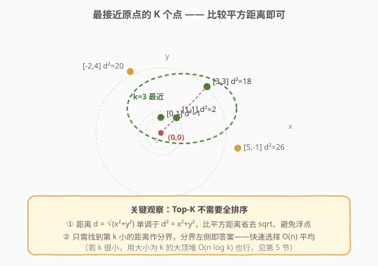
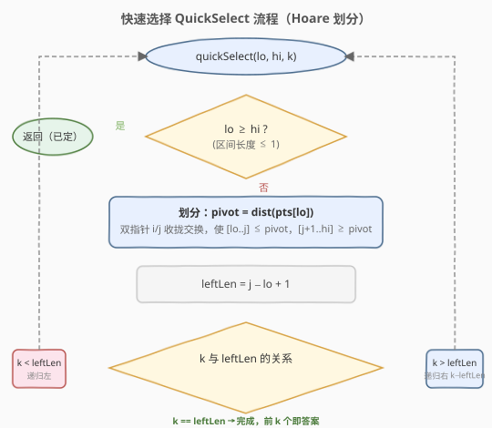
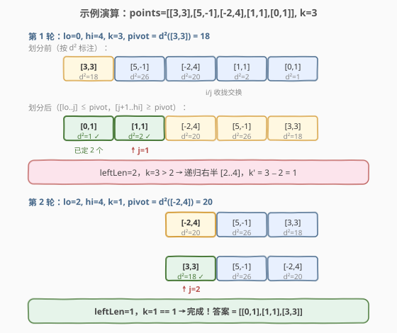

# LeetCode 最接近原点的 K 个点 题解

## 1. 题目概述

- **标题 / 题号**：最接近原点的 K 个点（#973，medium）
- **链接**：https://leetcode.cn/problems/k-closest-points-to-origin/
- **难度**：中等
- **标签**：数组、分治、快速选择、堆

**题意**：给定一个数组 `points`，其中 `points[i] = [xi, yi]` 表示 X-Y 平面上的一个点，以及一个整数 `k`。返回**离原点 `(0, 0)` 最近的 `k` 个点**。距离按**欧几里得距离**计算。答案可以按**任意顺序**返回。

**示例 1**：

```text
输入：points = [[1,3],[-2,2]], k = 1
输出：[[-2,2]]
解释：[1,3] 到原点距离 √10 ≈ 3.16，[-2,2] 距离 √8 ≈ 2.83，所以 [-2,2] 更近。
```

**示例 2**：

```text
输入：points = [[3,3],[5,-1],[-2,4]], k = 2
输出：[[3,3],[-2,4]]
解释：前两个最近的点，答案顺序任意均可。
```

**约束**：

- $1 \le k \le \text{points.length} \le 10^4$
- $-10^4 \le x_i, y_i \le 10^4$

> 💡 **两个隐含性质**：(1) 欧几里得距离 $d = \sqrt{x^2+y^2}$ 关于 $d^2 = x^2+y^2$ 单调递增，比大小只需比较**平方距离**，可省去 `sqrt` 并规避浮点误差；(2) 只需选出最近 `k` 个、不要求有序，因此**无需对全体排序**——这正是 Top-K 问题的特征。

## 2. 解题思路

### 2.1 暴力思路

把所有点按距离排序，取前 `k` 个。平方距离作为比较键，排序 $O(n \log n)$，截断 $O(k)$。能通过提交，但浪费了「不需要全排序」这一性质——把 $n$ 个数全排好只为了取前 $k$ 个，当 $k \ll n$ 时尤为可惜。

### 2.2 核心观察：Top-K 用快速选择，$O(n)$ 平均



**快速选择（Quickselect）**是快速排序的「半截」版本：每轮选一个 `pivot`，用 Hoare 双指针把数组划成「$\le$ pivot」与「$\ge$ pivot」两段，然后**只递归包含第 `k` 小元素的那一段**，另一半直接丢弃。

> 💡 **为什么是 $O(n)$**：每轮划分代价等于当前区间长度，但区间每轮大约缩到一半。总代价 $n + n/2 + n/4 + \cdots \approx 2n$，期望 $O(n)$。这与 [215. 数组中的第K个最大元素](../0201-0300/215_数组中的第K个最大元素.md) 是同一套模板，本题只是把「找第 k 大」换成「找第 k 小的距离」。

划分结束后，**前 `k` 个位置上的点就是答案**（顺序不限），无需再排序。

### 2.3 算法流程图



Hoare 划分以 `dist(pts[lo])` 为 pivot，双指针 `i = lo−1`、`j = hi+1` 相向而行：`i` 找第一个「$\ge$ pivot」的，`j` 找第一个「$\le$ pivot」的，相遇前交换。相遇后 `j` 即为左段右界，左段长度 `leftLen = j − lo + 1`：

- `k < leftLen`：第 `k` 小在左段，递归 `quickSelect(lo, j, k)`；
- `k > leftLen`：在右段，递归 `quickSelect(j+1, hi, k − leftLen)`；
- `k == leftLen`：恰好命中，前 `k` 个即为答案，结束。

> ⚠️ Hoare 划分结束后，左段元素 $\le$ pivot、右段元素 $\ge$ pivot，但**两段内部未必有序**，且 pivot 元素未必在 `j` 处——这对「选前 k 个」无影响，因为只要保证左段整体不大于右段即可。注意 `k == leftLen` 时左段恰好是 `k` 个不大于右段的元素，即为所求。

### 2.4 示例演算

以 `points = [[3,3],[5,-1],[-2,4],[1,1],[0,1]], k = 3` 为例（标注平方距离 $d^2$）：



| 轮次 | 区间 | pivot（$d^2$） | 划分后数组（按 $d^2$） | j | leftLen | 决策 |
|------|------|----------------|--------------------------|---|---------|------|
| 1 | [0..4], k=3 | 18（[3,3]） | [1, 2, 20, 26, 18] | 1 | 2 | k=3 > 2 → 递归右 [2..4], k'=1 |
| 2 | [2..4], k=1 | 20（[-2,4]） | [18, 26, 20] | 2 | 1 | k=1 == 1 → 完成 |

两轮划分后，前 3 个位置为 `[0,1]`(d²=1)、`[1,1]`(d²=2)、`[3,3]`(d²=18)，即最近的 `k=3` 个点。第 2 轮中 pivot=20 与左段首个元素 18 交换是 Hoare 划分的正常行为，不影响「左段 $\le$ 右段」的不变式。

## 3. 参考代码

### C++

```cpp
class Solution {
  public:
    vector<vector<int>> kClosest(vector<vector<int>>& points, int k) {
        quickSelect(points, 0, (int)points.size() - 1, k);
        return vector<vector<int>>(points.begin(), points.begin() + k);
    }

  private:
    void quickSelect(vector<vector<int>>& pts, int lo, int hi, int k) {
        if (lo >= hi) return;
        int pivot = dist(pts[lo]);
        int i = lo - 1, j = hi + 1;
        while (true) {
            do { ++i; } while (dist(pts[i]) < pivot);
            do { --j; } while (dist(pts[j]) > pivot);
            if (i >= j) break;
            swap(pts[i], pts[j]);
        }
        int leftLen = j - lo + 1;
        if (k < leftLen)      quickSelect(pts, lo, j, k);
        else if (k > leftLen) quickSelect(pts, j + 1, hi, k - leftLen);
    }
    int dist(const vector<int>& p) { return p[0] * p[0] + p[1] * p[1]; }
};
```

### Python

```python
class Solution:
    def kClosest(self, points: List[List[int]], k: int) -> List[List[int]]:
        def dist(p): return p[0] * p[0] + p[1] * p[1]

        def quickSelect(lo, hi, k):
            if lo >= hi:
                return
            pivot = dist(points[lo])
            i, j = lo - 1, hi + 1
            while True:
                i += 1
                while dist(points[i]) < pivot:
                    i += 1
                j -= 1
                while dist(points[j]) > pivot:
                    j -= 1
                if i >= j:
                    break
                points[i], points[j] = points[j], points[i]
            left_len = j - lo + 1
            if k < left_len:
                quickSelect(lo, j, k)
            elif k > left_len:
                quickSelect(j + 1, hi, k - left_len)

        quickSelect(0, len(points) - 1, k)
        return points[:k]
```

> 💡 **实现细节**：(1) `dist` 用 `x*x + y*y` 而非 `sqrt`，整数运算更快且无浮点误差；(2) Hoare 划分的 `do-while` 在 C++ 中天然避免越界（pivot 取自区间内，必存在等于 pivot 的元素作哨兵），Python 版需手写 `while` 推进；(3) 原地修改 `points`，最后截取前 `k` 个返回，$O(1)$ 额外空间（不计递归栈）。

## 4. 复杂度分析

| 维度 | 复杂度 | 说明 |
|------|--------|------|
| 时间复杂度 | $O(n)$（期望） | 每轮划分代价为当前区间长度，区间期望缩半，总代价 $\approx 2n$；最坏 $O(n^2)$（每次 pivot 都是极值），可用随机化 pivot 规避 |
| 空间复杂度 | $O(\log n)$（期望） | 递归栈深度期望 $O(\log n)$，最坏 $O(n)$；尾递归优化或迭代可降到 $O(1)$ |

> ⚠️ 最坏情况：当数组已按距离有序且总取 `pts[lo]` 为 pivot 时，每轮只缩一个元素，退化为 $O(n^2)$。工程上可随机交换 `pts[lo]` 与 `pts[lo + rand() % (hi-lo+1)]` 后再取 pivot，期望 $O(n)$ 且几乎不会退化。

## 5. 扩展：大小为 k 的大顶堆 $O(n \log k)$

当 `k` 远小于 `n`，或数据以**流式**到达（无法随机访问全部数据）时，**维护一个大小为 `k` 的大顶堆**更合适：

- 遍历每个点，计算平方距离；
- 堆未满 `k` 个时直接入堆；堆满后，若当前距离**小于堆顶**（堆顶是当前 `k` 个里最远的），弹出堆顶并入堆；
- 遍历结束，堆中即最近的 `k` 个点。

| 解法 | 时间 | 空间 | 适用场景 |
|------|------|------|----------|
| 全排序 | $O(n \log n)$ | $O(\log n)$ | 最简单，$n$ 小时可用 |
| 快速选择 | $O(n)$ 期望 | $O(\log n)$ | 随机访问、$n$ 大、不要求稳定 |
| 大小为 k 的大顶堆 | $O(n \log k)$ | $O(k)$ | $k \ll n$、流式数据、需稳定次序 |

Python 可用标准库一行实现堆解法：

```python
import heapq

class Solution:
    def kClosest(self, points: List[List[int]], k: int) -> List[List[int]]:
        return heapq.nsmallest(k, points, key=lambda p: p[0] ** 2 + p[1] ** 2)
```

> 💡 `heapq.nsmallest` 在 `k` 较小时内部用大小为 `k` 的最大堆，$O(n \log k)$；当 `k` 接近 `n` 时退化为排序。这是「Top-K 用小顶堆/大顶堆」模板的另一实例，与 [692. 前 K 个高频单词](../0601-0700/692_前K个高频单词.md) 同构。

## 6. 面试要点

1. **为什么比较平方距离而不是欧几里得距离？**

   因为 $\sqrt{\cdot}$ 是单调递增函数，$a^2 \le b^2 \iff \sqrt{a^2} \le \sqrt{b^2}$。比较平方距离得到的相对大小关系与真实距离完全一致，却省去了 `sqrt` 调用，且全程整数运算、无浮点误差。

2. **快速选择和快速排序的关系？**

   两者共用相同的「划分」步骤。快速排序划分后**两段都递归**（$O(n \log n)$）；快速选择只递归**包含目标第 k 小的那一段**，另一半丢弃，期望 $O(n)$。可理解为「只走快排的一条路径」。

3. **Hoare 划分结束后，左段内部有序吗？pivot 在哪？**

   都没有保证。Hoare 划分只保证**左段整体 $\le$ 右段**（即「半序」），左段内部、右段内部都未必有序，pivot 元素也不一定落在 `j` 位置。但对「选前 `k` 个」足够——只要左段是 `k` 个不大于右段的元素即可，顺序无所谓。

4. **最坏情况是什么？如何规避？**

   最坏是每次 pivot 都取到当前区间极值（如数组已有序且总取首元素），每轮只缩一个元素，$O(n^2)$。规避方法：随机化 pivot（先与随机位置交换再取 `pts[lo]`），或用「三点取中」。随机化后期望 $O(n)$，退化概率极低。

5. **什么时候选快速选择，什么时候选堆？**

   能随机访问全部数据、且不需要流式处理 → 快速选择 $O(n)$ 更优；数据以流到达、或 `k \ll n` 且需保留次序 → 大小为 `k` 的大顶堆 $O(n \log k)$；要求结果有序 → 全排序或堆。面试中先说全排序作 baseline，再优化到快速选择或堆，体现层次。

## 同类练习题

| # | 题目 | 与本题的关联 |
|---|------|-------------|
| 215 | [数组中的第K个最大元素](https://leetcode.cn/problems/kth-largest-element-in-an-array/)（[题解](../0201-0300/215_数组中的第K个最大元素.md)） | 快速选择母题，本题把「第 k 大」换成「第 k 小距离」，模板完全一致 |
| 912 | [排序数组](https://leetcode.cn/problems/sort-an-array/)（[题解](../0901-1000/912_排序数组.md)） | 快速排序/归并排序，理解快速选择「只走一条路径」的基础 |
| 692 | [前 K 个高频单词](https://leetcode.cn/problems/top-k-frequent-words/)（[题解](../0601-0700/692_前K个高频单词.md)） | Top-K 用大小为 k 的堆，本题第 5 节堆解法的同构题 |
| 347 | [前 K 个高频元素](https://leetcode.cn/problems/top-k-frequent-elements/) | Top-K 双解法（快速选择 / 堆），与本题并列为 Top-K 招牌题 |
| 23 | [合并 K 个升序链表](https://leetcode.cn/problems/merge-k-sorted-lists/) | 小顶堆的另一经典应用，对比「堆做归并」与「堆做 Top-K」 |
