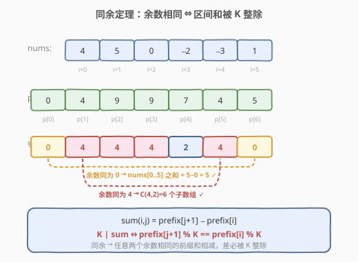
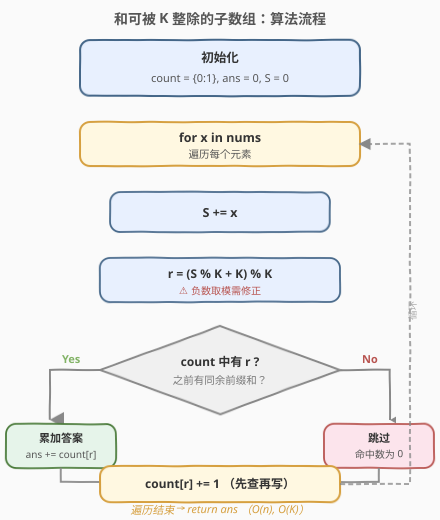
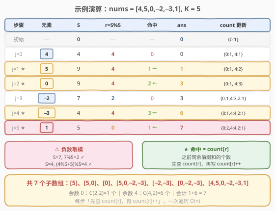

# LeetCode 和可被 K 整除的子数组 题解

## 1. 题目概述

- **标题 / 题号**：和可被 K 整除的子数组（#974，medium）
- **链接**：https://leetcode.cn/problems/subarray-sums-divisible-by-k/
- **难度**：中等
- **标签**：数组、哈希表、前缀和、数学

**题意**：给定一个整数数组 `nums` 和一个整数 `k`，返回其中元素之和可被 `k` 整除的、**连续且非空**的子数组数目。

**示例 1**：

```text
输入：nums = [4,5,0,-2,-3,1], k = 5
输出：7
解释：7 个子数组分别为 [5]、[5,0]、[0]、[5,0,-2,-3]、[-2,-3]、[0,-2,-3]、[4,5,0,-2,-3,1]。
```

**示例 2**：

```text
输入：nums = [5], k = 5
输出：1
```

**约束**：

- `1 <= nums.length <= 3 * 10^4`
- `-10^4 <= nums[i] <= 10^4`
- `2 <= k <= 10^5`

> ⚠️ 注意：数组元素可能为**负数**，因此不能用滑动窗口（窗口和没有单调性）；需借助前缀和与**同余定理**求解。

## 2. 解题思路

### 2.1 暴力思路

枚举所有子数组 `[i, j]`，逐个求和判断是否能被 `k` 整除。两重循环 + 求和共 `O(n^3)`；用前缀和优化到 `O(n^2)`，在 `n = 3*10^4` 时仍会超时。

### 2.2 核心观察：同余定理



定义前缀和 `prefix[i]` 为 `nums[0..i-1]` 的和（`prefix[0] = 0`），则子数组 `nums[i..j]` 的和为：

$$
\text{sum}(i, j) = \text{prefix}[j+1] - \text{prefix}[i]
$$

要让该和能被 `k` 整除，即：

$$
\text{prefix}[j+1] \equiv \text{prefix}[i] \pmod{k}
$$

> 💡 **关键转化（同余定理）**：两个前缀和对 `k` **取模同余**，当且仅当它们的差（即子数组和）能被 `k` 整除。于是问题变成——**对每个结束位置，之前有多少个起点的前缀和与当前前缀和同余**。用哈希表记录各余数的出现次数即可 `O(1)` 查询。

这与 [560. 和为 K 的子数组](../0501-0600/560_和为K的子数组.md) 的思路一脉相承：560 查的是 `prefix[i] == prefix[j+1] - k`，而本题查的是 `prefix[i] % k == prefix[j+1] % k`——把「差等于 k」换成「差是 k 的倍数」。

### 2.3 哈希表优化：一次遍历

不必先把所有前缀和算出来再统计，可以**边走边查**：

1. 维护哈希表 `count`，记录到目前为止各**余数**的出现次数。
2. 维护当前前缀和 `S`，每加入一个元素后计算余数 `r = S % k`。
3. 初始时 `count = {0: 1}`，表示「余数为 0 出现过一次」（空前缀，对应从下标 0 开始的子数组）。
4. 每步先把 `count[r]` 累加到答案，再把 `count[r]` 加一。

> ⚠️ **负数取模陷阱**：C++ / Java 中 `(-2) % 5 = -2`（符号跟随被除数），而数学上同余要求余数非负。因此需统一修正为 `r = (S % k + k) % k`，保证余数落在 `[0, k-1]`。Python 的 `%` 本身返回非负结果，无需修正，但为统一写法可保留。

### 2.4 算法流程图



### 2.5 示例演算

以 `nums = [4,5,0,-2,-3,1], k = 5` 为例：



| 步骤 | 元素 | 前缀和 S | r = S%5 | 命中 count[r] | 累计 ans | count 更新 |
|------|------|----------|---------|---------------|----------|------------|
| 初始 | — | 0 | — | — | 0 | {0:1} |
| j=0 | 4 | 4 | 4 | 0 | 0 | {0:1, 4:1} |
| j=1 | 5 | 9 | 4 | 1 | 1 | {0:1, 4:2} |
| j=2 | 0 | 9 | 4 | 2 | 3 | {0:1, 4:3} |
| j=3 | -2 | 7 | 2 | 0 | 3 | {0:1, 4:3, 2:1} |
| j=4 | -3 | 4 | 4 | 3 | 6 | {0:1, 4:4, 2:1} |
| j=5 | 1 | 5 | 0 | 1 | 7 | {0:2, 4:4, 2:1} |

最终答案为 `7`。余数 0 出现 2 次 → `C(2,2) = 1` 个子数组；余数 4 出现 4 次 → `C(4,2) = 6` 个子数组；合计 `1 + 6 = 7`。

## 3. 参考代码

### C++

```cpp
class Solution {
  public:
    int subarraysDivByK(vector<int>& nums, int k) {
        vector<int> count(k, 0);
        count[0] = 1;
        int ans = 0, prefix = 0;
        for (int x : nums) {
            prefix += x;
            int r = (prefix % k + k) % k;
            ans += count[r];
            count[r]++;
        }
        return ans;
    }
};
```

### Python

```python
class Solution:
    def subarraysDivByK(self, nums: List[int], k: int) -> int:
        count = {0: 1}
        ans = prefix = 0
        for x in nums:
            prefix += x
            r = prefix % k
            ans += count.get(r, 0)
            count[r] = count.get(r, 0) + 1
        return ans
```

> 💡 **优化**：因为余数范围固定为 `[0, k-1]`，C++ 可直接用 `vector<int>(k, 0)` 代替哈希表，避免哈希开销，查询更快。Python 用字典即可。

## 4. 复杂度分析

| 维度 | 复杂度 | 说明 |
|------|--------|------|
| 时间复杂度 | O(n) | 只遍历数组一次，每次哈希表（或数组）查询 / 写入均摊 O(1) |
| 空间复杂度 | O(k) | 余数取值范围为 `[0, k-1]`，哈希表最多存 k 个键；用数组则为恰好 k |

## 5. 扩展：同余思想的应用场景

同余定理是前缀和系列的进阶武器，核心在于把「差满足某条件」转化为「模值相等」：

- **求和为 K 的倍数的子数组个数** → 查同余前缀和对数（本题）
- **求和为 K 的倍数的最长子数组** → 记录每个余数首次出现的位置，取最大跨度
- **统计奇偶个数相同的子数组**（[525. 连续数组](https://leetcode.cn/problems/contiguous-array/)）→ 把 0 当作 -1，问题化为「前缀和为 0」，即同余特例

> 💡 当题目涉及「整除」「倍数」「模 K」等字眼时，优先考虑**前缀和 + 同余**。

## 6. 面试要点

1. **为什么哈希表要初始化 `{0: 1}`？**
   - 当某个从下标 0 开始的子数组和恰被 `k` 整除时，当前余数为 0，需要 `count[0]` 中已有的「空前缀」来匹配。若不初始化，这类子数组会被漏算。

2. **负数取模为什么要特殊处理？**
   - C++ / Java 中 `-2 % 5 = -2`，而我们要的是数学同余（余数非负）。用 `(S % k + k) % k` 可将 `[-(k-1), k-1]` 的结果统一映射到 `[0, k-1]`。Python 的 `%` 已返回非负值，无需修正。

3. **与 560（和为 K 的子数组）的联系与区别？**
   - 560 查 `prefix[i] == S - k`（差等于 k），本题查 `prefix[i] % k == S % k`（差是 k 的倍数）。两者框架完全一致（前缀和 + 哈希 + 先查再写），只是匹配条件从「相等」推广为「同余」。

4. **为什么不能用滑动窗口？**
   - 数组含负数，扩大窗口和可能减小、缩小窗口和可能增大，单调性被破坏，无法根据当前和与 `k` 的关系决定指针移动方向。前缀和 + 同余 + 哈希是通用解法。

5. **能否用数组代替哈希表？什么时候？**
   - 余数取值范围固定为 `[0, k-1]`，始终可用大小为 `k` 的数组。当 `k` 较小（如 `k <= 10^5`）时数组更快；当 `k` 极大但实际出现的余数很少时，哈希表更省空间。

## 同类练习题

| # | 题目 | 与本题的关联 |
|---|------|-------------|
| 560 | [和为 K 的子数组](https://leetcode.cn/problems/subarray-sum-equals-k/)（[题解](../0501-0600/560_和为K的子数组.md)） | 前缀和 + 哈希的母题，把本题的「同余」换成「差等于 k」 |
| 525 | [连续数组](https://leetcode.cn/problems/contiguous-array/) | 0 当 -1，化为前缀和为 0，同余特例 |
| 930 | [和相同的二元子数组](https://leetcode.cn/problems/binary-subarrays-with-sum/) | 0/1 数组求目标和，前缀和 + 哈希模板 |
| 1248 | [统计「优美子数组」](https://leetcode.cn/problems/count-number-of-nice-subarrays/) | 奇偶个数前缀和 + 哈希，思路同构 |
| 53 | [最大子数组和](https://leetcode.cn/problems/maximum-subarray/)（[题解](../0001-0100/53_最大子数组和.md)） | 前缀和的另一经典应用，求最大而非计数 |
