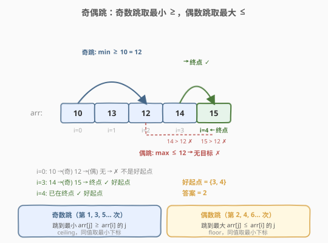
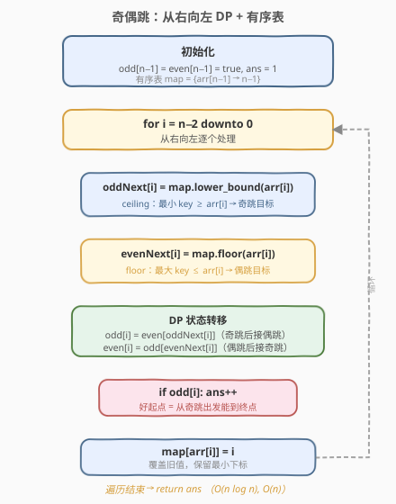
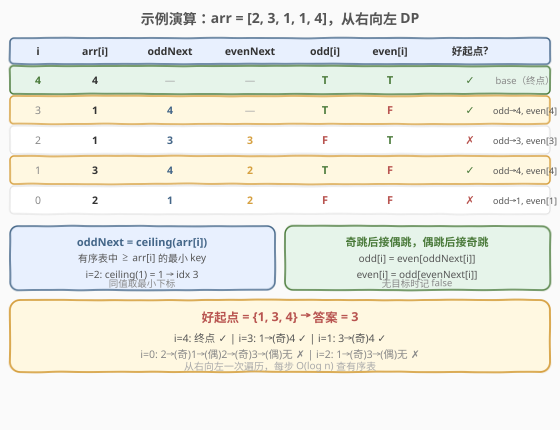

# LeetCode 奇偶跳 题解

## 1. 题目概述

- **标题 / 题号**：奇偶跳（#975，hard）
- **链接**：https://leetcode.cn/problems/odd-even-jumps/
- **难度**：困难
- **标签**：动态规划、单调栈、有序表、排序

**题意**：给定一个整数数组 `arr`，从某个起始下标 `i` 出发，你可以进行一系列跳跃。跳跃规则按次数交替：

- **奇数跳**（第 1、3、5… 次）：跳到下标 `j > i` 处，使得 `arr[j]` 是所有 `arr[j] ≥ arr[i]` 中的**最小值**；若存在多个这样的 `j`，选下标最小的。若不存在这样的 `j`，则停止。
- **偶数跳**（第 2、4、6… 次）：跳到下标 `j > i` 处，使得 `arr[j]` 是所有 `arr[j] ≤ arr[i]` 中的**最大值**；若存在多个这样的 `j`，选下标最小的。若不存在这样的 `j`，则停止。

如果从起始下标出发（第一次跳跃总是奇数跳），经过若干次跳跃能到达数组末尾 `n-1`，则该起始下标是**好下标**。返回好下标的个数。

**示例 1**：

```text
输入：arr = [10,13,12,14,15]
输出：2
解释：好下标为 3 和 4。
  i=3: 14 →(奇跳) 15，到达末尾 ✓
  i=4: 已在末尾 ✓
  i=0: 10 →(奇跳) 12 →(偶跳) 无目标 ✗
```

**示例 2**：

```text
输入：arr = [2,3,1,1,4]
输出：3
解释：好下标为 1、3、4。
  i=1: 3 →(奇跳) 4，到达末尾 ✓
  i=3: 1 →(奇跳) 4，到达末尾 ✓
  i=0: 2 →(奇跳) 3 →(偶跳) 1 →(奇跳) 1 →(偶跳) 无目标 ✗
```

**约束**：

- $1 \le \text{arr.length} \le 2 \times 10^4$
- $1 \le \text{arr[i]} \le 10^5$

> ⚠️ 注意：每次跳跃的目标下标只取决于**当前位置**和**跳是奇数次还是偶数次**，与起始下标无关。这一独立性是从暴力模拟优化到 DP 的关键。

## 2. 解题思路

### 2.1 暴力思路

对每个起始下标 `i`，模拟跳跃过程：每步扫描 `i` 右侧所有元素，找奇数跳/偶数跳的目标。单个起点最多跳 `n` 次，每次扫描 `O(n)`，共 `n` 个起点，总计 $O(n^3)$。用预计算的跳跃表可优化到 $O(n^2)$ 预处理 + $O(n)$ 模拟，但 $n = 2 \times 10^4$ 时仍超时。

### 2.2 核心观察：从右向左 DP + 有序表查 ceiling/floor



**观察 1：跳跃目标固定。** 对每个下标 `i`，奇数跳目标 `oddNext[i]` 和偶数跳目标 `evenNext[i]` 是确定的——只依赖 `arr[i]` 和 `i` 右侧的元素，与从哪里出发无关。

**观察 2：奇偶交替。** 奇数跳之后一定是偶数跳，偶数跳之后一定是奇数跳。因此可以定义两个布尔状态：

- `odd[i]`：从 `i` 出发**奇数跳**能否到达末尾
- `even[i]`：从 `i` 出发**偶数跳**能否到达末尾

**状态转移**：

$$
\text{odd}[i] = \text{even}[\text{oddNext}[i]] \quad (\text{奇跳后接偶跳})
$$
$$
\text{even}[i] = \text{odd}[\text{evenNext}[i]] \quad (\text{偶跳后接奇跳})
$$

> 💡 **关键转化**：一次跳跃的成败取决于「跳跃目标处，另一种跳型能否到达末尾」。从右向左处理时，右侧的状态已经算好，直接查表即可 `O(1)` 转移。最终答案是 `odd[i] = true` 的下标个数（因为第一次跳跃总是奇数跳）。

**观察 3：用有序表高效求 ceiling/floor。** 从右向左遍历时，维护一个有序表（`std::map` / `TreeMap`），存储「右侧已处理元素的值 → 最小下标」：

- `oddNext[i]` = 有序表中 **ceiling(arr[i])**（最小 key ≥ arr[i]）对应的下标
- `evenNext[i]` = 有序表中 **floor(arr[i])**（最大 key ≤ arr[i]）对应的下标

这和 [739. 每日温度](../0701-0800/739_每日温度.md) 中单调栈求「下一个更大元素」是同一类问题，只是本题同时需要 ceiling（≥）和 floor（≤）两种查询。

### 2.3 算法流程图



整体流程：

1. **初始化**：`odd[n-1] = even[n-1] = true`（末尾即终点），`ans = 1`，有序表放入 `arr[n-1] → n-1`。
2. **从右向左**遍历 `i = n-2` 到 `0`：
   - 查有序表 ceiling → `oddNext[i]`，查 floor → `evenNext[i]`
   - DP 转移：`odd[i] = even[oddNext[i]]`，`even[i] = odd[evenNext[i]]`（无目标时记 `false`）
   - 若 `odd[i]` 为 `true`，`ans++`
   - 将 `arr[i] → i` 插入有序表（**覆盖旧值**，保证同值保留最小下标）
3. 返回 `ans`。

### 2.4 示例演算

以 `arr = [2, 3, 1, 1, 4]` 为例：



| i | arr[i] | oddNext[i] | evenNext[i] | odd[i] | even[i] | 好起点? | 推导 |
|---|--------|------------|-------------|--------|---------|---------|------|
| 4 | 4      | —          | —           | T      | T       | ✓       | base（终点） |
| 3 | 1      | 4          | —           | T      | F       | ✓       | odd→4, even[4]=T |
| 2 | 1      | 3          | 3           | F      | T       | ✗       | odd→3, even[3]=F |
| 1 | 3      | 4          | 2           | T      | F       | ✓       | odd→4, even[4]=T |
| 0 | 2      | 1          | 2           | F      | F       | ✗       | odd→1, even[1]=F |

> 💡 **同值覆盖**：处理 `i=2`（`arr[2]=1`）时，有序表中已有 `1→3`（来自 `i=3`），覆盖为 `1→2`。这样 `i=0` 查 `floor(2)` 得到 `1→2`（而非 `1→3`），即 `evenNext[0]=2`——下标 2 比 3 更小，符合「同值取最小下标」规则。

最终好下标为 `{1, 3, 4}`，答案为 **3**。

## 3. 参考代码

### C++（`std::map` 有序表）

```cpp
class Solution {
  public:
    int oddEvenJumps(vector<int>& arr) {
        int n = arr.size();
        vector<int> oddNext(n, -1), evenNext(n, -1);
        map<int, int> mp; // value -> 最小下标
        for (int i = n - 1; i >= 0; i--) {
            // ceiling: 最小 key >= arr[i]
            auto it = mp.lower_bound(arr[i]);
            if (it != mp.end()) oddNext[i] = it->second;
            // floor: 最大 key <= arr[i]
            it = mp.upper_bound(arr[i]);
            if (it != mp.begin()) evenNext[i] = (--it)->second;
            mp[arr[i]] = i; // 覆盖旧值，保留更小下标
        }
        vector<bool> odd(n), even(n);
        odd[n - 1] = even[n - 1] = true;
        int ans = 1;
        for (int i = n - 2; i >= 0; i--) {
            if (oddNext[i] != -1) odd[i] = even[oddNext[i]];
            if (evenNext[i] != -1) even[i] = odd[evenNext[i]];
            if (odd[i]) ans++;
        }
        return ans;
    }
};
```

### Python（排序 + 单调栈）

```python
class Solution:
    def oddEvenJumps(self, arr: List[int]) -> int:
        n = len(arr)

        def makeNext(indices):
            """按给定顺序处理下标，用单调栈求每个下标的下一个跳跃目标。"""
            nxt = [-1] * n
            stack = []
            for i in indices:
                while stack and stack[-1] < i:
                    nxt[stack.pop()] = i
                stack.append(i)
            return nxt

        # oddNext: 按值升序、下标升序 → 第一个在右侧且值 >= 的下标
        oddNext = makeNext(sorted(range(n), key=lambda i: (arr[i], i)))
        # evenNext: 按值降序、下标升序 → 第一个在右侧且值 <= 的下标
        evenNext = makeNext(sorted(range(n), key=lambda i: (-arr[i], i)))

        odd = [False] * n
        even = [False] * n
        odd[n - 1] = even[n - 1] = True
        ans = 1
        for i in range(n - 2, -1, -1):
            if oddNext[i] != -1:
                odd[i] = even[oddNext[i]]
            if evenNext[i] != -1:
                even[i] = odd[evenNext[i]]
            if odd[i]:
                ans += 1
        return ans
```

> 💡 **两种实现的选择**：C++ 的 `std::map` 原生支持 `lower_bound` / `upper_bound`，代码直观；Python 标准库无有序表（`sortedcontainers` 在 LeetCode 不可用），改用**排序 + 单调栈**等价实现——按值排序后，栈中维护尚未匹配的下标（递减序列），遇到右侧下标时弹出并赋值。两者复杂度同为 $O(n \log n)$。

## 4. 复杂度分析

| 维度 | 复杂度 | 说明 |
|------|--------|------|
| 时间复杂度 | $O(n \log n)$ | C++：`n` 次 map 查询/插入，每次 $O(\log n)$；Python：排序 $O(n \log n)$ + 单调栈 $O(n)$ |
| 空间复杂度 | $O(n)$ | 有序表 / 排序数组 + `oddNext`、`evenNext`、`odd`、`even` 各 $O(n)$ |

## 5. 扩展：单调栈求 next 跳跃目标

Python 代码中的 `makeNext` 函数是一个通用模板，核心思想与 [503. 下一个更大元素 II](../0501-0600/503_下一个更大元素 II.md) 一脉相承：

**排序确定处理顺序，单调栈匹配目标。**

以 `oddNext`（求最小的 `arr[j] ≥ arr[i]`，同值取最小 `j`）为例：

1. **按 `(arr[i] 升序, i 升序)` 排序**：值小的先处理，同值时下标小的先处理。
2. **维护一个下标递减的栈**：栈中存放尚未找到跳跃目标的下标。
3. **处理 `curr`**：弹出栈顶所有 `< curr` 的下标 `top`，它们的跳跃目标就是 `curr`（`curr` 在右侧，且 `arr[curr] ≥ arr[top]`，是排序后遇到的第一个满足条件的）。然后将 `curr` 入栈。

`evenNext` 同理，只需改为按 `(arr[i] 降序, i 升序)` 排序——值大的先处理，第一个遇到的右侧下标就是「最大 `≤`」的目标。

> 💡 **与 TreeMap 的等价性**：TreeMap 从右向左扫描，每次查 ceiling/floor；单调栈则先排序再一次性匹配。两者本质相同——都是在已处理元素中找满足大小关系的最近下标，只是数据结构不同。

**C++ 也可以用单调栈**（替代 `std::map`），在值域很大或需要避免红黑树常数时更优：

```cpp
// 辅助函数：按 sortedIndices 的顺序用单调栈求 next
vector<int> makeNext(vector<int>& sortedIndices) {
    int n = sortedIndices.size();
    vector<int> nxt(n, -1);
    stack<int> stk;
    for (int idx : sortedIndices) {
        while (!stk.empty() && stk.top() < idx) {
            nxt[stk.top()] = idx;
            stk.pop();
        }
        stk.push(idx);
    }
    return nxt;
}
```

## 6. 面试要点

1. **为什么从右向左处理？**

   末尾 `n-1` 是所有跳跃的终点，状态确定（`odd[n-1] = even[n-1] = true`）。从右向左处理时，当前下标的跳跃目标在右侧，其状态已经计算好，可以直接查表完成 DP 转移。若从左向右则需要依赖未计算的右侧状态，无法形成有效递推。

2. **ceiling 和 floor 分别对应什么？**

   - **ceiling（`lower_bound`）**：有序表中最小 key `≥ arr[i]`，对应奇数跳——找「不小于当前值的最小值」。
   - **floor（`upper_bound` 后前移一位）**：有序表中最大 key `≤ arr[i]`，对应偶数跳——找「不大于当前值的最大值」。
   - C++ 中 floor 的写法：`it = mp.upper_bound(arr[i]); if (it != mp.begin()) --it;`，因为 `upper_bound` 返回第一个 `>` 的位置，前移一位即是 `≤`。

3. **为什么 `map[arr[i]] = i` 要覆盖旧值？**

   从右向左处理时，`i` 递减。若 `arr[i]` 已在表中（来自更右的下标 `j > i`），覆盖为 `i` 可保证同值保留**最小下标**。这符合题目「同值取最小 `j`」的规则——对后续更左侧的下标而言，`i` 比 `j` 更近，是更优的跳跃目标。

4. **奇偶交替的 DP 为什么只用两个布尔状态？**

   跳跃次数的奇偶性完全由当前是第几次跳跃决定，而第一次总是奇数跳。因此只需区分「当前处于奇数跳还是偶数跳」两种状态，不需要记录具体跳跃次数。`odd[i]` 和 `even[i]` 分别表示两种起跳状态能否到达终点，转移时交替引用对方。

5. **Python 为什么用排序 + 单调栈而不是有序表？**

   Python 标准库没有平衡 BST / `TreeMap`，`bisect` + 列表插入是 $O(n)$ 每次导致总 $O(n^2)$。排序 + 单调栈利用了「按值排序后，右侧下标的匹配关系」这一性质，将 `n` 次有序表查询转化为一次排序 + 一次线性扫描，总 $O(n \log n)$，与 TreeMap 等价但无需额外数据结构。

## 同类练习题

| # | 题目 | 与本题的关联 |
|---|------|-------------|
| 503 | [下一个更大元素 II](https://leetcode.cn/problems/next-greater-element-ii/)（[题解](../0501-0600/503_下一个更大元素 II.md)） | 单调栈求「下一个更大」，本题 ceiling 查询的直系亲戚 |
| 739 | [每日温度](https://leetcode.cn/problems/daily-temperatures/)（[题解](../0701-0800/739_每日温度.md)） | 单调栈求「下一个更大」的位置差，与 `oddNext` 的求法同构 |
| 901 | [股票价格跨度](https://leetcode.cn/problems/online-stock-span/)（[题解](../0901-1000/901_股票价格跨度.md)） | 单调栈 + 跨度合并，连续向左找「不大于当前」的元素，与 floor 查询对称 |
| 496 | [下一个更大元素 I](https://leetcode.cn/problems/next-greater-element-i/)（[题解](../0401-0500/496_下一个更大元素 I.md)） | 单调栈入门题，理解 `makeNext` 模板的最佳起点 |
| 84 | [柱状图中最大的矩形](https://leetcode.cn/problems/largest-rectangle-in-histogram/)（[题解](../0001-0100/84_柱状图中最大的矩形.md)） | 单调栈双侧扩展，天花板/地板思想的应用 |
