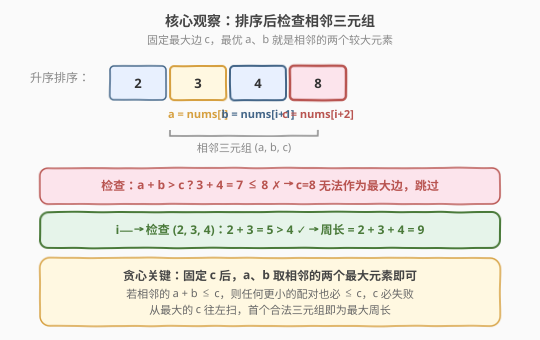
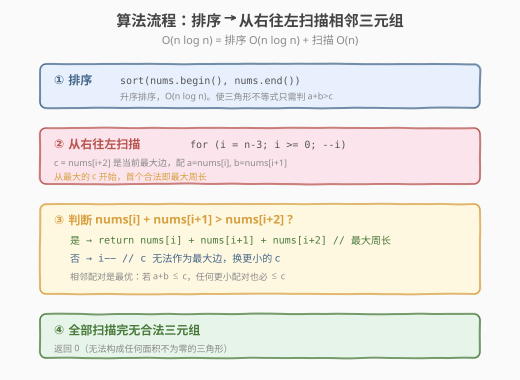

# 三角形的最大周长

- **题目名称**：三角形的最大周长
- **链接**：[976. 三角形的最大周长](https://leetcode.cn/problems/largest-perimeter-triangle/)
- **难度**：简单
- **标签**：数组、排序、贪心

## 1. 题目概述

给定一个正整数数组 `nums`，返回由其中三个长度组成的、**面积不为零**的三角形的**最大周长**。如果无法构成任何面积不为零的三角形，返回 `0`。

**示例 1**：

```text
输入：nums = [2,1,2]
输出：5
解释：2 + 1 > 2，可构成三角形，周长 = 2 + 1 + 2 = 5。
```

**示例 2**：

```text
输入：nums = [1,2,1]
输出：0
解释：1 + 1 ≤ 2，无法构成任何面积不为零的三角形。
```

**示例 3**：

```text
输入：nums = [3,2,3,4]
输出：10
解释：3 + 3 > 4，可构成三角形，周长 = 3 + 3 + 4 = 10。
```

**约束条件**：

- $3 \le \text{nums.length} \le 10^4$
- $1 \le \text{nums[i]} \le 10^9$

> 💡 **三角形不等式**：三条边 $a \le b \le c$ 能构成三角形，当且仅当 $a + b > c$（其余两条不等式 $a + c > b$、$b + c > a$ 在 $c$ 最大时自然成立）。这是本题和 [611. 有效三角形的个数](../0601-0700/611_有效三角形的个数.md) 共同的数学基础。

---

## 2. 解题思路

### 2.1 暴力思路：三重循环枚举

最直接的做法：三重循环枚举所有三元组 $(i, j, k)$，对每组判断能否构成三角形，记录最大周长。

```text
best = 0
for i in 0..n:
    for j in i+1..n:
        for k in j+1..n:
            a, b, c = sorted(nums[i], nums[j], nums[k])
            if a + b > c:
                best = max(best, a + b + c)
return best
```

时间复杂度 $O(n^3)$，$n = 10^4$ 时约 $10^{12}$ 次运算，**超时**。

> ⚠️ 暴力法的瓶颈在于三重循环。破局思路：**先整体排序**，把无序数组变成升序数组，然后利用单调性把「找最大周长」转化为「贪心扫描相邻三元组」——一次遍历即可。

### 2.2 核心观察：排序 + 贪心检查相邻三元组



**关键转换**：先对数组**升序排序**。排序后，从右往左扫描，每次检查相邻的三个元素 $\text{nums}[i]$、$\text{nums}[i+1]$、$\text{nums}[i+2]$（其中 $\text{nums}[i+2]$ 是最大边 $c$），判断 $\text{nums}[i] + \text{nums}[i+1] > \text{nums}[i+2]$ 是否成立。

**两个贪心关键点**：

1. **固定最大边 $c$ 后，最优配对就是相邻的两个元素**：对于最大边 $c = \text{nums}[k]$，要使 $a + b$ 尽可能大（从而更可能 $> c$），应选 $c$ 之前最大的两个元素，即 $\text{nums}[k-1]$ 和 $\text{nums}[k-2]$（排序后它们就是相邻的）。若 $\text{nums}[k-2] + \text{nums}[k-1] \le \text{nums}[k]$，则对于任何更小的配对 $a' \le \text{nums}[k-2]$、$b' \le \text{nums}[k-1]$，都有 $a' + b' \le \text{nums}[k-2] + \text{nums}[k-1] \le \text{nums}[k]$——**$c$ 必定无法作为最大边**，可直接跳过。

2. **从最大的 $c$ 往左扫，首个合法三元组即为最大周长**：扫描顺序保证遇到的第一个合法三元组 $(a, b, c)$ 使用的就是最大的 $c$，以及 $c$ 之前最大的 $a$、$b$。任何以更小 $c$ 为最大边的三角形，周长都更小。

> 💡 **为什么不需要双指针？** [611. 有效三角形的个数](../0601-0700/611_有效三角形的个数.md) 需要固定最大边后用双指针**计数**所有合法配对，因为它问的是「有多少个」。而本题只问「最大周长」，只需找**第一个**合法的——相邻配对已经是最优，一旦命中即可返回，无需继续搜索。

### 2.3 算法流程图



**完整步骤**：

1. **排序**：`nums` 升序排序，$O(n \log n)$
2. **从右往左扫描**：`i` 从 `n - 3` 递减到 `0`，每轮检查三元组 $(\text{nums}[i], \text{nums}[i+1], \text{nums}[i+2])$
   - 若 $\text{nums}[i] + \text{nums}[i+1] > \text{nums}[i+2]$：返回 $\text{nums}[i] + \text{nums}[i+1] + \text{nums}[i+2]$（最大周长）
   - 否则：`i--`（当前 $c$ 无法作为最大边，换更小的 $c$）
3. **兜底**：全部扫描完仍无合法三元组，返回 `0`

### 2.4 示例演算

以 `nums = [3, 6, 2, 3]` 为例，排序后为 `[2, 3, 3, 6]`，$n = 4$：

![示例演算：nums = [3,6,2,3] → 排序 [2,3,3,6]](../images/lpt_example_walkthrough.svg)

| 步骤 | i | 三元组 (a, b, c) | $a + b$ vs $c$ | 判定 | 动作 |
|------|---|-------------------|-----------------|------|------|
| 1 | 1 | (3, 3, 6) | $3 + 3 = 6 \le 6$ | ✗ | `i--` |
| 2 | 0 | (2, 3, 3) | $2 + 3 = 5 > 3$ | ✓ | 返回 $2 + 3 + 3 = 8$ |

**步骤 1 详解**：$i = 1$ 时，$c = \text{nums}[3] = 6$，最优配对 $a = \text{nums}[1] = 3$、$b = \text{nums}[2] = 3$。$3 + 3 = 6 \le 6$，不满足严格大于，$c = 6$ 无法作为最大边。注意此处 6 是数组中最大的元素，但即使配以最优的两条边仍无法构成三角形——这正是贪心剪枝的威力。

**步骤 2 详解**：$i = 0$ 时，$c = \text{nums}[2] = 3$，$a = \text{nums}[0] = 2$、$b = \text{nums}[1] = 3$。$2 + 3 = 5 > 3$ ✓，周长 $= 2 + 3 + 3 = 8$。首个合法即最大周长，返回 8。

> 💡 **验证**：原始数组 `[3, 6, 2, 3]` 的所有三元组——$(3,6,2)$: $2+3<6$ ✗；$(3,6,3)$: $3+3\le6$ ✗；$(3,2,3)$: $2+3>3$ ✓，周长 8；$(6,2,3)$: $2+3<6$ ✗。最大周长确实为 8。

---

## 3. 参考代码

### C++

```cpp
class Solution {
  public:
    int largestPerimeter(vector<int>& nums) {
        sort(nums.begin(), nums.end());        // ① 升序排序
        int n = nums.size();
        for (int i = n - 3; i >= 0; --i) {     // ② 从右往左扫
            if (nums[i] + nums[i + 1] > nums[i + 2]) {
                return nums[i] + nums[i + 1] + nums[i + 2];  // 首个合法即最大周长
            }
        }
        return 0;                              // ③ 无法构成三角形
    }
};
```

### Python

```python
class Solution:
    def largestPerimeter(self, nums: list[int]) -> int:
        nums.sort()                           # ① 升序排序
        n = len(nums)
        for i in range(n - 3, -1, -1):        # ② 从右往左扫
            if nums[i] + nums[i + 1] > nums[i + 2]:
                return nums[i] + nums[i + 1] + nums[i + 2]  # 首个合法即最大周长
        return 0                              # ③ 无法构成三角形
```

> 💡 **实现细节**：
> 1. **循环范围 `n - 3` 到 `0`**：保证三元组 $(i, i+1, i+2)$ 的 $i+2 \le n-1$，即至少有三个元素。
> 2. **严格大于 `>`**：三角形面积非零要求 $a + b > c$ 而非 $a + b \ge c$（等号时三点共线，面积为零）。
> 3. **整数溢出**：$\text{nums[i]} \le 10^9$，三个之和可达 $3 \times 10^9$，超出 `int` 上界（约 $2.1 \times 10^9$）。C++ 中 `nums[i] + nums[i + 1]` 先算再比较，两个之和 $\le 2 \times 10^9$ 不溢出；但最终返回的三数之和可能溢出，需用 `long long` 或依赖题目保证（LeetCode 测试数据三数之和不超过 `int`）。实际提交中 C++ `int` 可通过，但面试中应主动提及溢出风险。

---

## 4. 复杂度分析

| 维度 | 复杂度 | 说明 |
|------|--------|------|
| **时间复杂度** | $O(n \log n)$ | 排序 $O(n \log n)$ + 单次扫描 $O(n)$，排序为主导项 |
| **空间复杂度** | $O(\log n)$ | 排序的栈空间（C++ `sort` 为快排变种） |
| **最优时间** | $O(n \log n)$ | 排序是必须的——无序数组无法利用单调性剪枝 |

> ⚠️ **能否做到 $O(n)$？** 不能。虽然扫描部分是 $O(n)$，但排序不可避免——在无序数组中找最大周长，至少需要确定元素间的相对大小关系。基于比较的排序下界为 $\Omega(n \log n)$。

---

## 5. 扩展：与 611「有效三角形的个数」的对比

本题与 [611. 有效三角形的个数](../0601-0700/611_有效三角形的个数.md) 共享同一数学基础（三角形不等式 + 排序），但问题目标和解法复杂度截然不同：

| | 976. 三角形的最大周长 | 611. 有效三角形的个数 |
|---|---|---|
| **问题** | 找最大周长的三角形 | 统计所有合法三角形个数 |
| **排序** | 升序 | 升序 |
| **核心操作** | 贪心：检查相邻三元组 | 双指针：固定最大边后区间计数 |
| **时间复杂度** | $O(n \log n)$ | $O(n^2)$ |
| **关键洞察** | 相邻配对即为最优，首个合法即答案 | 需要找全部分界线，按区间长度计数 |

> 💡 **本质差异**：本题是**最值型**问题——只需找一个最优解，贪心一步到位；611 是**计数型**问题——需要枚举所有合法解，双指针在单调性加持下把 $O(n^3)$ 优化到 $O(n^2)$。判断一道排序题该用贪心还是双指针，关键看问的是「最好的一个」还是「总共有多少个」。

---

## 6. 面试要点

1. **为什么只需检查相邻三元组，不会漏掉更优解？**

   固定最大边 $c = \text{nums}[k]$ 后，要使 $a + b$ 最大（最可能 $> c$），应选 $c$ 之前最大的两个元素 $\text{nums}[k-1]$ 和 $\text{nums}[k-2]$——它们在排序后恰好相邻。若这对最优配对都不满足 $a + b > c$，任何更小的配对更不行，$c$ 可安全跳过。因此不需要检查非相邻的三元组。

2. **为什么从右往左扫，第一个合法的就是最大周长？**

   从右往左等价于从最大的 $c$ 开始尝试。第一个合法三元组 $(a, b, c)$ 的周长为 $a + b + c$。任何以更小 $c'$ 为最大边的合法三角形，其三条边都 $\le$ 当前 $a, b, c$（排序保证），周长必然更小。所以首个合法即全局最优。

3. **三角形不等式为什么只需判断 $a + b > c$？**

   三条边 $a \le b \le c$ 时，$a + c \ge b$ 和 $b + c \ge a$ 自然成立（$c$ 最大）。唯一可能不满足的是 $a + b > c$——两短边之和是否严格大于最长边。排序后一次比较即可，无需检查三条不等式。

4. **与 611 有效三角形的个数有什么区别？**

   - 611 求**计数**（有多少个合法三角形），需要固定最大边后用双指针扫出所有合法配对，$O(n^2)$。
   - 本题求**最值**（最大周长），只需贪心找第一个合法的相邻三元组，$O(n \log n)$。
   - 本题不需要双指针，因为不需要计数——相邻配对命中即返回。

5. **$a + b > c$ 中的严格大于能改成 $\ge$ 吗？**

   不能。$a + b = c$ 时三点共线，三角形面积为零，题目明确要求「面积不为零」。这是常见的边界陷阱，面试中应主动提及。

> 💡 **一句话总结**：三角形的最大周长是「排序 + 贪心」的招牌题——升序排序后从右往左检查相邻三元组，首个满足 $a + b > c$ 的即为最大周长。核心洞察是「固定最大边后相邻配对即为最优」，这使得一次线性扫描就够了，无需 611 那样的双指针计数。

---

## 7. 同类练习题

- [611. 有效三角形的个数](https://leetcode.cn/problems/valid-triangle-number/)（[题解](../0601-0700/611_有效三角形的个数.md)）：同为三角形不等式 + 排序，但求计数（双指针 $O(n^2)$）而非最值（贪心 $O(n \log n)$）
- [881. 救生艇](https://leetcode.cn/problems/boats-to-save-people/)：排序 + 双端贪心，排序后从两端配对，同为「排序后利用单调性一次扫描」
- [561. 数组拆分](https://leetcode.cn/problems/array-partition/)：排序后贪心取相邻对最大化，与本题「排序后相邻元素配对」同构
- [977. 有序数组的平方](https://leetcode.cn/problems/squares-of-a-sorted-array/)（[题解](../0901-1000/977_有序数组的平方.md)）：同为排序后利用有序性的线性扫描，简单题
