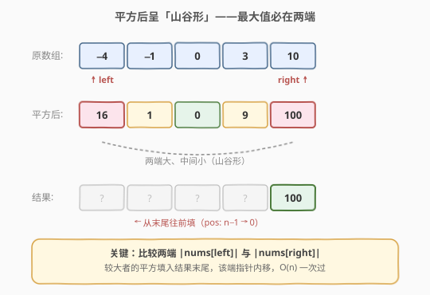

# LeetCode 有序数组的平方 题解

## 1. 题目概述

- **标题 / 题号**：有序数组的平方（#977，easy）
- **链接**：https://leetcode.cn/problems/squares-of-a-sorted-array/
- **难度**：简单
- **标签**：数组、双指针

**题意**：给定一个按**非递减顺序**排序的整数数组 `nums`，返回每个元素的**平方**组成的新数组，要求新数组也按**非递减顺序**排序。

**示例 1**：

```text
输入：nums = [-4,-1,0,3,10]
输出：[0,1,9,16,100]
解释：平方后得 [16,1,0,9,100]，排序后为 [0,1,9,16,100]。
```

**示例 2**：

```text
输入：nums = [-7,-3,2,3,11]
输出：[4,9,9,49,121]
解释：平方后得 [49,9,4,9,121]，排序后为 [4,9,9,49,121]。
```

**约束**：

- $1 \le \text{nums.length} \le 10^4$
- $-10^4 \le \text{nums[i]} \le 10^4$
- `nums` 已按非递减顺序排序

> 💡 **进阶要求**：你能设计一个 $O(n)$ 时间复杂度的解法吗？（直接平方后排序是 $O(n \log n)$。）

## 2. 解题思路

### 2.1 暴力思路

逐个元素平方，然后对结果数组排序。平方遍历 $O(n)$，排序 $O(n \log n)$，总复杂度 $O(n \log n)$。这能通过提交，但未利用「原数组已排序」这一关键性质，达不到进阶要求的 $O(n)$。

### 2.2 核心观察：平方后呈「山谷形」，最大值必在两端



原数组非递减，意味着**负数（若有）集中在左侧，正数集中在右侧**，分界处是绝对值最小的元素（最接近 0）。平方后：

- 负数的平方 = 正数，越往左（越负）平方越大；
- 正数的平方，越往右平方越大。

因此平方后的数组呈**「山谷形」**——两端大、中间小。**最大值一定在两端之一**。

> 💡 **关键推论**：既然每一步的最大值都在当前未处理区间的两端，就可以用**两个指针从两端向中间收拢**，每次取绝对值较大的一端，把它的平方填入结果数组的**末尾**（从后往前填）。这和 [88. 合并两个有序数组](../0001-0100/88_合并两个有序数组.md) 的「从后往前取较大者填末尾」是同一套模板。

### 2.3 算法流程图


初始化 `left = 0`、`right = n - 1`、`pos = n - 1`，结果数组 `result` 大小为 `n`。每轮：

1. 比较 $|\text{nums[left]}|$ 与 $|\text{nums[right]}|$（等价于比较平方值）。
2. 较大一端的平方填入 `result[pos]`，该端指针内移，`pos--`。
3. 当 `left > right` 时所有位置已填满，结束。

`left`、`right` 各从端点向中间移动，合计最多 `n` 步，总复杂度 $O(n)$。

### 2.4 示例演算

![示例演算：nums = [−4, −1, 0, 3, 10]](../images/sqs_example_walkthrough.svg)

以 `nums = [-4, -1, 0, 3, 10]` 为例，逐步执行：

| 步骤 | left | right | $|\text{左}|$ vs $|\text{右}|$ | 填入 | 结果数组 |
|------|------|-------|-------------------------------|------|----------|
| 1 | 0 | 4 | $4 < 10$ → 取右 | 100 | `[_, _, _, _, 100]` |
| 2 | 0 | 3 | $4 \ge 3$ → 取左 | 16 | `[_, _, _, 16, 100]` |
| 3 | 1 | 3 | $1 < 3$ → 取右 | 9 | `[_, _, 9, 16, 100]` |
| 4 | 1 | 2 | $1 \ge 0$ → 取左 | 1 | `[_, 1, 9, 16, 100]` |
| 5 | 2 | 2 | $0 \ge 0$ → 取左 | 0 | `[0, 1, 9, 16, 100]` |

`left = 3 > right = 2`，结束。最终结果 `[0, 1, 9, 16, 100]`。

## 3. 参考代码

### C++

```cpp
class Solution {
  public:
    vector<int> sortedSquares(vector<int>& nums) {
        int n = nums.size();
        vector<int> result(n);
        int left = 0, right = n - 1, pos = n - 1;
        while (left <= right) {
            int l = nums[left] * nums[left];
            int r = nums[right] * nums[right];
            if (l >= r) {
                result[pos--] = l;
                left++;
            } else {
                result[pos--] = r;
                right--;
            }
        }
        return result;
    }
};
```

### Python

```python
class Solution:
    def sortedSquares(self, nums: List[int]) -> List[int]:
        n = len(nums)
        result = [0] * n
        left, right, pos = 0, n - 1, n - 1
        while left <= right:
            l = nums[left] ** 2
            r = nums[right] ** 2
            if l >= r:
                result[pos] = l
                left += 1
            else:
                result[pos] = r
                right -= 1
            pos -= 1
        return result
```

> 💡 **两个实现细节**：
> 1. **比较平方值而非绝对值**：直接算 `nums[left] * nums[left]` 和 `nums[right] * nums[right]` 来比，省去调用 `abs`，且比较结果等价（非负数的大小关系与平方一致）。
> 2. **从后往前填**：`pos` 从 `n-1` 递减，保证先填大的、后填小的，结果自然有序。写入位置与读取方向相反，不会覆盖未处理的元素。

## 4. 复杂度分析

| 维度 | 复杂度 | 说明 |
|------|--------|------|
| 时间复杂度 | $O(n)$ | `left`、`right` 合计最多移动 `n` 步，每步 $O(1)$ |
| 空间复杂度 | $O(n)$ | 结果数组大小为 `n`（不含输出则 $O(1)$） |

## 5. 扩展：与「合并两个有序数组」的同构关系

本题与 [88. 合并两个有序数组](../0001-0100/88_合并两个有序数组.md) 共享同一个模板——**「反向填双指针」**：

| | 88. 合并两个有序数组 | 977. 有序数组的平方 |
|---|---|---|
| 输入 | 两个已排序数组 `nums1`、`nums2` | 一个已排序数组（含负数） |
| 结构 | 两个指针分别扫两个数组 | 两个指针从同一数组两端向中间收拢 |
| 填法 | 从后往前取较大者填入 `nums1` 末尾 | 从后往前取较大平方值填入 `result` 末尾 |
| 本质 | 两个有序序列的归并 | 「山谷形」序列从两端取最大 |

两者都是利用「最大值在端点」这一性质，从结果数组的末尾反向填充，避免正向填充时的元素搬移。掌握这个模板，就能秒杀一切「两端取大填末尾」的场景。

## 6. 面试要点

1. **为什么平方后呈「山谷形」？**

   原数组非递减：负数在左、正数在右，0 附近绝对值最小。负数越往左越负（绝对值越大），平方越大；正数越往右越大，平方也越大。所以平方后两端大、中间小，形成山谷。

2. **为什么从后往前填，而不从前往后填？**

   每轮取的是当前未处理区间的**最大值**，应该放在结果数组的最右侧（最大的位置）。从后往前填，先放大的、后放小的，结果自然非递减。若从前往后填则需要先取最小值，但最小值在中间（山谷底部），无法用双指针高效获取。

3. **比较时用 `abs` 还是用平方？**

   两者等价（非负数 $a \ge b \iff a^2 \ge b^2$）。直接用平方可以省掉 `abs` 调用，且填入结果时本来就需要平方值，一举两得。

4. **全正数或全负数数组怎么办？**

   无需特殊处理。全正数时 `left` 端的平方始终更小，`right` 指针一路左移，等价于直接反向拷贝平方值；全负数时 `left` 端的平方始终更大（更负的数平方更大），`left` 指针一路右移。算法自然适配。

5. **和直接排序相比有什么优势？**

   直接排序（平方 + `sort`）是 $O(n \log n)$，双指针是 $O(n)$。虽然 $n \le 10^4$ 时两者都能通过，但面试官出这道题就是想看你能否利用「已排序」性质把复杂度从 $O(n \log n)$ 优化到 $O(n)$——这是区分「会写代码」和「会算法」的考点。

## 同类练习题

| # | 题目 | 与本题的关联 |
|---|------|-------------|
| 88 | [合并两个有序数组](https://leetcode.cn/problems/merge-sorted-array/)（[题解](../0001-0100/88_合并两个有序数组.md)） | 同款「反向填双指针」模板，两个有序数组的归并 |
| 11 | [盛最多水的容器](https://leetcode.cn/problems/container-with-most-water/)（[题解](../0001-0100/11_盛最多水的容器.md)） | 双指针从两端向中间收拢，本题的「亲戚」 |
| 283 | [移动零](https://leetcode.cn/problems/move-zeroes/)（[题解](../0201-0300/283_移动零.md)） | 快慢双指针，与本题的对撞双指针互补 |
| 360 | [有序转换数组](https://leetcode.cn/problems/sort-transformed-array/) | 二次函数 $ax^2+bx+c$ 作用在有序数组上，根据开口方向决定从哪端填——山谷/山峰形的推广 |
