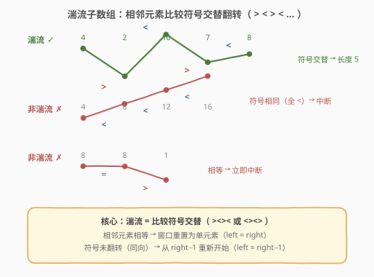
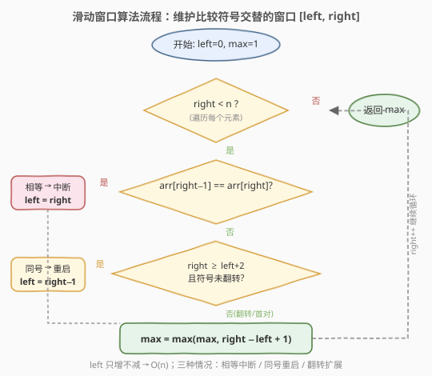

# LeetCode 最长湍流子数组 题解

## 1. 题目概述

- **标题 / 题号**：最长湍流子数组（#978，medium）
- **链接**：https://leetcode.cn/problems/longest-turbulent-subarray/
- **难度**：中等
- **标签**：数组、动态规划、滑动窗口

**题意**：给定一个整数数组 `arr`，返回 `arr` 的**最大湍流子数组的长度**。

一个子数组 `[arr[i], arr[i+1], ..., arr[j]]` 称为**湍流子数组**，当且仅当相邻元素之间的比较符号**交替翻转**：

- **模式 A**：对于 $i \le k < j$，当 $k$ 为偶数时 $\text{arr}[k] < \text{arr}[k+1]$，当 $k$ 为奇数时 $\text{arr}[k] > \text{arr}[k+1]$；
- **模式 B**：对于 $i \le k < j$，当 $k$ 为偶数时 $\text{arr}[k] > \text{arr}[k+1]$，当 $k$ 为奇数时 $\text{arr}[k] < \text{arr}[k+1]$。

直观地说，湍流子数组就是一条**上下交替的折线**——每一步的方向都和上一步相反（$>, <, >, <, \ldots$ 或 $<, >, <, >, \ldots$）。

**示例 1**：

```text
输入：arr = [9,4,2,10,7,8,8,1,9]
输出：5
解释：最长湍流子数组是 [4,2,10,7,8]，比较符号为 >, <, >, <（交替翻转）。
```

**示例 2**：

```text
输入：arr = [4,8,12,16]
输出：2
解释：所有相邻对都是 <，符号不交替，最长湍流子数组长度仅为 2。
```

**示例 3**：

```text
输入：arr = [100]
输出：1
解释：单元素子数组视为湍流子数组。
```

**约束**：

- $1 \le \text{arr.length} \le 4 \times 10^4$
- $0 \le \text{arr}[i] \le 10^9$

## 2. 解题思路

### 2.1 暴力思路

枚举所有子数组 `[i, j]`，逐一检查其中相邻元素的比较符号是否交替翻转。时间复杂度 $O(n^3)$（枚举 $O(n^2)$ × 检查 $O(n)$），对于 $n = 4 \times 10^4$ 必然超时。

### 2.2 核心观察：滑动窗口



关键直觉是维护一个**比较符号交替翻转的窗口** `[left, right]`：

- `right` 指针不断右移，把新元素纳入窗口。
- 每次扩展时检查 `arr[right-1]` 与 `arr[right]` 的比较方向是否和上一对 `arr[right-2]` 与 `arr[right-1]` **相反**。
- 有三种情况：
  1. **翻转**（方向相反）→ 窗口扩展，继续。
  2. **相等**（`arr[right-1] == arr[right]`）→ 相等无法构成任何比较方向，窗口**重置为单元素** `left = right`。
  3. **同号**（方向相同，如连续两个 `<`）→ 上一对方向已定，无法翻转；但 `arr[right-1]` 与 `arr[right]` 本身不相等，可以**从这对重新开始** `left = right - 1`。

> 💡 **为什么同号时 `left` 跳到 `right-1` 而不是 `right`？** 因为 `arr[right-1] != arr[right]`（否则走情况 2），这对元素本身是一个合法的湍流起点（长度 2）。丢掉 `right-1` 之前的历史，从 `[right-1, right]` 重新出发，不会漏掉更长的解。

### 2.3 算法流程图



整体只有一重循环，`left` 和 `right` 都只增不减，因此总移动次数不超过 $2n$。

### 2.4 示例演算

![示例演算：arr = [9, 4, 2, 10, 7, 8, 8, 1, 9]](../images/turb_example_walkthrough.svg)

以 `arr = [9, 4, 2, 10, 7, 8, 8, 1, 9]` 为例，逐步执行：

- 第 1 步 `right=1`：`9 > 4`，窗口首对，扩展 → `[9, 4]`，`max = 2`。
- 第 2 步 `right=2`：`4 > 2`，与上一对 `9 > 4` 同号 → `left` 跳到 `1`，窗口 `[4, 2]`，`max = 2`。
- 第 3–5 步：`2 < 10`、`10 > 7`、`7 < 8` 连续三次翻转，窗口扩展到 `[4, 2, 10, 7, 8]`，`max = 5` ⭐。
- 第 6 步 `right=6`：`8 == 8` 相等 → `left` 跳到 `6`，窗口重置为 `[8]`，`max` 不变。
- 第 7–8 步：`8 > 1`、`1 < 9` 翻转，窗口恢复到 `[8, 1, 9]`，长度 3 不超过 `max`。

最终答案为 `5`。

## 3. 参考代码

### C++（滑动窗口）

```cpp
class Solution {
  public:
    int maxTurbulenceSize(vector<int>& arr) {
        int n = arr.size();
        int left = 0, max_len = 1;
        for (int right = 1; right < n; right++) {
            if (arr[right - 1] == arr[right]) {
                left = right;                       // 相等：窗口重置为单元素
            } else if (right >= left + 2) {
                bool prevUp = arr[right - 2] < arr[right - 1];
                bool currUp = arr[right - 1] < arr[right];
                if (prevUp == currUp) {
                    left = right - 1;               // 同号：从 right-1 重新开始
                }
            }
            max_len = max(max_len, right - left + 1);
        }
        return max_len;
    }
};
```

### Python

```python
class Solution:
    def maxTurbulenceSize(self, arr: List[int]) -> int:
        n = len(arr)
        left = 0
        max_len = 1
        for right in range(1, n):
            if arr[right - 1] == arr[right]:
                left = right                       # 相等：窗口重置为单元素
            elif right >= left + 2:
                prev_up = arr[right - 2] < arr[right - 1]
                curr_up = arr[right - 1] < arr[right]
                if prev_up == curr_up:
                    left = right - 1               # 同号：从 right-1 重新开始
            max_len = max(max_len, right - left + 1)
        return max_len
```

> ⚠️ **注意** `right >= left + 2` **这个条件**：只有窗口内至少有 3 个元素时，才能取到 `arr[right-2]` 来判断方向是否翻转。窗口恰好 2 个元素（`right == left + 1`）时，只要不相等就天然合法，无需检查翻转。

## 4. 复杂度分析

| 维度 | 复杂度 | 说明 |
|------|--------|------|
| 时间复杂度 | $O(n)$ | `left`、`right` 各至多遍历一次，每步 $O(1)$ |
| 空间复杂度 | $O(1)$ | 只用常数个变量 |

## 5. 扩展：动态规划解法

滑动窗口的窗口长度 `right - left + 1` 本质上等价于一个 DP 状态：**以 `i` 结尾的最长湍流子数组长度** `dp[i]`。

- `arr[i-1] == arr[i]` → `dp[i] = 1`（相等，无法配对）
- 方向翻转（`prevUp != currUp`）→ `dp[i] = dp[i-1] + 1`（续接）
- 方向同号 → `dp[i] = 2`（从 `[i-1, i]` 重新开始）

```cpp
class Solution {
  public:
    int maxTurbulenceSize(vector<int>& arr) {
        int n = arr.size();
        int ans = 1, dp = 1;
        for (int i = 1; i < n; i++) {
            if (arr[i - 1] == arr[i]) {
                dp = 1;
            } else if (i >= 2 &&
                       (arr[i - 2] < arr[i - 1]) == (arr[i - 1] < arr[i])) {
                dp = 2;                            // 同号，重新开始
            } else {
                dp++;                              // 翻转或首对，续接
            }
            ans = max(ans, dp);
        }
        return ans;
    }
};
```

> 💡 **DP 与滑动窗口的等价性**：滑动窗口的 `left` 就是 DP 状态隐含的起点——`dp = right - left + 1`。两者复杂度相同 $O(n) / O(1)$，只是视角不同：DP 关注「以 i 结尾」，滑窗关注「当前窗口」。面试中两种写法都行，滑动窗口更直观。

## 6. 面试要点

1. **湍流的本质是什么？**

   相邻元素比较符号交替翻转（$>, <, >, <, \ldots$ 或 $<, >, <, >, \ldots$）。只要每一步的方向和上一步相反，子数组就是湍流的。相等会立即打断湍流。

2. **为什么同号时 `left = right - 1` 而不是 `right`？**

   同号意味着 `arr[right-1]` 和 `arr[right]` 不相等（否则走相等分支），它们本身可以构成一个新的湍流起点。从 `right - 1` 重新开始能保留这一对，避免漏掉潜在的更长窗口。

3. **为什么不用判断「模式 A 还是模式 B」？**

   模式 A 和模式 B 的区别仅在于起始方向（先 `<` 还是先 `>`）。滑动窗口天然包含两种模式——窗口的前两个元素决定了起始方向，后续只需检查是否翻转，无需显式区分。

4. **滑动窗口为什么是 $O(n)$？**

   `left` 和 `right` 都只增不减。`right` 每轮加 1，`left` 在相等时跳到 `right`、在同号时跳到 `right-1`，两者合计最多移动 $2n$ 次。

5. **如果数组元素有负数怎么办？**

   无影响。算法只比较相邻元素的大小关系（`<`、`>`、`==`），与元素的具体值无关。$0 \le \text{arr}[i] \le 10^9$ 的约束不影响算法正确性。

## 同类练习题

| # | 题目 | 与本题的关联 |
|---|------|-------------|
| 53 | [最大子数组和](https://leetcode.cn/problems/maximum-subarray/)（[题解](../0001-0100/53_最大子数组和.md)） | 同样求「满足条件的最大子数组」，Kadane DP 与本题的 DP 视角一脉相承 |
| 3 | [无重复字符的最长子串](https://leetcode.cn/problems/longest-substring-without-repeating-characters/)（[题解](../0001-0100/3_无重复字符的最长子串.md)） | 滑动窗口维护区间性质，遇冲突收缩 `left`，模板通用 |
| 904 | [水果成篮](https://leetcode.cn/problems/fruit-into-baskets/)（[题解](../0901-1000/904_水果成篮.md)） | 同目录滑动窗口题，维护窗口内「种类数 ≤ 2」的不变式 |
| 152 | [乘积最大子数组](https://leetcode.cn/problems/maximum-product-subarray/)（[题解](../0101-0200/152_乘积最大子数组.md)） | 滚动 DP 同时跟踪 max/min 状态，与本题跟踪「上一对方向」的思路类似 |
