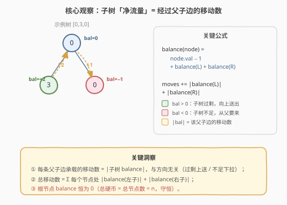
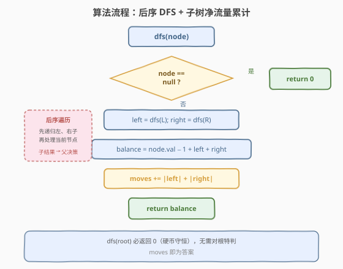

# LeetCode 在二叉树中分配硬币 题解

## 1. 题目概述

- **标题 / 题号**：在二叉树中分配硬币（#979，medium）
- **链接**：https://leetcode.cn/problems/distribute-coins-in-binary-tree/
- **难度**：中等
- **标签**：树、二叉树、深度优先搜索

**题意**：给定一棵有 $n$ 个节点的二叉树的根 `root`，其中每个节点 `node` 上有 `node.val` 枚硬币。整棵树**共有 $n$ 枚硬币**。

在一次移动中，我们可以选择**两个相邻节点**，将一枚硬币从其中一个节点移动到另一个节点。移动可以从父到子，也可以从子到父。

返回使**每个节点上恰好有 1 枚硬币**所需的最少移动次数。

**示例 1**：

```text
输入：root = [3,0,0]
输出：2
解释：从根节点移动一枚硬币到左子节点，再移动一枚到右子节点。
    3           1
   / \   →     / \
  0   0       1   1
```

**示例 2**：

```text
输入：root = [0,3,0]
输出：3
解释：从左子节点（3 枚）移动两枚到根（经根中转），根再移动一枚到右子节点。
    0           1
   / \   →     / \
  3   0       1   1
```

**约束**：

- 树中节点数 $n$ 在范围 $[1, 100]$ 内
- 节点值 $\text{node.val}$ 在范围 $[0, 100]$ 内
- 总硬币数 $= n$（守恒）

> 💡 本题是「**后序 DFS + 子树净流量**」的招牌题。关键洞察是：每条父子边承载的移动次数恰等于**子树的硬币净过剩/不足量**的绝对值。一次后序遍历，把子树盈亏向上传递，沿途累计 $|\text{balance}|$ 即得答案。它与 [968. 监控二叉树](../0901-1000/968_监控二叉树.md) 同属「后序传递状态 + 副作用累计」家族，只是返回值从「三状态枚举」换成了「带符号整数」。

## 2. 解题思路

### 2.1 暴力思路：模拟每次移动

最朴素的想法是：每次找到一个「硬币 $>1$」的节点和一个「硬币 $=0$」的相邻可达节点，移动一枚，重复直到所有节点都为 1。但这样需要反复扫描整棵树、且移动顺序影响效率（一枚硬币可能要经多跳才到位），难以直接得到**最少**次数。

更进一步，可以想到用 BFS/最短路计算每枚硬币到目标位置的跳数——但「谁送给谁」的配对本身就是一个分配问题，复杂度高。

> ⚠️ 暴力的困难在于「逐枚跟踪硬币」。事实上我们不需要关心**哪枚**硬币走了**哪条路**，只需关心**每条边**上必须流过多少枚——这正是「流量」视角的起点。

### 2.2 核心观察：子树「净流量」= 经过该边的移动数



定义节点 `node` 的**子树净流量**（balance）：

$$
\text{balance(node)} = \text{子树硬币总数} - \text{子树节点数}
$$

- $\text{balance} > 0$：子树**过剩**，多余的硬币必须经过 `node → parent` 这条边向上送出；
- $\text{balance} < 0$：子树**不足**，缺的硬币必须经过 `parent → node` 这条边向下要来；
- $\text{balance} = 0$：子树自给自足，父子边无流量。

**无论方向，经过父子边的移动次数 $= |\text{balance}|$**——因为过剩或不足的量都必须「物理地」流过这条边，且每枚硬币流过一次就是一次移动。

递归地，`balance(node)` 可由子节点递推：

$$
\text{balance(node)} = (\text{node.val} - 1) + \text{balance(L)} + \text{balance(R)}
$$

其中 $\text{node.val} - 1$ 是当前节点自身的「需求」（多出还是不足一枚）。

**累计移动次数**：在 `node` 处，左子边承载 $|\text{balance(L)}|$ 次、右子边承载 $|\text{balance(R)}|$ 次，故：

$$
\text{moves} \mathrel{+}= |\text{balance(L)}| + |\text{balance(R)}|
$$

> 💡 **根节点的 balance 恒为 0**：因为整棵树的硬币总数 $= n$（约束保证），即 $\text{balance(root)} = n - n = 0$。这是硬币守恒的体现——根没有父节点，无需再向上送出，所有流量在树内消化。

### 2.3 算法流程图



完整步骤：

1. **`dfs(node)`** 返回以 `node` 为根的子树净流量 `balance`；
2. **空节点**：返回 `0`（空子树既无硬币也无节点，净流量为 0）；
3. **递归**：`left = dfs(node.left)`，`right = dfs(node.right)`；
4. **算 balance**：`balance = node.val - 1 + left + right`；
5. **累计 moves**：`moves += abs(left) + abs(right)`（左右两条父子边各承载一次）；
6. **返回** `balance` 给父节点。

> ⚠️ **第 5 步是核心**：累计的是**子节点的 balance 绝对值**，而非当前节点的——因为当前节点的 balance 对应的是「node → parent」那条边，会在父节点处被算入。叶子节点处 `moves += |0| + |0| = 0`（空子节点返回 0），流量从父节点那层开始累计，逻辑自洽。

### 2.4 示例演算

以示例 3 `root = [1,0,0,null,3]` 为例（树形见下图），后序遍历顺序为 ①→④：

![示例演算：[1,0,0,null,3] → 4](../images/distrib_coins_walkthrough.svg)

| 步 | 节点 | val | 左 bal | 右 bal | 节点 balance | +moves | 累计 moves |
|----|------|-----|--------|--------|-------------|--------|-----------|
| ① | leaf(3) | 3 | 0(null) | 0(null) | $3-1+0+0=+2$ | $\|0\|+\|0\|=0$ | 0 |
| ② | left(0) | 0 | 0(null) | $+2$(①) | $0-1+0+2=+1$ | $\|0\|+\|2\|=2$ | 2 |
| ③ | right(0) | 0 | 0(null) | 0(null) | $0-1+0+0=-1$ | $0$ | 2 |
| ④ | root(1) | 1 | $+1$(②) | $-1$(③) | $1-1+1-1=0$ | $\|1\|+\|1\|=2$ | 4 |

根返回 `balance = 0`（守恒 ✓），最终 `moves = 4` ✓。

> 💡 **观察流量的物理意义**：leaf(3) 有 3 枚但只需 1 枚，多出 2 枚经「leaf→left」边向上（②处累计 2 次移动）；left(0) 收到 2 枚后自身仍缺 1 枚，净多 1 枚经「left→root」边向上（④处累计 1 次）；root 自身平衡（val=1），把从左收来的 1 枚转给右子，经「root→right」边向下（④处再累计 1 次）。三段流量 $2+1+1=4$ 恰为总移动数。

## 3. 参考代码

### C++

```cpp
// 在二叉树中分配硬币.cpp —— 后序 DFS + 子树净流量累计
// 编译: g++ -O2 -std=c++17 在二叉树中分配硬币.cpp -o distrib
class Solution {
    int moves = 0;

    // 返回以 node 为根的子树净流量（硬币数 - 节点数）
    int dfs(TreeNode* node) {
        if (!node) return 0;                 // 空子树净流量为 0
        int left  = dfs(node->left);
        int right = dfs(node->right);
        moves += std::abs(left) + std::abs(right);   // 左右父子边各承载 |balance|
        return node->val - 1 + left + right;         // 当前子树净流量
    }

  public:
    int distributeCoins(TreeNode* root) {
        moves = 0;
        dfs(root);                           // 返回值必为 0（硬币守恒），无需特判
        return moves;
    }
};
```

### Python

```python
class Solution:
    def distributeCoins(self, root: Optional[TreeNode]) -> int:
        moves = 0

        def dfs(node: Optional[TreeNode]) -> int:
            nonlocal moves
            if not node:
                return 0                     # 空子树净流量为 0
            left = dfs(node.left)
            right = dfs(node.right)
            moves += abs(left) + abs(right)  # 左右父子边各承载 |balance|
            return node.val - 1 + left + right

        dfs(root)                            # 返回值必为 0（硬币守恒）
        return moves
```

> 💡 两版完全等价。`dfs` 用返回值传递子树净流量、用 `moves` 记副作用——这是「数值返回 + 副作用累计」的树形统计惯用法，与 [968. 监控二叉树](../0901-1000/968_监控二叉树.md) 的「三状态返回 + count 副作用」、[250. 统计同值子树](../0201-0300/250_统计同值子树.md) 的「bool 返回 + 计数」一脉相承，只是返回值从布尔/枚举升级为带符号整数。

## 4. 复杂度分析

| 维度 | 复杂度 | 说明 |
|------|--------|------|
| 时间复杂度 | $O(n)$ | 每个节点访问一次，每次做 $O(1)$ 加法与绝对值 |
| 空间复杂度 | $O(h)$ | 递归栈深度 = 树高 $h$；平衡树 $O(\log n)$，退化链 $O(n)$ |
| 最坏情况 | $O(n)$ 空间 | 树退化为单侧链时递归深度达 $n$ |

> ⚠️ **正确性的关键**在于「每条父子边的流量恰被计数一次」：子节点的 balance 只在父节点处被取绝对值累计，不会重复计数。一枚硬币从叶子流到根经过 $k$ 条边，会在沿途 $k$ 个父节点处各贡献 1 次移动——这正是它实际需要的移动次数。因此总和等于所有硬币实际移动跳数之和，即最少移动次数。

## 5. 扩展：流量视角与守恒律

本题可以视为树上的**网络流（network flow）**问题的一个特例。把每条父子边视为一条**无容量上限的双向管道**，每个节点有「供应量」$\text{node.val} - 1$（正为供应、负为需求）。目标是找到一组边流量使所有节点供需平衡，且**总流量**（$\sum|\text{flow}|$）最小。

在**树**这一特殊拓扑上，每条边的流量是**唯一确定**的——因为树无环，切断任一父子边就把树分成两半，两半的供需差必须全部流过这条边。这正是 $\text{flow}(\text{edge}) = |\text{balance}(\text{子树})|$ 的拓扑根因。在一般图上，流量可沿多条路径分流，需用最小费用最大流求解；而树的唯一路径性质让问题退化为一趟 DFS。

> 💡 **守恒律**贯穿全题：每个节点处「流入 = 流出 + 自身净变化」，等价于 $\text{balance(node)} = (\text{node.val}-1) + \text{balance(L)} + \text{balance(R)}$；根节点无父边，故 $\text{balance(root)} = 0$ 即整体守恒。这一视角可推广到任意树形上的供需平衡问题。

## 6. 面试要点

1. **为什么用后序遍历？前序或中序行不行？**

   > 不行。计算 `balance(node)` 必须先知道左右子树的 balance，这是典型的「子问题结果决定父决策」结构，只能后序（自底向上）。前序/中序在访问 `node` 时子树尚未计算，无法得到子树净流量。这与 [124. 二叉树中的最大路径和](../0101-0200/124_二叉树中的最大路径和.md)、[968. 监控二叉树](../0901-1000/968_监控二叉树.md) 的后序需求同源。

2. **为什么根节点的 balance 一定是 0？**

   > 约束保证总硬币数 $= n$（节点数）。$\text{balance(root)} = \text{总硬币} - \text{总节点} = n - n = 0$。这是硬币守恒的必然结果——根没有父节点，所有供需在树内闭合。因此 `dfs(root)` 的返回值恒为 0，代码无需对根特判（对比 [968](../0901-1000/968_监控二叉树.md) 需要检查根是否「未覆盖」补摄像头，本题更简洁）。

3. **为什么 `moves += |left| + |right|` 而不是 `|balance(node)|`？**

   > `left`/`right` 是**子节点**的 balance，对应「node↔子节点」这条父子边的流量；`balance(node)` 对应「node↔父节点」那条边，会在**父节点**处被累计。在当前节点累计子边的流量，保证每条边恰好被计数一次。若累计 `|balance(node)|`，则漏算子边、且在根处多算（根 balance = 0 不影响但逻辑错误）。

4. **一枚硬币可能经过多条边吗？会重复计数吗？**

   > 会经过多条边，但**不会重复计数**。一枚硬币从叶子流到根经过 $k$ 条边，会在沿途 $k$ 个父节点处各贡献 1 次 $|\text{balance}|$——每条边只在该边的父端点被计数一次。这正是「移动次数 = 总跳数」的体现：跳 $k$ 次就计 $k$ 次。流量的线性可加性保证了求和等于实际总跳数。

5. **这题和 [968. 监控二叉树](../0901-1000/968_监控二叉树.md) 的套路有何异同？**

   > 同：都是「后序 DFS + 返回值传递子结构状态 + 副作用变量累计答案」——子问题结果决定父决策，状态压缩在返回值里向上传递，答案在遍历中累加。异：968 的返回值是三值枚举（未覆盖/已覆盖/有摄像头），转移是贪心规则；本题返回值是带符号整数（净流量），转移是简单加法。968 需对根特判（补摄像头），本题根 balance 恒 0 无需特判。两者都是「树形结构上的局部量向上聚合」范式。

> 💡 **一句话总结**：979 的灵魂是「**子树净流量**」——每个节点返回 `val-1 + 左 balance + 右 balance`，沿途累计 `|左|+|右|` 即得最少移动次数；树的唯一路径性质让每条边流量唯一确定，一趟后序 DFS $O(n)$ 解决。

## 同类练习题

| # | 题目 | 与本题的关联 |
|---|------|-------------|
| 968 | [监控二叉树](https://leetcode.cn/problems/binary-tree-cameras/)（[题解](../0901-1000/968_监控二叉树.md)） | 后序 DFS + 三状态返回值 + 副作用计数，与本题同属「后序传递状态 + 累计答案」家族，状态从整数退化为枚举 |
| 124 | [二叉树中的最大路径和](https://leetcode.cn/problems/binary-tree-maximum-path-sum/)（[题解](../0101-0200/124_二叉树中的最大路径和.md)） | 后序传递子树最大贡献值，在节点处聚合，经典「后序 + 返回值」骨架 |
| 250 | [统计同值子树](https://leetcode.cn/problems/count-univalue-subtrees/)（[题解](../0201-0300/250_统计同值子树.md)） | 后序 DFS + 布尔返回值传递子结构结论，本题「数值返回 + 副作用计数」模板的 bool 版前身 |
| 337 | [打家劫舍 III](https://leetcode.cn/problems/house-robber-iii/)（[题解](../0301-0400/337_打家劫舍III.md)） | 后序 DFS + 二状态返回值（偷/不偷），树形 DP 招牌题，与本题同属「后序传递状态」家族 |
| 1373 | [二叉搜索子树的最大键值和](https://leetcode.cn/problems/maximum-sum-bst-in-binary-tree/) | 后序 DFS 返回多值状态（是否 BST / 最小 / 最大 / 和），在节点处聚合判定，状态传递更复杂但骨架相同 |
