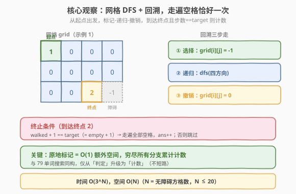
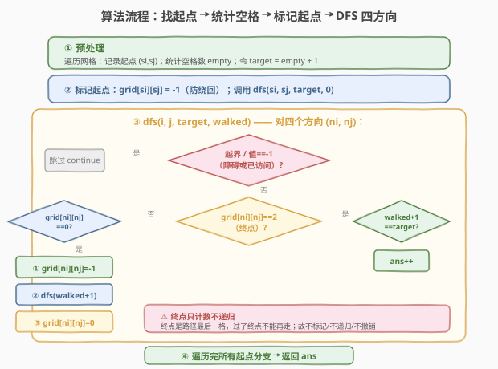
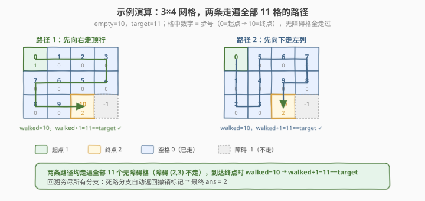

# 不同路径 III

- **题目名称**：不同路径 III
- **链接**：[980. 不同路径 III](https://leetcode.cn/problems/unique-paths-iii/)
- **难度**：困难
- **标签**：回溯、深度优先搜索、矩阵

## 1. 题目概述

在二维网格 `grid` 上有 4 种方格：

- `1` 表示起始方格（恰好一个）。
- `2` 表示结束方格（恰好一个）。
- `0` 表示可走过的空方格。
- `-1` 表示无法跨越的障碍。

返回从起始方格到结束方格、在四方向（上下左右）行走时的**不同路径数目**。**每一个无障碍方格都要恰好通过一次**，且一条路径中不能重复通过同一方格。

**示例 1**：

```text
输入：grid = [[1,0,0,0],[0,0,0,0],[0,0,2,-1]]
输出：2
解释：两条路径如下：
1. (0,0)→(0,1)→(0,2)→(0,3)→(1,3)→(1,2)→(1,1)→(1,0)→(2,0)→(2,1)→(2,2)
2. (0,0)→(1,0)→(2,0)→(2,1)→(1,1)→(0,1)→(0,2)→(0,3)→(1,3)→(1,2)→(2,2)
```

**示例 2**：

```text
输入：grid = [[1,0,0,0],[0,0,0,0],[0,0,0,2]]
输出：4
```

**示例 3**：

```text
输入：grid = [[0,1],[2,0]]
输出：0
解释：没有任何一条路能完全穿过每一个空方格恰好一次。
```

**约束条件**：

- `1 <= grid.length * grid[0].length <= 20`
- `grid[i][j]` 为 `-1`、`0`、`1` 或 `2`

> 💡 这是 [79. 单词搜索](../0001-0100/79_单词搜索.md) 的「计数版升级」——同样是网格 DFS + 回溯，但目标从「找一条匹配路径」变为「**统计所有走遍每个无障碍方格恰好一次、且到达终点的路径数**」。本质是在网格上求**哈密顿路径的条数**。`m × n ≤ 20` 的小规模正是回溯/状态压缩的甜区。

---

## 2. 解题思路

### 2.1 暴力思路：枚举所有路径

从起点出发，每步在四方向中任选，生成所有可能的走法，再筛选「不重复、走遍全部空格、终点为 `2`」的路径。但四方向分支导致路径数指数爆炸（最坏 $4^N$，$N$ 为无障碍方格数），且大量路径中途就重复或漏走，效率极差。

### 2.2 核心观察：DFS + 回溯，走遍空格恰好一次



**关键思路**：从起点 `1` 出发做 DFS，每走一步**标记当前格子为已访问**（原地改为 `-1`），递归四方向探索，返回后**撤销标记**恢复为 `0`。当走到终点 `2` 时，检查**已走步数是否等于需走步数**——相等则说明走遍了所有无障碍方格，路径计数 `+1`。

**三个核心量**：

1. **`empty`**：值为 `0` 的空方格数量（预处理时统计）。
2. **`target = empty + 1`**：从起点出发后还需走的步数（全部 `0` + 终点 `2`）。
3. **`walked`**：DFS 过程中已走的步数（不含起点）。

> 💡 **为什么是 `target = empty + 1`？** 无障碍方格总数 = `empty`（所有 `0`）+ 起点 `1` + 终点 `2` = `empty + 2`。从起点出发已占 1 格，还需走 `empty + 2 - 1 = empty + 1` 步才能走完全部。到达终点时若 `walked + 1 == target`（即 `walked == empty`），说明终点前已走完所有 `empty` 个空格，路径合法。

> ⚠️ **与 79 单词搜索的区别**：79 是「找到一条即返回 `true`」（短路）；980 是「统计所有合法路径」（必须穷尽全部分支，不能短路）。回溯模板相同，但 `dfs` 返回值语义从「是否成功」变为「累计计数」。

### 2.3 算法流程图



**完整步骤**：

1. **预处理**：遍历网格，记录起点 `(si, sj)`，统计空格数 `empty`；令 `target = empty + 1`。
2. **标记起点**：`grid[si][sj] = -1`（原地标记已访问）。
3. **DFS** `dfs(i, j, target, walked)`：
   - 对四个方向 `(ni, nj)`：
     - **越界 / 障碍 / 已访问**（值为 `-1`）→ 跳过
     - **终点**（值为 `2`）：若 `walked + 1 == target` → `ans++`（走遍全部，合法路径）；否则跳过（提前到终点但未走完）
     - **空格**（值为 `0`）：标记 `grid[ni][nj] = -1` → `dfs(ni, nj, target, walked + 1)` → 撤销 `grid[ni][nj] = 0`
4. 返回 `ans`。

> ⚠️ **终点不标记、不继续递归**：到达终点 `2` 后只判定计数，**不再向四方向递归**——因为终点是路径的最后一格，过了终点就不能再走（否则会走出网格或重复）。所以终点分支里只有 `if (walked+1==target) ans++`，没有标记/递归/撤销。

### 2.4 示例演算

以示例 1 `grid = [[1,0,0,0],[0,0,0,0],[0,0,2,-1]]` 为例。`empty = 10`，`target = 11`。两条合法路径如下：



| 步骤 | 路径 1 位置 | 路径 2 位置 | 说明 |
|------|------------|------------|------|
| 0 | (0,0) 起点 | (0,0) 起点 | 标记为已访问 |
| 1 | (0,1) → | (1,0) ↓ | 路径 1 先向右，路径 2 先向下 |
| 2 | (0,2) → | (2,0) ↓ | — |
| 3 | (0,3) → | (2,1) → | — |
| 4 | (1,3) ↓ | (1,1) ↑ | — |
| 5 | (1,2) ← | (0,1) ↑ | — |
| 6 | (1,1) ← | (0,2) → | — |
| 7 | (1,0) ← | (0,3) → | — |
| 8 | (2,0) ↓ | (1,3) ↓ | — |
| 9 | (2,1) → | (1,2) ← | — |
| 10 | (2,2) → 终点 | (2,2) ↓ 终点 | `walked=10`，`walked+1=11==target` ✓ 计数 |

两条路径均走遍全部 11 个无障碍方格（`(2,3)` 是 `-1` 障碍不走过），到达终点时步数恰好为 `target`，各计数一次，最终 `ans = 2`。

> 💡 **回溯保证穷尽所有走法**：当某条分支走到死路（四方向都不可走且未到终点）时，DFS 自然返回，撤销沿途标记，让其他分支能复用这些格子。这正是回溯「选择-递归-撤销」的精髓——和 79 单词搜索完全同构，只是不短路、改为累计计数。

---

## 3. 参考代码

### C++

```cpp
// 不同路径III.cpp —— DFS + 回溯，统计走遍全部空格的路径数
// 编译: g++ -O2 -std=c++17 不同路径III.cpp -o unique_paths3
class Solution {
    int m, n, ans = 0;
    int dirs[4][2] = {{-1, 0}, {1, 0}, {0, -1}, {0, 1}};

public:
    int uniquePathsIII(vector<vector<int>>& grid) {
        m = grid.size();
        n = grid[0].size();
        int si = 0, sj = 0, empty = 0;
        for (int i = 0; i < m; i++)
            for (int j = 0; j < n; j++) {
                if (grid[i][j] == 1) { si = i; sj = j; }
                else if (grid[i][j] == 0) empty++;
            }
        grid[si][sj] = -1; // 标记起点已访问
        dfs(grid, si, sj, empty + 1, 0);
        return ans;
    }

private:
    void dfs(vector<vector<int>>& g, int i, int j, int target, int walked) {
        for (auto& d : dirs) {
            int ni = i + d[0], nj = j + d[1];
            if (ni < 0 || ni >= m || nj < 0 || nj >= n) continue;
            if (g[ni][nj] == 2) {
                if (walked + 1 == target) ans++; // 走遍全部，合法路径
            } else if (g[ni][nj] == 0) {
                g[ni][nj] = -1;                 // ① 选择：标记
                dfs(g, ni, nj, target, walked + 1); // ② 递归
                g[ni][nj] = 0;                   // ③ 撤销：回溯
            }
        }
    }
};
```

### Python

```python
class Solution:
    def uniquePathsIII(self, grid: List[List[int]]) -> int:
        m, n = len(grid), len(grid[0])
        dirs = [(-1, 0), (1, 0), (0, -1), (0, 1)]
        si = sj = empty = 0
        for i in range(m):
            for j in range(n):
                if grid[i][j] == 1:
                    si, sj = i, j
                elif grid[i][j] == 0:
                    empty += 1

        ans = 0
        grid[si][sj] = -1  # 标记起点已访问

        def dfs(i: int, j: int, target: int, walked: int) -> None:
            nonlocal ans
            for di, dj in dirs:
                ni, nj = i + di, j + dj
                if 0 <= ni < m and 0 <= nj < n:
                    if grid[ni][nj] == 2:
                        if walked + 1 == target:  # 走遍全部，合法路径
                            ans += 1
                    elif grid[ni][nj] == 0:
                        grid[ni][nj] = -1              # ① 选择：标记
                        dfs(ni, nj, target, walked + 1) # ② 递归
                        grid[ni][nj] = 0                # ③ 撤销：回溯

        dfs(si, sj, empty + 1, 0)
        return ans
```

> 💡 **三处细节**：① 起点也要标记为已访问（`grid[si][sj] = -1`），否则后续可能绕回起点导致重复；② 终点分支只计数不递归——终点是路径终点，不能再走；③ 回溯恢复用 `0`（空格原值），因为进入该分支时已确认是空格。

---

## 4. 复杂度分析

| 维度 | 复杂度 | 说明 |
|------|--------|------|
| **时间** | $O(3^{N})$ | $N$ 为无障碍方格数。从起点出发，每步最多 4 个方向，但来路已标记，故有效分支因子 ≤ 3，深度 $N-1$ |
| **空间** | $O(N)$ | 递归栈深度 = 路径长度 $\le N$；原地标记无额外数组 |

> ⚠️ 时间复杂度 $O(3^{N})$：与 79 单词搜索同构——第一步 4 方向，之后每步来路已被标记为 `-1` 跳过，有效分支因子降为 3。$N \le 20$（约束 `m·n ≤ 20`）时 $3^{20} \approx 3.5 \times 10^{9}$ 为最坏上界，但「必须走遍全部」的约束使绝大多数分支在中途因死路（四方向都不可走且未到终点）提前终止，实际运行远快于上界。

---

## 5. 扩展：状态压缩记忆化 DP

回溯会重复搜索「从同一位置、已访问同一集合」的子问题。由于 $N \le 20$，可用 **bitmask 记录已访问集合**，用 `f(pos, mask)` 表示「在 `pos` 位置、已访问 `mask`、走完剩余方格到达终点的路径数」，记忆化避免重复计算。

```python
from functools import lru_cache

class Solution:
    def uniquePathsIII(self, grid: List[List[int]]) -> int:
        m, n = len(grid), len(grid[0])
        dirs = [(-1, 0), (1, 0), (0, -1), (0, 1)]
        si = sj = 0
        target_mask = 0
        for i in range(m):
            for j in range(n):
                if grid[i][j] == 1:
                    si, sj = i, j
                if grid[i][j] != -1:           # 所有无障碍方格纳入目标掩码
                    target_mask |= (1 << (i * n + j))

        @lru_cache(None)
        def dp(pos: int, mask: int) -> int:
            i, j = divmod(pos, n)
            if grid[i][j] == 2:                # 到达终点
                return 1 if mask == target_mask else 0
            res = 0
            for di, dj in dirs:
                ni, nj = i + di, j + dj
                if 0 <= ni < m and 0 <= nj < n and grid[ni][nj] != -1:
                    np = ni * n + nj
                    if not (mask >> np) & 1:   # 未访问
                        res += dp(np, mask | (1 << np))
            return res

        return dp(si * n + sj, 1 << (si * n + sj))
```

| 维度 | 复杂度 | 说明 |
|------|--------|------|
| **时间** | $O(N \cdot 2^{N})$ | 状态数 $N \cdot 2^{N}$，每个状态枚举 4 方向转移 |
| **空间** | $O(N \cdot 2^{N})$ | 记忆化缓存；$N \le 20$ 时 $2^{20} \approx 10^{6}$，实际可达状态远少 |

> 💡 **何时用记忆化？** 当网格接近填满（障碍少、$N$ 接近 20）且回溯出现大量重复子问题时，记忆化把指数级回溯降为 $O(N \cdot 2^{N})$。这与 [526. 优美的排列](https://leetcode.cn/problems/beautiful-arrangement/) 同属「bitmask + 记忆化」甜区（$N \le 15\sim20$）。但 980 的纯回溯已足够通过，记忆化是理论升级。

---

## 6. 面试要点

1. **`target = empty + 1` 怎么来的？**

   > 无障碍方格总数 = `empty`（`0` 的个数）+ 起点 `1` + 终点 `2` = `empty + 2`。起点已占 1 格，还需走 `empty + 2 - 1 = empty + 1` 步。到达终点时若 `walked + 1 == empty + 1`（即 `walked == empty`），说明终点前已走完所有空格，路径合法。

2. **起点为什么要标记为 `-1`？**

   > 起点也是路径中的一格，必须「恰好通过一次」。若不标记，后续 DFS 可能绕回起点造成重复访问，违反「不重复」约束。标记起点后，它和障碍一样被视为不可走，自然防止绕回。

3. **到达终点后为什么不继续递归？**

   > 终点 `2` 是路径的**最后一格**——题意要求走到终点即结束，过了终点不能再走。若继续递归会走出网格或重复访问，产生非法路径。因此终点分支只做计数判定（`walked+1 == target`），不标记、不递归、不撤销。

4. **本题和 79 单词搜索的回溯有什么异同？**

   > 同：都用「标记 → 四方向递归 → 撤销」三步走模板，原地标记省额外空间。
   > 异：79 是**判定型**——找到一条匹配路径即返回 `true`（短路）；980 是**计数型**——必须穷尽所有分支累计路径数，不能短路。79 匹配字符序列，980 匹配「走遍全部空格」的结构约束。

5. **回溯 vs 状态压缩记忆化，如何选？**

   > $N \le 20$ 时纯回溯已能通过（约束保证 $m \cdot n \le 20$，且「走遍全部」约束剪枝极强）。若障碍很少、$N$ 接近 20 且出现重复子问题，记忆化把 $O(3^{N})$ 降为 $O(N \cdot 2^{N})$，代价是 $O(N \cdot 2^{N})$ 空间。面试中先讲回溯（直观），再提记忆化作为优化方向加分。

> 💡 **一句话总结**：980 不同路径 III 是「网格 DFS + 回溯」的计数版招牌——从起点出发，标记-递归-撤销三步走，到达终点且步数等于 `empty+1` 则计数。时间 $O(3^{N})$、空间 $O(N)$。与 79 单词搜索同构，仅从「判定」升级为「计数」。$N \le 20$ 的规模还可用 bitmask 记忆化升级到 $O(N \cdot 2^{N})$。

---

## 7. 同类练习题

- [79. 单词搜索](https://leetcode.cn/problems/word-search/)（[题解](../0001-0100/79_单词搜索.md)）：网格 DFS + 回溯的母题，判定型（找到即返回），980 的「前作」
- [526. 优美的排列](https://leetcode.cn/problems/beautiful-arrangement/)：bitmask + 记忆化 DP 招牌题，与本题状态压缩扩展同套路（$N \le 15$ 甜区）
- [200. 岛屿数量](https://leetcode.cn/problems/number-of-islands/)（[题解](../0101-0200/200_岛屿数量.md)）：网格 DFS 连通块计数，不回溯（感染法），对照「回溯 vs 不回溯」
- [489. 扫地机器人](https://leetcode.cn/problems/robot-room-cleaner/)：网格 DFS + 回溯 + 方向状态，全覆盖型搜索（需访问所有可达格）
- [62. 不同路径](https://leetcode.cn/problems/unique-paths/)：经典 DP 计数（只能向右/下），对照本题「四方向 + 不重复 + 全覆盖」的回溯升级
