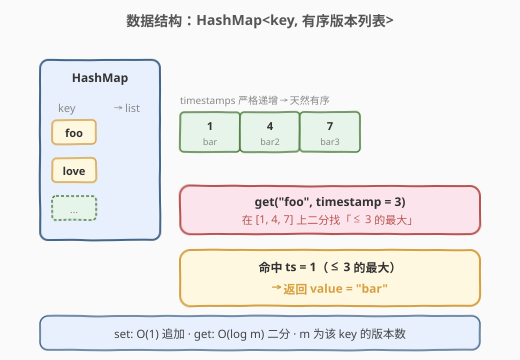
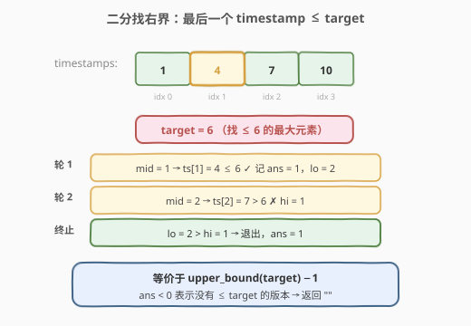
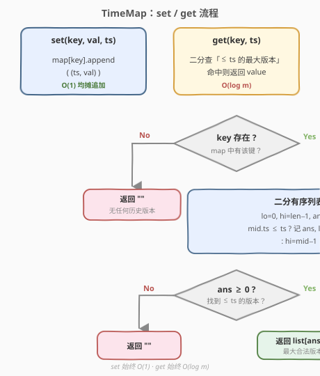
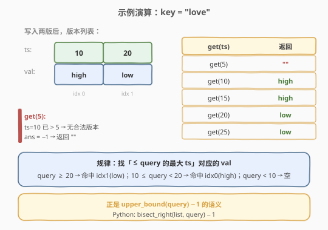

# 基于时间的键值存储

- **题目名称**：基于时间的键值存储
- **链接**：[981. 基于时间的键值存储](https://leetcode.cn/problems/time-based-key-value-store/)
- **难度**：中等
- **标签**：设计、哈希表、二分查找

## 1. 题目概述

设计一个基于时间的键值数据结构 `TimeMap`，对同一个 `key` 可以在不同时间戳存入不同 `value`，并能在指定时间戳查询「当时有效」的值。

- `TimeMap()`：初始化。
- `void set(String key, String value, int timestamp)`：把 `key` 与 `value` 在时间戳 `timestamp` 处关联存储。对**同一个 `key`** 的所有 `set` 调用，`timestamp` **严格递增**。
- `String get(String key, int timestamp)`：返回一个值，满足此前调用过 `set` 且其 `timestamp_prev <= timestamp`；若有多个，返回其中 `timestamp_prev` **最大**的那个 `value`；若没有，返回 `""`。

**示例 1**：

```text
输入：
["TimeMap", "set", "get", "get", "set", "get", "get"]
[[], ["foo", "bar", 1], ["foo", 1], ["foo", 3], ["foo", "bar2", 4], ["foo", 4], ["foo", 5]]
输出：[null, null, "bar", "bar", null, "bar2", "bar2"]

解释：
set("foo","bar",1)   → foo 版本表 = [(1, "bar")]
get("foo",1)         → 1 ≤ 1，命中 (1,"bar")，返回 "bar"
get("foo",3)         → 1 ≤ 3（最大合法），返回 "bar"
set("foo","bar2",4)  → foo 版本表 = [(1,"bar"), (4,"bar2")]
get("foo",4)         → 4 ≤ 4，命中 (4,"bar2")，返回 "bar2"
get("foo",5)         → 4 ≤ 5（最大合法），返回 "bar2"
```

**示例 2**：

```text
输入：
["TimeMap","set","set","get","get","get","get","get"]
[[],["love","high",10],["love","low",20],["love",5],["love",10],["love",15],["love",20],["love",25]]
输出：[null,null,null,"","high","high","low","low"]
```

**约束条件**：

- `1 <= key.length, value.length <= 100`
- `key` 和 `value` 只含小写英文字母和数字。
- `1 <= timestamp <= 10^7`
- `set` 和 `get` 的总调用次数最多 `2 * 10^5`。
- 同一 `key` 的所有 `set` 的 `timestamp` **严格递增**。

> 💡 **关键前提**：`set` 的时间戳严格递增，意味着每个 `key` 的版本列表**天然有序**，无需额外排序。这正是本题能用二分的前提。

---

## 2. 解题思路

### 2.1 暴力思路

用哈希表存 `key -> List<(timestamp, value)>`。`set` 直接追加 `O(1)`；`get` 时线性扫描列表，找 `timestamp_prev <= timestamp` 中最大的那个，`O(m)`（`m` 为该 `key` 的版本数）。

当大量 `get` 调用且单 `key` 版本数较多时，`O(m)` 最坏累计可达 `O(n^2)` 量级（`n = 2*10^5`），会超时。需要把 `get` 的查询降到 `O(log m)`。

### 2.2 核心观察：HashMap + 有序数组二分



把每个 `key` 的所有 `(timestamp, value)` 存进一个**列表**。由于 `set` 时间戳严格递增，列表按 `timestamp` 升序——这就具备了二分所需的**有序性**。

于是：

- **`set`**：`map[key].append((timestamp, value))`，`O(1)` 均摊。
- **`get`**：在 `map[key]` 的有序时间戳上**二分查找**，定位「最后一个 `timestamp_prev <= timestamp`」的位置，取出对应 `value`。

> 💡 **为什么用 `vector` / `list` 而不是 `map<timestamp, value>`？** 连续内存 + 随机访问让二分 `O(log m)` 且常数极小；`map`（红黑树）虽然也能 `upper_bound`，但常数大、缓存不友好。时间戳稀疏（最大 `10^7`），更不能用数组下标直接索引，否则空间爆炸。

### 2.3 二分细节：找右边界



`get` 要的不是「是否存在某个时间戳等于 `timestamp`」，而是「`<= timestamp` 的最大时间戳」——这是经典的**找右边界**，等价于 `upper_bound(timestamp) - 1`：

设 `lo = 0, hi = m - 1, ans = -1`：

- `mid = (lo + hi) / 2`
- 若 `list[mid].ts <= timestamp`：记录 `ans = mid`，继续向右找更大的 → `lo = mid + 1`
- 否则：`list[mid].ts > timestamp`，向左收缩 → `hi = mid - 1`
- 循环结束 `ans` 即为最大合法下标；`ans = -1` 表示没有任何版本 `<= timestamp`，返回 `""`。

> ⚠️ **不是普通二分**：普通二分找「等于 target」，本题找「`<= target` 的最右」。即使 `target` 不在列表里也能给出正确答案（如 `get("foo", 3)` 时列表是 `[1, 4, 7]`，`3` 不在表中，但仍应返回 `ts=1` 的值）。

### 2.4 算法流程图



### 2.5 示例演算

以示例 2 的 `key = "love"` 为例，两次 `set` 后版本列表为 `[(10,"high"), (20,"low")]`：



| 查询 | 二分结果 | 返回 |
|------|----------|------|
| `get(5)` | `5 < 10`，`ans = -1` | `""` |
| `get(10)` | `10 <= 10`，命中 idx0 | `"high"` |
| `get(15)` | `10 <= 15, 20 > 15`，命中 idx0 | `"high"` |
| `get(20)` | `20 <= 20`，命中 idx1 | `"low"` |
| `get(25)` | `20 <= 25`，命中 idx1 | `"low"` |

---

## 3. 参考代码

### C++

```cpp
class TimeMap {
    unordered_map<string, vector<pair<int, string>>> mp;

  public:
    TimeMap() {}

    void set(string key, string value, int timestamp) {
        mp[key].emplace_back(timestamp, value);
    }

    string get(string key, int timestamp) {
        auto it = mp.find(key);
        if (it == mp.end()) return "";
        const auto& v = it->second;
        int lo = 0, hi = (int)v.size() - 1, ans = -1;
        while (lo <= hi) {
            int mid = lo + (hi - lo) / 2;
            if (v[mid].first <= timestamp) {
                ans = mid;
                lo = mid + 1;
            } else {
                hi = mid - 1;
            }
        }
        return ans < 0 ? "" : v[ans].second;
    }
};
```

### Python

```python
from bisect import bisect_right
from collections import defaultdict


class TimeMap:
    def __init__(self):
        # key -> 两个平行列表：timestamps 升序、对应 values
        self.ts = defaultdict(list)
        self.val = defaultdict(list)

    def set(self, key: str, value: str, timestamp: int) -> None:
        self.ts[key].append(timestamp)
        self.val[key].append(value)

    def get(self, key: str, timestamp: int) -> str:
        if key not in self.ts:
            return ""
        # bisect_right 返回「> timestamp 的第一个下标」，减 1 即 <= timestamp 的最大下标
        i = bisect_right(self.ts[key], timestamp) - 1
        return "" if i < 0 else self.val[key][i]
```

> 💡 Python 用标准库 `bisect.bisect_right` 一行搞定找右界；C++ 也可用 `std::upper_bound` 配 `pair` 比较，或直接手写二分（如上），更直观可控。

---

## 4. 复杂度分析

| 维度 | 复杂度 | 说明 |
|------|--------|------|
| `set` 时间 | $O(1)$ 均摊 | 列表尾部追加，均摊常数时间 |
| `get` 时间 | $O(\log m)$ | `m` 为该 `key` 的版本数；二分每次折半 |
| 总时间 | $O(1 \cdot S + \log m \cdot G)$ | `S` 次 `set` + `G` 次 `get`；最坏 $m = S$ |
| 空间 | $O(S)$ | 存下所有 `set` 写入的 `(timestamp, value)` |

其中 $S + G \le 2 \times 10^5$，单次 `get` 最多约 $\log_2(2\times10^5) \approx 18$ 次比较，完全在时限内。

---

## 5. 扩展：时间戳不保证递增怎么办

题目保证了 `set` 的 `timestamp` 严格递增，所以 `append` 即可保持有序。若去掉该保证，`get` 仍要返回「`<= timestamp` 的最大版本」，则需要：

- **方案 A（离线 / 批量）**：所有 `set` 完成后对每个 `key` 排序，再二分查询；适合写多读少或可缓冲的场景。
- **方案 B（在线）**：改用平衡树（C++ `map<int,string>`、Java `TreeMap`、Python 无内置可用 `sortedcontainers`），`set` 时 `O(log m)` 插入，`get` 时 `upper_bound - 1` 仍 `O(log m)`。代价是常数更大、实现更重。
- **方案 C（时间戳值域小）**：若 `timestamp` 范围有限，可用线段树 / 树状数组按时间戳维护「最新值」，但本题 `timestamp` 高达 `10^7` 且稀疏，不划算。

> 💡 这正体现了题目「严格递增」这一约束的**善意**：它让最简单的 `vector + append + 二分` 成为最优解，免去了排序与平衡树的开销。面试时若遇到变体，先确认是否仍有该保证。

---

## 6. 面试要点

1. **为什么能在列表上二分？**
   - 题目保证同一 `key` 的 `set` 时间戳严格递增，因此 `append` 后列表天然升序，满足二分的有序性前提。

2. **`get` 找的是哪种边界？与普通二分有何不同？**
   - 找「`<= timestamp` 的最大下标」，即右边界，等价于 `upper_bound(timestamp) - 1`。普通二分找「等于 target」，本题即使 `target` 不在表中也须给出最近的历史版本，故必须用边界二分而非存在性二分。

3. **`ans = -1` 代表什么？**
   - 表示没有任何版本的 `timestamp_prev <= timestamp`（即查询时间早于该 `key` 的最早版本），应返回 `""`。这是右边界二分的天然哨兵值。

4. **为什么不用 `map<timestamp, value>`（红黑树）？**
   - `vector` 连续存储、随机访问，二分常数小、缓存友好；`set` 是 `O(1)` 追加。红黑树 `set` 要 `O(log m)` 插入且结点分散，常数更大。仅当时间戳不再保证递增时，红黑树才显出「插入即有序」的优势。

5. **`timestamp` 高达 `10^7`，能直接用数组下标存吗？**
   - 不能。版本稀疏，用时间戳做下标会浪费巨量空间（最坏 `10^7` 长度却只存少量版本）。哈希表 + 动态列表才是正确的稀疏存储。

---

## 7. 同类练习题

- [704. 二分查找](https://leetcode.cn/problems/binary-search/)（[题解](../0701-0800/704_二分查找.md)）：二分母题，先吃透闭区间模板再迁移到边界二分
- [34. 在排序数组中查找元素的第一个和最后一个位置](https://leetcode.cn/problems/find-first-and-last-position-of-element-in-sorted-array/)：左 / 右边界二分的标准练习，与本题找右界同构
- [35. 搜索插入位置](https://leetcode.cn/problems/search-insert-position/)：`lower_bound` 语义，对比本题的 `upper_bound - 1`
- [1146. 快照数组](https://leetcode.cn/problems/snapshot-array/)：设计与二分的姊妹题，按 `snap_id` 二分取版本，套路几乎一致
- [378. 有序矩阵中第 K 小的元素](https://leetcode.cn/problems/kth-smallest-element-in-a-sorted-matrix/)（[题解](../0301-0400/378_有序矩阵中第K小的元素.md)）：二分值域 + 计数的另一种二分应用，拓展二分思维
