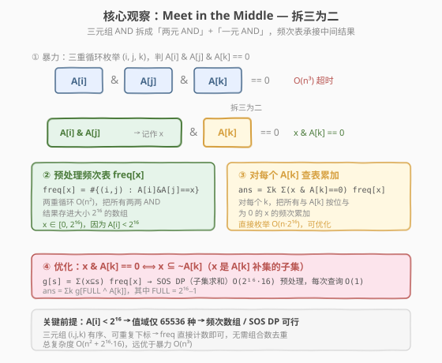
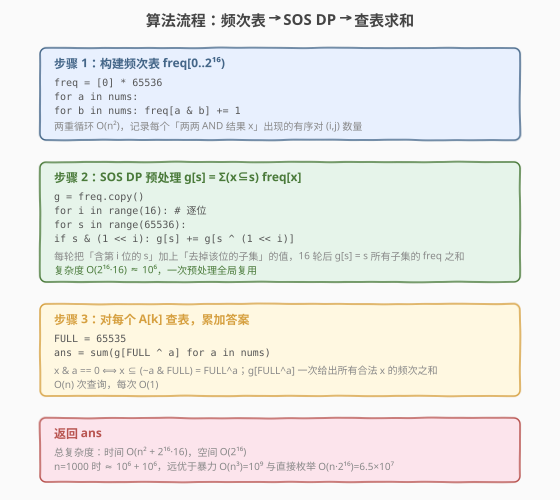

# 按位与为零的三元组

- **题目名称**：按位与为零的三元组
- **链接**：[982. 按位与为零的三元组](https://leetcode.cn/problems/triples-with-bitwise-and-equal-to-zero/)
- **难度**：中等
- **标签**：位运算、数组、Meet in the Middle、动态规划

## 1. 题目概述

给定一个整数数组 `nums`，返回满足 `nums[i] & nums[j] & nums[k] == 0` 的**三元组** `(i, j, k)` 的个数，其中 `0 <= i, j, k < nums.length`，`&` 表示按位与运算符。三元组的三个下标**有序且可重复**（`i`、`j`、`k` 互不影响，可取相同下标）。

**示例 1**：

```text
输入：nums = [2,1,3]
输出：12
解释：12 个三元组分别为
(0,0,1)、(0,1,0)、(0,1,1)、(0,1,2)、(0,2,1)、
(1,0,0)、(1,0,1)、(1,0,2)、(1,1,0)、(1,2,0)、
(2,0,1)、(2,1,0)。
```

**示例 2**：

```text
输入：nums = [0,0,0]
输出：27
解释：所有 3³ = 27 个三元组都满足 0 & 0 & 0 == 0。
```

**约束条件**：

- `1 <= nums.length <= 1000`
- `0 <= nums[i] < 2^16`

> 💡 两个关键提示藏在不显眼处：一是三元组下标**有序可重复**（不是 `i < j < k`），因此直接用频次累乘即可，无需组合数去重——这与 [923. 三数之和的多种可能](../0901-1000/923_三数之和的多种可能.md) 的 `i < j < k` 恰好相反；二是 `nums[i] < 2^16`，值域只有 65536 种，使得「按值建频次数组」与「子集求和 DP」都可行。

---

## 2. 解题思路

### 2.1 暴力思路

三重循环枚举所有 `(i, j, k)`，逐个判断 `nums[i] & nums[j] & nums[k] == 0`：

```text
for i in 0..n:
    for j in 0..n:
        for k in 0..n:
            if nums[i] & nums[j] & nums[k] == 0: ans++
```

时间复杂度 $O(n^3)$，`n = 1000` 时约 $10^9$ 次运算，**严重超时**。

### 2.2 核心观察：Meet in the Middle — 拆三为二



关键转化：三元组的按位与可以**拆成两步**——

$$
\text{nums}[i]\ \&\ \text{nums}[j]\ \&\ \text{nums}[k] == 0 \iff (\text{nums}[i]\ \&\ \text{nums}[j])\ \&\ \text{nums}[k] == 0
$$

令 $x = \text{nums}[i]\ \&\ \text{nums}[j]$，问题变为：对每个 $k$，有多少个有序对 $(i, j)$ 满足 $x\ \&\ \text{nums}[k] == 0$。

**两步分解**：

1. **预处理频次表** `freq[x]`：两重循环 $O(n^2)$ 统计所有有序对 `(i, j)` 的按位与结果 $x$ 的出现次数。由于 `nums[i] < 2^16`，$x \in [0, 2^{16})$，用大小 $2^{16}$ 的数组即可。

2. **查询累加**：对每个 `nums[k]`，把所有满足 $x\ \&\ \text{nums}[k] == 0$ 的 `freq[x]` 累加：

$$
\text{ans} = \sum_{k} \sum_{\substack{x:\ x\ \&\ \text{nums}[k] == 0}} \text{freq}[x]
$$

> 💡 **为什么下标可重复时不需要组合数？** 题目要求的是有序三元组 $(i, j, k)$，三个下标独立取值。`freq[x]` 统计的就是有序对 $(i, j)$ 的个数（包括 $i = j$），与 $k$ 独立相乘即得有序三元组数。无需像 923 题那样按 $i < j < k$ 去重并套 $C(n, 2)$。

直接实现第 2 步：对每个 `nums[k]` 遍历 $[0, 2^{16})$ 所有 $x$，复杂度 $O(n \cdot 2^{16}) \approx 6.5 \times 10^7$。C++ 可过，但 Python 纯解释执行会超时。下面用 **SOS DP** 把这一步压到 $O(2^{16} \cdot 16)$。

### 2.3 优化：子集求和（SOS DP）

第 2 步的核心查询是「对所有与 $a$ 按位与为 0 的 $x$，求 `freq[x]` 之和」。观察：

$$
x\ \&\ a == 0 \iff x \subseteq (\sim a\ \&\ \text{FULL})
$$

其中 $\text{FULL} = 2^{16} - 1$（全 1 掩码）。即 $x$ 的每一位都只能取在 $a$ 为 0 的位上——$x$ 是 $a$ 的**补集的子集**。

令 $\text{mask} = \text{FULL} \oplus a$（$a$ 的补集），则所求为：

$$
g[\text{mask}] = \sum_{x \subseteq \text{mask}} \text{freq}[x]
$$

这是经典的**子集求和**（Sum Over Subsets），可用 **SOS DP**（快速 Zeta 变换）一次性预处理所有 $g[s]$：

```text
g = freq 的副本
for i in 0..15:              # 逐位
    for s in 0..2^16-1:
        if s 的第 i 位为 1:
            g[s] += g[s ^ (1 << i)]    # 加上去掉该位的子集
```

每轮把「含第 $i$ 位的 $s$」累加上「去掉该位的子集 $s \oplus (1 \ll i)$」的值。16 轮后，$g[s]$ 恰好等于 $s$ 所有子集的 `freq` 之和。预处理 $O(2^{16} \cdot 16) \approx 10^6$，之后每次查询 $O(1)$。

> 💡 **SOS DP 的正确性直觉**：处理第 $i$ 位时，$s \oplus (1 \ll i)$ 的第 $i$ 位为 0，本轮不会再次更新它，因此读取的是「已包含前 $i-1$ 位全部子集」的中间值。16 轮处理完 16 个位后，每个 $g[s]$ 就累计了所有位组合下的子集贡献。

### 2.4 算法流程图



### 2.5 示例演算

以 `nums = [2, 1, 3]` 为例（值只用 3 位，此处 `FULL = 7` 便于展示，实际解 `FULL = 2^16 - 1`）：

![示例演算：nums = [2, 1, 3]](../images/triplets_zero_and_walkthrough.svg)

**① 两两 AND 矩阵**（行 $i$，列 $j$，`nums = [2, 1, 3]`）：

| | j=0 (2) | j=1 (1) | j=2 (3) |
|------|---------|---------|---------|
| **i=0 (2)** | 2 | 0 | 2 |
| **i=1 (1)** | 0 | 1 | 1 |
| **i=2 (3)** | 2 | 1 | 3 |

**② 频次表**：`freq[0] = 2`，`freq[1] = 3`，`freq[2] = 3`，`freq[3] = 1`（共 9 个有序对）。

**③ SOS DP 后** $g[s] = \sum_{x \subseteq s} \text{freq}[x]$：

| s | 0 | 1 | 2 | 3 | 4 | 5 | 6 | 7 |
|---|---|---|---|---|---|---|---|---|
| g[s] | 2 | 5 | 5 | 9 | 2 | 5 | 5 | 9 |

例如 $g[5] = g[101_2] = \text{freq}[0] + \text{freq}[1] + \text{freq}[4] + \text{freq}[5] = 2 + 3 + 0 + 0 = 5$。

**④ 对每个 $k$ 查表累加**：

| k | nums[k] | FULL ^ nums[k] | g[...] | 贡献 |
|---|---------|-----------------|--------|------|
| 0 | 2 (010) | 7 ^ 2 = 5 (101) | g[5] = 5 | 5 |
| 1 | 1 (001) | 7 ^ 1 = 6 (110) | g[6] = 5 | 5 |
| 2 | 3 (011) | 7 ^ 3 = 4 (100) | g[4] = 2 | 2 |

合计 $\text{ans} = 5 + 5 + 2 = 12$，与示例一致。

> 💡 验证 $k = 0$（$a = 2$）：$x\ \&\ 2 == 0$ 的 $x \in \{0, 1\}$，$\text{freq}[0] + \text{freq}[1] = 2 + 3 = 5$。SOS DP 把这个求和压缩成 $g[5]$ 一次查得——这正是优化的收益。

---

## 3. 参考代码

### C++

```cpp
class Solution {
  public:
    int countTriplets(vector<int>& nums) {
        const int M = 1 << 16;
        vector<int> freq(M, 0);
        for (int a : nums)                          // ① 频次表
            for (int b : nums)
                freq[a & b]++;
        vector<int> g = freq;                       // ② SOS DP
        for (int i = 0; i < 16; ++i)
            for (int s = 0; s < M; ++s)
                if (s & (1 << i))
                    g[s] += g[s ^ (1 << i)];
        int full = M - 1, ans = 0;                  // ③ 查表累加
        for (int a : nums)
            ans += g[full ^ a];
        return ans;
    }
};
```

### Python

```python
class Solution:
    def countTriplets(self, nums: List[int]) -> int:
        M = 1 << 16
        freq = [0] * M
        for a in nums:                              # ① 频次表
            for b in nums:
                freq[a & b] += 1
        g = freq[:]                                 # ② SOS DP
        for i in range(16):
            bit = 1 << i
            for s in range(M):
                if s & bit:
                    g[s] += g[s ^ bit]
        full = M - 1                                # ③ 查表累加
        return sum(g[full ^ a] for a in nums)
```

> ⚠️ **Python 不宜用直接枚举法**：$O(n \cdot 2^{16}) \approx 6.5 \times 10^7$ 次纯 Python 迭代会超时。SOS DP 把查询阶段从 $n \cdot 2^{16}$ 降到 $2^{16} \cdot 16 \approx 10^6$，两阶段合计约 $2 \times 10^6$ 次迭代，Python 可在 1–2 秒内通过。C++ 两种写法都能过，SOS DP 版更优。

---

## 4. 复杂度分析

| 维度 | 复杂度 | 说明 |
|------|--------|------|
| **时间复杂度** | $O(n^2 + 2^{16} \cdot 16)$ | 频次表两重循环 $O(n^2)$ + SOS DP 预处理 $O(2^{16} \cdot 16)$ + 查表 $O(n)$；$n = 1000$ 时约 $10^6 + 10^6$ |
| **空间复杂度** | $O(2^{16})$ | `freq` 与 `g` 各占 $2^{16}$ 个 `int`，约 256 KB |

> 💡 对比各方案：暴力 $O(n^3) = 10^9$（超时）；直接枚举 $O(n^2 + n \cdot 2^{16}) \approx 6.5 \times 10^7$（C++ 可过，Python 超时）；SOS DP $O(n^2 + 2^{16} \cdot 16) \approx 2 \times 10^6$（最优，双语言通用）。

---

## 5. 扩展：直接枚举法（SOS DP 的退化版）

不引入 SOS DP，第 2 步直接对每个 `nums[k]` 遍历 $[0, 2^{16})$ 所有 $x$，累加满足 $x\ \&\ a == 0$ 的 `freq[x]`：

```cpp
// 直接枚举法 O(n² + n·2¹⁶)，C++ 可过
int countTriplets(vector<int>& nums) {
    const int M = 1 << 16;
    vector<int> freq(M, 0);
    for (int a : nums)
        for (int b : nums)
            freq[a & b]++;
    int ans = 0;
    for (int a : nums)
        for (int x = 0; x < M; ++x)
            if (freq[x] && (x & a) == 0)
                ans += freq[x];
    return ans;
}
```

| 方案 | 查询阶段复杂度 | 总复杂度 | 适用语言 |
|------|----------------|----------|----------|
| 直接枚举 | $O(n \cdot 2^{16})$ | $O(n^2 + n \cdot 2^{16})$ | C++（Python 超时） |
| SOS DP | $O(2^{16} \cdot 16) + O(n)$ | $O(n^2 + 2^{16} \cdot 16)$ | C++ / Python 通用 |

> 💡 **从枚举到 SOS DP 的思维跳跃**：直接枚举是「对每个 $a$，逐个 $x$ 判断 $x\ \&\ a == 0$」；SOS DP 的洞察是把这个判断转化为「$x$ 是 $a$ 补集的子集」，再用子集求和预处理把 $n$ 次遍历压成 1 次全局 DP。这是「逐个判断 → 按结构批量求和」的典型优化范式，与 [149. 直线上最多的点数](../0101-0200/149_直线上最多的点数.md) 中「逐对算斜率 → 按 GCD 化简后分组计数」异曲同工。

---

## 6. 面试要点

1. **为什么三元组下标可重复时不需要组合数？**

   - 题目统计的是有序三元组 $(i, j, k)$，三个下标独立取值、可相等。`freq[x]` 统计有序对 $(i, j)$（含 $i = j$），与 $k$ 独立相乘即得有序三元组数。这与 [923](../0901-1000/923_三数之和的多种可能.md) 的 `i < j < k`（须去重并套 $C(n,2)$、$C(n,3)$）是两类不同的计数模型，需先看清下标约束。

2. **Meet in the Middle 在这里如何起作用？**

   - 三元按位与 $A[i]\ \&\ A[j]\ \&\ A[k]$ 拆成 $(A[i]\ \&\ A[j])\ \&\ A[k]$，前半预处理成频次表，后半查表。$O(n^3)$ 降为 $O(n^2 + \text{查询})$。这与 [454. 四数相加 II](https://leetcode.cn/problems/4sum-ii/) 的「四数拆两组、哈希承接」是同一范式，只是本题的「承接结构」是值域数组而非哈希表。

3. **SOS DP 的「子集求和」如何把查询从 $O(n \cdot 2^{16})$ 降到 $O(2^{16} \cdot 16)$？**

   - 关键观察：$x\ \&\ a == 0 \iff x \subseteq \text{FULL} \oplus a$。于是「对所有与 $a$ 按位与为 0 的 $x$ 求和」等价于「对 $a$ 补集的所有子集求和」。SOS DP 一次性预处理所有掩码的子集和 $g[s]$，之后每个 $a$ 只需 $O(1)$ 查 $g[\text{FULL} \oplus a]$。把 $n$ 次独立遍历合并为 1 次结构化 DP。

4. **SOS DP 内层循环的顺序为什么不影响正确性？**

   - 处理第 $i$ 位时，$s \oplus (1 \ll i)$ 的第 $i$ 位为 0，本轮不会被更新（条件 `s & (1<<i)` 只更新第 $i$ 位为 1 的 $s$）。因此读取的 $g[s \oplus (1 \ll i)]$ 是上一轮（前 $i-1$ 位已处理完毕）的值，与 $s$ 的遍历顺序无关。

5. **值域约束 `nums[i] < 2^16` 为什么是本题的解题钥匙？**

   - 它保证两两 AND 结果 $x \in [0, 2^{16})$，频次数组大小仅 65536，SOS DP 的 $2^{16} \cdot 16 \approx 10^6$ 也可接受。若值域与 $n$ 同阶（如 $10^9$），频次数组与 SOS DP 均不可行，需另寻他法。识别「值域是否小」是位运算计数题的选型关键。

> 💡 **一句话总结**：982 是「位运算 + Meet in the Middle + SOS DP」的招牌题——拆三元 AND 为「两元 AND 频次表 + 一元查表」，再用子集求和把逐个判断压缩为结构化 DP。值域 $2^{16}$ 是频次数组与 SOS DP 的共同前提，是整道题的解题钥匙。

---

## 7. 同类练习题

- [923. 三数之和的多种可能](https://leetcode.cn/problems/3sum-with-multiplicity/)（[题解](../0901-1000/923_三数之和的多种可能.md)）：同为三元组计数，对比「下标有序可重复（直接乘频次）」与「`i < j < k`（套组合数去重）」两种计数模型
- [454. 四数相加 II](https://leetcode.cn/problems/4sum-ii/)（[题解](../0401-0500/454_四数相加%20II.md)）：Meet in the Middle 的计数版鼻祖——四数拆两组、哈希承接，与本题「拆三为二」同范式
- [1835. 所有数对按位与结果的异或和](https://leetcode.cn/problems/find-xor-sum-of-all-pair-bitwise-and/)：按位 AND 配对 + Meet in the Middle，本题的「异或变体」
- [1994. 好子集的数目](https://leetcode.cn/problems/the-number-of-good-subsets/)：SOS DP 经典应用——子集求和预处理 + 背包计数，深化对 SOS DP 的理解
- [898. 子数组按位或操作](https://leetcode.cn/problems/bitwise-or-of-all-subsequences/)：位运算值域计数，对比 AND（越与越小）与 OR（越或越大）的不同处理策略
