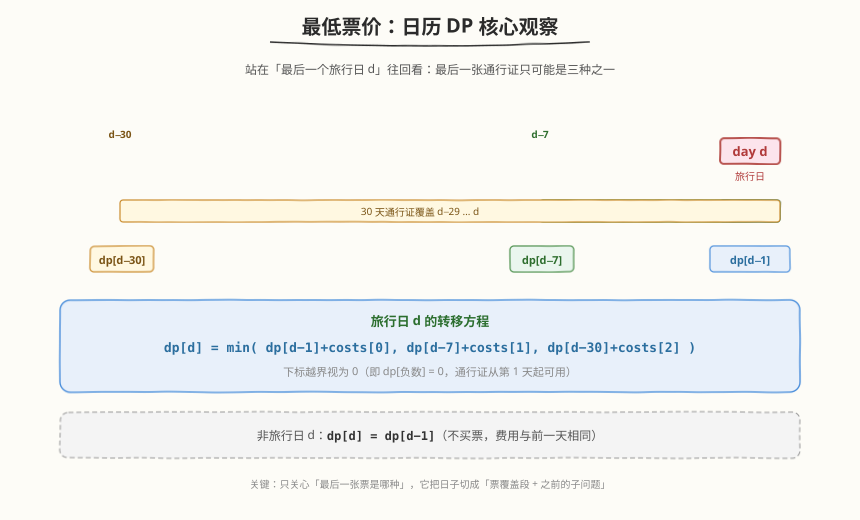
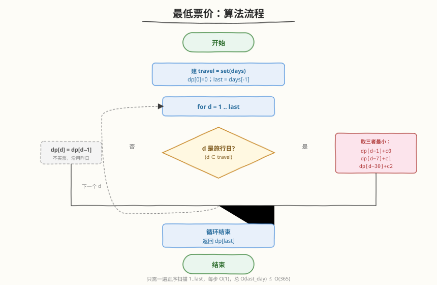
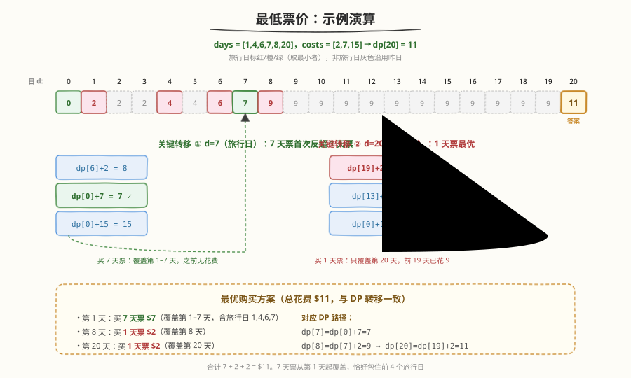

# LeetCode 最低票价 题解

## 1. 题目概述

- **标题 / 题号**：最低票价（#983，medium）
- **链接**：https://leetcode.cn/problems/minimum-cost-for-tickets/
- **难度**：中等
- **标签**：动态规划

**题意**：在一个火车旅行很受欢迎的国度，你提前一年计划了一些火车旅行。接下来一年里你要旅行的日子以数组 `days` 给出（每个元素是 1 到 365 的整数，**严格递增**）。火车票有三种销售方式：

- 一张 **为期 1 天** 的通行证售价 `costs[0]` 美元；
- 一张 **为期 7 天** 的通行证售价 `costs[1]` 美元；
- 一张 **为期 30 天** 的通行证售价 `costs[2]` 美元。

通行证允许在有效期内无限制旅行。例如第 2 天拿到 7 天通行证，可旅行第 2~8 天（共 7 天）。

返回完成 `days` 中**每一个**旅行日所需的**最低消费**。

**示例 1**：

```text
输入：days = [1,4,6,7,8,20], costs = [2,7,15]
输出：11
解释：
- 第 1 天，买 1 天通行证 $2，覆盖第 1 天。
- 第 3 天，买 7 天通行证 $7，覆盖第 3~9 天（含旅行日 4,6,7,8）。
- 第 20 天，买 1 天通行证 $2，覆盖第 20 天。
合计 $11。
```

**示例 2**：

```text
输入：days = [1,2,3,4,5,6,7,8,9,10,30,31], costs = [2,7,15]
输出：17
解释：
- 第 1 天，买 30 天通行证 $15，覆盖第 1~30 天（含旅行日 1~10 与 30）。
- 第 31 天，买 1 天通行证 $2，覆盖第 31 天。
合计 $17。
```

**约束**：

- `1 <= days.length <= 365`
- `1 <= days[i] <= 365`
- `days` 按顺序**严格递增**
- `costs.length == 3`
- `1 <= costs[i] <= 1000`

> 💡 **关键前提**：`days` 严格递增且天数上限 365——这意味着可以按「日历天」从 1 扫到 `days[-1]`，开销最多 365 步，常数极小。

## 2. 解题思路

### 2.1 暴力思路（回溯）

对每个旅行日，枚举买 1/7/30 天票三种选择，递归搜索所有组合取最小花费。最坏 `O(3^n)`（`n = days.length`），`n` 可达 365，严重超时。问题存在大量重叠子问题（同一个「从第 i 个旅行日起」的最优花费被反复计算），天然适合 DP。

### 2.2 核心观察：日历 DP（按天递推）



定义 $dp[d]$ = **完成第 $d$ 天及之前所有旅行日**所需的最低消费。按日历天 $d$ 从 1 正序递推到 `days[-1]`（最后一个旅行日）。

关键洞察：站在旅行日 $d$ 往回看，**最后一张覆盖 $d$ 的通行证只可能是三种之一**，且为了让通行证尽量多覆盖之前的旅行日，应让它恰好「截止于 $d$」：

| 最后一张票 | 覆盖区间 | 之前需覆盖到 | 转移 |
|------------|----------|--------------|------|
| 1 天票 | $[d, d]$ | $d-1$ | $dp[d-1] + costs[0]$ |
| 7 天票 | $[d-6, d]$ | $d-7$ | $dp[d-7] + costs[1]$ |
| 30 天票 | $[d-29, d]$ | $d-30$ | $dp[d-30] + costs[2]$ |

于是旅行日 $d$ 的转移方程：

$$dp[d] = \min\big(dp[d-1]+costs[0],\ dp[d-7]+costs[1],\ dp[d-30]+costs[2]\big)$$

非旅行日 $d$ 不买票，费用与前一天相同：$dp[d] = dp[d-1]$。下标为负时视为 0（即通行证从第 1 天起可用，之前无花费）。

> 💡 **为什么通行证「截止于 $d$」最优？** 通行证覆盖 $d$ 是必须的（$d$ 是旅行日）。让它截止于 $d$ 能把覆盖窗口尽可能往前推（7 天票覆盖 $[d-6,d]$，30 天票覆盖 $[d-29,d]$），从而包住更多前置旅行日，把剩余子问题留给 $dp[d-7]$ / $dp[d-30]$。即便 $d-6$ 不是旅行日，也可以在非旅行日买票——题目并不要求只在旅行日买。

### 2.3 算法流程图



1. 用哈希集合 `travel = set(days)`，`O(1)` 判断某天是否旅行日。
2. `dp[0] = 0`，`last = days[-1]`。
3. 对 $d$ 从 1 到 `last`：
   - 若 $d \notin travel$：$dp[d] = dp[d-1]$。
   - 否则：$dp[d] = \min(dp[d-1]+costs[0],\ dp[\max(0,d-7)]+costs[1],\ dp[\max(0,d-30)]+costs[2])$。
4. 返回 $dp[last]$。

### 2.4 示例演算



以示例 1 `days = [1,4,6,7,8,20], costs = [2,7,15]` 为例，递推 $d=0\dots20$：

| $d$ | 旅行日? | $dp[d-1]+2$ | $dp[d-7]+7$ | $dp[d-30]+15$ | $dp[d]$ | 说明 |
|-----|---------|-------------|-------------|---------------|---------|------|
| 0 | — | — | — | — | 0 | 哨兵 |
| 1 | ✓ | 0+2=**2** | 0+7=7 | 0+15=15 | 2 | 1 天票 |
| 2,3 | ✗ | — | — | — | 2 | 沿用 |
| 4 | ✓ | 2+2=**4** | 0+7=7 | 0+15=15 | 4 | 1 天票 |
| 5 | ✗ | — | — | — | 4 | 沿用 |
| 6 | ✓ | 4+2=**6** | 0+7=7 | 0+15=15 | 6 | 1 天票 |
| 7 | ✓ | 6+2=8 | 0+7=**7** | 0+15=15 | 7 | **7 天票反超** |
| 8 | ✓ | 7+2=**9** | 2+7=9 | 0+15=15 | 9 | 1 天/7 天并列 |
| 9~19 | ✗ | — | — | — | 9 | 沿用 |
| 20 | ✓ | 9+2=**11** | 9+7=16 | 0+15=15 | 11 | 1 天票 |

> ⚠️ **注意 $d=7$ 的转折**：单看第 7 天，1 天票需 $dp[6]+2=8$；但买 7 天票覆盖 $[1,7]$，之前 $dp[0]=0$，只需 $7$。这是 7 天票首次反超——它一次性包住了旅行日 1,4,6,7。最终 $dp[20]=11$。

最优方案：第 1 天买 7 天票（$7，覆盖 1~7）+ 第 8 天买 1 天票（$2）+ 第 20 天买 1 天票（$2）= $11。

## 3. 参考代码

### C++

```cpp
class Solution {
  public:
    int mincostTickets(vector<int>& days, vector<int>& costs) {
        unordered_set<int> travel(days.begin(), days.end());
        int last = days.back();
        vector<int> dp(last + 1, 0);
        for (int d = 1; d <= last; d++) {
            if (!travel.count(d)) {
                dp[d] = dp[d - 1];
            } else {
                int c1 = dp[d - 1] + costs[0];
                int c7 = dp[max(0, d - 7)] + costs[1];
                int c30 = dp[max(0, d - 30)] + costs[2];
                dp[d] = min({c1, c7, c30});
            }
        }
        return dp[last];
    }
};
```

### Python

```python
class Solution:
    def mincostTickets(self, days: List[int], costs: List[int]) -> int:
        travel = set(days)
        last = days[-1]
        dp = [0] * (last + 1)
        for d in range(1, last + 1):
            if d not in travel:
                dp[d] = dp[d - 1]
            else:
                dp[d] = min(
                    dp[d - 1] + costs[0],
                    dp[max(0, d - 7)] + costs[1],
                    dp[max(0, d - 30)] + costs[2],
                )
        return dp[last]
```

> 💡 `dp` 数组长度取 `last+1`（最多 366），空间可忽略。若想进一步省空间，可用滚动数组只保留最近 30 天，但 365 维下没有实际意义。

## 4. 复杂度分析

| 维度 | 复杂度 | 说明 |
|------|--------|------|
| 时间复杂度 | $O(L)$ | $L = days[-1] \le 365$，单趟扫描，每步 $O(1)$ |
| 空间复杂度 | $O(L)$ | `dp` 数组长度 $L+1$；`travel` 集合 $O(n)$，$n \le 365$ |

由于 $L \le 365$，时间和空间都是常数级，远低于题目规模上限。

## 5. 扩展：按旅行日索引的 DP（$O(n \log n)$ / $O(n)$）

日历 DP 扫描了所有日历天（含非旅行日）。若把状态定义在**旅行日**上，可跳过非旅行日，更适合 $n$ 远小于 $L$ 的场景（本题 $n, L$ 都 ≤ 365，差异不大，但思路值得掌握）。

定义 $dp[i]$ = 覆盖旅行日 $days[i\dots n-1]$ 的最低消费（从右往左递推）：

$$dp[i] = \min\big(costs[0] + dp[i+1],\ costs[1] + dp[j_7],\ costs[2] + dp[j_{30}]\big)$$

其中 $j_7$ = 第一个满足 $days[j] > days[i] + 6$ 的下标（7 天票覆盖 $days[i]\dots days[i]+6$），$j_{30}$ 类似（$> days[i]+29$）。由于 `days` 有序，可用二分（`upper_bound`）或双指针求 $j_7, j_{30}$。

```cpp
class Solution {
  public:
    int mincostTickets(vector<int>& days, vector<int>& costs) {
        int n = days.size();
        vector<int> dp(n + 1, 0); // dp[n] = 0 哨兵
        for (int i = n - 1; i >= 0; i--) {
            int j7 = upper_bound(days.begin(), days.end(), days[i] + 6) - days.begin();
            int j30 = upper_bound(days.begin(), days.end(), days[i] + 29) - days.begin();
            dp[i] = min({costs[0] + dp[i + 1],
                         costs[1] + dp[j7],
                         costs[2] + dp[j30]});
        }
        return dp[0];
    }
};
```

- 时间 $O(n \log n)$（二分）或 $O(n)$（双指针，因 $j_7, j_{30}$ 随 $i$ 递减单调左移）。
- 空间 $O(n)$。

> 💡 **两种 DP 的对应关系**：日历 DP 的 $dp[d-7]$ 等价于旅行日 DP 的 $dp[j_7]$——都是「7 天票覆盖窗口之前的最优解」。日历 DP 直观、好写；旅行日 DP 更省、可推广到天数上界极大的变体。

## 6. 面试要点

1. **为什么通行证要「截止于旅行日 $d$」而非「从 $d$ 开始」？**

   - DP 按天从左到右递推，到旅行日 $d$ 时需要决定「$d$ 由哪张票覆盖」。让这张票截止于 $d$（7 天票覆盖 $[d-6,d]$），能把窗口尽量前推、包住更多前置旅行日，剩余子问题恰好是 $dp[d-7]$。若从 $d$ 开始（覆盖 $[d,d+6]$）则牵涉未来日子，与「左到右已算好的前缀」方向冲突，状态不闭合。

2. **非旅行日为什么 $dp[d] = dp[d-1]$？**

   - 非旅行日无需旅行，不必买票，费用不增；又因 $dp$ 定义为「第 $d$ 天及之前的最低消费」，它必须继承前一天的最优值，保证后续旅行日回看 $dp[d-1]$ 时拿到的是「截至前一天的真实最优」。

3. **下标 $d-7$、$d-30$ 为负时为什么取 0？**

   - 负下标表示通行证覆盖窗口起点早于第 1 天，即「之前没有旅行日需要覆盖」，花费为 0。用 $\max(0, d-k)$ 即可，等价于在 $dp[0]=0$ 处设哨兵。

4. **这题和 [322. 零钱兑换](../0301-0400/322_零钱兑换.md) 有何异同？**

   - 都是「枚举几种选择取最小」的 min-DP。零钱兑换是 $dp[i]=\min(dp[i-coin]+1)$，按金额递推、硬币可无限用（完全背包）；本题是 $dp[d]=\min(dp[d-k]+cost)$，按日历天递推、三种「通行证时长」对应三种回看步长。本质都是「当前状态由若干前驱状态 + 代价取最小」。

5. **能否用贪心（每次买覆盖最多旅行日的票）？**

   - 不能保证最优。贪心可能过早买 30 天票而浪费，或在该用 7 天票时选了 1 天票。例如示例 2 中前 10 天密集旅行，30 天票（$15）反而最优，而贪心按「1 天票逐天」会花 $20。DP 穷举三种选择、取最小，才能保证全局最优。

## 同类练习题

| # | 题目 | 与本题的关联 |
|---|------|-------------|
| 322 | [零钱兑换](https://leetcode.cn/problems/coin-change/)（[题解](../0301-0400/322_零钱兑换.md)） | `dp[i]=min(dp[i-coin]+1)`，按金额递推取最小，与本题「枚举几种通行证取最小」结构同构 |
| 746 | [使用最小花费爬楼梯](https://leetcode.cn/problems/min-cost-climbing-stairs/)（[题解](../0701-0800/746_使用最小花费爬楼梯.md)） | `dp[i]=min(dp[i-1],dp[i-2])+cost[i]`，一维 DP 有限步回看转移，与本题 $dp[d-1/7/30]$ 同为「回看型」 |
| 740 | [删除并获得点数](https://leetcode.cn/problems/delete-and-earn/)（[题解](../0701-0800/740_删除并获得点数.md)） | 值域建桶后打家劫舍式回看 $dp[i]=\max(dp[i-1],dp[i-2]+val_i)$，相邻互斥决策与本题「选哪种票」类比 |
| 91 | [解码方法](https://leetcode.cn/problems/decode-ways/)（[题解](../0001-0100/91_解码方法.md)） | 按 $d-1/d-2$ 回看转移的一维 DP，训练「按位置递推 + 有限步前驱」的建模直觉 |
