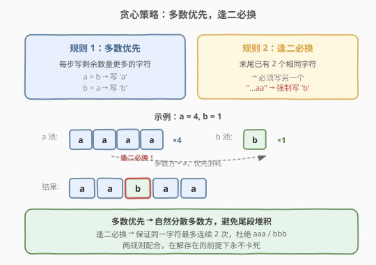
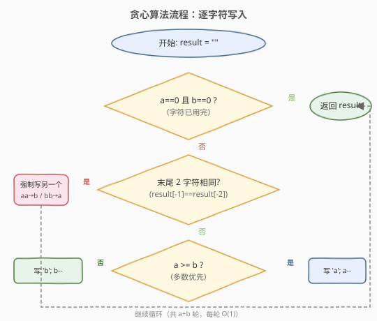

# 不含 AAA 或 BBB 的字符串

- **题目名称**：不含 AAA 或 BBB 的字符串
- **链接**：[984. 不含 AAA 或 BBB 的字符串](https://leetcode.cn/problems/string-without-aaa-or-bbb/)
- **难度**：中等
- **标签**：贪心、字符串

## 1. 题目概述

给定两个整数 `a` 和 `b`，返回**任意**字符串 `s`，要求满足：

- `s` 的长度为 `a + b`，且正好包含 `a` 个 `'a'` 字母与 `b` 个 `'b'` 字母；
- 子串 `'aaa'` 没有出现在 `s` 中；
- 子串 `'bbb'` 没有出现在 `s` 中。

**示例 1**：

```text
输入：a = 1, b = 2
输出："abb"
解释："abb", "bab" 和 "bba" 都是正确答案。
```

**示例 2**：

```text
输入：a = 4, b = 1
输出："aabaa"
```

**约束条件**：

- $0 \le a, b \le 100$
- 对于给定的 $a$ 和 $b$，保证存在满足要求的 $s$

> 💡 **关键信息**：题目保证解存在，且只需返回**任意一个**合法解——这是构造题的典型信号，暗示存在贪心策略。

---

## 2. 解题思路

### 2.1 暴力思路

枚举所有长度为 $a+b$、含 $a$ 个 `'a'` 和 $b$ 个 `'b'` 的字符串（共 $\binom{a+b}{a}$ 个），逐个检查是否包含 `'aaa'` 或 `'bbb'`。当 $a = b = 50$ 时，组合数约为 $\binom{100}{50} \approx 10^{29}$，完全不可行。

> ⚠️ 这类「只需任意一个解」的构造题，关键是找到**确定性的贪心策略**——每一步都做「不会犯错」的选择。

### 2.2 核心观察：多数优先，逢二必换



约束「不含 `aaa` 和 `bbb`」等价于：**同一字符最多连续出现 2 次**。基于此，贪心策略只有两条规则：

1. **多数优先**：每一步优先写**剩余数量更多**的字符。这样做能尽快消耗多数方，避免最后剩余大量同一种字符无法安插。
2. **逢二必换**：如果末尾已经连续写了 **2 个相同**字符，下一步**必须写另一个**字符——否则就会出现 `aaa` 或 `bbb`。

> 💡 **为什么这样一定合法？** 题目保证解存在，意味着多数方的数量不超过少数方的两倍加一：$\max(a, b) \le 2 \cdot (\min(a, b) + 1)$。直观理解：每个「多数方分组」（至多 2 个）需要至少 1 个「少数方」做隔板，$k$ 个少数方最多隔出 $k + 1$ 个分组，所以多数方 $\le 2(k+1)$。在这个前提下，「多数优先」保证每一步都有字符可写，「逢二必换」保证不产生三连——两者配合，永远不会卡死。

### 2.3 算法流程图



初始化空结果字符串 `result`。每轮：

1. 若 `a == 0` 且 `b == 0`：结束，返回 `result`。
2. 检查 `result` 末尾是否已有 2 个相同字符（`result[-1] == result[-2]`）：
   - **是** → **逢二必换**：必须写另一个字符（末尾是 `'aa'` 则写 `'b'`，末尾是 `'bb'` 则写 `'a'`）。
   - **否** → **多数优先**：写剩余数量更多的字符（`a >= b` 则写 `'a'`，否则写 `'b'`）。
3. 对应计数减一，回到步骤 1。

共 $a + b$ 轮，每轮 $O(1)$，总复杂度 $O(a + b)$。

### 2.4 示例演算


以 `a = 4, b = 1` 为例，逐步执行：

| 步骤 | a 剩余 | b 剩余 | 末尾 2 字符 | 决策依据 | 写入 | 结果 |
|------|--------|--------|-------------|----------|------|------|
| 1 | 4 | 1 | — | 多数优先（$a > b$） | a | `"a"` |
| 2 | 3 | 1 | `"a"` | 多数优先（$a > b$） | a | `"aa"` |
| 3 | 2 | 1 | `"aa"` | **逢二必换** | b | `"aab"` |
| 4 | 2 | 0 | `"ab"` | 多数优先（$a > b$） | a | `"aaba"` |
| 5 | 1 | 0 | `"ba"` | 多数优先（$a > b$） | a | `"aabaa"` |

`a = 0, b = 0`，结束。最终结果 `"aabaa"`——不含 `aaa` 和 `bbb`，含 4 个 `a` 和 1 个 `b`。✓

---

## 3. 参考代码

### C++

```cpp
class Solution {
  public:
    string strWithout3a3b(int a, int b) {
        string result;
        while (a > 0 || b > 0) {
            bool writeA;
            int n = result.size();
            if (n >= 2 && result[n - 1] == 'a' && result[n - 2] == 'a') {
                writeA = false;
            } else if (n >= 2 && result[n - 1] == 'b' && result[n - 2] == 'b') {
                writeA = true;
            } else {
                writeA = a >= b;
            }
            if (writeA) {
                result.push_back('a');
                a--;
            } else {
                result.push_back('b');
                b--;
            }
        }
        return result;
    }
};
```

### Python

```python
class Solution:
    def strWithout3a3b(self, a: int, b: int) -> str:
        result = []
        while a > 0 or b > 0:
            n = len(result)
            if n >= 2 and result[-1] == 'a' and result[-2] == 'a':
                write_a = False
            elif n >= 2 and result[-1] == 'b' and result[-2] == 'b':
                write_a = True
            else:
                write_a = a >= b
            if write_a:
                result.append('a')
                a -= 1
            else:
                result.append('b')
                b -= 1
        return ''.join(result)
```

> 💡 **两个实现细节**：
> 1. **用列表拼接再 `join`**：Python 中 `list.append` + `''.join` 比 `str +=` 高效——字符串是不可变对象，`+=` 每次都创建新对象，$O(n^2)$；列表追加是 $O(1)$ 摊还。
> 2. **判断顺序：先检查「是否需要强制切换」，再判断「谁多写谁」**：若前两步不触发强制切换（初始 1~2 步），走默认的多数优先分支。这个优先级保证了「逢二必换」永远先于「多数优先」生效。

---

## 4. 复杂度分析

| 维度 | 复杂度 | 说明 |
|------|--------|------|
| 时间复杂度 | $O(a + b)$ | 每轮写 1 个字符，共 $a + b$ 轮，每轮 $O(1)$ |
| 空间复杂度 | $O(a + b)$ | 结果字符串长度为 $a + b$（输出本身；不计额外空间则 $O(1)$） |

---

## 5. 扩展：分块写法——"aab" / "bba" / "ab"

除了逐字符判断，还有一种**分块**视角的贪心：

- 当 $a > b$：写 `"aab"`（消耗 2 个 `a`、1 个 `b`）
- 当 $b > a$：写 `"bba"`（消耗 2 个 `b`、1 个 `a`）
- 当 $a == b$：写 `"ab"`（各消耗 1 个）

每个分块内部不含三连，分块之间的衔接也安全（前块以 `b` 结尾、后块以 `a` 开头，或前块以 `a` 结尾、后块以 `b` 开头）。这种写法每轮消耗更多字符，循环次数更少，但两种写法的渐近复杂度相同。

```python
class Solution:
    def strWithout3a3b(self, a: int, b: int) -> str:
        result = []
        while a > 0 or b > 0:
            if a > b:
                result.append('a')
                a -= 1
                if a > 0:
                    result.append('a')
                    a -= 1
                if b > 0:
                    result.append('b')
                    b -= 1
            elif b > a:
                result.append('b')
                b -= 1
                if b > 0:
                    result.append('b')
                    b -= 1
                if a > 0:
                    result.append('a')
                    a -= 1
            else:
                result.append('ab')
                a -= 1
                b -= 1
        return ''.join(result)
```

> 💡 **两种写法的关系**：逐字符写法是「每步检查末尾、动态决策」，分块写法是「按数量关系一次性写一组」。前者判断更细但逻辑简单，后者循环次数少但分支更多。面试中两种都可以，逐字符写法更不容易写错。

---

## 6. 面试要点

1. **为什么「多数优先」是安全的？**

   如果不优先消耗多数方，可能出现少数方提前用完、剩余大量多数方无法安插的情况——例如 $a = 4, b = 1$，若先写 `b`，剩余 $a = 4$，只能连续写 `a`，必然出现 `aaa`。「多数优先」的目的是**自然地分散多数方**，让连续同字符不超过 2 个，避免尾段堆积。

2. **「逢二必换」为什么不会导致卡死？**

   当末尾出现 2 个 `'a'` 时，需要写 `'b'`。若此时 $b = 0$，说明所有 `b` 已用完——但题目保证解存在，意味着 $a \le 2$（否则无法避免 `aaa`），所以最多再写 2 个 `'a'` 就结束。即「逢二必换」触发时，另一种字符必然还有剩余（除非马上就要结束了）。

3. **解的存在条件是什么？**

   $\max(a, b) \le 2 \cdot (\min(a, b) + 1)$。直观理解：把少数方当作「隔板」，$k$ 个隔板最多把字符串分成 $k + 1$ 个「多数方分组」，每组至多 2 个，所以多数方 $\le 2(k+1)$。题目保证输入满足此条件。

4. **如果题目改成不允许 `aa` 和 `bb`（更严格）怎么办？**

   那就变成严格交替：`abab...` 或 `baba...`，要求 $|a - b| \le 1$。策略更简单：多数方先写一个，之后严格交替即可。

5. **两种写法（逐字符 vs 分块）有什么区别？**

   逻辑等价，产出的字符串可能不同但都合法。逐字符写法每步都检查末尾，判断更细粒度；分块写法每轮消耗一组（2+1 或 1+1），循环次数更少。面试中两种都可以，逐字符写法更直观、不容易写错。

---

## 7. 同类练习题

- [942. 增减字符串匹配](https://leetcode.cn/problems/di-string-match/)（[题解](../0901-1000/942_增减字符串匹配.md)）：同为贪心构造题，「留最大余量」思想，产出任意合法排列
- [767. 重构字符串](https://leetcode.cn/problems/reorganize-string/)（[题解](../0701-0800/767_重构字符串.md)）：不允许相邻相同字符，贪心 + 大根堆按频率交替放置
- [1405. 最长快乐字符串](https://leetcode.cn/problems/longest-happy-string/)：984 的三字符泛化版（a/b/c，不含三连），完全相同的贪心策略
- [358. K 距离间隔重排字符串](https://leetcode.cn/problems/rearrange-string-k-distance-apart/)：767 的泛化版，相同字符至少间隔 k 位，贪心 + 优先队列
