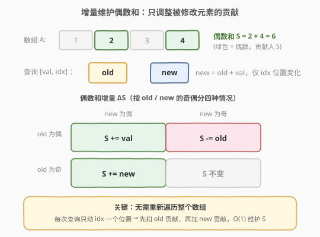
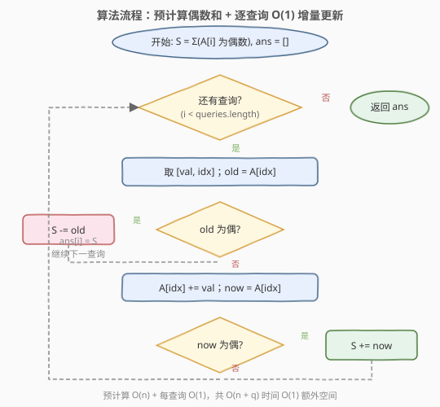

# 查询后的偶数和

- **题目名称**：查询后的偶数和
- **链接**：[985. 查询后的偶数和](https://leetcode.cn/problems/sum-of-even-numbers-after-queries/)
- **难度**：中等
- **标签**：数组、增量维护

## 1. 题目概述

给出一个整数数组 `nums` 和一个查询数组 `queries`。对于第 `i` 次查询，有 `val = queries[i][0]`、`index = queries[i][1]`，先把 `val` 加到 `nums[index]` 上，然后第 `i` 次查询的答案是 `nums` 中**所有偶数值的和**。每次查询会**永久修改**数组 `nums`。返回所有查询的答案数组 `answer`。

**示例**：

```text
输入：nums = [1,2,3,4], queries = [[1,0],[-3,1],[-4,0],[2,3]]
输出：[8,6,2,4]
解释：
开始时，数组为 [1,2,3,4]。
将 1 加到 nums[0] 上之后，数组为 [2,2,3,4]，偶数值之和为 2 + 2 + 4 = 8。
将 -3 加到 nums[1] 上之后，数组为 [2,-1,3,4]，偶数值之和为 2 + 4 = 6。
将 -4 加到 nums[0] 上之后，数组为 [-2,-1,3,4]，偶数值之和为 -2 + 4 = 2。
将 2 加到 nums[3] 上之后，数组为 [-2,-1,3,6]，偶数值之和为 -2 + 6 = 4。
```

**约束条件**：

- $1 \le \text{nums.length} \le 10^4$
- $-10^4 \le \text{nums[i]} \le 10^4$
- $1 \le \text{queries.length} \le 10^4$
- $-10^4 \le \text{queries[i][0]} \le 10^4$
- $0 \le \text{queries[i][1]} < \text{nums.length}$

> 💡 **关键信息**：每次查询只改动**一个位置** `nums[index]`，却要回答**全数组**的偶数和。规模上 $n$ 与 $q$ 都到 $10^4$，$O(n \cdot q) = 10^8$ 次加法偏慢——这暗示应当**增量维护**偶数和，而非每次重算。

---

## 2. 解题思路

### 2.1 暴力思路

对每次查询：先执行 `nums[index] += val`，再从头遍历一遍 `nums` 累加所有偶数。单次查询 $O(n)$，共 $q$ 次查询，总复杂度 $O(n \cdot q)$。当 $n = q = 10^4$ 时约 $10^8$ 次运算，C++ 勉强可过、Python 必超时，且完全没有利用「只改一个位置」这一性质。

> ⚠️ 每次查询改的是**一个元素**，却为它重算**整个数组**的偶数和——这是典型的「以全局代价回应局部变化」，应改为增量更新。

### 2.2 核心观察：增量维护偶数和，只调整被修改元素的贡献



设当前偶数和为 $S$。每次查询只修改 `nums[index]` 这**一个位置**，记修改前的值为 `old`、修改后的值为 `new = old + val`。其余位置的偶数性不变，对 $S$ 的贡献也不变。因此 $S$ 的变化**完全由 `old` 与 `new` 的奇偶性决定**，共四种情况：

| | `new` 为偶 | `new` 为奇 |
|---|---|---|
| **`old` 为偶** | $S \mathrel{+}= \text{val}$（仍是偶数，净变化即 val） | $S \mathrel{-}= \text{old}$（从偶变奇，移除旧贡献） |
| **`old` 为奇** | $S \mathrel{+}= \text{new}$（从奇变偶，加入新贡献） | $S$ 不变（奇→奇，无影响） |

> 💡 **一句话记忆**：**先扣 old 贡献（若 old 偶），再加 new 贡献（若 new 偶）**。两次判断、两次加减，$O(1)$ 完成。注意必须先减 old 再加 new——若 `old == new`（`val == 0`）时减后加回，顺序不影响结果；但「先减后加」的写法逻辑清晰、不易写错。

### 2.3 算法流程图



整体两阶段：

1. **预计算**：遍历一次 `nums`，累加所有偶数得到初始 $S$。$O(n)$。
2. **逐查询增量更新**：对每个 `[val, index]`：
   - 取 `old = nums[index]`；若 `old` 为偶，`S -= old`（移除旧贡献）。
   - 执行 `nums[index] += val`，记 `now = nums[index]`；若 `now` 为偶，`S += now`（加入新贡献）。
   - 将当前 $S$ 追加到答案数组。

预计算 $O(n)$，$q$ 次查询每次 $O(1)$，总复杂度 $O(n + q)$。

### 2.4 示例演算

![示例演算：nums = [1,2,3,4]，queries = [[1,0],[−3,1],[−4,0],[2,3]]](../images/soen_example_walkthrough.svg)

以 `nums = [1,2,3,4]`、`queries = [[1,0],[-3,1],[-4,0],[2,3]]` 为例，初始偶数和 $S = 2 + 4 = 6$：

| 步骤 | 查询 [val, idx] | old → new | 情况 | ΔS | 偶数和 S | 数组状态 |
|------|-----------------|-----------|------|-----|----------|----------|
| 初始 | — | — | — | — | 6 | [1, **2**, 3, **4**] |
| 1 | [1, 0] | 1 → 2 | old 奇、new 偶 | +new = +2 | 8 | [**2**, **2**, 3, **4**] |
| 2 | [−3, 1] | 2 → −1 | old 偶、new 奇 | −old = −2 | 6 | [**2**, −1, 3, **4**] |
| 3 | [−4, 0] | 2 → −2 | old 偶、new 偶 | +val = −4 | 2 | [**−2**, −1, 3, **4**] |
| 4 | [2, 3] | 4 → 6 | old 偶、new 偶 | +val = +2 | 4 | [**−2**, −1, 3, **6**] |

最终 `ans = [8, 6, 2, 4]`。✓ 每一步只动了一个位置，$S$ 也只做一次加减，全程未重算整个数组。

---

## 3. 参考代码

### C++

```cpp
class Solution {
  public:
    vector<int> sumEvenAfterQueries(vector<int>& nums,
                                    vector<vector<int>>& queries) {
        int S = 0;
        for (int x : nums) {
            if (x % 2 == 0) S += x;
        }
        vector<int> ans;
        ans.reserve(queries.size());
        for (auto& q : queries) {
            int val = q[0], idx = q[1];
            int old = nums[idx];
            if (old % 2 == 0) S -= old;
            nums[idx] += val;
            int now = nums[idx];
            if (now % 2 == 0) S += now;
            ans.push_back(S);
        }
        return ans;
    }
};
```

### Python

```python
class Solution:
    def sumEvenAfterQueries(self, nums: List[int], queries: List[List[int]]) -> List[int]:
        S = sum(x for x in nums if x % 2 == 0)
        ans = []
        for val, idx in queries:
            old = nums[idx]
            if old % 2 == 0:
                S -= old
            nums[idx] += val
            now = nums[idx]
            if now % 2 == 0:
                S += now
            ans.append(S)
        return ans
```

> 💡 **三个实现细节**：
> 1. **奇偶判断用 `x % 2 == 0`**：C++ 中负奇数 `x % 2` 得 `-1`（而非 `1`），但判断 `== 0` 对正负数都正确，无需关心符号。也可用 `(x & 1) == 0`，等价且更快。
> 2. **先减 old 再加 new**：必须先从 $S$ 中扣除旧值贡献，再判断新值是否入和。若先加新值再减旧值，在 `val == 0`（`old == new`）时虽然结果相同，但「先减后加」符合「先撤销旧状态、再叠加新状态」的直觉，更不易写错。
> 3. **`ans.reserve(q)`**：C++ 预分配答案数组容量，避免 `push_back` 反复扩容拷贝，是常数优化好习惯。

---

## 4. 复杂度分析

| 维度 | 复杂度 | 说明 |
|------|--------|------|
| 时间复杂度 | $O(n + q)$ | 预计算偶数和 $O(n)$；$q$ 次查询每次 $O(1)$（仅两次奇偶判断 + 至多两次加减） |
| 空间复杂度 | $O(1)$ | 仅用常数变量 $S$、`old`、`now`（答案数组不计额外空间；若计入输出则为 $O(q)$） |

---

## 5. 扩展：从「增量维护」到「带条件聚合的点更新」

本题的本质是**维护一个带过滤条件的全局聚合量**：聚合 = 求和，过滤 = 仅偶数，更新 = 单点修改。每次点更新只需调整**受影响那一个元素**对聚合的贡献，而不必重算全局。这套「增量维护」思想可推广到多种变体：

- **更换过滤条件**：把「偶数」换成「能被 $k$ 整除」「位于某值域」「满足某谓词」——只要过滤条件在单次更新后只对被修改元素改变，就能 $O(1)$ 调整。
- **更换聚合运算**：把「求和」换成「求积」「异或」「最大值」等。注意**最大值/最小值**不能用单点增量维护（删掉一个最大值后无法 $O(1)$ 恢复次大值），需要线段树或单调结构；而**求和、异或**这类「可逆」运算天然支持增量。
- **更换更新粒度**：本题是单点更新 + 全局查询；若变成**区间更新 + 区间查询**，就升级为 [307. 区域和检索 - 数组可变](../0301-0400/307_区域和检索 - 数组可变.md) 的线段树/树状数组场景。

> 💡 **判断增量是否可行的一个口诀**：聚合运算满足「删一个、加一个都能 $O(1)$ 完成」时（如求和、异或），单点更新即可增量维护；否则需要更重的数据结构。

---

## 6. 面试要点

1. **为什么不能每次查询都重新遍历数组求偶数和？**

   每次查询只修改一个位置，却为它重算整个数组是「以全局代价回应局部变化」。$n = q = 10^4$ 时 $O(n \cdot q) = 10^8$，C++ 勉强、Python 必超时。正确做法是维护偶数和 $S$，每次只调整被修改元素的贡献，$O(1)$ 完成更新。

2. **四种情况怎么统一处理，避免写四个分支？**

   统一为两步：「先扣 old 贡献（若 old 偶则 `S -= old`），再加 new 贡献（若 new 偶则 `S += now`）」。这两步独立判断、互不干扰，自然覆盖全部四种奇偶组合，比显式枚举四个 case 更简洁、不易漏。

3. **为什么必须先减 old 再加 new，顺序能反吗？**

   逻辑上先减后加 = 先撤销旧状态再叠加新状态。即便 `val == 0`（`old == new`）时先减后加会先把偶数贡献减掉再加回，结果仍正确。反过来先加后减同样正确，但「先减后加」更贴合状态机直觉，且避免了「同时把同一值算两次」的中间态困惑。两种顺序都能过，选一种固定写法即可。

4. **负数和零的奇偶性怎么处理？**

   `0` 是偶数（`0 % 2 == 0` 为真），会贡献进 $S$，符合数学定义。负偶数如 `-2` 同样满足 `-2 % 2 == 0`，正常入和。C++ 中 `-3 % 2 == -1`，但用 `== 0` 判断偶性不受影响——**永远判 `== 0`，不要判 `== 1`**。

5. **如果聚合改成「最大偶数」还能这样做吗？**

   不能。最大值不可逆：若当前最大偶数被改成奇数，无法 $O(1)$ 得到次大偶数。此时需用线段树（叶节点存该位置的偶数值或 $-\infty$，区间维护 max）或有序容器（如 C++ 的 `multiset` 维护所有偶数值，$O(\log n)$ 更新查询）。这正好印证扩展中「聚合运算可逆才能增量」的口诀。

---

## 7. 同类练习题

- [307. 区域和检索 - 数组可变](https://leetcode.cn/problems/range-sum-query-mutable/)（[题解](../0301-0400/307_区域和检索 - 数组可变.md)）：点更新下维护区间和（树状数组/线段树），同样是「点更新只调整局部聚合」思想，升级为区间查询
- [238. 除自身以外数组的乘积](https://leetcode.cn/problems/product-of-array-except-self/)（[题解](../0201-0300/238_除自身以外数组的乘积.md)）：前后缀聚合（乘积）的预计算，不可变版的「聚合量维护」
- [303. 区域和检索 - 数组不可变](https://leetcode.cn/problems/range-sum-query-immutable/)（[题解](../0301-0400/303_区域和检索 - 数组不可变.md)）：前缀和预计算 $O(1)$ 区间和，静态聚合的母题
- [1310. 异或查询子数组](https://leetcode.cn/problems/xor-queries-of-a-subarray/)：前缀异或预计算 $O(1)$ 区间异或，异或与求和同为「可逆聚合」，可对照本题的动态增量维护
