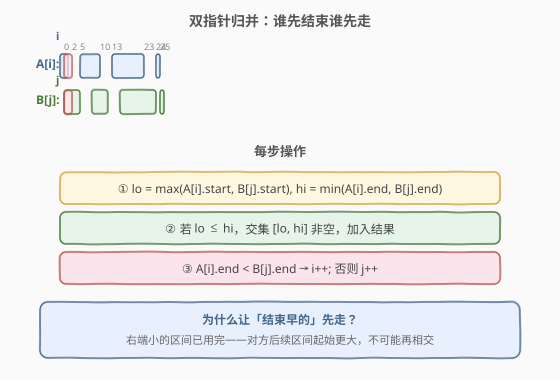
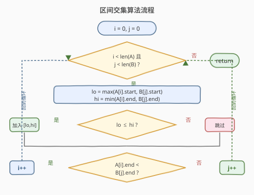
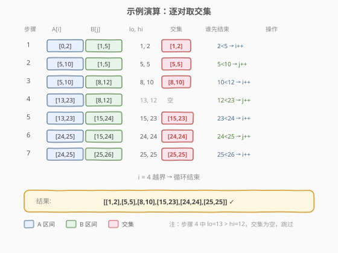

# 区间列表的交集

- **题目名称**：区间列表的交集
- **链接**：[986. 区间列表的交集](https://leetcode.cn/problems/interval-list-intersections/)
- **难度**：中等
- **标签**：数组、双指针、区间

## 1. 题目概述

给定两个**闭区间列表** `firstList` 和 `secondList`，每个列表内的区间**互不重叠**且按起始端点**升序**排列。返回两个列表中所有区间的**交集**列表。

闭区间 `[a, b]`（$a \le b$）表示实数集合 $\{x \mid a \le x \le b\}$。两个闭区间的交集也是闭区间（若非空），例如 $[1, 3] \cap [2, 4] = [2, 3]$。

**示例 1**：

```text
输入：firstList = [[0,2],[5,10],[13,23],[24,25]], secondList = [[1,5],[8,12],[15,24],[25,26]]
输出：[[1,2],[5,5],[8,10],[15,23],[24,24],[25,25]]
解释：逐对取交集——[0,2]∩[1,5]=[1,2]，[5,10]∩[1,5]=[5,5]，[5,10]∩[8,12]=[8,10]……
```

**示例 2**：

```text
输入：firstList = [[1,3],[5,9],[0,0]], secondList = [[1,7]]
输出：[[1,3],[5,9]]
解释：[1,7] 同时与 [1,3] 和 [5,9] 有交集（注意输入不保证 firstList 内部升序，但同列表区间仍然互不重叠）。
```

**约束条件**：

- `0 <= firstList.length, secondList.length <= 1000`
- `firstList.length + secondList.length >= 1`
- `0 <= start_i < end_i <= 10^9`
- 同一列表内 `end_i < start_{i+1}`（互不重叠且不相邻）
- 两个列表各自按起始端点升序排列

> 💡 **闭区间交集公式**：两个区间 $[a_1, b_1]$ 与 $[a_2, b_2]$ 的交集为 $[\max(a_1, a_2),\ \min(b_1, b_2)]$，当 $\max(a_1, a_2) \le \min(b_1, b_2)$ 时非空。

---

## 2. 解题思路

### 2.1 暴力思路

枚举 `firstList` 中每个区间与 `secondList` 中每个区间的所有组合，逐对计算交集。共 $O(m \times n)$ 次，在 $m, n = 1000$ 时达 $10^6$，虽能通过但**浪费了两个列表各自有序的性质**。

### 2.2 核心观察：双指针归并



关键洞察与 [21. 合并两个有序链表](../0001-0100/21_合并两个有序链表.md) 异曲同工：两个列表各自有序，用双指针 $i, j$ 分别扫描，每步只处理当前一对区间，处理完后**让结束更早的那个指针前进**——因为结束早的区间不可能再与对方后续区间产生交集。

> 💡 **为什么让「结束早的」先走？** 设 `firstList[i] = [1, 3]`，`secondList[j] = [2, 8]`，交集为 `[2, 3]`。`firstList[i]` 的右端 3 < 8，它不可能再与 `secondList` 中 `j` 之后的任何区间相交（那些区间起始 $> 8 > 3$），所以 $i$ 可以安全前进。

每步操作：

1. 计算当前一对区间的交集：`lo = max(A[i][0], B[j][0])`，`hi = min(A[i][1], B[j][1])`
2. 若 `lo <= hi`，交集非空，加入结果
3. 若 `A[i][1] < B[j][1]`，`i++`；否则 `j++`

### 2.3 算法流程图



```
i = 0, j = 0
while i < len(A) and j < len(B):
    lo = max(A[i].start, B[j].start)
    hi = min(A[i].end,   B[j].end)
    if lo <= hi:
        result.append([lo, hi])
    if A[i].end < B[j].end:
        i += 1
    else:
        j += 1
return result
```

### 2.4 示例演算

以 `firstList = [[0,2],[5,10],[13,23],[24,25]]`，`secondList = [[1,5],[8,12],[15,24],[25,26]]` 为例：



| 步骤 | A[i] | B[j] | lo, hi | 交集 | 谁先结束 | 操作 |
|------|------|------|--------|------|----------|------|
| 1 | [0,2] | [1,5] | 1, 2 | [1,2] | 2<5 → i++ | 加入 [1,2]，i=1 |
| 2 | [5,10] | [1,5] | 5, 5 | [5,5] | 5<10 → j++ | 加入 [5,5]，j=1 |
| 3 | [5,10] | [8,12] | 8, 10 | [8,10] | 10<12 → i++ | 加入 [8,10]，i=2 |
| 4 | [13,23] | [8,12] | 13, 12 | 空 | 12<23 → j++ | 无交集，j=2 |
| 5 | [13,23] | [15,24] | 15, 23 | [15,23] | 23<24 → i++ | 加入 [15,23]，i=3 |
| 6 | [24,25] | [15,24] | 24, 24 | [24,24] | 24<25 → j++ | 加入 [24,24]，j=3 |
| 7 | [24,25] | [25,26] | 25, 25 | [25,25] | 25<26 → i++ | 加入 [25,25]，i=4 |
| — | i=4 越界 | — | — | — | — | 结束 |

输出 `[[1,2],[5,5],[8,10],[15,23],[24,24],[25,25]]` $\checkmark$

> 💡 步骤 2 中 `[5,5]` 是一个单点交集——两个区间仅在端点 5 处接触，闭区间仍算相交。步骤 4 中 `lo=13 > hi=12`，交集为空，跳过。

---

## 3. 参考代码

### C++

```cpp
class Solution {
  public:
    vector<vector<int>> intervalIntersection(vector<vector<int>>& A,
                                             vector<vector<int>>& B) {
        vector<vector<int>> res;
        int i = 0, j = 0;
        while (i < A.size() && j < B.size()) {
            int lo = max(A[i][0], B[j][0]);
            int hi = min(A[i][1], B[j][1]);
            if (lo <= hi)
                res.push_back({lo, hi});
            if (A[i][1] < B[j][1])
                i++;
            else
                j++;
        }
        return res;
    }
};
```

### Python

```python
class Solution:
    def intervalIntersection(self, A: List[List[int]], B: List[List[int]]) -> List[List[int]]:
        res = []
        i = j = 0
        while i < len(A) and j < len(B):
            lo = max(A[i][0], B[j][0])
            hi = min(A[i][1], B[j][1])
            if lo <= hi:
                res.append([lo, hi])
            if A[i][1] < B[j][1]:
                i += 1
            else:
                j += 1
        return res
```

---

## 4. 复杂度分析

| 维度 | 复杂度 | 说明 |
|------|--------|------|
| 时间复杂度 | $O(m + n)$ | 双指针各遍历一次，每步 $i$ 或 $j$ 必有一个前进 |
| 空间复杂度 | $O(1)$ | 仅用常数变量（结果数组不计返回值） |

> 💡 暴力法 $O(m \times n)$，双指针法利用有序性降至 $O(m+n)$，与归并排序的 merge 阶段同构。

---

## 5. 扩展：开区间与端点处理

- **闭区间 vs 开区间**：本题是闭区间，端点接触（如 `[5,5]`）算交集。若改为开区间 $(a, b)$，需用 `lo < hi` 判定非空，单点交集不再存在。
- **输入不保证严格升序**：示例 2 中 `firstList = [[1,3],[5,9],[0,0]]`，虽然题目约束说升序，但实际测试数据可能不严格。双指针算法依赖有序性，若无法保证应先排序 $O(n \log n)$。
- **多个列表求交集**：可推广为 $k$ 路归并——用小顶堆维护 $k$ 个指针各自当前区间的右端点，每步取堆顶（右端最小的）前进，同时计算所有 $k$ 个当前区间的交集。

> ⚠️ **指针前进的判断**是比较**右端点**而非左端点。右端小的区间已"用完"——它不可能再与对方后续区间相交。若误比左端点会导致遗漏交集。

---

## 6. 面试要点

1. **为什么用双指针而不是暴力枚举所有对？**

   - 两个列表各自有序且内部不重叠，这保证了结束更早的区间不会再与对方后续区间相交。双指针每步必前进一个，总步数 $O(m+n)$，而暴力法 $O(m \times n)$。

2. **为什么比较右端点决定谁前进？**

   - 右端点小的区间已经"结束"了，对方后续区间的起始只会更大（有序），不可能再与它相交。而右端点大的区间还可能与对方下一个区间相交，所以保留。

3. **`lo <= hi` 中的等号有什么含义？**

   - 闭区间下，两个区间仅在端点接触（如 `[0,2]` 与 `[2,5]`）也算相交，交集为单点 `[2,2]`。若题目改为开区间则需 `lo < hi`。

4. **和合并两个有序链表 / 归并排序有什么关系？**

   - 三者都是双指针归并模式：利用两路有序性，每步处理当前对，然后让"用完"的一路前进。区别在于合并操作不同——链表是拼接节点，归并排序是取较小值，本题是取交集。

5. **如果两个列表内部有重叠区间怎么办？**

   - 题目保证不重叠。若不保证，可先用 [56. 合并区间](../0001-0100/56_合并区间.md) 的方法预处理各自列表，再做双指针求交集。

---

## 7. 同类练习题

- [56. 合并区间](https://leetcode.cn/problems/merge-intervals/)（[题解](../0001-0100/56_合并区间.md)）：同一列表内有重叠时合并，与本题"跨列表取交集"互补
- [57. 插入区间](https://leetcode.cn/problems/insert-interval/)（[题解](../0001-0100/57_插入区间.md)）：向有序不重叠列表中插入并合并，三阶段线性扫描
- [253. 会议室 II](https://leetcode.cn/problems/meeting-rooms-ii/)（[题解](../0201-0300/253_会议室II.md)）：扫描线求区间最大重叠数，另一维度利用有序性
- [435. 无重叠区间](https://leetcode.cn/problems/non-overlapping-intervals/)（[题解](../0401-0500/435_无重叠区间.md)）：贪心移除最少区间使无重叠
- [1288. 删除被覆盖区间](https://leetcode.cn/problems/remove-covered-intervals/)：排序 + 区间包含判定，同为区间双指针/排序应用
